# CoboGesture: A Continuous Hand Gesture Dataset and Recognition Method for Human-Collaborative Robot Interaction

Báo cáo thu hoạch nội dung đọc và phân tích bài báo về phương pháp **nhận diện cử chỉ tay liên tục trong tương tác người – robot cộng tác**.

**Thông tin bài báo**

- **Tên bài báo:** *CoboGesture: A Continuous Hand Gesture Dataset and Recognition Method for Human-Collaborative Robot Interaction*.

- **Tạp chí:** IEEE Access, 2026
- **Chủ đề chính:** Hand Gesture Recognition, Human-Cobot Interaction, Continuous Recognition, VideoMAE, Edge Device.

## Mục lục

- [1. Literature Review](#1-literature-review)
- [2. Tổng kết lại về Research Gap mà bài báo chỉ ra](#2-tổng-kết-lại-về-research-gap-mà-bài-báo-chỉ-ra)
- [3. Tóm tắt phương pháp và pipeline](#3-tóm-tắt-phương-pháp-và-pipeline)
- [4. Giải thích chi tiết các phương pháp kĩ thuật](#4-giải-thích-chi-tiết-các-phương-pháp-kĩ-thuật)
  - [4.1. Phân loại isolated và continuous Hand Gesture Recognition](#41-phân-loại-isolated-và-continuous-hand-gesture-recognition)
  - [4.2. Data collection methods và đặc điểm dataset CoboGesture](#42-data-collection-methods-và-đặc-điểm-dataset-cobogesture)
  - [4.3. Phương pháp triển khai](#43-phương-pháp-triển-khai)
- [5. Kết quả thực nghiệm và đánh giá](#5-kết-quả-thực-nghiệm-và-đánh-giá)
- [6. Research Gap còn lại của bài báo](#6-research-gap-còn-lại-của-bài-báo)
- [7. Nhận xét cá nhân](#7-nhận-xét-cá-nhân)

---

## 1. Literature Review

### 1.1. Bối cảnh chung

Bối cảnh mà bài báo đưa ra nhưu sau : 

- Trong môi trường sản xuất sử dụng robot cộng tác ngày càng phổ biến, giao tiếp giữa con người và cobot đóng vai trò rất quan trọng. Nếu con người phải điều khiển robot bằng giao diện phức tạp, thiết bị đeo hoặc câu lệnh lập trình, quá trình vận hành sẽ kém tự nhiên và khó triển khai cho công nhân phổ thông. Vì vậy, các phương thức tương tác tự nhiên như **giọng nói**, **cử chỉ tay**, **ánh mắt**, **tư thế cơ thể** được quan tâm nhiều trong Human-Robot Interaction.

Bài báo tập trung vào **nhận dạng cử chỉ tay** vì đây là hình thức giao tiếp trực quan, dễ học, ít phụ thuộc ngôn ngữ và phù hợp với ngữ cảnh điều khiển robot trong nhà máy. Ví dụ, người vận hành có thể dùng tay để ra lệnh bắt đầu, dừng, di chuyển, xác nhận, hủy thao tác hoặc điều hướng robot.

### 1.2. Các hướng nhận dạng cử chỉ tay trong nghiên cứu đã được công bố

Các nghiên cứu về Hand Gesture Recognition thường được chia theo loại dữ liệu đầu vào:

- **Wearable sensor-based methods:** dùng cảm biến đeo như găng tay, IMU, EMG hoặc wristband.
- **Vision-based methods:** dùng camera RGB, depth camera, infrared camera hoặc multi-modal camera.
- **Skeleton-based methods:** trích xuất khung xương bàn tay/người rồi nhận dạng chuỗi chuyển động.
- **RGB video-based methods:** học trực tiếp đặc trưng không gian – thời gian từ chuỗi ảnh RGB.
- **Multi-modal methods:** kết hợp RGB, depth, skeleton, optical flow hoặc dữ liệu cảm biến khác.

- **Research Gap 1** :
Các phương pháp dùng thiết bị đeo có thể đạt độ ổn định cao nhưng gây bất tiện trong môi trường công nghiệp. Người vận hành phải đeo thiết bị, thiết bị có thể không vừa tay, cần bảo trì, cần hiệu chuẩn, khó chia sẻ giữa nhiều người và gây vướng víu khi làm việc trong không gian hẹp. Vì vậy, bài báo ưu tiên hướng **vision-based**, chỉ cần camera quan sát và không yêu cầu thiết bị gắn trên cơ thể.

- **Research Gap 2**: 
Các phương pháp vision-based trước đây đã có nhiều tiến bộ nhờ deep learning, đặc biệt là CNN, RNN, LSTM, Transformer và các mô hình video representation learning. Tuy nhiên, phần lớn nghiên cứu vẫn tập trung vào bài toán **isolated gesture recognition**, tức là mỗi video đã được cắt sẵn và chỉ chứa một cử chỉ duy nhất.

### 1.3. Tổng quan các dataset liên quan

Bài báo khảo sát nhiều dataset công khai cho nhận dạng cử chỉ tay. Các dataset này thường phục vụ những bối cảnh như điều khiển thiết bị, tương tác màn hình cảm ứng, nhận dạng cử chỉ trong môi trường thường ngày hoặc nhận dạng động tác bàn tay. Tuy nhiên, số lượng dataset chuyên biệt cho **human-cobot interaction** còn hạn chế.

- **Research Gap 3** :

Nhiều dataset không phù hợp trực tiếp với môi trường robot cộng tác vì:

- không được thiết kế theo tập lệnh điều khiển cobot;
- chủ yếu gồm cử chỉ ngắn, đơn lẻ, đã được cắt sẵn;
- thiếu video liên tục có nhiều cử chỉ nối tiếp;
- không có nhãn thời gian bắt đầu/kết thúc từng cử chỉ;
- môi trường quay chưa phản ánh nền phức tạp, ánh sáng thay đổi hoặc bối cảnh công nghiệp.

Do đó, tác giả xây dựng dataset mới tên **CoboGesture** để phục vụ bài toán nhận dạng cử chỉ tay liên tục trong tương tác người – cobot.

- Tác giả bài báo đưa ra một số bộ dataset và đánh giá với bộ dataset tự thu thập (CobotGesture) như bảng sau : 

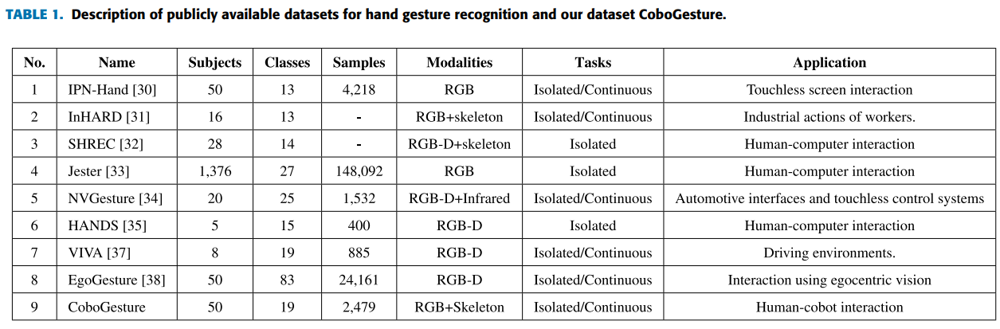

---

## 2. Tổng kết lại về Research Gap mà bài báo chỉ ra

Bài báo chỉ ra khoảng trống nghiên cứu chính nằm ở sự khác biệt giữa môi trường nghiên cứu lý tưởng và nhu cầu triển khai thực tế trong human-cobot interaction.

### 2.1. Thiếu dataset cho continuous hand gesture recognition

Nhiều dataset hiện có chỉ hỗ trợ nhận dạng cử chỉ rời rạc. Mỗi mẫu dữ liệu thường là một video ngắn đã được cắt đúng đoạn cử chỉ. 

Trong thực tế, camera ghi nhận một luồng video liên tục. Người vận hành có thể thực hiện nhiều cử chỉ liên tiếp, giữa các cử chỉ có khoảng nghỉ, có động tác thừa hoặc có chuyển động không mang ý nghĩa điều khiển. Vì vậy, hệ thống không chỉ cần biết **cử chỉ là gì**, mà còn phải biết **cử chỉ bắt đầu khi nào** và **kết thúc khi nào**.

### 2.2. Phương pháp isolated recognition chưa đủ cho ứng dụng thực tế

Isolated recognition giả định rằng đoạn video đầu vào đã được cắt chính xác. Giả định này làm bài toán đơn giản hơn nhưng không thực tế. Nếu đưa trực tiếp video dài vào hệ thống, mô hình isolated không biết đoạn nào chứa cử chỉ, đoạn nào là nền hoặc no-gesture.

Bài toán continuous recognition khó hơn vì cần giải quyết đồng thời ba nhiệm vụ:

- phát hiện vùng thời gian có cử chỉ (start frame --> end frame); 
- phân loại nhãn cử chỉ (classification); 
- làm mượt kết quả theo thời gian để tránh dự đoán nhiễu (smoothing);

### 2.3. Môi trường công nghiệp có nhiều nhiễu

Trong bối cảnh nhà máy hoặc phòng thí nghiệm sản xuất, dữ liệu hình ảnh thường bị ảnh hưởng bởi:

- nền phức tạp;
- nhiều thiết bị điện tử xung quanh;
- ánh sáng thay đổi hoặc nhấp nháy;
- tay bị che khuất một phần;
- góc nhìn camera thay đổi;
- tốc độ thực hiện cử chỉ khác nhau giữa các người dùng.

Các yếu tố này làm giảm độ ổn định của mô hình nếu chỉ đánh giá trong môi trường sạch. Để giải quyết vấn đề này, tác giả xây dựng dataset CoboGesture trong điều kiện thu thập có nền phức tạp, nhiều thiết bị trong khung hình và ánh sáng không ổn định, nhằm mô phỏng tốt hơn môi trường human-cobot interaction thực tế. Bên cạnh đó, bài báo đề xuất hai pipeline RGB-CoGes và SkeRGB-CoGes để xử lý bài toán nhận dạng cử chỉ liên tục.

### 2.4. Thiếu đánh giá trên edge device

Một hệ thống tương tác người – robot cần phản hồi gần thời gian thực. Do đó, mô hình không chỉ cần chính xác mà còn cần chạy được trên thiết bị biên như Jetson. Nhiều bài báo chỉ đánh giá offline trên GPU mạnh, chưa chứng minh khả năng triển khai thực tế.

---

## 3. Tóm tắt phương pháp và pipeline

Bài báo đề xuất hai phương pháp nhận dạng cử chỉ tay liên tục:

- **RGB-CoGes:** dùng chuỗi ảnh RGB làm đầu vào.
- **SkeRGB-CoGes:** kết hợp skeleton và RGB, trong đó skeleton dùng để phát hiện biên thời gian của cử chỉ, RGB dùng để phân loại cử chỉ.

Hai phương pháp dùng chung một giai đoạn huấn luyện mô hình nhận dạng cử chỉ rời rạc. Mô hình nền được sử dụng là **VideoMAE** hoặc **VideoMAEv2**, các kiến trúc học biểu diễn video dựa trên masked autoencoder và vision transformer ( 2 model này đã được pretrained trên Kinetics-400 dataset ).

### 3.1. Pipeline tổng quát

Pipeline có thể tóm tắt như sau:

1. Thu thập video liên tục chứa nhiều cử chỉ tay.
2. Gán nhãn thời gian bắt đầu/kết thúc và nhãn lớp cho từng cử chỉ.
3. Cắt video thành các đoạn isolated gesture để huấn luyện mô hình phân loại.
4. Huấn luyện mô hình VideoMAE/VideoMAEv2 trên các đoạn cử chỉ đã cắt.
5. Khi suy luận trên video liên tục:
   - RGB-CoGes dùng sliding window để quét video;
   - SkeRGB-CoGes dùng skeleton để phát hiện đoạn có cử chỉ.
6. Dùng mô hình đã huấn luyện để phân loại từng đoạn ứng viên.
7. Dùng hậu xử lý/voting để làm mượt nhãn và tạo kết quả cuối cùng.
8. Đánh giá bằng các metric cho isolated và continuous recognition.

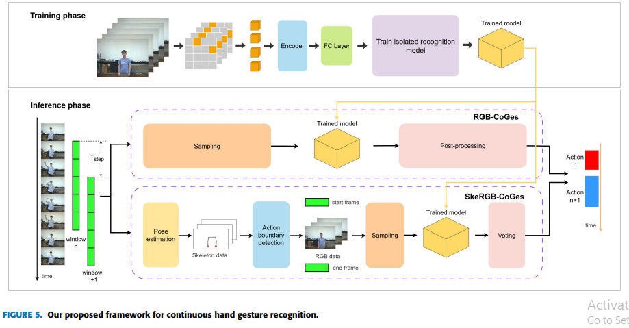

### 3.2. Ý tưởng cốt lõi

Ý tưởng quan trọng của bài báo là tận dụng ưu điểm của hai hướng tiếp cận:

- VideoMAE học đặc trưng không gian – thời gian mạnh từ RGB video.
- Skeleton nhẹ hơn, phù hợp để phát hiện chuyển động và biên thời gian.

Thay vì chỉ dùng skeleton để nhận dạng toàn bộ cử chỉ, tác giả dùng skeleton như một công cụ hỗ trợ phân đoạn, sau đó dùng mô hình RGB mạnh hơn để phân loại. Cách kết hợp này hợp lý vì skeleton có thể đơn giản hóa bài toán phát hiện vùng cử chỉ, trong khi RGB giữ lại nhiều thông tin hình ảnh hơn để nhận dạng chính xác.

---

## 4. Giải thích chi tiết các phương pháp kĩ thuật

## 4.1. Phân loại isolated và continuous Hand Gesture Recognition

### 4.1.1. Isolated Hand Gesture Recognition

**Isolated Hand Gesture Recognition** là bài toán nhận dạng cử chỉ trong một đoạn video đã được cắt sẵn. Mỗi video chỉ chứa một cử chỉ chính và nhãn của video là nhãn cử chỉ đó.

Đặc điểm:

- đầu vào là video ngắn đã phân đoạn;
- mỗi mẫu thường chỉ có một nhãn;
- không cần phát hiện thời điểm bắt đầu/kết thúc;
- dễ huấn luyện và đánh giá hơn;
- chưa phản ánh đầy đủ yêu cầu triển khai thực tế.

Trong bài báo, giai đoạn huấn luyện chính là huấn luyện isolated recognition model. Các video liên tục được cắt thành từng đoạn cử chỉ để tạo dữ liệu huấn luyện cho VideoMAE/VideoMAEv2.

### 4.1.2. Continuous Hand Gesture Recognition

**Continuous Hand Gesture Recognition** là bài toán nhận dạng cử chỉ trong video dài, không cắt sẵn. Một video có thể chứa nhiều cử chỉ liên tiếp, khoảng nghỉ và chuyển động không thuộc lớp cử chỉ nào.

Hệ thống cần trả lời đồng thời:

- frame nào thuộc cử chỉ;
- frame nào là no-gesture;
- cử chỉ thuộc lớp nào;
- đoạn cử chỉ kéo dài từ thời điểm nào đến thời điểm nào.

Đây là bài toán khó hơn isolated recognition vì lỗi có thể đến từ cả phân đoạn lẫn phân loại. Một mô hình có thể phân loại đúng khi đoạn video được cắt chuẩn, nhưng khi chạy trên video liên tục, nếu cửa sổ thời gian lệch hoặc phát hiện sai biên cử chỉ, kết quả cuối cùng vẫn bị giảm.

### 4.1.3. So sánh isolated và continuous recognition

| Tiêu chí | Isolated recognition | Continuous recognition |
|---|---|---|
| Đầu vào | Video ngắn đã cắt | Video dài, chưa cắt |
| Số cử chỉ trong video | Thường một cử chỉ | Nhiều cử chỉ hoặc no-gesture |
| Nhiệm vụ chính | Phân loại | Phát hiện + phân đoạn + phân loại |
| Độ khó | Thấp hơn | Cao hơn |
| Mức độ thực tế | Hạn chế | Gần ứng dụng thực tế |
| Metric thường dùng | Accuracy | Frame-wise Accuracy, Overlap Score |

---

## 4.2. Data collection methods và đặc điểm dataset CoboGesture

### 4.2.1. Mục tiêu xây dựng dataset

CoboGesture được xây dựng nhằm phục vụ nghiên cứu continuous hand gesture recognition trong bối cảnh human-cobot interaction. Dataset cần đảm bảo các cử chỉ phù hợp với điều khiển robot, dễ học với người vận hành và đủ đa dạng để đánh giá mô hình trong môi trường có nhiễu.

Tập cử chỉ trong CoboGesture dựa trên nghiên cứu trước về bộ cử chỉ điều khiển robot công nghiệp. Bài báo sử dụng **19 cử chỉ tay** và bổ sung lớp **No-gesture** để biểu diễn các đoạn không có cử chỉ điều khiển.

### 4.2.2. Yêu cầu thiết kế cử chỉ

Bài báo nêu các yêu cầu quan trọng khi thiết kế bộ cử chỉ cho human-cobot interaction:

- **Phù hợp môi trường công nghiệp:** cử chỉ phải dùng được trong dây chuyền sản xuất có tiếng ồn và không gian làm việc hạn chế.
- **Không cần thiết bị đeo:** người vận hành không phải đeo găng tay, vòng cảm biến hoặc micro gắn người.
- **Dễ học:** cử chỉ nên trực quan, dễ nhớ, giảm thời gian huấn luyện người dùng mới.
- **Dùng một tay:** người vận hành có thể dùng tay còn lại cho công việc khác.
- **Linh hoạt với nhiều loại robot:** tập cử chỉ không nên phụ thuộc vào một robot cụ thể.
- **Bao phủ thao tác điều khiển cơ bản:** ví dụ bắt đầu, dừng, di chuyển, xác nhận, điều hướng.

### 4.2.3. Quy trình thu thập dữ liệu

Dữ liệu được thu thập trong phòng thí nghiệm có máy tính, camera và màn hình hướng dẫn. Một người đóng vai trò annotator sẽ đánh dấu thời điểm bắt đầu và kết thúc cử chỉ bằng bàn phím trong quá trình quay.

Quy trình cơ bản:

1. Hệ thống hiển thị cử chỉ cần thực hiện cho người tham gia.
2. Thứ tự 19 cử chỉ được xáo trộn ngẫu nhiên cho từng người để giảm thiên lệch thứ tự.
3. Người tham gia thực hiện cử chỉ trước camera.
4. Annotator đánh dấu thời điểm bắt đầu/kết thúc cử chỉ.
5. Phần mềm lưu video và file annotation tương ứng.
6. Dữ liệu được dùng để tạo cả video liên tục và các đoạn isolated gesture.
> Figure 1: Scene for data collection.
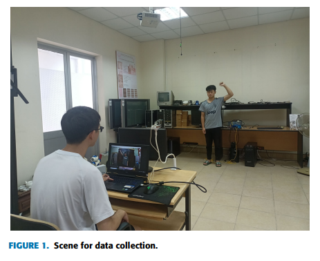

> Figure 2: flowchart of the data collection scheme.

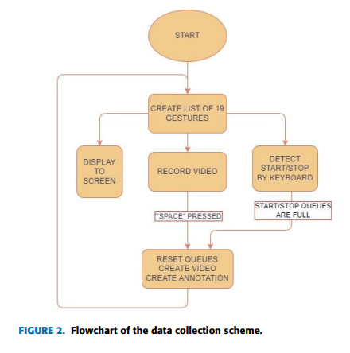

> Table 2: Sample of annotation file.

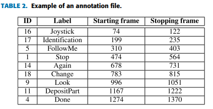

### 4.2.4. Đặc điểm dataset

Theo bài báo, CoboGesture có các đặc điểm chính:

- gồm **50 người tham gia**;
- trong đó có **11 nữ và 39 nam**;
- gồm **150 video untrimmed**;
- mỗi video chứa nhiều cử chỉ theo chuỗi liên tục;
- gồm **19 loại cử chỉ tay** phục vụ human-cobot interaction;
- có thêm lớp **No-gesture**;
- dữ liệu được gán nhãn đầy đủ theo thời gian;
- môi trường quay có nền phức tạp, thiết bị điện tử và điều kiện ánh sáng không hoàn hảo.

Bài báo cho biết số lượng mẫu giữa các lớp tương đối cân bằng, với số lượng mẫu nhỏ nhất khoảng **188**. Điều này giúp giảm thiên lệch lớp khi huấn luyện và đánh giá mô hình.

> Figure 3: ví dụ các chuỗi cử chỉ trong CoboGesture.

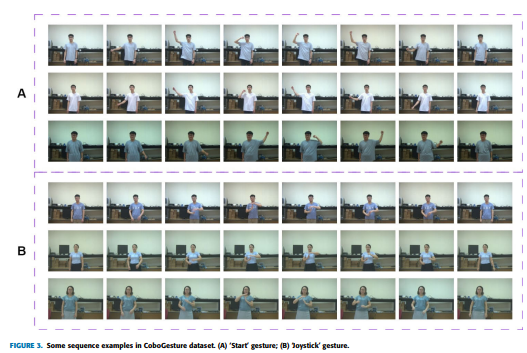

> Figure 4: thống kê dataset CoboGesture.

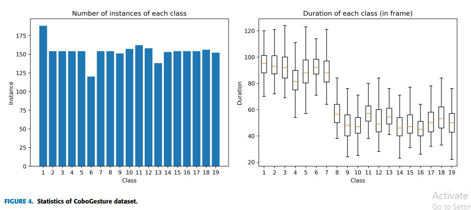

### 4.2.5. Ý nghĩa của dataset

CoboGesture có ý nghĩa ở hai điểm.

- Thứ nhất, dataset được thiết kế theo ngữ cảnh **điều khiển cobot**, không chỉ là nhận dạng cử chỉ tay chung chung. Điều này làm cho bài toán có tính ứng dụng cao hơn trong sản xuất thông minh.

- Thứ hai, dataset hỗ trợ **continuous recognition** nhờ có video untrimmed và annotation thời gian. Đây là điểm quan trọng vì hệ thống thực tế cần xử lý video liên tục chứ không phải các đoạn video đã cắt sẵn.

---

## 4.3. Phương pháp triển khai

### 4.3.1. Mô hình isolated recognition với VideoMAE/VideoMAEv2

Bài báo sử dụng VideoMAE và VideoMAEv2 làm mô hình nền cho nhận dạng cử chỉ rời rạc. VideoMAE là mô hình học biểu diễn video theo hướng self-supervised learning, lấy cảm hứng từ Masked Autoencoder trong xử lý ảnh.

Nguyên lý chính:

- video được chia thành các khối không gian – thời gian;
- một tỷ lệ lớn patch/tube trong video bị che đi;
- encoder học đặc trưng từ phần không bị che;
- decoder tái tạo lại phần bị che trong giai đoạn pretraining;
- khi fine-tune cho classification, decoder được thay bằng classifier head.

Trong bài báo, tác giả sử dụng backbone dạng Vision Transformer để học đặc trưng không gian – thời gian của chuỗi ảnh. Mô hình có khả năng nắm bắt cả hình dạng bàn tay, chuyển động tay và sự thay đổi theo thời gian.

Ưu điểm của VideoMAE:

- học tốt đặc trưng video;
- tận dụng pretraining trên dataset lớn;
- phù hợp với dữ liệu có quy mô vừa phải;
- hiệu quả hơn nhiều mô hình CNN/RNN truyền thống trong video understanding.

### 4.3.2. RGB-CoGes

RGB-CoGes là phương pháp nhận dạng cử chỉ liên tục chỉ dùng ảnh RGB.

Quy trình:

1. Nhận video liên tục từ camera.
2. Dùng sliding window để chia video thành nhiều cửa sổ thời gian chồng lấn.
3. Đưa từng cửa sổ vào mô hình VideoMAE/VideoMAEv2 đã huấn luyện.
4. Mô hình dự đoán nhãn cử chỉ cho từng cửa sổ.
5. Ánh xạ kết quả dự đoán cửa sổ về nhãn theo frame.
6. Áp dụng hậu xử lý để làm mượt kết quả.

Ưu điểm:

- chỉ cần camera RGB;
- pipeline đơn giản;
- không phụ thuộc vào chất lượng skeleton extraction;
- phù hợp khi không có depth/skeleton sensor.

Hạn chế:

- sliding window có thể tạo nhiều dự đoán dư thừa;
- khó xác định chính xác biên bắt đầu/kết thúc cử chỉ;
- cửa sổ quá ngắn có thể thiếu thông tin, cửa sổ quá dài có thể gây trễ;
- chi phí tính toán cao hơn vì phải chạy mô hình nhiều lần trên các cửa sổ.

### 4.3.3. SkeRGB-CoGes

SkeRGB-CoGes kết hợp skeleton và RGB. Skeleton không phải nguồn thông tin chính để phân loại, mà được dùng để phát hiện đoạn thời gian có cử chỉ.

Quy trình:

1. Trích xuất skeleton hoặc keypoints từ video.
2. Phân tích chuyển động skeleton để phát hiện điểm bắt đầu và kết thúc cử chỉ.
3. Cắt đoạn RGB tương ứng với vùng cử chỉ đã phát hiện.
4. Đưa đoạn RGB vào mô hình VideoMAE/VideoMAEv2 để phân loại.
5. Dùng voting hoặc hậu xử lý để ổn định kết quả cuối.

Ưu điểm:

- skeleton nhẹ hơn RGB video model;
- hỗ trợ phát hiện biên thời gian tốt hơn sliding window thuần RGB;
- giảm số lần gọi mô hình VideoMAE;
- phù hợp hơn cho triển khai thời gian thực.

Hạn chế:

- phụ thuộc vào chất lượng pose/keypoint estimation;
- khi tay bị che khuất hoặc ánh sáng xấu, skeleton có thể nhiễu;
- nếu phát hiện sai biên, đoạn RGB đưa vào classifier cũng bị lệch.

### 4.3.4. Hậu xử lý output dự đoán

Do dự đoán theo cửa sổ hoặc theo đoạn có thể bị nhiễu, bài báo sử dụng các kỹ thuật hậu xử lý như voting/làm mượt để tạo nhãn ổn định hơn theo thời gian.

Vai trò của hậu xử lý:

- giảm nhãn nhảy liên tục giữa các frame;
- loại bỏ dự đoán ngắn bất thường;
- hợp nhất các đoạn cùng nhãn gần nhau;
- cải thiện kết quả frame-wise và overlap.

## 5. Kết quả thực nghiệm và đánh giá

### 5.1. Metric đánh giá

Bài báo đánh giá hai nhóm nhiệm vụ: isolated recognition và continuous recognition.

Với **isolated recognition**, metric chính là accuracy. Mô hình dự đoán đúng nếu nhãn video trùng với nhãn ground truth.

Với **continuous recognition**, bài báo dùng:

- **Frame-wise Accuracy:** tỷ lệ frame được gán nhãn đúng.
- **Activity Overlap Score:** đo mức độ trùng khớp giữa đoạn cử chỉ dự đoán và đoạn cử chỉ thật.

Frame-wise Accuracy cao cho thấy mô hình dự đoán đúng nhãn trên nhiều frame. Tuy nhiên, metric này chưa đủ vì mô hình có thể đúng nhiều frame nhưng vẫn xác định biên cử chỉ chưa chính xác. Do đó, Activity Overlap Score quan trọng để đánh giá chất lượng phân đoạn cử chỉ theo thời gian.

### 5.2. Kết quả isolated recognition

Bài báo báo cáo kết quả tốt cho bài toán isolated recognition. Trên CoboGesture, phương pháp đề xuất đạt khoảng **95.4% accuracy**. Điều này cho thấy VideoMAE/VideoMAEv2 học được đặc trưng cử chỉ tay hiệu quả khi đoạn video đã được phân đoạn chính xác.

Kết quả này cũng chứng minh rằng dữ liệu RGB chứa đủ thông tin để phân biệt các cử chỉ trong bộ 19 cử chỉ. Việc dùng mô hình video transformer giúp khai thác cả đặc trưng hình ảnh bàn tay và động học chuyển động.
Bảng kết quả isolated recognition trên CoboGesture:

| Models | Input | Accuracy (%) | No. Parameters | Inference time (s) |
|---|---|---:|---:|---:|
| DDNet [45] | Skeleton | 84.2 | 2.4M | 0.057 |
| TDDNet [46] | Skeleton + Text | 85.5 | 2.4M | 0.057 |
| ST-GCN [47] | Skeleton | 88.15 | 2.8M | 0.059 |
| CTR-GCN [48] | Skeleton | 92.31 | 1.5M | 0.044 |
| Proposed method with VideoMAE | RGB | 95.4 | 303.8M | 0.123 |
| Proposed method with VideoMAEv2 | RGB | 96.7 | 303.8M | 0.123 |

### 5.3. Kết quả continuous recognition trên CoboGesture

Với bài toán continuous recognition, bài báo đưa ra kết quả chính:

| Phương pháp | Frame-wise Accuracy | Activity Overlap Score |
|---|---:|---:|
| RGB-CoGes | 0.87 | 0.68 |
| SkeRGB-CoGes | 0.90 | 0.67 |

Nhận xét:

- SkeRGB-CoGes đạt Frame-wise Accuracy cao hơn RGB-CoGes, cho thấy skeleton hỗ trợ tốt trong phát hiện vùng có cử chỉ.
- RGB-CoGes có Activity Overlap Score nhỉnh hơn một chút, cho thấy sliding window RGB có thể giữ được vùng dự đoán tương đối ổn trong một số trường hợp.
- Cả hai phương pháp đều vượt các phương pháp skeleton-based truyền thống được so sánh trong bài báo.
- Sự chênh lệch giữa accuracy và overlap cho thấy nhận dạng liên tục không chỉ là bài toán phân loại, mà còn phụ thuộc mạnh vào phát hiện biên thời gian.

>Table 6: so sánh RGB-CoGes, SkeRGB-CoGes và các phương pháp state-of-the-art trên CoboGesture.

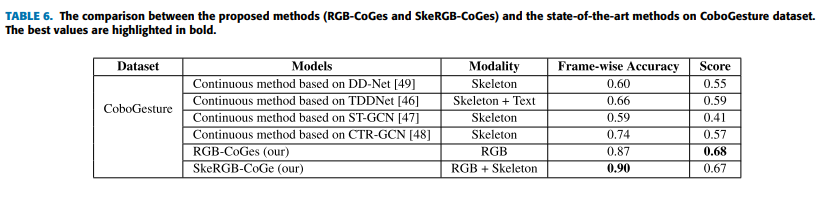

>Figure 11: visualization kết quả continuous recognition.

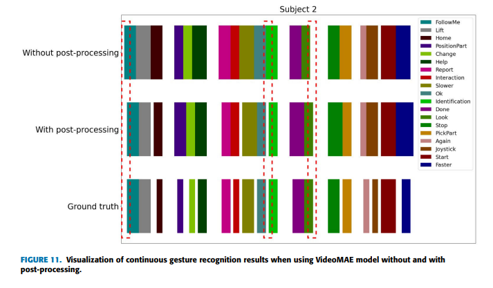

### 5.4. Kết quả trên dataset khác

Bài báo cũng đánh giá trên các dataset khác như IPN-Hand và EgoGesture để kiểm chứng khả năng tổng quát của phương pháp.

Theo kết luận bài báo:

- Trên IPN-Hand, phương pháp đạt **78.81% accuracy** cho isolated recognition.
- Với continuous recognition trên IPN-Hand, phương pháp đạt khoảng **0.80 frame-wise accuracy** và **0.37 overlap score**.
- Trên EgoGesture, kết quả continuous thấp hơn, khoảng **0.56 frame-wise accuracy** và **0.36 overlap score**.

Kết quả này cho thấy phương pháp hoạt động tốt nhất trên dataset được thiết kế đúng ngữ cảnh CoboGesture. Khi chuyển sang dataset khác, đặc biệt dataset có điều kiện quay, bộ cử chỉ hoặc góc nhìn khác, hiệu năng giảm. Đây là hiện tượng thường gặp trong computer vision do domain shift.

>Table 7: so sánh trên IPN-Hand và EgoGesture.

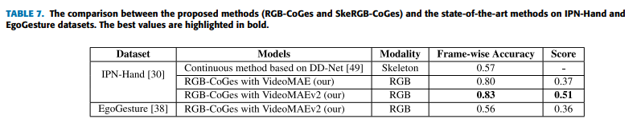

### 5.5. Triển khai trên edge device

Một đóng góp thực tế của bài báo là thử nghiệm triển khai trên edge device. Thiết bị được sử dụng là **Jetson AGX Orin Developer Kit**.

Trong thiết lập online:

- camera ghi nhận người thực hiện cử chỉ trong môi trường mô phỏng công nghiệp;
- skeleton extraction sử dụng Mediapipe;
- VideoMAE dùng để phân loại đoạn cử chỉ;
- hệ thống xử lý trực tuyến và đưa ra nhãn dự đoán.

Bài báo ghi nhận:

- frame-wise accuracy online khoảng **94%** trên các frame đã xử lý;
- activity overlap score khoảng **56%**;
- tốc độ Mediapipe khoảng **4.5 FPS**;
- tốc độ VideoMAE khoảng **2.5 FPS**;
- độ trễ nhận dạng trung bình khoảng **1.3 giây**, có lúc vượt quá 2 giây.

Nhận xét:

- Độ chính xác theo frame cao chứng tỏ mô hình vẫn có khả năng phân loại tốt.
- Overlap score thấp hơn do tốc độ xử lý thấp và độ trễ gây lệch thời điểm dự đoán.
- Bottleneck chính nằm ở tốc độ xử lý của Mediapipe và VideoMAE trên edge device.
- Hệ thống có tiềm năng triển khai thực tế nhưng cần tối ưu thêm để đạt phản hồi thời gian thực ổn định.

>  Figure 12: thiết lập triển khai edge device.

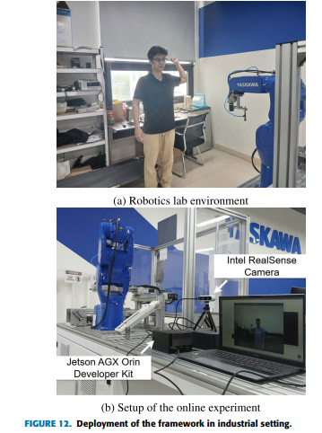

>  Table 8: online evaluation results on edge device.

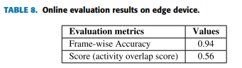

### 5.6. Đánh giá tổng hợp

Bài báo đạt được 3 đóng góp đáng chú ý.

- Mô hình VideoMAE/VideoMAEv2 rất hiệu quả cho isolated gesture recognition. Điều này cho thấy video transformer phù hợp với bài toán nhận dạng cử chỉ tay.

- Việc chuyển từ isolated sang continuous recognition làm bài toán khó hơn rõ rệt. Accuracy vẫn khá cao nhưng overlap score thấp hơn, chứng minh khó khăn lớn nhất là xác định đúng biên thời gian của cử chỉ.

- Kết quả edge deployment cho thấy bài toán không chỉ nằm ở độ chính xác mô hình mà còn ở tốc độ xử lý, độ trễ và khả năng đồng bộ giữa các thành phần trong pipeline.

---

## 6. Research Gap còn lại của bài báo

### 6.1. Quy mô dataset còn hạn chế

CoboGesture có 50 người tham gia và 150 video untrimmed. Quy mô này có giá trị cho nghiên cứu ban đầu nhưng vẫn nhỏ so với yêu cầu triển khai thực tế trong môi trường công nghiệp đa dạng. Để tăng độ tổng quát, dataset nên được mở rộng thêm ví dụ nhưu :

- số lượng người tham gia;
- độ tuổi, giới tính, thuận tay trái/phải;
- trang phục bảo hộ;
- góc nhìn camera;
- điều kiện ánh sáng;
- môi trường nhà máy thật.

### 6.2. Overlap score chưa cao

Frame-wise accuracy của RGB-CoGes và SkeRGB-CoGes tốt, nhưng overlap score chỉ khoảng 0.67–0.68 trên CoboGesture và thấp hơn khi đánh giá online. Điều này cho thấy bài toán phát hiện biên cử chỉ vẫn chưa được giải quyết triệt để.

### 6.3. Tốc độ edge deployment quá thấp 

Trên Jetson AGX Orin (GPU, 32GB RAM), tốc độ Mediapipe và VideoMAE còn thấp so với tốc độ camera. Điều này gây dropped frames và tăng độ trễ. Với ứng dụng robot, độ trễ quá cao có thể làm tương tác kém tự nhiên hoặc ảnh hưởng an toàn.

Một số phương pháp có thể tối ưu thêm:

- dùng mô hình nhẹ hơn;
- quantization hoặc TensorRT optimization;
- giảm độ phân giải đầu vào;
- giảm số frame mỗi clip;
- dùng early-exit hoặc adaptive inference;
- tách pipeline thành các luồng song song.

## 7. Nhận xét cá nhân 

### 7.1. Điểm mạnh của bài báo

Điểm mạnh nổi bật:

- xác định đúng hạn chế của isolated gesture recognition;
- xây dựng dataset CoboGesture có annotation thời gian;
- đề xuất 2 pipeline: RGB-CoGes và SkeRGB-CoGes ( trong đó ý tưởng dùng skeleton để tập trung phân tích vào khu vực có cử chỉ em thấy khá hay, trước đó em có dùng yolo pose để zoom vào cánh tay, tuy nhiên bounding box bị thay đổi kích thước liên tục khi chạy reference --> resize ảnh cho đúng cấu hình Model CNN--> chuỗi hình ảnh mất đi tỉ lệ thực nhất quán với nhau nên em chưa tìm được cách tối ưu ạ) ;
- dùng VideoMAE/VideoMAEv2 kiến trúc transfomer ( thay decoder bằng mạng CNN để phân loại); 
- có đánh giá cả offline và online;
- có triển khai thử trên thiết bị biên ( mặc dù chưa hiệu quả)

### 7.2. Điểm hạn chế

Tốc độ xử lý trên edge device khoảng 5 FPS là rất thấp cho dự án realtime . Vì bài báo sử dụng thêm Mediapipe để lấy dữ liệu skeleton, moldel này cũng cần tài nguyên xử lý tương đối .
- Ngoài ra hạn chế của mediapipe là chỉ detect được 1 người. Nếu dùng Yolo pose thì được nhiều người hơn nhưng model thì lại nặng hơn Mediapipe

### 7.3. Hướng nghiên cứu action recognition trên edge device

Bài báo cung cấp vài gợi ý mà em thấy hữu ích cho hướng nghiên cứu nhận dạng hành động/cử chỉ trên thiết bị biên nhưu sau :

- Vì thực tế cần chạy realtime liên tục nên phương pháp continuous bài báo đưa ra là hợp lí. 
- Có thể thửu nghiệm VideoMAE trên edge device để đánh giá hiệu suất .
- Skeleton có thể là phương pháp để hỗ trợ phát hiện chuyển động hoặc giảm chi phí xử lý. 
---
