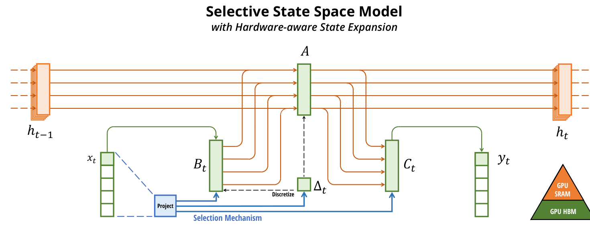
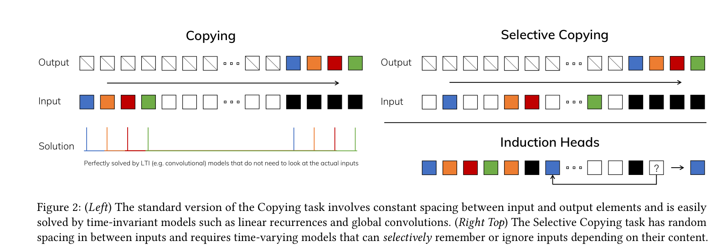
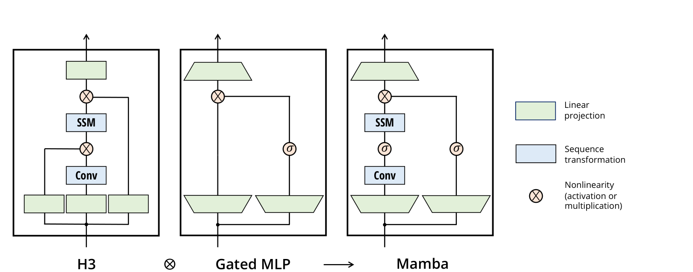
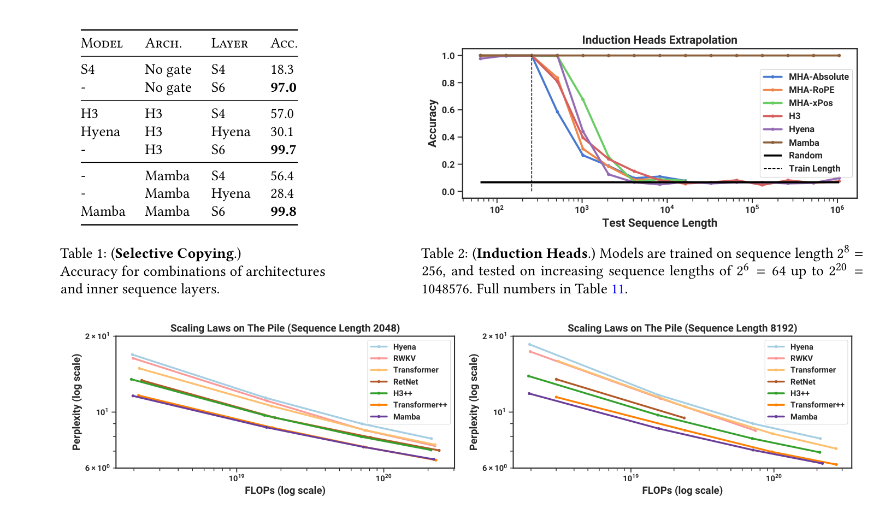
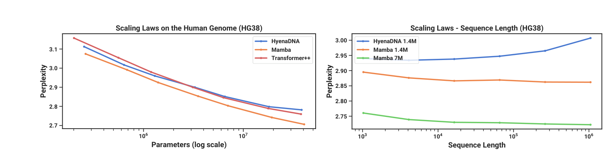
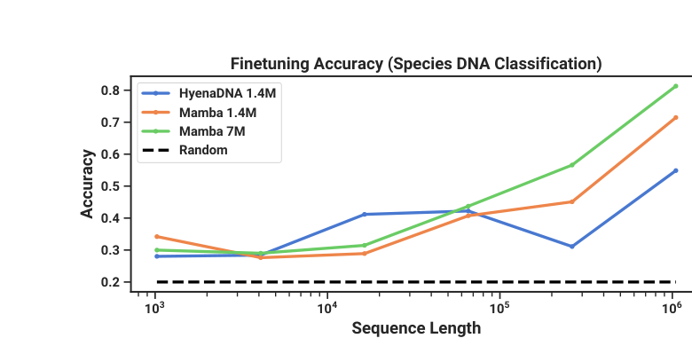
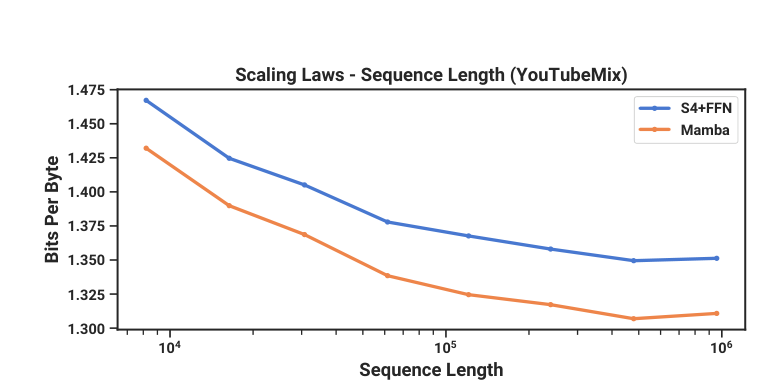
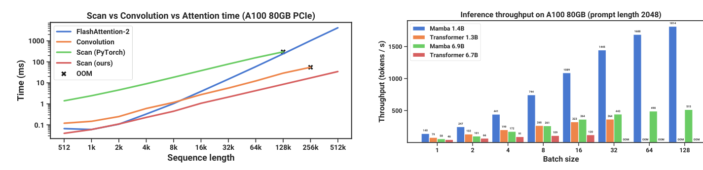
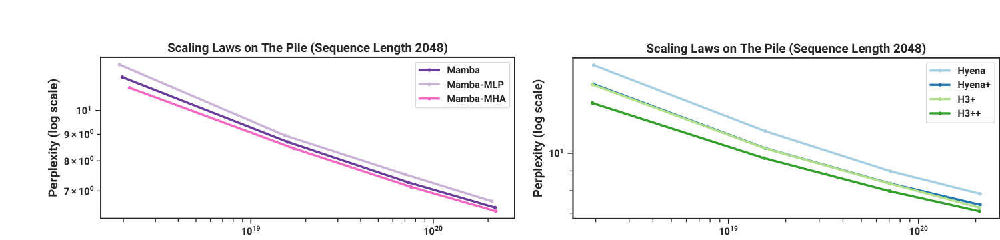
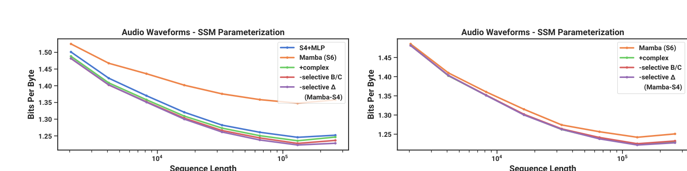

# Mamba : Linear-Time Sequence Modeling with Selective State Spaces

- Bản dịch có chú giải bài báo: **Mamba: Mô hình hóa chuỗi với thời gian tính toán tuyến tính bằng không gian trạng thái chọn lọc**.
- Tác giả : Albert Gu, Tri Dao.
- Link mã nguồn được công bố trong bài báo : `https://github.com/state-spaces/mamba`.

> **Quy ước biên tập:** Các đoạn thuộc nguyên bản được trình bày theo đúng thứ tự mục của bài báo. Những phần diễn giải thêm cho hướng Action Recognition/Edge Device được ghi rõ là **Ghi chú của người dịch**, không phải nội dung của tác giả.

## Abstract

Các mô hình nền tảng (foundation models), hiện đang vận hành hầu hết các ứng dụng nổi bật trong học sâu (deep learning), gần như đều dựa trên kiến trúc **Transformer** và module cốt lõi của nó là **attention**. Nhiều kiến trúc có thời gian tính toán dưới bậc hai (subquadratic-time architectures) như **linear attention**, **gated convolution** và **recurrent models**, cũng như **structured state space models - SSMs** đã được phát triển để giải quyết sự kém hiệu quả về tính toán của Transformer trên các chuỗi dài (long sequences), nhưng chúng chưa đạt hiệu quả tốt như attention trên các modality quan trọng như ngôn ngữ (language). Chúng tôi xác định rằng một điểm yếu then chốt của các mô hình như vậy là sự thiếu khả năng thực hiện suy luận dựa trên nội dung (content-based reasoning), và đưa ra một số cải tiến. Thứ nhất, chỉ cần cho phép các tham số SSM là các hàm của đầu vào (functions of the input) đã giải quyết điểm yếu của chúng với các modality rời rạc (discrete modalities), cho phép mô hình chọn lọc lan truyền hoặc quên thông tin dọc theo chiều độ dài chuỗi (sequence length dimension) tùy thuộc vào token hiện tại. Thứ hai, mặc dù thay đổi này ngăn việc sử dụng các convolution hiệu quả (efficient convolutions), chúng tôi thiết kế một thuật toán song song có xét tới phần cứng (hardware-aware parallel algorithm) trong chế độ hồi quy (recurrent mode). Chúng tôi tích hợp các selective SSM này vào một kiến trúc mạng neural end-to-end được đơn giản hóa, không có attention hoặc thậm chí không có các khối MLP (Mamba). Mamba có inference nhanh (throughput cao hơn Transformer **5×**) và có khả năng scale tuyến tính theo độ dài chuỗi (linear scaling in sequence length), đồng thời hiệu năng của nó cải thiện trên dữ liệu thực tới các chuỗi có độ dài hàng triệu (million-length sequences). Với vai trò là một backbone mô hình chuỗi tổng quát (general sequence model backbone), Mamba đạt hiệu năng state-of-the-art trên nhiều modality như ngôn ngữ, audio và genomics. Trong language modeling, mô hình **Mamba-3B** của chúng tôi vượt trội hơn Transformer cùng kích thước và đạt mức tương đương Transformer có kích thước gấp đôi, trong cả pretraining và downstream evaluation.

## 1 Introduction

Các mô hình nền tảng (foundation models - FMs), hay các mô hình lớn được pretrain trên dữ liệu khổng lồ rồi được thích nghi cho các nhiệm vụ downstream, đã nổi lên như một mô thức hiệu quả (effective paradigm) trong machine learning hiện đại. Backbone của các FM này thường là các mô hình chuỗi (sequence models), hoạt động trên các chuỗi đầu vào có độ dài tùy ý (arbitrary sequences of inputs) từ rất nhiều miền dữ liệu khác nhau như ngôn ngữ, hình ảnh, speech, audio, time series và genomics (Brown et al. 2020; Dosovitskiy et al. 2020; Ismail Fawaz et al. 2019; Oord et al. 2016; Poli et al. 2023; Sutskever, Vinyals, and Quoc V Le 2014). Mặc dù khái niệm này không phụ thuộc (agnostic) vào một lựa chọn kiến trúc mô hình cụ thể, các FM hiện đại chủ yếu (predominantly) dựa trên một loại mô hình chuỗi duy nhất : **Transformer** (Vaswani et al. 2017) và lớp attention cốt lõi của nó (Bahdanau, Cho, and Bengio 2015). Hiệu quả (efficacy) của self-attention được quy cho khả năng định tuyến thông tin một cách dày đặc (route information densely) trong một cửa sổ ngữ cảnh (context window), cho phép nó mô hình hóa dữ liệu phức tạp. Tuy nhiên, tính chất này mang lại các nhược điểm cơ bản : không có khả năng mô hình hóa bất kỳ thứ gì nằm ngoài một cửa sổ hữu hạn (finite window), và chi phí scale bậc hai theo độ dài cửa sổ (quadratic scaling with respect to the window length). Một khối lượng nghiên cứu rất lớn đã xuất hiện về các biến thể attention hiệu quả hơn nhằm khắc phục các nhược điểm này (Tay, Dehghani, Bahri, et al. 2022), nhưng thường phải đánh đổi chính những tính chất khiến attention hiệu quả. Cho tới hiện tại, chưa có biến thể nào trong số này được chứng minh là hiệu quả về mặt thực nghiệm ở quy mô lớn trên nhiều miền dữ liệu (across domains).

Gần đây, các mô hình chuỗi không gian trạng thái có cấu trúc (structured state space sequence models - SSMs) (Gu, Goel, and Ré 2022; Gu, Johnson, Goel, et al. 2021) đã nổi lên như một lớp kiến trúc hứa hẹn cho mô hình hóa chuỗi (sequence modeling). Các mô hình này có thể được diễn giải như một sự kết hợp giữa mạng neural hồi quy (recurrent neural networks - RNNs) và mạng neural tích chập (convolutional neural networks - CNNs), với cảm hứng từ các mô hình không gian trạng thái cổ điển (classical state space models) (Kalman 1960). Lớp mô hình này có thể được tính rất hiệu quả dưới dạng recurrence hoặc convolution, với khả năng scale tuyến tính hoặc gần tuyến tính theo độ dài chuỗi. Ngoài ra, chúng có các cơ chế có nguyên lý (principled mechanisms) để mô hình hóa phụ thuộc dài hạn (long-range dependencies) (Gu, Dao, et al. 2020) trong một số modality dữ liệu nhất định, và đã thống trị các benchmark như Long Range Arena (Tay, Dehghani, Abnar, et al. 2021). Nhiều biến thể của SSMs (Gu, Goel, and Ré 2022; Gu, Gupta, et al. 2022; Gupta, Gu, and Berant 2022; Y. Li et al. 2023; Ma et al. 2023; Orvieto et al. 2023; Smith, Warrington, and Linderman 2023) đã thành công trong các miền liên quan tới dữ liệu tín hiệu liên tục (continuous signal data) như audio và vision (Goel et al. 2022; Nguyen, Goel, et al. 2022; Saon, Gupta, and Cui 2023). Tuy nhiên, chúng kém hiệu quả hơn trong việc mô hình hóa dữ liệu rời rạc và giàu thông tin (discrete and information-dense data) như văn bản (text).

Chúng tôi đề xuất một lớp mới của các mô hình không gian trạng thái có chọn lọc (selective state space models), cải thiện các công trình trước đó trên nhiều trục để đạt được năng lực mô hình hóa của Transformer trong khi vẫn scale tuyến tính theo độ dài chuỗi.

**Selection Mechanism.** Thứ nhất, chúng tôi xác định một giới hạn then chốt của các mô hình trước đó : khả năng chọn dữ liệu hiệu quả theo cách phụ thuộc vào đầu vào (input-dependent manner), tức tập trung vào hoặc bỏ qua các input cụ thể. Dựa trên trực giác từ các nhiệm vụ tổng hợp quan trọng (important synthetic tasks) như selective copy và induction heads, chúng tôi thiết kế một cơ chế chọn lọc đơn giản bằng cách tham số hóa các tham số SSM dựa trên input. Điều này cho phép mô hình lọc bỏ thông tin không liên quan (irrelevant information) và ghi nhớ thông tin liên quan (relevant information) vô thời hạn.

**Hardware-aware Algorithm.** Thay đổi đơn giản này đặt ra một thách thức kỹ thuật đối với việc tính toán mô hình; trên thực tế, tất cả các mô hình SSM trước đó đều phải bất biến theo thời gian và input (time- and input-invariant) để đạt hiệu quả tính toán. Chúng tôi vượt qua điều này bằng một thuật toán có xét tới phần cứng (hardware-aware algorithm), tính mô hình theo kiểu hồi quy bằng scan thay vì convolution, nhưng không hiện thực hóa trạng thái mở rộng (expanded state) nhằm tránh truy cập I/O giữa các tầng khác nhau trong phân cấp bộ nhớ GPU (GPU memory hierarchy). Hiện thực thu được nhanh hơn các phương pháp trước cả về lý thuyết (scale tuyến tính theo độ dài chuỗi, so với giả tuyến tính (pseudo-linear) của tất cả SSM dựa trên convolution) và trên phần cứng hiện đại (nhanh hơn tới **3×** trên GPU A100).

**Architecture.** Chúng tôi đơn giản hóa các kiến trúc mô hình chuỗi sâu trước đó bằng cách kết hợp thiết kế của các kiến trúc SSM trước đây (Dao, Fu, Saab, et al. 2023) với khối MLP của Transformer vào một block duy nhất, dẫn tới một thiết kế kiến trúc đơn giản và đồng nhất (homogenous architecture design) gọi là **Mamba**, có tích hợp selective state spaces.

Selective SSMs, và mở rộng ra là kiến trúc Mamba, là các mô hình hồi quy hoàn toàn (fully recurrent models) với những đặc tính then chốt khiến chúng phù hợp làm backbone cho các mô hình nền tảng tổng quát hoạt động trên chuỗi. (i) **Chất lượng cao (High quality)** : tính chọn lọc (selectivity) mang lại hiệu năng mạnh trên các modality dày đặc (dense modalities) như ngôn ngữ và genomics. (ii) **Training và inference nhanh (Fast training and inference)** : tính toán và bộ nhớ scale tuyến tính theo độ dài chuỗi trong training, và khi unroll mô hình theo kiểu autoregressive trong inference, mỗi bước chỉ cần thời gian hằng số vì không cần cache các phần tử trước đó. (iii) **Ngữ cảnh dài (Long context)** : chất lượng và hiệu quả kết hợp với nhau tạo ra cải thiện hiệu năng trên dữ liệu thực tới độ dài chuỗi **1M**.

Chúng tôi kiểm chứng thực nghiệm tiềm năng của Mamba như một backbone FM chuỗi tổng quát, xét cả chất lượng pretraining và hiệu năng trên nhiệm vụ chuyên biệt theo miền (domain-specific task performance), trên nhiều loại modality và thiết lập :

- **Synthetics.** Trên các nhiệm vụ tổng hợp quan trọng như copying và induction heads, vốn được đề xuất là then chốt đối với large language models, Mamba không chỉ giải quyết chúng dễ dàng mà còn có thể ngoại suy nghiệm tới độ dài vô hạn trên thực tế (>1M tokens).
- **Audio and Genomics.** Mamba vượt các mô hình state-of-the-art trước đó như SaShiMi, Hyena và Transformers trong mô hình hóa waveform audio và chuỗi DNA, xét cả chất lượng pretraining và các metric downstream (ví dụ giảm FID trên một dataset speech generation khó xuống hơn một nửa). Trong cả hai thiết lập, hiệu năng của nó cải thiện với context dài hơn tới các chuỗi độ dài hàng triệu.
- **Language Modeling.** Mamba là mô hình chuỗi thời gian tuyến tính (linear-time sequence model) đầu tiên thực sự đạt hiệu năng chất lượng Transformer (Transformer-quality performance), xét cả perplexity trong pretraining và downstream evaluations. Với scaling laws tới 1B tham số, chúng tôi cho thấy Mamba vượt hiệu năng của một dải rộng baseline, bao gồm các công thức training Transformer hiện đại rất mạnh dựa trên LLaMa (Touvron et al. 2023). Language model Mamba của chúng tôi có throughput generation cao hơn **5×** so với Transformer có kích thước tương tự, và chất lượng của **Mamba-3B** khớp với Transformer có kích thước gấp đôi (ví dụ avg. trên common sense reasoning cao hơn 4 điểm so với Pythia-3B và thậm chí vượt Pythia-7B).

Mã mô hình và các checkpoint đã pretrain được open-source tại `https://github.com/state-spaces/mamba`.

## 2 State Space Models

Các mô hình chuỗi không gian trạng thái có cấu trúc (structured state space sequence models - S4) là một lớp mô hình chuỗi gần đây cho deep learning, có liên hệ rộng với RNNs, CNNs và các mô hình không gian trạng thái cổ điển (classical state space models). Chúng được lấy cảm hứng từ một hệ liên tục cụ thể (1), ánh xạ một hàm hoặc chuỗi một chiều `x(t) ∈ R` thành `y(t) ∈ R` thông qua một trạng thái ẩn tiềm tàng (implicit latent state) `h(t) ∈ R^N`.



**Figure 1: (Overview.)** Các structured SSM ánh xạ độc lập từng kênh (channel), ví dụ `D = 5`, của input `x` thành output `y` thông qua một trạng thái ẩn chiều cao hơn (higher dimensional latent state) `h`, ví dụ `N = 4`. Các SSM trước đó tránh hiện thực hóa (materializing) trạng thái hiệu dụng lớn này (`DN`, nhân với batch size `B` và độ dài chuỗi `L`) thông qua các đường tính toán thay thế thông minh, vốn yêu cầu tính bất biến theo thời gian (time-invariance) : các tham số `(Δ, A, B, C)` là hằng số theo thời gian. Cơ chế chọn lọc (selection mechanism) của chúng tôi thêm lại động lực học phụ thuộc input (input-dependent dynamics), điều này cũng yêu cầu một thuật toán cẩn thận có xét tới phần cứng (hardware-aware algorithm) để chỉ hiện thực hóa các trạng thái mở rộng (expanded states) ở những tầng hiệu quả hơn trong phân cấp bộ nhớ GPU (GPU memory hierarchy).

Cụ thể, các mô hình S4 được định nghĩa bởi bốn tham số `(Δ, A, B, C)`, các tham số này định nghĩa một phép biến đổi chuỗi-sang-chuỗi (sequence-to-sequence transformation) theo hai giai đoạn.

<div style='color: currentColor; background: transparent; overflow-x: auto; margin: 1em 0;'>
<table style='color: currentColor; border-collapse: collapse; width: 100%; font-family: &quot;Times New Roman&quot;, serif; font-size: 1.05em;'>
<tr>
<td style='padding: 0.25em 1em; text-align: center;'><i>h</i>′(<i>t</i>) = <b>A</b><i>h</i>(<i>t</i>) + <b>B</b><i>x</i>(<i>t</i>)</td>
<td style='padding: 0.25em 1em; text-align: right;'>(1a)</td>
<td style='padding: 0.25em 1em; text-align: center;'><i>h</i><sub>t</sub> = <b>Ā</b><i>h</i><sub>t−1</sub> + <b>B̄</b><i>x</i><sub>t</sub></td>
<td style='padding: 0.25em 1em; text-align: right;'>(2a)</td>
<td style='padding: 0.25em 1em; text-align: center;'><b>K̄</b> = (<b>C</b><b>B̄</b>, <b>C</b><b>Ā</b><b>B̄</b>, …, <b>C</b><b>Ā</b><sup>k</sup><b>B̄</b>, …)</td>
<td style='padding: 0.25em 1em; text-align: right;'>(3a)</td>
</tr>
<tr>
<td style='padding: 0.25em 1em; text-align: center;'><i>y</i>(<i>t</i>) = <b>C</b><i>h</i>(<i>t</i>)</td>
<td style='padding: 0.25em 1em; text-align: right;'>(1b)</td>
<td style='padding: 0.25em 1em; text-align: center;'><i>y</i><sub>t</sub> = <b>C</b><i>h</i><sub>t</sub></td>
<td style='padding: 0.25em 1em; text-align: right;'>(2b)</td>
<td style='padding: 0.25em 1em; text-align: center;'><i>y</i> = <i>x</i> ∗ <b>K̄</b></td>
<td style='padding: 0.25em 1em; text-align: right;'>(3b)</td>
</tr>
</table>
</div>

**Discretization.** Giai đoạn đầu tiên biến đổi các “tham số liên tục” (continuous parameters) `(Δ, A, B)` thành các “tham số rời rạc” (discrete parameters) `(Ā, B̄)` thông qua các công thức cố định `Ā = f_A(Δ, A)` và `B̄ = f_B(Δ, A, B)`, trong đó cặp `(f_A, f_B)` được gọi là một quy tắc rời rạc hóa (discretization rule). Có thể dùng nhiều quy tắc khác nhau, ví dụ zero-order hold (ZOH) được định nghĩa trong phương trình (4).

<div style='color: currentColor; background: transparent; overflow-x: auto; margin: 1em 0; font-family: &quot;Times New Roman&quot;, serif; font-size: 1.05em; text-align: center;'>
<b>Ā</b> = exp(Δ<b>A</b>) &nbsp;&nbsp;&nbsp;&nbsp;
<b>B̄</b> = (Δ<b>A</b>)<sup>−1</sup>(exp(Δ<b>A</b>) − <b>I</b>) · Δ<b>B</b>
<span style='float: right;'>(4)</span>
</div>

Discretization có liên hệ sâu với các hệ thời gian liên tục (continuous-time systems), nhờ đó có thể trao cho chúng các tính chất bổ sung như bất biến theo độ phân giải (resolution invariance) (Nguyen, Goel, et al. 2022) và tự động bảo đảm mô hình được chuẩn hóa đúng (properly normalized) (Gu, Johnson, Timalsina, et al. 2023; Orvieto et al. 2023). Nó cũng có liên hệ với các cơ chế gating của RNNs (Gu, Gulcehre, et al. 2020; Tallec and Ollivier 2018), điều mà chúng tôi sẽ quay lại trong Section 3.5. Tuy nhiên, từ góc nhìn cơ học (mechanical point of view), discretization có thể đơn giản được xem là bước đầu tiên của computation graph trong forward pass của một SSM. Các biến thể SSM khác có thể bỏ qua bước discretization và thay vào đó tham số hóa trực tiếp `(Ā, B̄)` (Zhang et al. 2023), điều này có thể dễ lập luận hơn.

**Computation.** Sau khi các tham số đã được biến đổi từ `(Δ, A, B, C)` thành `(Ā, B̄, C)`, mô hình có thể được tính theo hai cách, hoặc như một recurrence tuyến tính (linear recurrence) (2), hoặc như một convolution toàn cục (global convolution) (3).

Thông thường, mô hình dùng chế độ convolution (convolutional mode) (3) để training song song hiệu quả (khi toàn bộ chuỗi input đã được thấy trước), và chuyển sang chế độ recurrent (recurrent mode) (2) để inference autoregressive hiệu quả (khi các input được thấy từng timestep một).

**Linear Time Invariance (LTI).** Một tính chất quan trọng của các phương trình (1) tới (3) là động lực học (dynamics) của mô hình là hằng số theo thời gian. Nói cách khác, `(Δ, A, B, C)`, và hệ quả là cả `(Ā, B̄)`, được cố định cho mọi timestep. Tính chất này được gọi là linear time invariance (LTI), có liên hệ sâu với recurrence và convolution. Một cách không chính thức, chúng tôi xem LTI SSMs là tương đương với bất kỳ recurrence tuyến tính (2a) hoặc convolution (3b) nào, và dùng LTI như một thuật ngữ bao trùm (umbrella term) cho các lớp mô hình này.

Cho tới nay, tất cả structured SSMs đều là LTI, ví dụ được tính như convolutions, do các ràng buộc hiệu quả cơ bản (fundamental efficiency constraints), được thảo luận trong Section 3.3. Tuy nhiên, một insight cốt lõi của công trình này là các mô hình LTI có những giới hạn cơ bản trong việc mô hình hóa một số loại dữ liệu nhất định, và các đóng góp kỹ thuật của chúng tôi liên quan tới việc loại bỏ ràng buộc LTI trong khi vẫn vượt qua các nút thắt hiệu quả (efficiency bottlenecks).

**Structure and Dimensions.** Cuối cùng, chúng tôi lưu ý rằng structured SSMs được gọi như vậy vì việc tính chúng hiệu quả cũng yêu cầu áp đặt cấu trúc lên ma trận `A`. Dạng cấu trúc phổ biến nhất là diagonal (Gu, Gupta, et al. 2022; Gupta, Gu, and Berant 2022; Smith, Warrington, and Linderman 2023), và chúng tôi cũng dùng dạng này.

Trong trường hợp này, các ma trận `A ∈ R^{N×N}`, `B ∈ R^{N×1}`, `C ∈ R^{1×N}` đều có thể được biểu diễn bằng `N` số. Để hoạt động trên một chuỗi input `x` có batch size `B`, độ dài `L` và `D` kênh (channels), SSM được áp dụng độc lập cho từng kênh. Lưu ý rằng trong trường hợp này, tổng hidden state có chiều `DN` cho mỗi input, và việc tính nó trên chiều dài chuỗi yêu cầu thời gian và bộ nhớ `O(BLDN)`; đây là gốc rễ của nút thắt hiệu quả cơ bản được xử lý trong Section 3.3.

**General State Space Models.** Chúng tôi lưu ý rằng thuật ngữ state space model có ý nghĩa rất rộng, đơn giản biểu diễn khái niệm về bất kỳ quá trình hồi quy (recurrent process) nào với một trạng thái tiềm tàng (latent state). Nó đã được dùng để chỉ nhiều khái niệm rời rạc trong các ngành khác nhau, bao gồm Markov decision processes (MDP) trong reinforcement learning (Hafner et al. 2020), dynamic causal modeling (DCM) trong computational neuroscience (Friston, Harrison, and Penny 2003), Kalman filters trong controls (Kalman 1960), hidden Markov models (HMM) và linear dynamical systems (LDS) trong machine learning, và rộng hơn là các mô hình recurrent, đôi khi cả convolutional, trong deep learning.

Trong toàn bộ bài báo này, chúng tôi dùng thuật ngữ “SSM” để chỉ riêng lớp structured SSMs hoặc các mô hình S4 (Gu, Goel, and Ré 2022; Gu, Gupta, et al. 2022; Gupta, Gu, and Berant 2022; Hasani et al. 2023; Ma et al. 2023; Smith, Warrington, and Linderman 2023), và dùng các thuật ngữ này thay thế cho nhau (interchangeably). Để tiện, chúng tôi cũng có thể bao gồm các dẫn xuất (derivatives) của những mô hình như vậy, chẳng hạn các mô hình tập trung vào góc nhìn linear-recurrence hoặc global-convolution (Y. Li et al. 2023; Orvieto et al. 2023; Poli et al. 2023), và sẽ làm rõ các sắc thái khi cần thiết.

**SSM Architectures.** SSMs là các phép biến đổi chuỗi độc lập (standalone sequence transformations) có thể được tích hợp vào các kiến trúc neural network end-to-end. Chúng tôi đôi khi cũng gọi các kiến trúc SSM là SSNNs, tương tự như quan hệ giữa CNNs và các lớp linear convolution. Chúng tôi thảo luận một số kiến trúc SSM nổi tiếng nhất, nhiều kiến trúc trong số đó cũng sẽ đóng vai trò là các baseline chính của chúng tôi.

- **Linear attention** (Katharopoulos et al. 2020) là một xấp xỉ của self-attention liên quan tới một recurrence, có thể được xem như một linear SSM suy biến (degenerate linear SSM).
- **H3** (Dao, Fu, Saab, et al. 2023) tổng quát hóa recurrence này để dùng S4; nó có thể được xem như một kiến trúc với một SSM được kẹp giữa hai gated connections (Figure 3). H3 cũng chèn một local convolution tiêu chuẩn, được họ diễn giải như một shift-SSM, trước lớp SSM chính.
- **Hyena** (Poli et al. 2023) dùng cùng kiến trúc với H3 nhưng thay lớp S4 bằng một global convolution được tham số hóa bởi MLP (MLP-parameterized global convolution) (Romero et al. 2021).
- **RetNet** (Y. Sun et al. 2023) thêm một gate bổ sung vào kiến trúc và dùng một SSM đơn giản hơn, cho phép một đường tính toán song song thay thế (alternative parallelizable computation path), dùng một biến thể của multi-head attention (MHA) thay vì convolutions.
- **RWKV** (B. Peng et al. 2023) là một RNN gần đây được thiết kế cho language modeling dựa trên một xấp xỉ linear attention khác, attention-free Transformer (S. Zhai et al. 2021). Cơ chế “WKV” chính của nó liên quan tới các LTI recurrences và có thể được xem là tỉ số của hai SSMs.

Các SSM và kiến trúc liên quan chặt chẽ khác được thảo luận thêm trong phần related work mở rộng (Appendix B). Chúng tôi đặc biệt nhấn mạnh S5 (Smith, Warrington, and Linderman 2023), QRNN (Bradbury et al. 2016), và SRU (Lei et al. 2017), những phương pháp mà chúng tôi xem là liên quan gần nhất tới selective SSM cốt lõi của mình.

## 3. Selective State Space Models

Chúng tôi tạo động lực cho selection mechanism bằng trực giác từ các tác vụ tổng hợp (Mục 3.1), sau đó giải thích cách đưa cơ chế này vào state space model (Mục 3.2). Các SSM biến thiên theo thời gian thu được không thể sử dụng convolution, từ đó đặt ra thách thức kỹ thuật về cách tính chúng hiệu quả. Chúng tôi khắc phục bằng một thuật toán hardware-aware khai thác hệ phân cấp bộ nhớ của phần cứng hiện đại (Mục 3.3). Tiếp theo, chúng tôi mô tả một kiến trúc SSM đơn giản không có attention, thậm chí không có MLP block (Mục 3.4). Cuối cùng, chúng tôi thảo luận thêm các tính chất của selection mechanism (Mục 3.5).

### 3.1 Motivation : Selection as a Means of Compression

Chúng tôi lập luận rằng một vấn đề nền tảng của sequence modeling là nén context vào một state nhỏ hơn. Trên thực tế, có thể nhìn sự đánh đổi giữa các sequence model phổ biến từ góc độ này. Attention vừa hiệu quả về chất lượng vừa kém hiệu quả về tính toán vì nó chủ ý không nén context. Điều này thể hiện ở autoregressive inference: mô hình phải lưu rõ toàn bộ context, tức KV cache, trực tiếp dẫn tới inference có thời gian tuyến tính chậm và training bậc hai của Transformer. Ngược lại, recurrent model hiệu quả vì có state hữu hạn, kéo theo inference constant-time và training linear-time. Tuy nhiên, hiệu quả dự đoán của chúng bị giới hạn bởi mức độ state đó nén được context tốt đến đâu.

Để hiểu nguyên lý này, chúng tôi tập trung vào hai ví dụ xuyên suốt là các tác vụ tổng hợp trong Hình 2.

- **Selective Copying** sửa đổi tác vụ Copying phổ biến (Arjovsky, Shah, and Bengio 2016) bằng cách thay đổi vị trí của các token cần ghi nhớ. Tác vụ yêu cầu suy luận nhận biết nội dung để ghi nhớ token liên quan (có màu) và lọc bỏ token không liên quan (màu trắng).
- **Induction Heads** là một cơ chế nổi tiếng được giả thuyết là giải thích phần lớn khả năng in-context learning của LLM (Olsson et al. 2022). Nó yêu cầu suy luận nhận biết context để biết khi nào phải tạo đúng output trong context phù hợp (màu đen).



**Figure 2: (Trái)** Copying chuẩn có khoảng cách cố định giữa input và output, nên các mô hình bất biến theo thời gian như linear recurrence và global convolution giải dễ dàng. **(Phải, trên)** Selective Copying có khoảng cách ngẫu nhiên giữa các input, yêu cầu mô hình biến thiên theo thời gian có thể chọn lọc nhớ hoặc bỏ qua input tùy nội dung. **(Phải, dưới)** Induction Heads là ví dụ associative recall yêu cầu truy hồi câu trả lời dựa trên context, một năng lực then chốt của LLM.

Các tác vụ này bộc lộ failure mode của mô hình LTI. Theo góc nhìn recurrent, dynamics không đổi của chúng, chẳng hạn phép chuyển `(A, B)` trong phương trình (2), không cho phép chọn đúng thông tin từ context hoặc tác động lên hidden state truyền dọc chuỗi theo cách phụ thuộc input. Theo góc nhìn convolution, global convolution giải được Copying thông thường vì tác vụ chỉ cần nhận biết thời gian, nhưng gặp khó với Selective Copying vì thiếu nhận biết nội dung. Cụ thể hơn, khoảng cách từ input tới output thay đổi và không thể được mô hình hóa bằng convolution kernel tĩnh.

Tóm lại, đánh đổi giữa efficiency và effectiveness của sequence model được đặc trưng bởi khả năng nén state: mô hình hiệu quả phải có state nhỏ, còn mô hình hiệu lực phải có state chứa mọi thông tin cần thiết từ context. Từ đó, chúng tôi đề xuất **selectivity** là một nguyên lý nền tảng để xây dựng sequence model: khả năng nhận biết context nhằm tập trung vào hoặc lọc bỏ input khi đưa chúng vào sequential state. Cụ thể, selection mechanism kiểm soát cách thông tin lan truyền hoặc tương tác dọc theo chiều chuỗi.

## 3.2 Improving SSMs with Selection

Một cách đưa selection mechanism vào mô hình là làm cho các tham số chi phối tương tác dọc theo chuỗi, chẳng hạn recurrent dynamics của RNN hoặc convolution kernel của CNN, phụ thuộc vào input.

Thuật toán 1 và 2 minh họa selection mechanism chính mà chúng tôi sử dụng. Khác biệt chủ yếu chỉ là biến một số tham số `Δ`, `B`, `C` thành các hàm của input, đồng thời thay đổi tương ứng shape của tensor trong toàn bộ phép tính. Đặc biệt, các tham số này giờ có thêm chiều độ dài `L`, nghĩa là mô hình đã chuyển từ time-invariant sang time-varying. Điều này làm mất tính tương đương với convolution trong phương trình (3), kéo theo ảnh hưởng về efficiency được thảo luận ở phần tiếp theo.

<div style='color: currentColor; background: transparent; overflow-x: auto; margin: 1em 0; font-family: &quot;Times New Roman&quot;, serif; font-size: 1.05em; text-align: center;'>
<div><b>B</b><sub>t</sub> = s<sub>B</sub>(x<sub>t</sub>)</div>
<div><b>C</b><sub>t</sub> = s<sub>C</sub>(x<sub>t</sub>)</div>
<div>Δ<sub>t</sub> = τ<sub>Δ</sub>(Parameter + s<sub>Δ</sub>(x<sub>t</sub>))</div>
</div>

Chúng tôi chọn cụ thể:

\[
s_B(x)=\operatorname{Linear}_N(x),\qquad
s_C(x)=\operatorname{Linear}_N(x),
\]

\[
s_\Delta(x)=\operatorname{Broadcast}_D(\operatorname{Linear}_1(x)),
\qquad \tau_\Delta=\operatorname{softplus},
\]

trong đó `Linear_d` là một phép chiếu có tham số tới dimension `d`. Lựa chọn `s_Δ` và `τ_Δ` xuất phát từ mối liên hệ với gating mechanism của RNN, được giải thích ở Mục 3.5.

**Thuật toán 1 - SSM (S4).** Input và output có shape `(B, L, D)`. `A`, `B`, `C` và `Δ` là các parameter không có chiều `L`; sau discretization, mô hình time-invariant có thể được tính bằng recurrence hoặc convolution.

```text
A : (D, N) ← Parameter          # biểu diễn ma trận N × N có cấu trúc
B : (D, N) ← Parameter
C : (D, N) ← Parameter
Δ : (D)    ← τΔ(Parameter)
Ā, B̄ : (D, N) ← discretize(Δ, A, B)
y ← SSM(Ā, B̄, C)(x)           # recurrence hoặc convolution
```

**Thuật toán 2 - SSM + Selection (S6).** `B`, `C`, `Δ` được sinh từ input nên có chiều `L`; sau discretization, `Ā`, `B̄` có shape `(B, L, D, N)`. Mô hình time-varying chỉ còn dạng recurrence, được tính bằng scan.

```text
A : (D, N)       ← Parameter
B : (B, L, N)    ← sB(x)
C : (B, L, N)    ← sC(x)
Δ : (B, L, D)    ← τΔ(Parameter + sΔ(x))
Ā, B̄ : (B, L, D, N) ← discretize(Δ, A, B)
y ← SSM(Ā, B̄, C)(x)             # recurrence/scan
```

## 3.3 Efficient Implementation of Selective SSMs

Các primitive thân thiện với phần cứng như convolution và attention được ứng dụng rộng rãi. Ở đây, mục tiêu của chúng tôi là làm selective SSM cũng hiệu quả trên phần cứng hiện đại, đặc biệt là GPU. Selection mechanism khá tự nhiên, và các công trình trước từng thử một số trường hợp đặc biệt, chẳng hạn cho `Δ` thay đổi theo thời gian trong recurrent SSM. Tuy nhiên, giới hạn cốt lõi của SSM là efficiency; đó là lý do S4 và mọi dẫn xuất trước đây đều dùng mô hình LTI không chọn lọc, thường dưới dạng global convolution.

### 3.3.1 Motivation of Prior Models

Trước hết, chúng tôi xem lại động lực của các mô hình trước và khái quát cách khắc phục giới hạn của chúng.

- Ở mức cao, recurrent model như SSM luôn đánh đổi giữa expressivity và speed. Mô hình có hidden state dimension lớn hơn về lý thuyết sẽ hiệu lực hơn nhưng chậm hơn. Vì vậy, ta muốn tối đa hóa hidden state dimension mà không phải trả chi phí speed và memory.
- Recurrent mode linh hoạt hơn convolution mode vì dạng convolution (3) được suy ra bằng cách khai triển recurrence (2). Tuy nhiên, recurrent mode ngây thơ phải tính và materialize latent state `h` có shape `(B, L, D, N)`, lớn hơn input `x` và output `y` shape `(B, L, D)` một hệ số `N`. Convolution mode được đưa ra để bỏ qua việc materialize state, chỉ tạo convolution kernel (3a) có size `(B, L, D)`.
- Các LTI SSM trước khai thác cả dạng recurrent và convolution để tăng effective state dimension lên hệ số `N`, thường khoảng `10-100`, lớn hơn RNN truyền thống mà không chịu phạt về efficiency.

### 3.3.2 Overview of Selective Scan: Hardware-Aware State Expansion

Selection mechanism khắc phục giới hạn của LTI model, nhưng đồng thời buộc chúng tôi xem xét lại bài toán tính SSM. Chúng tôi giải quyết bằng ba kỹ thuật cổ điển: **kernel fusion**, **parallel scan** và **recomputation**. Có hai quan sát chính:

- Recurrent computation ngây thơ dùng `O(BLDN)` FLOPs, còn convolution dùng `O(BLD log L)` FLOPs; recurrence có constant factor thấp hơn. Vì vậy, với chuỗi dài và state dimension `N` không quá lớn, recurrent mode thực tế có thể dùng ít FLOPs hơn.
- Hai thách thức là tính tuần tự của recurrence và mức dùng memory lớn. Với memory, tương tự convolution mode, ta có thể tránh materialize toàn bộ state `h`.

Ý tưởng chính là chỉ materialize state `h` ở các tầng hiệu quả hơn trong memory hierarchy của GPU. Hầu hết phép toán ngoài matrix multiplication bị giới hạn bởi memory bandwidth; scan cũng vậy. Chúng tôi dùng kernel fusion để giảm memory I/O, tạo speedup lớn so với triển khai chuẩn.

Cụ thể, thay vì chuẩn bị scan input `(Ā, B̄)` size `(B, L, D, N)` trong HBM, chúng tôi tải trực tiếp các tham số SSM `(Δ, A, B, C)` từ HBM chậm vào SRAM nhanh, thực hiện discretization và recurrence trong SRAM, rồi chỉ ghi output cuối shape `(B, L, D)` trở lại HBM.

Để tránh recurrence tuần tự, chúng tôi nhận thấy dù phép biến đổi không còn time-invariant, nó vẫn có thể được parallelize bằng một work-efficient parallel scan algorithm.

Cuối cùng, cần tránh lưu các intermediate state vốn cần cho backpropagation. Chúng tôi áp dụng recomputation: intermediate state không được lưu trong forward mà được tính lại trong backward khi input được tải từ HBM vào SRAM. Nhờ đó, fused selective scan layer có memory requirement tương đương một Transformer tối ưu bằng FlashAttention. Chi tiết fused kernel và recomputation nằm trong Phụ lục D; toàn bộ selective SSM layer được minh họa trong Hình 1.

## 3.4 A Simplified SSM Architecture

Tương tự structured SSM, selective SSM là một phép biến đổi chuỗi độc lập có thể được tích hợp linh hoạt vào neural network. H3 là nền tảng của các kiến trúc SSM nổi tiếng nhất; nhìn chung chúng gồm một block lấy cảm hứng từ linear attention, xen kẽ với một MLP block. Chúng tôi đơn giản hóa bằng cách kết hợp hai thành phần này thành một block duy nhất rồi lặp block đó một cách đồng nhất (Hình 3). Thiết kế này được gợi cảm hứng từ Gated Attention Unit, vốn từng thực hiện ý tưởng tương tự cho attention.



**Figure 3: (Architecture.)** Thiết kế block đơn giản hóa kết hợp H3 block - nền tảng của phần lớn kiến trúc SSM - với MLP block phổ biến trong neural network hiện đại. Thay vì xen kẽ hai block, chúng tôi chỉ lặp Mamba block một cách đồng nhất. So với H3, Mamba thay multiplicative gate đầu tiên bằng activation function. So với MLP, Mamba thêm một SSM vào nhánh chính. Với `σ`, chúng tôi dùng activation SiLU/Swish.

Kiến trúc mở rộng model dimension `D` theo expansion factor có thể điều khiển `E`. Trong mỗi block, phần lớn tham số, `3ED²`, nằm ở linear projection: `2ED²` cho input projection và `ED²` cho output projection; phần SSM bên trong đóng góp ít hơn nhiều. Số tham số SSM gồm projection cho `Δ`, `B`, `C` và ma trận `A` là tương đối nhỏ.

Chúng tôi lặp block này, xen standard normalization và residual connection, để tạo kiến trúc Mamba. Trong mọi thí nghiệm, chúng tôi cố định `E = 2` và dùng hai stack của block để khớp `12D²` tham số của cặp MHA và MLP block xen kẽ trong Transformer. Chúng tôi dùng SiLU/Swish, với động lực là khi bỏ SSM thì phần Gated MLP trở thành biến thể SwiGLU phổ biến. Cuối cùng, chúng tôi tùy chọn thêm một normalization layer, cụ thể là LayerNorm, dựa trên cách RetNet dùng normalization ở vị trí tương tự.

## 3.5 Properties of Selection Mechanisms

Selection mechanism là khái niệm rộng hơn, có thể áp dụng theo nhiều cách: cho RNN hoặc CNN truyền thống hơn, cho các tham số khác như `A` trong Thuật toán 2, hoặc dùng các phép biến đổi `s(x)` khác.

### 3.5.1 Connection to Gating Mechanisms

Chúng tôi nhấn mạnh mối liên hệ quan trọng nhất: gating mechanism cổ điển của RNN là một trường hợp của selection mechanism dành cho SSM. Mối liên hệ giữa RNN gating và discretization của hệ continuous-time đã được xác lập rõ. Định lý 1 mở rộng kết quả trước sang ZOH discretization và input-dependent gate. Tổng quát hơn, `Δ` trong SSM có thể được xem là đóng vai trò khái quát của RNN gate. Theo các công trình trước, chúng tôi xem discretization của SSM là nền tảng có nguyên lý cho các gating mechanism vốn được xây dựng theo heuristic.

**Định lý 1.** Khi `N = 1`, `A = -1`, `B = 1`, `s_Δ = Linear(x)` và `τ_Δ = softplus`, recurrence của selective SSM trong Thuật toán 2 có dạng:

\[
g_t=\sigma(\operatorname{Linear}(x_t)),
\]

\[
h_t=(1-g_t)h_{t-1}+g_tx_t. \tag{5}
\]

Như đã nói ở Mục 3.2, lựa chọn cụ thể của `s_Δ` và `τ_Δ` xuất phát từ mối liên hệ này. Nếu một input `x_t` cần bị bỏ qua hoàn toàn, như trong các tác vụ tổng hợp, toàn bộ `D` channel đều phải bỏ qua nó. Vì vậy, chúng tôi chiếu input xuống một dimension trước khi lặp/broadcast kết quả theo `Δ`.

### 3.5.2 Interpretation of Selection Mechanisms

Chúng tôi làm rõ ba hiệu ứng cơ học cụ thể của selection.

**Variable Spacing.** Selectivity cho phép lọc token nhiễu không liên quan xuất hiện giữa các input quan trọng. Điều này được minh họa bởi Selective Copying và xuất hiện phổ biến trong dữ liệu thực, đặc biệt dữ liệu rời rạc, chẳng hạn từ đệm “um” trong ngôn ngữ. Mô hình có thể trực tiếp lọc một input `x_t`; trong gated RNN của Định lý 1, điều này xảy ra khi `g_t → 0`.

**Filtering Context.** Nhiều sequence model thực nghiệm không cải thiện khi context dài hơn, dù về nguyên tắc nhiều context hơn phải giúp hiệu năng tốt hơn. Một giải thích là chúng không thể bỏ qua context không liên quan khi cần; global convolution và LTI model là ví dụ trực quan. Ngược lại, selective model có thể reset state bất cứ lúc nào để loại lịch sử dư thừa, nên về nguyên tắc hiệu năng có thể cải thiện đơn điệu theo context length.

**Boundary Resetting.** Khi nhiều chuỗi độc lập được nối lại, Transformer có thể tách chúng bằng attention mask, còn LTI model làm rò thông tin giữa các chuỗi. Selective SSM cũng có thể reset state tại boundary, chẳng hạn `Δ_t → ∞`, hoặc `g_t → 1` trong Định lý 1. Boundary có thể do nhân tạo, như đóng gói document để tăng hardware utilization, hoặc tự nhiên, như ranh giới episode trong reinforcement learning.

**Diễn giải `Δ`.** `Δ` điều khiển cân bằng giữa tập trung vào và bỏ qua input hiện tại `x_t`. Nó khái quát RNN gate: `Δ` lớn reset state `h` và tập trung vào input hiện tại, còn `Δ` nhỏ duy trì state và bỏ qua input. Theo góc nhìn hệ liên tục được discretize, `Δ → ∞` nghĩa là hệ tập trung vào input hiện tại lâu hơn, qua đó chọn nó và quên state cũ; `Δ → 0` biểu diễn input thoáng qua bị bỏ qua.

**Diễn giải `A`.** `A` cũng có thể được làm selective, nhưng cuối cùng chỉ tác động qua tương tác với `Δ` trong `Ā = exp(ΔA)`. Vì vậy, selectivity trong `Δ` đã đủ tạo selectivity cho `(Ā, B̄)` và là nguồn cải thiện chính. Chúng tôi giả thuyết làm `A` selective cũng cho hiệu năng tương tự, nhưng bỏ qua để giữ thiết kế đơn giản.

**Diễn giải `B` và `C`.** Tính chất quan trọng nhất của selectivity là lọc thông tin không liên quan để nén context vào state hiệu quả. Làm `B` và `C` selective cho phép kiểm soát chi tiết việc có đưa input `x_t` vào state `h_t` hay đưa state vào output `y_t` hay không. Có thể hiểu chúng cho phép mô hình điều biến recurrent dynamics lần lượt dựa trên content của input và context trong hidden state.

## 3.6 Additional Model Details

**Real và Complex.** Phần lớn SSM trước dùng số phức trong state `h`, cần thiết để đạt hiệu năng mạnh trên nhiều tác vụ thuộc perceptual modality. Tuy nhiên, thực nghiệm cho thấy SSM hoàn toàn real-valued vẫn hoạt động tốt, thậm chí tốt hơn trong một số thiết lập. Chúng tôi mặc định dùng số thực; lựa chọn này hoạt động tốt trên mọi tác vụ trừ một tác vụ. Chúng tôi giả thuyết đánh đổi complex-real liên quan tới phổ continuous-discrete của modality: số phức hữu ích cho modality liên tục như audio, video, nhưng ít cần hơn cho modality rời rạc như text, DNA.

**Initialization.** Phần lớn SSM trước đề xuất initialization đặc biệt, nhất là trong trường hợp complex-valued, hữu ích ở một số thiết lập như low-data regime. Mặc định của chúng tôi là S4D-Lin cho số phức và S4D-Real cho số thực, dựa trên lý thuyết HiPPO. Chúng xác định phần tử thứ `n` của `A` lần lượt là `-1/2 + ni` và `-(n + 1)`. Tuy nhiên, chúng tôi kỳ vọng nhiều initialization khác cũng hoạt động tốt, đặc biệt khi dữ liệu lớn và SSM real-valued; Mục 4.6 cung cấp ablation.

**Parameterization of `Δ`.** Chúng tôi định nghĩa điều chỉnh selective cho `Δ` là `s_Δ(x) = Broadcast_D(Linear_1(x))`, dựa trên cơ chế của `Δ` ở Mục 3.5. Dimension 1 có thể được mở rộng thành dimension `R`. Chúng tôi đặt `R` là một phần nhỏ của `D`, dùng số tham số không đáng kể so với các linear projection chính. Broadcast cũng có thể được xem là một linear projection khởi tạo theo pattern gồm `1` và `0`; nếu projection này trainable, ta có dạng `s_Δ(x) = Linear_D(Linear_R(x))`, tức một low-rank projection.

Trong thí nghiệm, parameter `Δ`, có thể xem như bias term, được khởi tạo bằng `τ_Δ^{-1}(Uniform([0.001, 0.1]))`, theo các SSM trước.

**Remark 3.1.** Để viết gọn trong kết quả thực nghiệm, đôi khi chúng tôi gọi selective SSM là mô hình **S6**, vì chúng là mô hình S4 có thêm selection mechanism và được tính bằng scan.

## 4. Empirical Evaluation

Trong Mục 4.1, chúng tôi kiểm tra Mamba trên hai tác vụ tổng hợp đã tạo động lực cho thiết kế ở Mục 3.1. Sau đó, mô hình được đánh giá trên ba miền dữ liệu; ở mỗi miền đều có pretraining tự hồi quy và đánh giá downstream:

- Mục 4.2: pretraining mô hình ngôn ngữ, scaling laws và đánh giá zero-shot.
- Mục 4.3: pretraining chuỗi DNA và fine-tuning phân loại chuỗi dài.
- Mục 4.4: pretraining waveform âm thanh và đánh giá tiếng nói sinh tự hồi quy.

Mục 4.5 đánh giá hiệu quả tính toán khi training và inference. Mục 4.6 ablate các thành phần của kiến trúc và selective SSM.

## 4.1 Synthetic Tasks

Chi tiết về tác vụ và giao thức training nằm trong Phụ lục E.1.

### 4.1.1 Selective Copying

Copying là tác vụ tổng hợp kinh điển để kiểm tra khả năng ghi nhớ của recurrent model. Như Mục 3.1 đã phân tích, LTI SSM - linear recurrence hoặc global convolution - có thể giải Copying thông thường chỉ bằng cách theo dõi thời gian, chẳng hạn tạo convolution kernel có đúng độ dài, thay vì suy luận trên nội dung dữ liệu.

Selective Copying loại bỏ đường tắt này bằng cách ngẫu nhiên hóa khoảng cách giữa các token cần nhớ. Tác vụ tương tự từng được gọi là **Denoising task**.

Một số nghiên cứu cho rằng architecture gating, tức tương tác nhân, có thể tạo tính phụ thuộc dữ liệu. Tuy nhiên, gating không tương tác trực tiếp dọc trục chuỗi nên không thể quyết định khoảng cách giữa các token. Architecture gating vì vậy không tự động là selection mechanism theo định nghĩa của bài báo.

Bảng 1 xác nhận các kiến trúc có gate như H3 và Mamba chỉ cải thiện một phần nếu vẫn dùng lớp S4. Selection mechanism - chuyển S4 thành S6 - giải tác vụ dễ dàng, đặc biệt khi kết hợp với kiến trúc mạnh hơn.

### 4.1.2 Induction Heads

Induction Heads là tác vụ từ hướng mechanistic interpretability, đồng thời có khả năng dự báo đáng ngạc nhiên đối với in-context learning của LLM. Tác vụ yêu cầu associative recall: nếu mô hình từng thấy bigram “Harry Potter”, lần sau khi “Harry” xuất hiện trong cùng chuỗi, mô hình phải dự đoán “Potter” bằng cách sao chép từ lịch sử.

**Dataset.** Mô hình 2 layer được train ở sequence length 256, vocabulary size 16. Khả năng generalization và extrapolation được kiểm tra trên độ dài từ `2^6 = 64` đến `2^20 = 1,048,576` token.

**Models.** Baseline gồm multi-head attention 8 head với nhiều positional encoding và các biến thể SSM. Model dimension là 64 cho Mamba, 128 cho các mô hình còn lại.

**Results.** Mamba - chính xác hơn là selective SSM layer - giải hoàn hảo tác vụ nhờ chọn lọc ghi nhớ token liên quan, bỏ qua mọi token xen giữa. Mô hình tổng quát hóa hoàn hảo tới chuỗi hơn một triệu token, dài hơn khoảng `4000×` so với độ dài training; không phương pháp còn lại nào vượt mức ngoại suy `2×` trong thiết lập này.

## 4.2 Language Modeling



**Figure 4: (Scaling Laws.)** Scaling laws của các model trên The Pile và các kết quả synthetic liên quan.


Phần này đánh giá Mamba như language model autoregressive qua pretraining quy mô lớn và các tác vụ downstream zero-shot.

### 4.2.1 Scaling Laws

Các mô hình khoảng 125M đến 1.3B tham số được train trên The Pile theo giao thức Chinchilla: số token training xấp xỉ 20 lần số tham số. Baseline chính gồm Transformer, Transformer++, Hyena, H3++, RWKV, RetNet và các SSM liên quan. Nhóm tác giả dùng cùng tokenizer, dữ liệu và training recipe khi có thể để tăng tính công bằng.

Hình 4 cho thấy Mamba có scaling law tốt hơn các kiến trúc subquadratic được so sánh và cạnh tranh mạnh với Transformer++. Khoảng cách cải thiện được duy trì khi model size tăng, nên lợi ích không chỉ giới hạn ở mô hình nhỏ.

### 4.2.2 Downstream Evaluations

Bảng 3 đánh giá zero-shot trên các benchmark gồm LAMBADA, HellaSwag, PIQA, ARC và WinoGrande. Các language model mã nguồn mở trong bảng có thể dùng tokenizer và pretraining recipe khác nhau; vì vậy đây không phải so sánh được kiểm soát chặt như scaling law.

Mamba-3B vượt các Transformer cùng cỡ trong nhóm so sánh và đạt chất lượng gần Transformer lớn gấp khoảng hai lần. Kết quả hỗ trợ selective SSM như một backbone ngôn ngữ tổng quát, không chỉ là mô hình chuyên long sequence.

## 4.3 DNA Modeling



**Figure 5: (DNA Scaling Laws.)** Scaling laws khi pretraining trên dataset HG38.



**Figure 6: (Great Apes DNA Classification.)** Accuracy sau fine-tuning theo độ dài chuỗi.


DNA được biểu diễn như chuỗi rời rạc trên một bảng chữ cái nhỏ. Thí nghiệm dùng HG38 - bộ gene người tham chiếu - cho pretraining autoregressive, sau đó đánh giá scaling theo model size, context length và fine-tuning phân loại loài linh trưởng.

### 4.3.1 Scaling: Model Size

Ở context length cố định `2^10 = 1024`, Mamba cải thiện đều khi tăng model size và có scaling tốt hơn các baseline được khảo sát. Selection do đó hữu ích không chỉ với ngôn ngữ mà còn với chuỗi sinh học rời rạc.

### 4.3.2 Scaling: Context Length

Khi giữ tổng lượng tính toán tương đương, tác giả tăng context length và điều chỉnh batch size. Hiệu năng Mamba tiếp tục cải thiện với context dài hơn, trong khi nhiều mô hình khác bão hòa hoặc khó khai thác thông tin xa. Kết quả chứng minh khả năng tận dụng chuỗi dài, không chỉ khả năng chạy trên chuỗi dài.

### 4.3.3 Synthetic Species Classification

Mô hình pretrained trên HG38 được fine-tune để phân loại các đoạn DNA của great apes. Độ dài đầu vào tăng từ `2^10 = 1024` tới `2^20 = 1,048,576`. Accuracy của Mamba tăng theo context length và mô hình xử lý được chuỗi triệu token, thể hiện khả năng truyền thông tin ở khoảng cách rất xa trong downstream task.

## 4.4 Audio Modeling and Generation



**Figure 7: (Audio Pretraining.)** Mamba cải thiện hiệu năng khi context dài hơn trên audio.


Audio waveform là modality liên tục, lấy mẫu đều, có sequence length rất lớn. Thí nghiệm dựa trên kiến trúc SaShiMi: U-Net backbone với hai tầng pooling, model dimension tăng gấp đôi ở mỗi tầng, xen kẽ các block SSM và MLP.

### 4.4.1 Long-Context Autoregressive Pretraining

Mô hình được pretrain tự hồi quy trên YouTubeMix. Khi tăng context length nhưng kiểm soát lượng tính toán, Mamba tận dụng context dài hơn và cải thiện negative log-likelihood. Tuy nhiên, ablation trong phụ lục cho thấy selection không phải lúc nào có lợi với waveform liên tục lấy mẫu đều; một số cấu hình S4 không chọn lọc cạnh tranh hoặc tốt hơn S6. Đây là giới hạn quan trọng của selection mechanism.

### 4.4.2 Autoregressive Speech Generation

Trên SC09, chất lượng sinh tiếng nói vô điều kiện được đánh giá bằng Fréchet DeepSpeech Distance, Inception Score, modified Inception Score và AM Score. Mamba-UNet được so sánh với WaveNet, WaveGAN, DiffWave, SaShiMi cùng các baseline trước đó. Mô hình đạt chất lượng cạnh tranh trong khi giữ sequence modeling tuyến tính.

Bảng 5 ablate kiến trúc ở các tầng ngoài và block trung tâm, cho thấy selective SSM có thể thay block S4 trong pipeline sinh audio mà không cần attention.

## 4.5 Speed and Memory Benchmarks



**Figure 8: (Efficiency Benchmarks.)** Benchmark training và inference của selective scan so với attention/convolution.


**Training.** Selective scan được so sánh với scan chuẩn, convolution dựa trên FFT và attention tối ưu. Kernel hardware-aware nhanh hơn scan thông thường khoảng `20-40×`; ở sequence length 32K, selective scan có thể nhanh hơn attention tới khoảng `7×`. Chi phí block Mamba vẫn tuyến tính theo sequence length.

**Inference.** Khi autoregressive decoding, Mamba chuyển sang recurrent mode và chỉ cập nhật state hiện tại. Mô hình không lưu key/value của toàn bộ context như Transformer. Trong benchmark của bài báo, Mamba đạt throughput cao hơn Transformer khoảng `5×`; throughput không giảm theo context length giống attention với KV cache tăng dần.

**Memory.** Kernel fusion và recomputation giúp selective SSM không ghi tensor state mở rộng `(B, L, D, N)` ra HBM. Dấu chân bộ nhớ training của Mamba tương đương Transformer được tối ưu bằng FlashAttention.

### So sánh inference với Transformer

- Transformer autoregressive inference cần lưu key/value của toàn bộ context.
- Mamba chỉ cần lưu state cố định theo layer.
- Vì vậy, Mamba có tiềm năng tốt cho edge device hoặc hệ thống giới hạn bộ nhớ.

## 4.6 Model Ablations

### 4.6.1 Architecture

Bảng 6 tách ảnh hưởng của block architecture và lớp SSM bên trong. Mamba block đạt chất lượng tương tự H3 nhưng đơn giản hơn: hợp nhất hai nhánh chính, giảm projection và loại bỏ MLP block riêng. Local convolution và multiplicative gating vẫn đóng góp vào hiệu năng.

### 4.6.2 Selective SSM

Bảng 7 thử các tổ hợp `Δ`, `B`, `C` phụ thuộc input. `Δ` là tham số chọn lọc quan trọng nhất; làm `B` và `C` phụ thuộc input tiếp tục cải thiện chất lượng. Cải tiến do đó không chỉ đến từ kernel engineering mà từ việc phá ràng buộc LTI để thêm content-based selection.

Bảng 8 khảo sát khởi tạo ma trận `A`. Mamba không phụ thuộc mạnh vào khởi tạo HiPPO phức tạp; dạng diagonal đơn giản hoạt động tốt. Bảng 9 thay đổi dimension của projection tạo `Δ`; rank nhỏ vẫn đủ biểu đạt. Bảng 10 thay đổi state dimension `N`; tăng `N` cải thiện chất lượng, đặc biệt khi `B` và `C` có tính chọn lọc.

## 5. Discussion

- Mamba cho thấy SSM có thể cạnh tranh với Transformer nếu được bổ sung cơ chế chọn lọc theo nội dung.
- Điểm mạnh chính :
    - Tính toán tuyến tính theo độ dài chuỗi.
    - Inference nhanh.
    - Bộ nhớ thấp hơn, đặc biệt khi sinh autoregressive.
    - Khả năng mở rộng tới chuỗi rất dài.
    - Có thể dùng như backbone tổng quát cho nhiều modality.
- Điểm cần hiểu đúng :
    - Mamba không dùng attention, nên không truy xuất trực tiếp toàn bộ context như Transformer.
    - Mamba nén lịch sử vào state. Selection giúp nén thông minh hơn, nhưng vẫn là nén.
    - Với nhiệm vụ cần copy/truy xuất chính xác nhiều chi tiết trong context rất dài, attention hoặc kiến trúc hybrid vẫn có thể có lợi thế.

## 6. Conclusion

- Bài báo đề xuất **Mamba**, một kiến trúc sequence model tuyến tính theo thời gian dựa trên selective state spaces.
- Đóng góp cốt lõi là thêm selection mechanism vào SSM bằng cách làm `B`, `C`, `Δ` phụ thuộc input.
- Thay đổi này giúp SSM xử lý tốt hơn dữ liệu rời rạc như ngôn ngữ, vốn là điểm yếu của SSM LTI trước đó.
- Vì selection phá vỡ khả năng dùng convolution hiệu quả, bài báo thiết kế selective scan có xét tới phần cứng để huấn luyện nhanh trên GPU.
- Thực nghiệm cho thấy Mamba đạt kết quả mạnh trên language, audio, genomics, đồng thời có inference nhanh và scale tuyến tính theo sequence length.

## Appendix A. Discussion : Selection Mechanism

- Phụ lục phân tích sâu hơn cơ chế selection.
- Selection có thể xem là cách mô hình quyết định thông tin nào cần được giữ trong state nén.
- Trên dữ liệu liên tục, thông tin thường biến đổi trơn, nên LTI SSM có thể hoạt động tốt.
- Trên dữ liệu rời rạc như text, mỗi token có thể mang lượng thông tin rất khác nhau. Vì vậy, mô hình cần cơ chế phụ thuộc nội dung để quyết định cập nhật state.
- `Δ_t` đóng vai trò giống cổng điều khiển timescale, liên hệ với gating trong LSTM/GRU.
- `B_t` và `C_t` đóng vai trò chọn lọc ghi và đọc.

## Appendix B. Related Work

### B.1 S4 Variants and Derivatives

Các biến thể của S4 đơn giản hóa cấu trúc ma trận trạng thái, thay đổi phép rời rạc hóa hoặc diễn giải SSM như global convolution/linear recurrence. Nhóm này gồm DSS, S4D, S5 và nhiều dẫn xuất diagonal SSM. Mamba kế thừa nền tảng structured SSM nhưng bỏ giả định LTI bằng cách làm tham số phụ thuộc input.

### B.2 SSM Architectures

Nhiều kiến trúc đặt lớp SSM trong block có convolution cục bộ, gating và MLP, tiêu biểu như H3 và Hyena. Mamba đơn giản hóa block này, kết hợp SSM branch và gating branch, đồng thời không cần attention hay MLP block riêng biệt.

### B.3 Relationship to RNNs

Selective SSM có thể được xem như một recurrent model với state tuyến tính nhưng tham số chuyển trạng thái phụ thuộc input. `Δ` đóng vai trò tương tự gate điều khiển tốc độ cập nhật hoặc quên; khác biệt chính là cấu trúc SSM cho phép parameterization ổn định và scan song song khi training.

### B.4 Linear Attention

Linear attention cũng viết phép tính dưới dạng recurrence với state có kích thước cố định. Tuy nhiên, selective SSM dùng dynamics được tham số hóa qua hệ state space và phép rời rạc hóa, thay vì tích lũy key-value feature map. Hai hướng có điểm chung về inference tuyến tính nhưng khác cơ chế state update.

### B.5 Long Context Models

Các mô hình long context gồm efficient/sparse attention, recurrent model, gated convolution và SSM. Điểm khác biệt của Mamba là kết hợp selective input-dependent SSM, selective scan tối ưu phần cứng và block end-to-end đơn giản.

## Appendix C. Mechanics of Selective SSMs

- Phụ lục trình bày chi tiết cơ học của selective SSM.
- Với mỗi timestep, tham số phụ thuộc input được sinh ra, sau đó rời rạc hóa để tạo recurrence.
- Vì recurrence có dạng affine transformation, có thể dùng phép scan kết hợp (associative scan).
- Điều này cho phép parallelization dù mô hình không còn convolution LTI.

## Appendix D. Hardware-aware Algorithm For Selective SSMs

- Phụ lục mô tả chi tiết thuật toán phần cứng.
- Mục tiêu là giảm số lần đọc/ghi HBM, vì memory bandwidth là nút thắt lớn trên GPU.
- Thuật toán fuse nhiều bước : projection, discretization, scan và output computation.
- State mở rộng chỉ được giữ trong SRAM nhanh hơn trong quá trình tính.
- Backward dùng recomputation để tránh lưu toàn bộ activation lớn.
- Thiết kế này tương tự tinh thần của FlashAttention : không thay đổi toán học cốt lõi, nhưng sắp xếp tính toán theo phần cứng để giảm memory I/O.

## Appendix E. Experimental Details and Additional Results



**Figure 9: (Scaling laws: extra ablations.)** Các ablation bổ sung trên scaling laws.



**Figure 10: (Audio Pretraining Ablations.)** Ablation trên audio waveform với các tham số hóa SSM khác nhau.


### E.1 Synthetic Tasks

Phụ lục mô tả cách sinh dữ liệu Selective Copying và Induction Heads, model size, optimizer, số bước training và tiêu chí accuracy. Bảng 11 mở rộng kết quả ngoại suy Induction Heads từ độ dài 64 tới 1,048,576; dấu kiểm biểu thị accuracy hoàn hảo, dấu `✗` biểu thị hết bộ nhớ.

### E.2 Language Modeling

#### E.2.1 Scaling Law Details

Bảng 12 liệt kê model dimension, số layer, learning rate, batch size và tổng token cho các cỡ từ khoảng 125M tới 1.3B tham số. Các mô hình được train theo cùng dữ liệu/tokenizer và ngân sách token tương ứng để so sánh scaling.

#### E.2.2 Additional Scaling Law Ablations

Hình 9 khảo sát thêm ảnh hưởng của weight decay, embedding tying, normalization và kiến trúc hybrid. Kết quả cho thấy Mamba thuần nhất không cần xen attention hoặc MLP để đạt scaling mạnh trong thiết lập chính.

#### E.2.3 Downstream Evaluation Details

Phần này mô tả harness đánh giá zero-shot, cách chọn checkpoint và cách chuẩn hóa score giữa các benchmark.

### E.3 DNA Modeling

Phụ lục cung cấp cách token hóa nucleotide, chia train/validation, lịch training HG38, chi tiết scaling model/context và thiết lập fine-tuning Great Apes. Bảng 13 báo cáo accuracy theo sequence length từ 1024 tới 1,048,576.

### E.4 Audio Details

Phần này mô tả YouTubeMix autoregressive pretraining, batch size theo từng context length và SC09 speech generation. Hình 10 cho thấy S4 có thể tốt hơn S6 trên một số audio waveform liên tục; selection không phải cải tiến phổ quát cho mọi modality.

### E.5 Efficiency Benchmark

Benchmark đo training speed, inference throughput và memory trên GPU A100 80GB. Bảng 15 cho thấy memory footprint của Mamba gần với Transformer dùng FlashAttention ở các sequence length được thử nghiệm.

## Ghi chú thuật ngữ

- **Foundation model** : mô hình nền tảng, thường được pretrain trên dữ liệu lớn rồi fine-tune/adapt cho downstream task.
- **Sequence model** : mô hình xử lý dữ liệu dạng chuỗi.
- **Attention** : cơ chế tính trọng số tương tác giữa các token để định tuyến và tổng hợp thông tin theo nội dung.
- **Recurrence** : phép tính hồi quy, cập nhật state hiện tại từ state trước và input hiện tại.
- **Convolution / global convolution** : phép tích chập; global convolution có kernel bao phủ toàn chuỗi.
- **State space model - SSM** : mô hình không gian trạng thái, dùng state ẩn để biểu diễn lịch sử.
- **Structured SSM** : SSM có cấu trúc đặc biệt trên ma trận tham số để tính hiệu quả.
- **Selective SSM** : SSM có tham số phụ thuộc input, cho phép chọn lọc thông tin theo nội dung.
- **Linear time invariance - LTI** : tính bất biến theo thời gian; tham số không đổi tại mọi timestep.
- **Discretization** : rời rạc hóa hệ liên tục để tính trên các timestep rời rạc.
- **Zero-order hold - ZOH** : quy tắc rời rạc hóa giả sử input giữ không đổi trong mỗi khoảng lấy mẫu.
- **HiPPO** : họ ma trận/khởi tạo giúp hệ state space nén lịch sử tín hiệu theo các đa thức trực giao.
- **Scan** : phép tính prefix áp dụng tuần tự hoặc song song trên chuỗi phần tử.
- **Associative scan** : scan dùng toán tử kết hợp, cho phép tổ chức phép tính theo cây để chạy song song.
- **Selective scan** : thuật toán scan song song để tính recurrence của selective SSM.
- **Hardware-aware algorithm** : thuật toán được thiết kế theo đặc tính bộ nhớ và tính toán của phần cứng.
- **Kernel fusion** : hợp nhất nhiều phép toán vào một GPU kernel để giảm đọc/ghi bộ nhớ trung gian.
- **Recomputation** : tính lại activation/state trong backward thay vì lưu từ forward để giảm bộ nhớ.
- **Memory I/O** : lượng dữ liệu đọc và ghi giữa các tầng bộ nhớ.
- **HBM - High Bandwidth Memory** : bộ nhớ chính của GPU, dung lượng lớn nhưng độ trễ cao hơn SRAM on-chip.
- **SRAM - Static Random-Access Memory** : bộ nhớ on-chip nhanh, dung lượng nhỏ, gần đơn vị tính toán.
- **State expansion** : mở rộng mỗi channel thành state nhiều chiều `N`; tăng khả năng biểu diễn nhưng tạo tensor trung gian lớn.
- **Content-based reasoning** : suy luận dựa trên nội dung token, không chỉ dựa vào vị trí.
- **Gating** : cơ chế nhân một nhánh tín hiệu với gate để điều khiển lượng thông tin truyền qua.
- **Induction head** : cơ chế nhận diện mẫu token từng xuất hiện và dự đoán phần tiếp theo bằng cách truy hồi mẫu đó.
- **Autoregressive modeling** : mô hình hóa phần tử tiếp theo dựa trên các phần tử trước đó.
- **KV cache** : bộ nhớ lưu key và value của các token trước trong Transformer khi autoregressive inference.
- **Perplexity** : metric language model; thấp hơn thường biểu thị dự đoán token tốt hơn.
- **Throughput** : lượng token hoặc mẫu xử lý trong một đơn vị thời gian.
- **Modality** : dạng dữ liệu như text, audio, image, video hoặc DNA.
- **Ablation** : thí nghiệm thay đổi từng thành phần để đo đóng góp của thành phần đó.
- **Zero-shot evaluation** : đánh giá mà không fine-tune trên dữ liệu huấn luyện riêng của tác vụ.
- **Scaling law** : quan hệ thực nghiệm giữa loss/hiệu năng với model size, dữ liệu và lượng tính toán.

## Ghi chú của người dịch: Ý nghĩa với Action Recognition trên Edge Device

- Mamba phù hợp với edge device vì inference có thể dùng state cố định, giảm nhu cầu bộ nhớ so với KV cache của Transformer.
- Với dữ liệu video/action recognition, chuỗi frame dài có thể gây chi phí lớn nếu dùng attention đầy đủ.
- Selective SSM có tiềm năng chọn lọc frame/đặc trưng quan trọng theo thời gian, thay vì xử lý mọi frame với attention bậc hai.
- Tuy nhiên, cần kiểm chứng thực nghiệm vì Mamba nén lịch sử vào state, có thể mất chi tiết không gian-thời gian nếu thiết kế feature extractor hoặc temporal module chưa phù hợp.
