# Mamba : Linear-Time Sequence Modeling with Selective State Spaces

- Bản dịch có chú giải bài báo: **Mamba: Mô hình hóa chuỗi với thời gian tính toán tuyến tính bằng không gian trạng thái chọn lọc**.
- Tác giả : Albert Gu, Tri Dao.
- Link mã nguồn được công bố trong bài báo : `https://github.com/state-spaces/mamba`.

> **Quy ước biên tập:** Các đoạn thuộc nguyên bản được trình bày theo đúng thứ tự mục của bài báo. Những phần diễn giải thêm cho hướng Action Recognition/Edge Device được ghi rõ là **Ghi chú của người dịch**, không phải nội dung của tác giả.

## Abstract

Các mô hình nền tảng (foundation models), hiện đang vận hành hầu hết các ứng dụng nổi bật trong học sâu (deep learning), gần như đều dựa trên kiến trúc **Transformer** và module cốt lõi của nó là **attention**. Nhiều kiến trúc có thời gian tính toán dưới bậc hai (subquadratic-time architectures) như **linear attention**, **gated convolution** và **recurrent models**, cũng như **structured state space models - SSMs** đã được phát triển để giải quyết sự kém hiệu quả về tính toán của Transformer trên các chuỗi dài (long sequences), nhưng chúng chưa đạt hiệu quả tốt như attention trên các modality quan trọng như ngôn ngữ (language). Chúng tôi xác định rằng một điểm yếu then chốt của các mô hình như vậy là sự thiếu khả năng thực hiện suy luận dựa trên nội dung (content-based reasoning), và đưa ra một số cải tiến. Thứ nhất, chỉ cần cho phép các tham số SSM là các hàm của đầu vào (functions of the input) đã giải quyết điểm yếu của chúng với các modality rời rạc (discrete modalities), cho phép mô hình chọn lọc lan truyền hoặc quên thông tin dọc theo chiều độ dài chuỗi (sequence length dimension) tùy thuộc vào token hiện tại. Thứ hai, mặc dù thay đổi này ngăn việc sử dụng các convolution hiệu quả (efficient convolutions), chúng tôi thiết kế một thuật toán song song có xét tới phần cứng (hardware-aware parallel algorithm) trong chế độ hồi quy (recurrent mode). Chúng tôi tích hợp các selective SSM này vào một kiến trúc mạng neural end-to-end được đơn giản hóa, không có attention hoặc thậm chí không có các khối MLP (Mamba). Mamba có inference nhanh (throughput cao hơn Transformer **5×**) và có khả năng scale tuyến tính theo độ dài chuỗi (linear scaling in sequence length), đồng thời hiệu năng của nó cải thiện trên dữ liệu thực tới các chuỗi có độ dài hàng triệu (million-length sequences). Với vai trò là một backbone mô hình chuỗi tổng quát (general sequence model backbone), Mamba đạt hiệu năng state-of-the-art trên nhiều modality như ngôn ngữ, audio và genomics. Trong language modeling, mô hình **Mamba-3B** của chúng tôi vượt trội hơn Transformer cùng kích thước và đạt mức tương đương Transformer có kích thước gấp đôi, trong cả pretraining và downstream evaluation.

## 1 Introduction

Các mô hình nền tảng (foundation models - FMs), hay các mô hình lớn được pretrain trên dữ liệu khổng lồ rồi được thích nghi cho các nhiệm vụ downstream, đã nổi lên như một mô thức hiệu quả (effective paradigm) trong machine learning hiện đại. Backbone của các FM này thường là các mô hình chuỗi (sequence models), hoạt động trên các chuỗi đầu vào có độ dài tùy ý (arbitrary sequences of inputs) từ rất nhiều miền dữ liệu khác nhau như ngôn ngữ, hình ảnh, speech, audio, time series và genomics (Brown et al. 2020; Dosovitskiy et al. 2020; Ismail Fawaz et al. 2019; Oord et al. 2016; Poli et al. 2023; Sutskever, Vinyals, and Quoc V Le 2014). Mặc dù khái niệm này không phụ thuộc (agnostic) vào một lựa chọn kiến trúc mô hình cụ thể, các FM hiện đại chủ yếu (predominantly) dựa trên một loại mô hình chuỗi duy nhất : **Transformer** (Vaswani et al. 2017) và lớp attention cốt lõi của nó (Bahdanau, Cho, and Bengio 2015). Hiệu quả (efficacy) của self-attention được quy cho khả năng định tuyến thông tin một cách dày đặc (route information densely) trong một cửa sổ ngữ cảnh (context window), cho phép nó mô hình hóa dữ liệu phức tạp. Tuy nhiên, tính chất này mang lại các nhược điểm cơ bản : không có khả năng mô hình hóa bất kỳ thứ gì nằm ngoài một cửa sổ hữu hạn (finite window), và chi phí scale bậc hai theo độ dài cửa sổ (quadratic scaling with respect to the window length). Một khối lượng nghiên cứu rất lớn đã xuất hiện về các biến thể attention hiệu quả hơn nhằm khắc phục các nhược điểm này (Tay, Dehghani, Bahri, et al. 2022), nhưng thường phải đánh đổi chính những tính chất khiến attention hiệu quả. Cho tới hiện tại, chưa có biến thể nào trong số này được chứng minh là hiệu quả về mặt thực nghiệm ở quy mô lớn trên nhiều miền dữ liệu (across domains).

Gần đây, các mô hình chuỗi không gian trạng thái có cấu trúc (structured state space sequence models - SSMs) (Gu, Goel, and Ré 2022; Gu, Johnson, Goel, et al. 2021) đã nổi lên như một lớp kiến trúc hứa hẹn cho mô hình hóa chuỗi (sequence modeling). Các mô hình này có thể được diễn giải như một sự kết hợp giữa mạng neural hồi quy (recurrent neural networks - RNNs) và mạng neural tích chập (convolutional neural networks - CNNs), với cảm hứng từ các mô hình không gian trạng thái cổ điển (classical state space models) (Kalman 1960). Lớp mô hình này có thể được tính rất hiệu quả dưới dạng recurrence hoặc convolution, với khả năng scale tuyến tính hoặc gần tuyến tính theo độ dài chuỗi. Ngoài ra, chúng có các cơ chế có nguyên lý (principled mechanisms) để mô hình hóa phụ thuộc dài hạn (long-range dependencies) (Gu, Dao, et al. 2020) trong một số modality dữ liệu nhất định, và đã thống trị các benchmark như Long Range Arena (Tay, Dehghani, Abnar, et al. 2021). Nhiều biến thể của SSMs (Gu, Goel, and Ré 2022; Gu, Gupta, et al. 2022; Gupta, Gu, and Berant 2022; Y. Li et al. 2023; Ma et al. 2023; Orvieto et al. 2023; Smith, Warrington, and Linderman 2023) đã thành công trong các miền liên quan tới dữ liệu tín hiệu liên tục (continuous signal data) như audio và vision (Goel et al. 2022; Nguyen, Goel, et al. 2022; Saon, Gupta, and Cui 2023). Tuy nhiên, chúng kém hiệu quả hơn trong việc mô hình hóa dữ liệu rời rạc và giàu thông tin (discrete and information-dense data) như văn bản (text).

Chúng tôi đề xuất một lớp mới của các mô hình không gian trạng thái có chọn lọc (selective state space models), cải thiện các công trình trước đó trên nhiều trục để đạt được năng lực mô hình hóa của Transformer trong khi vẫn scale tuyến tính theo độ dài chuỗi.

**Selection Mechanism.** Thứ nhất, chúng tôi xác định một giới hạn then chốt của các mô hình trước đó : khả năng chọn dữ liệu hiệu quả theo cách phụ thuộc vào đầu vào (input-dependent manner), tức tập trung vào hoặc bỏ qua các input cụ thể. Dựa trên trực giác từ các nhiệm vụ tổng hợp quan trọng (important synthetic tasks) như selective copy và induction heads, chúng tôi thiết kế một cơ chế chọn lọc đơn giản bằng cách tham số hóa các tham số SSM dựa trên input. Điều này cho phép mô hình lọc bỏ thông tin không liên quan (irrelevant information) và ghi nhớ thông tin liên quan (relevant information) vô thời hạn.

**Hardware-aware Algorithm.** Thay đổi đơn giản này đặt ra một thách thức kỹ thuật đối với việc tính toán mô hình; trên thực tế, tất cả các mô hình SSM trước đó đều phải bất biến theo thời gian và input (time- and input-invariant) để đạt hiệu quả tính toán. Chúng tôi vượt qua điều này bằng một thuật toán có xét tới phần cứng (hardware-aware algorithm), tính mô hình theo kiểu hồi quy bằng scan thay vì convolution, nhưng không hiện thực hóa trạng thái mở rộng (expanded state) nhằm tránh truy cập I/O giữa các tầng khác nhau trong phân cấp bộ nhớ GPU (GPU memory hierarchy). Hiện thực thu được nhanh hơn các phương pháp trước cả về lý thuyết (scale tuyến tính theo độ dài chuỗi, so với giả tuyến tính (pseudo-linear) của tất cả SSM dựa trên convolution) và trên phần cứng hiện đại (nhanh hơn tới **3×** trên GPU A100).

**Architecture.** Chúng tôi đơn giản hóa các kiến trúc mô hình chuỗi sâu trước đó bằng cách kết hợp thiết kế của các kiến trúc SSM trước đây (Dao, Fu, Saab, et al. 2023) với khối MLP của Transformer vào một block duy nhất, dẫn tới một thiết kế kiến trúc đơn giản và đồng nhất (homogenous architecture design) gọi là **Mamba**, có tích hợp selective state spaces.

Selective SSMs, và mở rộng ra là kiến trúc Mamba, là các mô hình hồi quy hoàn toàn (fully recurrent models) với những đặc tính then chốt khiến chúng phù hợp làm backbone cho các mô hình nền tảng tổng quát hoạt động trên chuỗi. (i) **Chất lượng cao (High quality)** : tính chọn lọc (selectivity) mang lại hiệu năng mạnh trên các modality dày đặc (dense modalities) như ngôn ngữ và genomics. (ii) **Training và inference nhanh (Fast training and inference)** : tính toán và bộ nhớ scale tuyến tính theo độ dài chuỗi trong training, và khi unroll mô hình theo kiểu autoregressive trong inference, mỗi bước chỉ cần thời gian hằng số vì không cần cache các phần tử trước đó. (iii) **Ngữ cảnh dài (Long context)** : chất lượng và hiệu quả kết hợp với nhau tạo ra cải thiện hiệu năng trên dữ liệu thực tới độ dài chuỗi **1M**.

Chúng tôi kiểm chứng thực nghiệm tiềm năng của Mamba như một backbone FM chuỗi tổng quát, xét cả chất lượng pretraining và hiệu năng trên nhiệm vụ chuyên biệt theo miền (domain-specific task performance), trên nhiều loại modality và thiết lập :

- **Synthetics.** Trên các nhiệm vụ tổng hợp quan trọng như copying và induction heads, vốn được đề xuất là then chốt đối với large language models, Mamba không chỉ giải quyết chúng dễ dàng mà còn có thể ngoại suy nghiệm tới độ dài vô hạn trên thực tế (>1M tokens).
- **Audio and Genomics.** Mamba vượt các mô hình state-of-the-art trước đó như SaShiMi, Hyena và Transformers trong mô hình hóa waveform audio và chuỗi DNA, xét cả chất lượng pretraining và các metric downstream (ví dụ giảm FID trên một dataset speech generation khó xuống hơn một nửa). Trong cả hai thiết lập, hiệu năng của nó cải thiện với context dài hơn tới các chuỗi độ dài hàng triệu.
- **Language Modeling.** Mamba là mô hình chuỗi thời gian tuyến tính (linear-time sequence model) đầu tiên thực sự đạt hiệu năng chất lượng Transformer (Transformer-quality performance), xét cả perplexity trong pretraining và downstream evaluations. Với scaling laws tới 1B tham số, chúng tôi cho thấy Mamba vượt hiệu năng của một dải rộng baseline, bao gồm các công thức training Transformer hiện đại rất mạnh dựa trên LLaMa (Touvron et al. 2023). Language model Mamba của chúng tôi có throughput generation cao hơn **5×** so với Transformer có kích thước tương tự, và chất lượng của **Mamba-3B** khớp với Transformer có kích thước gấp đôi (ví dụ avg. trên common sense reasoning cao hơn 4 điểm so với Pythia-3B và thậm chí vượt Pythia-7B).

Mã mô hình và các checkpoint đã pretrain được open-source tại `https://github.com/state-spaces/mamba`.

## 2 State Space Models

Các mô hình chuỗi không gian trạng thái có cấu trúc (structured state space sequence models - S4) là một lớp mô hình chuỗi gần đây cho deep learning, có liên hệ rộng với RNNs, CNNs và các mô hình không gian trạng thái cổ điển (classical state space models). Chúng được lấy cảm hứng từ một hệ liên tục cụ thể (1), ánh xạ một hàm hoặc chuỗi một chiều `x(t) ∈ R` thành `y(t) ∈ R` thông qua một trạng thái ẩn tiềm tàng (implicit latent state) `h(t) ∈ R^N`.

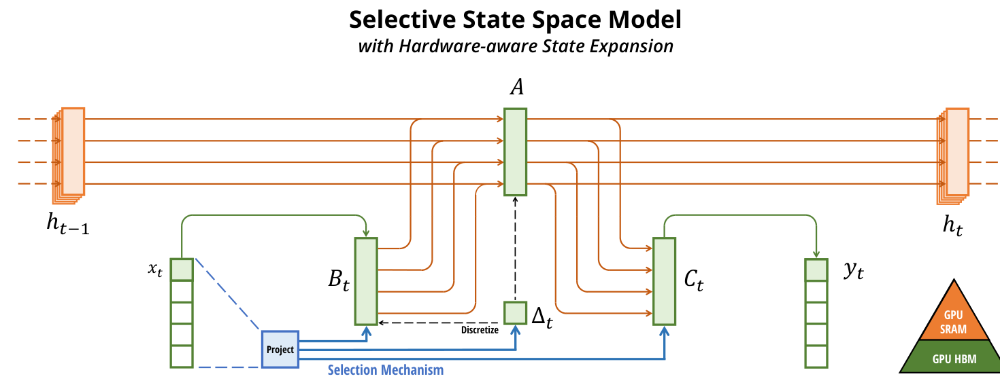

**Figure 1: (Overview.)** Các structured SSM ánh xạ độc lập từng kênh (channel), ví dụ `D = 5`, của input `x` thành output `y` thông qua một trạng thái ẩn chiều cao hơn (higher dimensional latent state) `h`, ví dụ `N = 4`. Các SSM trước đó tránh hiện thực hóa (materializing) trạng thái hiệu dụng lớn này (`DN`, nhân với batch size `B` và độ dài chuỗi `L`) thông qua các đường tính toán thay thế thông minh, vốn yêu cầu tính bất biến theo thời gian (time-invariance) : các tham số `(Δ, A, B, C)` là hằng số theo thời gian. Cơ chế chọn lọc (selection mechanism) của chúng tôi thêm lại động lực học phụ thuộc input (input-dependent dynamics), điều này cũng yêu cầu một thuật toán cẩn thận có xét tới phần cứng (hardware-aware algorithm) để chỉ hiện thực hóa các trạng thái mở rộng (expanded states) ở những tầng hiệu quả hơn trong phân cấp bộ nhớ GPU (GPU memory hierarchy).

Cụ thể, các mô hình S4 được định nghĩa bởi bốn tham số `(Δ, A, B, C)`, các tham số này định nghĩa một phép biến đổi chuỗi-sang-chuỗi (sequence-to-sequence transformation) theo hai giai đoạn.

<table style='color: currentColor; border-collapse: collapse; width: 100%; font-family: &quot;Times New Roman&quot;, serif; font-size: 1.05em;'>
<tr>
<td style='padding: 0.25em 1em; text-align: center;'><i>h</i>′(<i>t</i>) = <b>A</b><i>h</i>(<i>t</i>) + <b>B</b><i>x</i>(<i>t</i>)</td>
<td style='padding: 0.25em 1em; text-align: right;'>(1a)</td>
<td style='padding: 0.25em 1em; text-align: center;'><i>h</i>t = <b>Ā</b><i>h</i>t−1 + <b>B̄</b><i>x</i>t</td>
<td style='padding: 0.25em 1em; text-align: right;'>(2a)</td>
<td style='padding: 0.25em 1em; text-align: center;'><b>K̄</b> = (<b>C</b><b>B̄</b>, <b>C</b><b>Ā</b><b>B̄</b>, …, <b>C</b><b>Ā</b>k<b>B̄</b>, …)</td>
<td style='padding: 0.25em 1em; text-align: right;'>(3a)</td>
</tr>
<tr>
<td style='padding: 0.25em 1em; text-align: center;'><i>y</i>(<i>t</i>) = <b>C</b><i>h</i>(<i>t</i>)</td>
<td style='padding: 0.25em 1em; text-align: right;'>(1b)</td>
<td style='padding: 0.25em 1em; text-align: center;'><i>y</i>t = <b>C</b><i>h</i>t</td>
<td style='padding: 0.25em 1em; text-align: right;'>(2b)</td>
<td style='padding: 0.25em 1em; text-align: center;'><i>y</i> = <i>x</i> ∗ <b>K̄</b></td>
<td style='padding: 0.25em 1em; text-align: right;'>(3b)</td>
</tr>
</table>

**Discretization.** Giai đoạn đầu tiên biến đổi các “tham số liên tục” (continuous parameters) `(Δ, A, B)` thành các “tham số rời rạc” (discrete parameters) `(Ā, B̄)` thông qua các công thức cố định `Ā = f_A(Δ, A)` và `B̄ = f_B(Δ, A, B)`, trong đó cặp `(f_A, f_B)` được gọi là một quy tắc rời rạc hóa (discretization rule). Có thể dùng nhiều quy tắc khác nhau, ví dụ zero-order hold (ZOH) được định nghĩa trong phương trình (4).

<b>Ā</b> = exp(Δ<b>A</b>) &nbsp;&nbsp;&nbsp;&nbsp;
<b>B̄</b> = (Δ<b>A</b>)−1(exp(Δ<b>A</b>) − <b>I</b>) · Δ<b>B</b>
(4)

Discretization có liên hệ sâu với các hệ thời gian liên tục (continuous-time systems), nhờ đó có thể trao cho chúng các tính chất bổ sung như bất biến theo độ phân giải (resolution invariance) (Nguyen, Goel, et al. 2022) và tự động bảo đảm mô hình được chuẩn hóa đúng (properly normalized) (Gu, Johnson, Timalsina, et al. 2023; Orvieto et al. 2023). Nó cũng có liên hệ với các cơ chế gating của RNNs (Gu, Gulcehre, et al. 2020; Tallec and Ollivier 2018), điều mà chúng tôi sẽ quay lại trong Section 3.5. Tuy nhiên, từ góc nhìn cơ học (mechanical point of view), discretization có thể đơn giản được xem là bước đầu tiên của computation graph trong forward pass của một SSM. Các biến thể SSM khác có thể bỏ qua bước discretization và thay vào đó tham số hóa trực tiếp `(Ā, B̄)` (Zhang et al. 2023), điều này có thể dễ lập luận hơn.

**Computation.** Sau khi các tham số đã được biến đổi từ `(Δ, A, B, C)` thành `(Ā, B̄, C)`, mô hình có thể được tính theo hai cách, hoặc như một recurrence tuyến tính (linear recurrence) (2), hoặc như một convolution toàn cục (global convolution) (3).

Thông thường, mô hình dùng chế độ convolution (convolutional mode) (3) để training song song hiệu quả (khi toàn bộ chuỗi input đã được thấy trước), và chuyển sang chế độ recurrent (recurrent mode) (2) để inference autoregressive hiệu quả (khi các input được thấy từng timestep một).

**Linear Time Invariance (LTI).** Một tính chất quan trọng của các phương trình (1) tới (3) là động lực học (dynamics) của mô hình là hằng số theo thời gian. Nói cách khác, `(Δ, A, B, C)`, và hệ quả là cả `(Ā, B̄)`, được cố định cho mọi timestep. Tính chất này được gọi là linear time invariance (LTI), có liên hệ sâu với recurrence và convolution. Một cách không chính thức, chúng tôi xem LTI SSMs là tương đương với bất kỳ recurrence tuyến tính (2a) hoặc convolution (3b) nào, và dùng LTI như một thuật ngữ bao trùm (umbrella term) cho các lớp mô hình này.

Cho tới nay, tất cả structured SSMs đều là LTI, ví dụ được tính như convolutions, do các ràng buộc hiệu quả cơ bản (fundamental efficiency constraints), được thảo luận trong Section 3.3. Tuy nhiên, một insight cốt lõi của công trình này là các mô hình LTI có những giới hạn cơ bản trong việc mô hình hóa một số loại dữ liệu nhất định, và các đóng góp kỹ thuật của chúng tôi liên quan tới việc loại bỏ ràng buộc LTI trong khi vẫn vượt qua các nút thắt hiệu quả (efficiency bottlenecks).

**Structure and Dimensions.** Cuối cùng, chúng tôi lưu ý rằng structured SSMs được gọi như vậy vì việc tính chúng hiệu quả cũng yêu cầu áp đặt cấu trúc lên ma trận `A`. Dạng cấu trúc phổ biến nhất là diagonal (Gu, Gupta, et al. 2022; Gupta, Gu, and Berant 2022; Smith, Warrington, and Linderman 2023), và chúng tôi cũng dùng dạng này.

Trong trường hợp này, các ma trận `A ∈ R^{N×N}`, `B ∈ R^{N×1}`, `C ∈ R^{1×N}` đều có thể được biểu diễn bằng `N` số. Để hoạt động trên một chuỗi input `x` có batch size `B`, độ dài `L` và `D` kênh (channels), SSM được áp dụng độc lập cho từng kênh. Lưu ý rằng trong trường hợp này, tổng hidden state có chiều `DN` cho mỗi input, và việc tính nó trên chiều dài chuỗi yêu cầu thời gian và bộ nhớ `O(BLDN)`; đây là gốc rễ của nút thắt hiệu quả cơ bản được xử lý trong Section 3.3.

**General State Space Models.** Chúng tôi lưu ý rằng thuật ngữ state space model có ý nghĩa rất rộng, đơn giản biểu diễn khái niệm về bất kỳ quá trình hồi quy (recurrent process) nào với một trạng thái tiềm tàng (latent state). Nó đã được dùng để chỉ nhiều khái niệm rời rạc trong các ngành khác nhau, bao gồm Markov decision processes (MDP) trong reinforcement learning (Hafner et al. 2020), dynamic causal modeling (DCM) trong computational neuroscience (Friston, Harrison, and Penny 2003), Kalman filters trong controls (Kalman 1960), hidden Markov models (HMM) và linear dynamical systems (LDS) trong machine learning, và rộng hơn là các mô hình recurrent, đôi khi cả convolutional, trong deep learning.

Trong toàn bộ bài báo này, chúng tôi dùng thuật ngữ “SSM” để chỉ riêng lớp structured SSMs hoặc các mô hình S4 (Gu, Goel, and Ré 2022; Gu, Gupta, et al. 2022; Gupta, Gu, and Berant 2022; Hasani et al. 2023; Ma et al. 2023; Smith, Warrington, and Linderman 2023), và dùng các thuật ngữ này thay thế cho nhau (interchangeably). Để tiện, chúng tôi cũng có thể bao gồm các dẫn xuất (derivatives) của những mô hình như vậy, chẳng hạn các mô hình tập trung vào góc nhìn linear-recurrence hoặc global-convolution (Y. Li et al. 2023; Orvieto et al. 2023; Poli et al. 2023), và sẽ làm rõ các sắc thái khi cần thiết.

**SSM Architectures.** SSMs là các phép biến đổi chuỗi độc lập (standalone sequence transformations) có thể được tích hợp vào các kiến trúc neural network end-to-end. Chúng tôi đôi khi cũng gọi các kiến trúc SSM là SSNNs, tương tự như quan hệ giữa CNNs và các lớp linear convolution. Chúng tôi thảo luận một số kiến trúc SSM nổi tiếng nhất, nhiều kiến trúc trong số đó cũng sẽ đóng vai trò là các baseline chính của chúng tôi.

- **Linear attention** (Katharopoulos et al. 2020) là một xấp xỉ của self-attention liên quan tới một recurrence, có thể được xem như một linear SSM suy biến (degenerate linear SSM).
- **H3** (Dao, Fu, Saab, et al. 2023) tổng quát hóa recurrence này để dùng S4; nó có thể được xem như một kiến trúc với một SSM được kẹp giữa hai gated connections (Figure 3). H3 cũng chèn một local convolution tiêu chuẩn, được họ diễn giải như một shift-SSM, trước lớp SSM chính.
- **Hyena** (Poli et al. 2023) dùng cùng kiến trúc với H3 nhưng thay lớp S4 bằng một global convolution được tham số hóa bởi MLP (MLP-parameterized global convolution) (Romero et al. 2021).
- **RetNet** (Y. Sun et al. 2023) thêm một gate bổ sung vào kiến trúc và dùng một SSM đơn giản hơn, cho phép một đường tính toán song song thay thế (alternative parallelizable computation path), dùng một biến thể của multi-head attention (MHA) thay vì convolutions.
- **RWKV** (B. Peng et al. 2023) là một RNN gần đây được thiết kế cho language modeling dựa trên một xấp xỉ linear attention khác, attention-free Transformer (S. Zhai et al. 2021). Cơ chế “WKV” chính của nó liên quan tới các LTI recurrences và có thể được xem là tỉ số của hai SSMs.

Các SSM và kiến trúc liên quan chặt chẽ khác được thảo luận thêm trong phần related work mở rộng (Appendix B). Chúng tôi đặc biệt nhấn mạnh S5 (Smith, Warrington, and Linderman 2023), QRNN (Bradbury et al. 2016), và SRU (Lei et al. 2017), những phương pháp mà chúng tôi xem là liên quan gần nhất tới selective SSM cốt lõi của mình.

## 3. Selective State Space Models

Chúng tôi tạo động lực cho cơ chế chọn lọc từ trực giác của các tác vụ tổng hợp (Mục 3.1), rồi giải thích cách tích hợp cơ chế này vào mô hình không gian trạng thái (Mục 3.2). Các SSM biến thiên theo thời gian thu được không thể dùng convolution, từ đó nảy sinh thách thức kỹ thuật: làm thế nào để tính chúng một cách hiệu quả. Chúng tôi giải quyết vấn đề này bằng một thuật toán có xét tới phần cứng, khai thác hệ phân cấp bộ nhớ trên phần cứng hiện đại (Mục 3.3). Sau đó, chúng tôi mô tả một kiến trúc SSM đơn giản, không có attention, thậm chí không có các block MLP (Mục 3.4). Cuối cùng, chúng tôi thảo luận thêm một số tính chất của cơ chế chọn lọc (Mục 3.5).

### 3.1 Motivation: Selection as a Means of Compression

Chúng tôi lập luận rằng một vấn đề nền tảng của mô hình hóa chuỗi là **nén ngữ cảnh vào một trạng thái nhỏ hơn**. Trên thực tế, có thể nhìn các đánh đổi của những mô hình chuỗi phổ biến từ góc độ này. Chẳng hạn, attention vừa hiệu quả về chất lượng vừa kém hiệu quả về tính toán vì nó chủ động không nén ngữ cảnh. Điều này thể hiện ở chỗ suy luận tự hồi quy phải lưu tường minh toàn bộ ngữ cảnh, tức KV cache, trực tiếp gây ra suy luận chậm với thời gian tuyến tính và huấn luyện với thời gian bậc hai của Transformer. Ngược lại, các mô hình hồi quy hiệu quả vì chúng có trạng thái hữu hạn, kéo theo suy luận thời gian hằng số và huấn luyện thời gian tuyến tính. Tuy nhiên, hiệu quả dự đoán của chúng bị giới hạn bởi mức độ trạng thái đó nén được ngữ cảnh.

Để hiểu nguyên lý này, chúng tôi dùng hai tác vụ tổng hợp làm ví dụ xuyên suốt (Hình 2).

- **Selective Copying.** Tác vụ này sửa đổi Copying phổ biến (Arjovsky, Shah, and Bengio 2016) bằng cách thay đổi vị trí của các token cần ghi nhớ. Nó đòi hỏi suy luận **nhận biết nội dung** để ghi nhớ các token liên quan (có màu) và lọc bỏ các token không liên quan (màu trắng).
- **Induction Heads.** Đây là một cơ chế nổi tiếng, được giả thuyết là giải thích phần lớn năng lực in-context learning của LLM (Olsson et al. 2022). Nó đòi hỏi suy luận **nhận biết ngữ cảnh** để biết khi nào phải tạo đúng đầu ra trong ngữ cảnh thích hợp (màu đen).

Các tác vụ này làm lộ ra kiểu thất bại của mô hình LTI. Theo góc nhìn hồi quy, động lực học không đổi của chúng, chẳng hạn các phép chuyển `(Ā, B̄)` trong Phương trình (2), không cho phép mô hình chọn đúng thông tin từ ngữ cảnh hoặc tác động lên trạng thái ẩn được truyền dọc chuỗi theo cách phụ thuộc đầu vào. Theo góc nhìn convolution, global convolution có thể giải Copying thông thường vì tác vụ này chỉ yêu cầu nhận biết thời gian, nhưng gặp khó với Selective Copying vì thiếu khả năng nhận biết nội dung. Cụ thể hơn, khoảng cách từ đầu vào tới đầu ra thay đổi và không thể được mô hình hóa bằng một convolution kernel tĩnh.

Tóm lại, đánh đổi giữa hiệu quả tính toán và hiệu quả dự đoán của mô hình chuỗi được đặc trưng bởi mức độ mô hình nén trạng thái: mô hình hiệu quả phải có trạng thái nhỏ, còn mô hình hiệu lực phải có trạng thái chứa mọi thông tin cần thiết từ ngữ cảnh. Vì vậy, chúng tôi đề xuất **tính chọn lọc** (*selectivity*) như một nguyên lý nền tảng để xây dựng mô hình chuỗi: khả năng nhận biết ngữ cảnh để tập trung vào hoặc lọc bỏ đầu vào khi đưa chúng vào trạng thái tuần tự. Cụ thể, một cơ chế chọn lọc điều khiển cách thông tin lan truyền hoặc tương tác dọc theo chiều chuỗi; xem Mục 3.5 để biết thêm thảo luận.

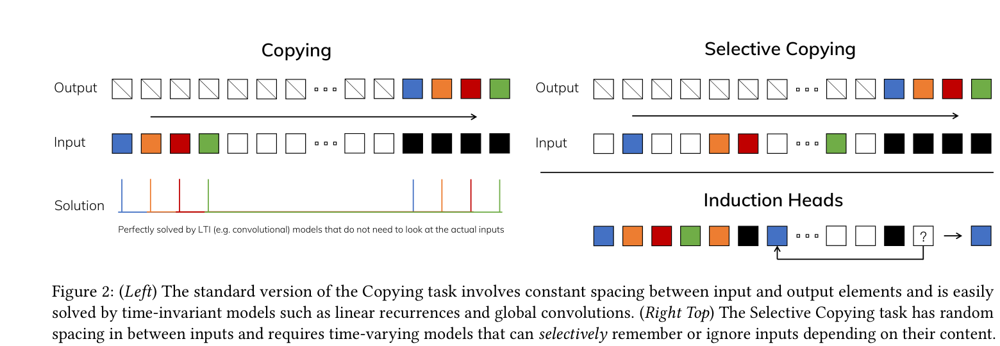

**Hình 2: Các tác vụ tổng hợp.** **(Trái)** Phiên bản chuẩn của tác vụ Copying có khoảng cách cố định giữa các phần tử đầu vào và đầu ra, vì vậy các mô hình bất biến theo thời gian như linear recurrence và global convolution giải được dễ dàng. **(Phải, trên)** Selective Copying có khoảng cách ngẫu nhiên giữa các đầu vào, đòi hỏi mô hình biến thiên theo thời gian có thể *chọn lọc* ghi nhớ hoặc bỏ qua đầu vào tùy theo nội dung. **(Phải, dưới)** Induction Heads là một ví dụ về associative recall, yêu cầu truy hồi câu trả lời dựa trên ngữ cảnh, một năng lực then chốt của LLM.

### 3.2 Improving SSMs with Selection

Một cách đưa cơ chế chọn lọc vào mô hình là làm cho các tham số chi phối tương tác dọc theo chuỗi, chẳng hạn động lực học hồi quy của RNN hoặc convolution kernel của CNN, phụ thuộc vào đầu vào.

Thuật toán 1 và Thuật toán 2 minh họa cơ chế chọn lọc chính mà chúng tôi sử dụng. Khác biệt chủ yếu chỉ là biến một số tham số `Δ`, `B`, `C` thành các hàm của đầu vào, cùng với những thay đổi tương ứng về shape tensor. Đặc biệt, các tham số này giờ có thêm chiều độ dài `L`, nghĩa là mô hình đã chuyển từ bất biến theo thời gian sang biến thiên theo thời gian. Các chú thích shape tuân theo quy ước ở Mục 2. Thay đổi này làm mất tính tương đương với convolution trong Phương trình (3), kéo theo các hệ quả về hiệu quả tính toán được thảo luận ở Mục 3.3.

Chúng tôi chọn cụ thể:

<table style="border-collapse:collapse; margin:auto; font-family:'Times New Roman',serif;">
<tr><td style="padding:.3em 1em; text-align:center;"><i>s</i>B(<i>x</i>) = LinearN(<i>x</i>)</td></tr>
<tr><td style="padding:.3em 1em; text-align:center;"><i>s</i>C(<i>x</i>) = LinearN(<i>x</i>)</td></tr>
<tr><td style="padding:.3em 1em; text-align:center;"><i>s</i>Δ(<i>x</i>) = BroadcastD(Linear1(<i>x</i>))</td></tr>
<tr><td style="padding:.3em 1em; text-align:center;"><i>τ</i>Δ = softplus</td></tr>
</table>

trong đó `Linear_d` là phép chiếu có tham số tới chiều `d`. Lựa chọn `s_Δ` và `τ_Δ` xuất phát từ mối liên hệ với cơ chế gate của RNN, được giải thích ở Mục 3.5.

#### Thuật toán 1: SSM (S4)

<table style="border-collapse:collapse; width:100%; font-family:'Times New Roman',serif;">
<tr><th style="border:1px solid #888; padding:.45em; width:8%;">Dòng</th><th style="border:1px solid #888; padding:.45em; text-align:left;">Phép tính</th></tr>
<tr><td style="border:1px solid #888; padding:.45em; text-align:center;">Đầu vào</td><td style="border:1px solid #888; padding:.45em;"><i>x</i>: (B, L, D)</td></tr>
<tr><td style="border:1px solid #888; padding:.45em; text-align:center;">Đầu ra</td><td style="border:1px solid #888; padding:.45em;"><i>y</i>: (B, L, D)</td></tr>
<tr><td style="border:1px solid #888; padding:.45em; text-align:center;">1</td><td style="border:1px solid #888; padding:.45em;"><b>A</b>: (D, N) ← Parameter <i>(biểu diễn ma trận N × N có cấu trúc)</i></td></tr>
<tr><td style="border:1px solid #888; padding:.45em; text-align:center;">2</td><td style="border:1px solid #888; padding:.45em;"><b>B</b>: (D, N) ← Parameter</td></tr>
<tr><td style="border:1px solid #888; padding:.45em; text-align:center;">3</td><td style="border:1px solid #888; padding:.45em;"><b>C</b>: (D, N) ← Parameter</td></tr>
<tr><td style="border:1px solid #888; padding:.45em; text-align:center;">4</td><td style="border:1px solid #888; padding:.45em;">Δ: (D) ← <i>τ</i>Δ(Parameter)</td></tr>
<tr><td style="border:1px solid #888; padding:.45em; text-align:center;">5</td><td style="border:1px solid #888; padding:.45em;"><b>Ā</b>, <b>B̄</b>: (D, N) ← discretize(Δ, <b>A</b>, <b>B</b>)</td></tr>
<tr><td style="border:1px solid #888; padding:.45em; text-align:center;">6</td><td style="border:1px solid #888; padding:.45em;"><i>y</i> ← SSM(<b>Ā</b>, <b>B̄</b>, <b>C</b>)(<i>x</i>) <i>- bất biến theo thời gian; dùng recurrence hoặc convolution</i></td></tr>
<tr><td style="border:1px solid #888; padding:.45em; text-align:center;">7</td><td style="border:1px solid #888; padding:.45em;"><b>return</b> <i>y</i></td></tr>
</table>

#### Thuật toán 2: SSM + Selection (S6)

<table style="border-collapse:collapse; width:100%; font-family:'Times New Roman',serif;">
<tr><th style="border:1px solid #888; padding:.45em; width:8%;">Dòng</th><th style="border:1px solid #888; padding:.45em; text-align:left;">Phép tính</th></tr>
<tr><td style="border:1px solid #888; padding:.45em; text-align:center;">Đầu vào</td><td style="border:1px solid #888; padding:.45em;"><i>x</i>: (B, L, D)</td></tr>
<tr><td style="border:1px solid #888; padding:.45em; text-align:center;">Đầu ra</td><td style="border:1px solid #888; padding:.45em;"><i>y</i>: (B, L, D)</td></tr>
<tr><td style="border:1px solid #888; padding:.45em; text-align:center;">1</td><td style="border:1px solid #888; padding:.45em;"><b>A</b>: (D, N) ← Parameter <i>(biểu diễn ma trận N × N có cấu trúc)</i></td></tr>
<tr><td style="border:1px solid #888; padding:.45em; text-align:center;">2</td><td style="border:1px solid #888; padding:.45em;"><b>B</b>: <b>(B, L, N)</b> ← <i>s</i>B(<i>x</i>)</td></tr>
<tr><td style="border:1px solid #888; padding:.45em; text-align:center;">3</td><td style="border:1px solid #888; padding:.45em;"><b>C</b>: <b>(B, L, N)</b> ← <i>s</i>C(<i>x</i>)</td></tr>
<tr><td style="border:1px solid #888; padding:.45em; text-align:center;">4</td><td style="border:1px solid #888; padding:.45em;">Δ: <b>(B, L, D)</b> ← <i>τ</i>Δ(Parameter + <i>s</i>Δ(<i>x</i>))</td></tr>
<tr><td style="border:1px solid #888; padding:.45em; text-align:center;">5</td><td style="border:1px solid #888; padding:.45em;"><b>Ā</b>, <b>B̄</b>: <b>(B, L, D, N)</b> ← discretize(Δ, <b>A</b>, <b>B</b>)</td></tr>
<tr><td style="border:1px solid #888; padding:.45em; text-align:center;">6</td><td style="border:1px solid #888; padding:.45em;"><i>y</i> ← SSM(<b>Ā</b>, <b>B̄</b>, <b>C</b>)(<i>x</i>) <i>- biến thiên theo thời gian; chỉ dùng recurrence, được tính bằng scan</i></td></tr>
<tr><td style="border:1px solid #888; padding:.45em; text-align:center;">7</td><td style="border:1px solid #888; padding:.45em;"><b>return</b> <i>y</i></td></tr>
</table>

### 3.3 Efficient Implementation of Selective SSMs

Các primitive thân thiện với phần cứng như convolution (Krizhevsky, Sutskever, and Hinton 2012) và attention (Bahdanau, Cho, and Bengio 2015; Vaswani et al. 2017) được ứng dụng rộng rãi. Ở đây, chúng tôi cũng hướng tới làm selective SSM chạy hiệu quả trên phần cứng hiện đại, cụ thể là GPU. Cơ chế chọn lọc khá tự nhiên; các công trình trước từng thử đưa vào những trường hợp chọn lọc đặc biệt, chẳng hạn cho phép `Δ` thay đổi theo thời gian trong SSM hồi quy (Gu et al. 2020). Tuy nhiên, như đã đề cập, một hạn chế cốt lõi của SSM là hiệu quả tính toán. Vì vậy, S4 và mọi dẫn xuất của nó đều dùng mô hình LTI, tức không chọn lọc, phổ biến nhất dưới dạng global convolution.

#### 3.3.1 Motivation of Prior Models

Trước hết, chúng tôi xem lại động lực này và khái quát cách tiếp cận nhằm khắc phục các hạn chế của phương pháp trước.

- Ở mức khái quát, các mô hình hồi quy như SSM luôn phải cân bằng giữa khả năng biểu đạt và tốc độ. Như đã thảo luận ở Mục 3.1, mô hình có chiều trạng thái ẩn lớn hơn thường hiệu quả hơn nhưng chậm hơn. Vì vậy, mục tiêu là **tối đa hóa chiều trạng thái ẩn mà không phải trả chi phí tốc độ và bộ nhớ**.
- Chế độ hồi quy linh hoạt hơn chế độ convolution, vì dạng convolution ở Phương trình (3) được suy ra bằng cách khai triển dạng hồi quy ở Phương trình (2). Tuy nhiên, chế độ hồi quy đòi hỏi tính và materialize trạng thái tiềm ẩn `h` có shape `(B, L, D, N)`, lớn hơn `N` lần so với đầu vào `x` và đầu ra `y` có shape `(B, L, D)`. Do đó, chế độ convolution hiệu quả hơn được đưa ra để bỏ qua phép tính trạng thái và chỉ materialize convolution kernel có kích thước `(B, L, D)`.
- Các mô hình không gian trạng thái LTI trước đây khai thác hai dạng tương đương hồi quy-convolution để tăng chiều trạng thái hiệu dụng lên hệ số `N` (xấp xỉ `10-100`), lớn hơn nhiều so với RNN truyền thống, mà không làm giảm hiệu quả tính toán.

#### 3.3.2 Overview of Selective Scan: Hardware-Aware State Expansion

Cơ chế chọn lọc được thiết kế để khắc phục hạn chế của mô hình LTI; đồng thời, vì vậy chúng tôi phải xem xét lại bài toán tính toán của SSM. Chúng tôi giải quyết bằng ba kỹ thuật kinh điển: **kernel fusion**, **parallel scan** và **recomputation**. Hai quan sát chính là:

- Phép tính hồi quy ngây thơ dùng `O(BLDN)` FLOP, còn phép tính convolution dùng `O(BLD log L)` FLOP; phép tính hồi quy có hệ số hằng nhỏ hơn. Do đó, với chuỗi dài và chiều trạng thái `N` không quá lớn, chế độ hồi quy thực tế có thể dùng ít FLOP hơn.
- Hai thách thức là tính tuần tự của recurrence và lượng bộ nhớ lớn. Để xử lý vấn đề bộ nhớ, tương tự chế độ convolution, có thể tránh materialize toàn bộ trạng thái `h`.

Ý tưởng chính là khai thác đặc tính của bộ gia tốc hiện đại, tức GPU, để chỉ materialize trạng thái `h` ở các tầng hiệu quả hơn trong hệ phân cấp bộ nhớ. Cụ thể, phần lớn phép toán ngoài nhân ma trận bị giới hạn bởi memory bandwidth; scan của chúng tôi cũng vậy. Chúng tôi dùng kernel fusion để giảm lượng memory I/O, tạo ra tốc độ cao hơn đáng kể so với cách triển khai chuẩn.

Cụ thể, thay vì chuẩn bị đầu vào scan `(Ā, B̄)` kích thước `(B, L, D, N)` trong HBM của GPU, chúng tôi tải trực tiếp các tham số SSM `(Δ, A, B, C)` từ HBM chậm vào SRAM nhanh, thực hiện discretization và recurrence trong SRAM, rồi ghi đầu ra cuối cùng kích thước `(B, L, D)` trở lại HBM.

Để tránh recurrence tuần tự, chúng tôi nhận thấy dù phép biến đổi không còn bất biến theo thời gian, nó vẫn có thể được song song hóa bằng một thuật toán parallel scan hiệu quả theo lượng công việc.

Cuối cùng, phải tránh lưu các trạng thái trung gian cần cho backpropagation. Chúng tôi áp dụng cẩn thận kỹ thuật recomputation: không lưu trạng thái trung gian trong forward pass mà tính lại chúng trong backward pass khi đầu vào được tải từ HBM vào SRAM. Kết quả là lớp selective scan hợp nhất có yêu cầu bộ nhớ tương đương một triển khai Transformer tối ưu bằng FlashAttention. Chi tiết về fused kernel và recomputation nằm trong Phụ lục D. Toàn bộ lớp selective SSM và thuật toán được minh họa trong Hình 1.

### 3.4 A Simplified SSM Architecture

Tương tự structured SSM, selective SSM là các phép biến đổi chuỗi độc lập có thể được tích hợp linh hoạt vào mạng neural. Kiến trúc H3 là nền tảng của những kiến trúc SSM nổi tiếng nhất, thường gồm một block lấy cảm hứng từ linear attention xen kẽ với một block MLP. Chúng tôi đơn giản hóa kiến trúc này bằng cách hợp nhất hai thành phần thành một block duy nhất rồi xếp chồng đồng nhất. Ý tưởng này được gợi cảm hứng từ Gated Attention Unit, vốn thực hiện một phép hợp nhất tương tự cho attention.

Kiến trúc mở rộng model dimension `D` bằng expansion factor `E` có thể điều khiển. Trong mỗi block, phần lớn tham số, `3ED²`, nằm ở các linear projection: `2ED²` cho input projection và `ED²` cho output projection; SSM bên trong đóng góp ít hơn. Số tham số của SSM, gồm các projection cho `Δ`, `B`, `C` và ma trận `A`, nhỏ hơn nhiều.

Chúng tôi lặp block này, xen kẽ normalization chuẩn và residual connection, để tạo thành kiến trúc Mamba. Trong mọi thí nghiệm, chúng tôi cố định `E = 2` và dùng hai stack của block để khớp `12D²` tham số của cặp block MHA và MLP xen kẽ trong Transformer. Chúng tôi dùng activation SiLU/Swish; động lực là khi bỏ SSM, Gated MLP trở thành biến thể SwiGLU phổ biến. Cuối cùng, chúng tôi dùng thêm một normalization layer tùy chọn, cụ thể là LayerNorm, dựa trên việc RetNet đặt normalization ở vị trí tương tự.

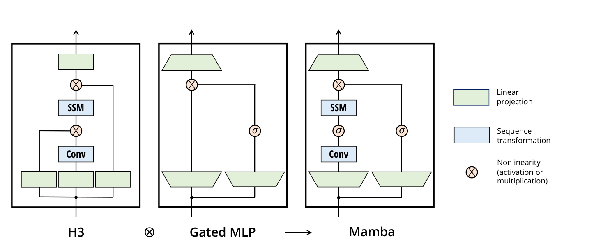

**Hình 3: Kiến trúc.** Thiết kế block đơn giản hóa hợp nhất H3 block, nền tảng của phần lớn kiến trúc SSM, với MLP block phổ biến trong mạng neural hiện đại. Thay vì xen kẽ hai block, chúng tôi chỉ lặp Mamba block một cách đồng nhất. So với H3, Mamba thay multiplicative gate đầu tiên bằng activation function. So với MLP, Mamba thêm một SSM vào nhánh chính. Với `σ`, chúng tôi dùng activation SiLU/Swish.

### 3.5 Properties of Selection Mechanisms

Cơ chế chọn lọc là một khái niệm rộng hơn, có thể được áp dụng theo nhiều cách: cho RNN hoặc CNN truyền thống hơn, cho các tham số khác như `A` trong Thuật toán 2, hoặc bằng các phép biến đổi `s(x)` khác.

#### 3.5.1 Connection to Gating Mechanisms

Chúng tôi nhấn mạnh mối liên hệ quan trọng nhất: cơ chế gate cổ điển của RNN là một trường hợp của cơ chế chọn lọc dành cho SSM. Mối liên hệ giữa RNN gating và discretization của hệ continuous-time đã được xác lập rõ. Định lý 1 mở rộng kết quả trước sang ZOH discretization và gate phụ thuộc đầu vào; chứng minh nằm ở Phụ lục C. Tổng quát hơn, `Δ` trong SSM có thể được xem là đóng vai trò khái quát của cơ chế gate trong RNN. Theo các công trình trước, chúng tôi xem **discretization của SSM là nền tảng có nguyên lý cho các cơ chế gate được xây dựng theo heuristic**.

**Định lý 1.** Khi `N = 1`, `A = -1`, `B = 1`, `s_Δ = Linear(x)` và `τ_Δ = softplus`, recurrence của selective SSM trong Thuật toán 2 có dạng:

<table style="border-collapse:collapse; width:100%; font-family:'Times New Roman',serif;">
<tr><td style="padding:.25em 1em; text-align:center;"><i>g</i>t = σ(Linear(<i>x</i>t))</td><td style="padding:.25em 1em; text-align:right;">(4a)</td></tr>
<tr><td style="padding:.25em 1em; text-align:center;"><i>h</i>t = (1 - <i>g</i>t)<i>h</i>t-1 + <i>g</i>t<i>x</i>t</td><td style="padding:.25em 1em; text-align:right;">(4b)</td></tr>
</table>

Như đã nêu ở Mục 3.2, lựa chọn cụ thể của `s_Δ` và `τ_Δ` xuất phát từ mối liên hệ này. Đặc biệt, nếu một đầu vào `x_t` cần bị bỏ qua hoàn toàn, như trong các tác vụ tổng hợp, thì mọi kênh trong `D` đều phải bỏ qua nó. Vì vậy, chúng tôi chiếu đầu vào xuống một chiều trước khi lặp hoặc broadcast theo `Δ`.

#### 3.5.2 Interpretation of Selection Mechanisms

Chúng tôi làm rõ ba tác động cơ học cụ thể của tính chọn lọc.

**Variable Spacing.** Tính chọn lọc cho phép lọc bỏ các noise token không liên quan nằm giữa những đầu vào đáng quan tâm. Điều này được minh họa bằng Selective Copying, nhưng xuất hiện phổ biến trong các modality dữ liệu, đặc biệt là dữ liệu rời rạc; ví dụ, các từ đệm như “um” trong ngôn ngữ. Tính chất này xuất hiện vì mô hình có thể trực tiếp lọc bỏ một đầu vào cụ thể `x_t`; trong trường hợp gated RNN của Định lý 1, điều đó xảy ra khi `g_t → 0`.

**Filtering Context.** Thực nghiệm cho thấy nhiều mô hình chuỗi không cải thiện khi ngữ cảnh dài hơn, dù về nguyên tắc nhiều ngữ cảnh hơn phải dẫn tới hiệu năng tốt hơn. Một cách giải thích là nhiều mô hình chuỗi không thể bỏ qua hiệu quả ngữ cảnh không liên quan khi cần; global convolution và mô hình LTI nói chung là ví dụ trực quan. Ngược lại, mô hình chọn lọc có thể đơn giản reset trạng thái bất cứ lúc nào để loại bỏ lịch sử dư thừa, vì vậy về nguyên tắc hiệu năng của chúng cải thiện đơn điệu theo độ dài ngữ cảnh.

**Boundary Resetting.** Khi nhiều chuỗi độc lập được nối lại, Transformer có thể giữ chúng tách biệt bằng một attention mask cụ thể, trong khi mô hình LTI làm rò thông tin giữa các chuỗi. Selective SSM cũng có thể reset trạng thái tại biên, chẳng hạn `Δ_t → ∞`, hoặc trong Định lý 1 khi `g_t → 1`. Các tình huống này có thể xuất hiện nhân tạo, như đóng gói nhiều document để tăng hardware utilization, hoặc tự nhiên, như ranh giới episode trong reinforcement learning.

Ngoài ra, chúng tôi làm rõ tác động của từng tham số chọn lọc.

**Diễn giải `Δ`.** Nhìn chung, `Δ` điều khiển cân bằng giữa mức độ tập trung vào và bỏ qua đầu vào hiện tại `x_t`. Nó khái quát gate của RNN, chẳng hạn `g_t` trong Định lý 1: về mặt cơ học, `Δ` lớn reset trạng thái `h` và tập trung vào đầu vào hiện tại `x`, còn `Δ` nhỏ duy trì trạng thái và bỏ qua đầu vào hiện tại. Có thể diễn giải SSM ở Phương trình (1)-(2) như một hệ liên tục được discretize bằng timestep `Δ`; theo trực giác này, `Δ → ∞` biểu diễn hệ tập trung vào đầu vào hiện tại trong thời gian lâu hơn, qua đó “chọn” đầu vào và quên trạng thái hiện tại, còn `Δ → 0` biểu diễn một đầu vào thoáng qua bị bỏ qua.

**Diễn giải `A`.** Tham số `A` cũng có thể được làm selective, nhưng cuối cùng nó chỉ tác động tới mô hình thông qua tương tác với `Δ` trong `Ā = exp(ΔA)`, tức bước discretization. Vì vậy, tính chọn lọc trong `Δ` đã đủ bảo đảm tính chọn lọc trong `(Ā, B̄)` và là nguồn cải thiện chính. Chúng tôi giả thuyết rằng làm `A` selective bên cạnh, hoặc thay cho, `Δ` sẽ cho hiệu năng tương tự, nhưng bỏ qua để giữ thiết kế đơn giản.

**Diễn giải `B` và `C`.** Như đã thảo luận ở Mục 3.1, tính chất quan trọng nhất của selectivity là lọc bỏ thông tin không liên quan để ngữ cảnh của mô hình chuỗi được nén vào một trạng thái hiệu quả. Trong SSM, làm `B` và `C` selective cho phép kiểm soát chi tiết việc có đưa đầu vào `x_t` vào trạng thái `h_t`, hoặc đưa trạng thái vào đầu ra `y_t`, hay không. Có thể diễn giải chúng như việc cho phép mô hình điều biến động lực học hồi quy lần lượt dựa trên nội dung của đầu vào và ngữ cảnh trong trạng thái ẩn.

### 3.6 Additional Model Details

**Số thực và số phức.** Phần lớn SSM trước dùng số phức trong trạng thái `h`; điều này cần thiết để đạt hiệu năng mạnh trên nhiều tác vụ thuộc perceptual modality. Tuy nhiên, thực nghiệm cho thấy SSM hoàn toàn dùng số thực vẫn hoạt động tốt, thậm chí có thể tốt hơn trong một số thiết lập. Chúng tôi mặc định dùng số thực, lựa chọn này hoạt động tốt trên mọi tác vụ trừ một tác vụ. Chúng tôi giả thuyết rằng đánh đổi complex-real liên quan tới phổ continuous-discrete của modality dữ liệu: số phức hữu ích cho modality liên tục như audio và video, nhưng không cần thiết bằng cho modality rời rạc như text và DNA.

**Khởi tạo.** Phần lớn SSM trước cũng đề xuất các cách khởi tạo đặc biệt, nhất là trong trường hợp complex-valued; chúng có thể hữu ích trong một số thiết lập như low-data regime. Mặc định của chúng tôi là S4D-Lin cho trường hợp số phức và S4D-Real cho trường hợp số thực, dựa trên lý thuyết HiPPO. Chúng xác định phần tử thứ `n` của `A` lần lượt là `-1/2 + ni` và `-(n + 1)`. Tuy nhiên, chúng tôi kỳ vọng nhiều cách khởi tạo khác cũng hoạt động tốt, đặc biệt trong chế độ dữ liệu lớn và SSM real-valued; một số ablation được trình bày ở Mục 4.6.

**Tham số hóa `Δ`.** Chúng tôi định nghĩa điều chỉnh selective cho `Δ` là `s_Δ(x) = Broadcast_D(Linear_1(x))`, dựa trên cơ chế của `Δ` ở Mục 3.5. Có thể tổng quát từ chiều `1` lên chiều lớn hơn `R`. Chúng tôi đặt `R` bằng một phần nhỏ của `D`, nên số tham số không đáng kể so với các linear projection chính trong block. Phép broadcast cũng có thể được xem là một linear projection khác, được khởi tạo theo một pattern cụ thể gồm các giá trị `1` và `0`; nếu projection này trainable, ta có dạng thay thế `s_Δ(x) = Linear_D(Linear_R(x))`, có thể xem như một low-rank projection.

Trong các thí nghiệm, tham số `Δ`, có thể xem như một bias term, được khởi tạo bằng `τ_Δ⁻¹(Uniform([0.001, 0.1]))`, theo các công trình SSM trước.

> **Nhận xét 3.1.** Để viết gọn trong phần kết quả thực nghiệm, đôi khi chúng tôi viết tắt selective SSM là **S6**, vì đây là mô hình S4 có thêm cơ chế **selection** và được tính bằng **scan**.

## 4. Empirical Evaluation

Ở Mục 4.1, chúng tôi kiểm tra khả năng của Mamba trong việc giải hai tác vụ tổng hợp được dùng làm động lực ở Mục 3.1. Sau đó, chúng tôi đánh giá trên ba miền dữ liệu; mỗi miền đều gồm pretraining tự hồi quy và tác vụ downstream.

- **Mục 4.2:** pretraining mô hình ngôn ngữ, gồm scaling laws, và đánh giá downstream zero-shot.
- **Mục 4.3:** pretraining chuỗi DNA và fine-tuning trên tác vụ phân loại chuỗi dài.
- **Mục 4.4:** pretraining waveform audio và đánh giá chất lượng các đoạn tiếng nói được sinh tự hồi quy.

Cuối cùng, Mục 4.5 trình bày hiệu quả tính toán của Mamba trong cả training lẫn inference, còn Mục 4.6 ablate các thành phần của kiến trúc và selective SSM.

### 4.1 Synthetic Tasks

Chi tiết đầy đủ về tác vụ và giao thức training nằm ở Phụ lục E.1.

#### 4.1.1 Selective Copying

Copying là một trong những tác vụ tổng hợp được nghiên cứu nhiều nhất trong mô hình hóa chuỗi, ban đầu được thiết kế để kiểm tra khả năng ghi nhớ của mô hình hồi quy. Như đã thảo luận ở Mục 3.1, LTI SSM, gồm linear recurrence và global convolution, có thể dễ dàng giải tác vụ này bằng cách chỉ theo dõi thời gian thay vì suy luận trên dữ liệu; chẳng hạn, bằng cách xây dựng convolution kernel có đúng độ dài. Điều này đã được xác nhận rõ trong các công trình trước về global convolution. Selective Copying loại bỏ đường tắt đó bằng cách ngẫu nhiên hóa khoảng cách giữa các token. Tác vụ này từng được giới thiệu dưới tên Denoising.

Nhiều công trình trước lập luận rằng thêm architectural gating, tức tương tác nhân, có thể tạo cho mô hình “data-dependence” và giải các tác vụ liên quan. Tuy nhiên, chúng tôi thấy cách giải thích này chưa đủ thuyết phục về mặt trực giác vì kiểu gate đó không tương tác dọc trục chuỗi và không thể tác động lên khoảng cách giữa các token. Cụ thể, architectural gating không phải là một trường hợp của cơ chế chọn lọc; xem Phụ lục A.

Bảng 1 xác nhận rằng các kiến trúc có gate như H3 và Mamba chỉ cải thiện một phần, trong khi cơ chế chọn lọc, tức sửa S4 thành S6, giải tác vụ này dễ dàng, đặc biệt khi kết hợp với các kiến trúc mạnh hơn.

<table style="border-collapse:collapse; width:100%;">
<caption style="caption-side:top; text-align:left;"><b>Bảng 1: Selective Copying.</b> Accuracy của các tổ hợp kiến trúc và lớp chuỗi bên trong.</caption>
<tr><th style="border:1px solid #888; padding:.4em;">Model</th><th style="border:1px solid #888; padding:.4em;">Kiến trúc</th><th style="border:1px solid #888; padding:.4em;">Lớp</th><th style="border:1px solid #888; padding:.4em;">Accuracy</th></tr>
<tr><td style="border:1px solid #888; padding:.4em;">S4</td><td style="border:1px solid #888; padding:.4em;">No gate</td><td style="border:1px solid #888; padding:.4em;">S4</td><td style="border:1px solid #888; padding:.4em;">18.3</td></tr>
<tr><td style="border:1px solid #888; padding:.4em;">-</td><td style="border:1px solid #888; padding:.4em;">No gate</td><td style="border:1px solid #888; padding:.4em;">S6</td><td style="border:1px solid #888; padding:.4em;"><b>97.0</b></td></tr>
<tr><td style="border:1px solid #888; padding:.4em;">H3</td><td style="border:1px solid #888; padding:.4em;">H3</td><td style="border:1px solid #888; padding:.4em;">S4</td><td style="border:1px solid #888; padding:.4em;">57.0</td></tr>
<tr><td style="border:1px solid #888; padding:.4em;">Hyena</td><td style="border:1px solid #888; padding:.4em;">H3</td><td style="border:1px solid #888; padding:.4em;">Hyena</td><td style="border:1px solid #888; padding:.4em;">30.1</td></tr>
<tr><td style="border:1px solid #888; padding:.4em;">-</td><td style="border:1px solid #888; padding:.4em;">H3</td><td style="border:1px solid #888; padding:.4em;">S6</td><td style="border:1px solid #888; padding:.4em;"><b>99.7</b></td></tr>
<tr><td style="border:1px solid #888; padding:.4em;">-</td><td style="border:1px solid #888; padding:.4em;">Mamba</td><td style="border:1px solid #888; padding:.4em;">S4</td><td style="border:1px solid #888; padding:.4em;">56.4</td></tr>
<tr><td style="border:1px solid #888; padding:.4em;">-</td><td style="border:1px solid #888; padding:.4em;">Mamba</td><td style="border:1px solid #888; padding:.4em;">Hyena</td><td style="border:1px solid #888; padding:.4em;">28.4</td></tr>
<tr><td style="border:1px solid #888; padding:.4em;"><b>Mamba</b></td><td style="border:1px solid #888; padding:.4em;">Mamba</td><td style="border:1px solid #888; padding:.4em;">S6</td><td style="border:1px solid #888; padding:.4em;"><b>99.8</b></td></tr>
</table>

#### 4.1.2 Induction Heads

Induction heads là một tác vụ đơn giản xuất phát từ góc nhìn mechanistic interpretability, nhưng có khả năng dự báo đáng ngạc nhiên đối với năng lực in-context learning của LLM. Tác vụ yêu cầu mô hình thực hiện associative recall và sao chép: chẳng hạn, nếu mô hình đã thấy bigram “Harry Potter” trong chuỗi, thì lần tiếp theo “Harry” xuất hiện trong cùng chuỗi, mô hình phải dự đoán được “Potter” bằng cách sao chép từ lịch sử.

**Dataset.** Chúng tôi train mô hình 2 layer trên tác vụ induction heads với sequence length `256` và vocabulary size `16`, tương đương các công trình trước nhưng dùng chuỗi dài hơn. Chúng tôi cũng khảo sát khả năng khái quát và ngoại suy bằng cách đánh giá trên sequence length từ `2⁶ = 64` tới `2²⁰ = 1,048,576` ở test time.

**Models.** Theo thiết lập đã được dùng rộng rãi cho induction heads, chúng tôi dùng mô hình 2 layer, đủ để attention giải tác vụ theo cơ chế induction head. Chúng tôi kiểm tra cả multi-head attention, gồm 8 head với nhiều positional encoding, và các biến thể SSM. Model dimension `D` là `64` cho Mamba và `128` cho các mô hình còn lại.

**Kết quả.** Bảng 2 cho thấy Mamba, chính xác hơn là selective SSM layer của nó, giải tác vụ hoàn hảo nhờ khả năng chọn lọc ghi nhớ token liên quan trong khi bỏ qua mọi thứ nằm giữa. **Mô hình khái quát hoàn hảo tới chuỗi dài một triệu phần tử, dài hơn 4000 lần so với chuỗi khi training**, trong khi không phương pháp nào khác vượt quá hệ số `2×`.

Trong các positional encoding của attention, xPos, vốn được thiết kế cho length extrapolation, nhỉnh hơn các lựa chọn khác. Mọi attention model chỉ được kiểm tra tới sequence length `2¹⁴ = 16,384` do giới hạn bộ nhớ. Trong các SSM khác, H3 và Hyena cho kết quả tương tự nhau, trái với kết luận của Poli et al. (2023).

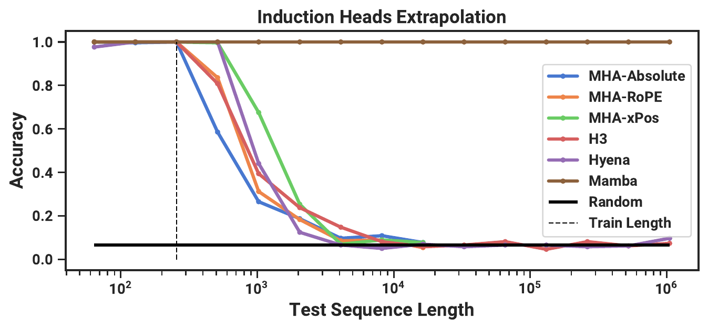

**Bảng 2: Induction Heads.** Các mô hình được train ở sequence length `2⁸ = 256`, rồi kiểm tra ở các độ dài tăng dần từ `2⁶ = 64` tới `2²⁰ = 1,048,576`. Số liệu đầy đủ nằm ở Bảng 11 trong Phụ lục E.1.

### 4.2 Language Modeling

Chúng tôi đánh giá kiến trúc Mamba trên bài toán language modeling tự hồi quy tiêu chuẩn, so sánh với các kiến trúc khác bằng cả metric pretraining, tức perplexity, và đánh giá zero-shot. Kích thước mô hình, gồm depth và width, được đặt tương ứng với đặc tả GPT-3. Dữ liệu là The Pile và quy trình training tuân theo Brown et al. (2020). Mọi chi tiết training nằm ở Phụ lục E.2.

#### 4.2.1 Scaling Laws

Các baseline gồm kiến trúc Transformer chuẩn, tức GPT-3, và công thức Transformer mạnh nhất mà chúng tôi biết, được gọi là Transformer++, dựa trên PaLM và LLaMA: rotary embedding, SwiGLU MLP, RMSNorm thay cho LayerNorm, không dùng linear bias và learning rate cao hơn. Chúng tôi cũng so sánh với các kiến trúc dưới bậc hai gần đây khác.

Hình 4 trình bày scaling law theo giao thức Chinchilla chuẩn, với mô hình từ xấp xỉ `125M` tới `1.3B` tham số. **Mamba là mô hình không có attention đầu tiên đạt hiệu năng tương đương một công thức Transformer rất mạnh, Transformer++, nay đã trở thành tiêu chuẩn, đặc biệt khi sequence length tăng.** Kết quả đầy đủ ở context length `8K` bị thiếu đối với RWKV và RetNet vì chưa có triển khai đủ hiệu quả, dẫn tới out-of-memory hoặc yêu cầu tính toán phi thực tế.

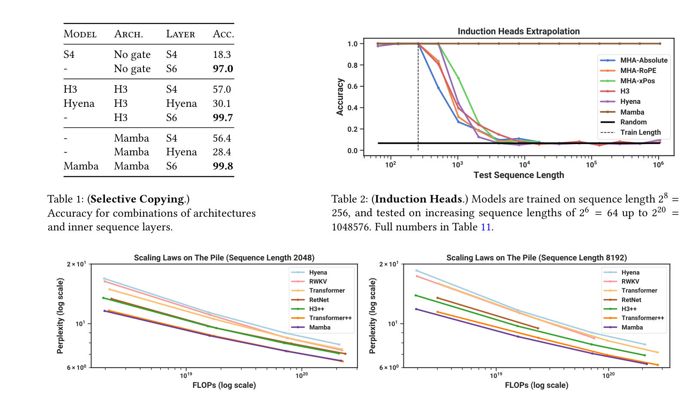

**Hình 4: Scaling Laws.** Các mô hình khoảng `125M` tới `1.3B` tham số được train trên The Pile. Mamba scale tốt hơn mọi mô hình không dùng attention khác và là mô hình đầu tiên đạt hiệu năng tương đương công thức Transformer++ rất mạnh, đặc biệt khi sequence length tăng.

#### 4.2.2 Downstream Evaluations

Bảng 3 trình bày hiệu năng của Mamba trên nhiều tác vụ đánh giá downstream zero-shot phổ biến. Chúng tôi so sánh với các mô hình mã nguồn mở nổi tiếng nhất ở những kích thước này, quan trọng nhất là Pythia và RWKV, vốn được train bằng cùng tokenizer, dataset và độ dài training `300B` token như các mô hình của chúng tôi. Mamba và Pythia được train với context length `2048`, còn RWKV dùng `1024`.

<table border="1" cellpadding="3" style="border-collapse:collapse; width:100%; font-size:.64em;">
<caption style="caption-side:top; text-align:left; font-size:1.55em;"><b>Bảng 3: Đánh giá zero-shot.</b> Kết quả tốt nhất ở mỗi nhóm kích thước được in đậm. Pile là perplexity trên validation split và chỉ so sánh các mô hình dùng cùng dataset, tokenizer GPT-NeoX-20B. Ở mỗi kích thước, Mamba dẫn đầu mọi metric và nhìn chung đạt mức của baseline lớn gấp đôi.</caption>
<tr><th rowspan="2" style="border:1px solid #888; padding:.35em;">Model</th><th rowspan="2" style="border:1px solid #888; padding:.35em;">Tokenizer</th><th style="border:1px solid #888; padding:.35em;">Pile</th><th style="border:1px solid #888; padding:.35em;">LAMBADA</th><th style="border:1px solid #888; padding:.35em;">LAMBADA</th><th style="border:1px solid #888; padding:.35em;">HellaSwag</th><th style="border:1px solid #888; padding:.35em;">PIQA</th><th style="border:1px solid #888; padding:.35em;">ARC-E</th><th style="border:1px solid #888; padding:.35em;">ARC-C</th><th style="border:1px solid #888; padding:.35em;">WinoGrande</th><th style="border:1px solid #888; padding:.35em;">Trung bình</th></tr>
<tr><th style="border:1px solid #888; padding:.35em;">ppl ↓</th><th style="border:1px solid #888; padding:.35em;">ppl ↓</th><th style="border:1px solid #888; padding:.35em;">acc ↑</th><th style="border:1px solid #888; padding:.35em;">acc ↑</th><th style="border:1px solid #888; padding:.35em;">acc ↑</th><th style="border:1px solid #888; padding:.35em;">acc ↑</th><th style="border:1px solid #888; padding:.35em;">acc ↑</th><th style="border:1px solid #888; padding:.35em;">acc ↑</th><th style="border:1px solid #888; padding:.35em;">acc ↑</th></tr>
<tr><td style="border:1px solid #888; padding:.35em;">Hybrid H3-130M</td><td style="border:1px solid #888; padding:.35em;">GPT2</td><td style="border:1px solid #888; padding:.35em;">-</td><td style="border:1px solid #888; padding:.35em;">89.48</td><td style="border:1px solid #888; padding:.35em;">25.77</td><td style="border:1px solid #888; padding:.35em;">31.7</td><td style="border:1px solid #888; padding:.35em;">64.2</td><td style="border:1px solid #888; padding:.35em;">44.4</td><td style="border:1px solid #888; padding:.35em;">24.2</td><td style="border:1px solid #888; padding:.35em;">50.6</td><td style="border:1px solid #888; padding:.35em;">40.1</td></tr>
<tr><td style="border:1px solid #888; padding:.35em;">Pythia-160M</td><td style="border:1px solid #888; padding:.35em;">NeoX</td><td style="border:1px solid #888; padding:.35em;">29.64</td><td style="border:1px solid #888; padding:.35em;">38.10</td><td style="border:1px solid #888; padding:.35em;">33.0</td><td style="border:1px solid #888; padding:.35em;">30.2</td><td style="border:1px solid #888; padding:.35em;">61.4</td><td style="border:1px solid #888; padding:.35em;">43.2</td><td style="border:1px solid #888; padding:.35em;">24.1</td><td style="border:1px solid #888; padding:.35em;"><b>51.9</b></td><td style="border:1px solid #888; padding:.35em;">40.6</td></tr>
<tr><td style="border:1px solid #888; padding:.35em;"><b>Mamba-130M</b></td><td style="border:1px solid #888; padding:.35em;">NeoX</td><td style="border:1px solid #888; padding:.35em;"><b>10.56</b></td><td style="border:1px solid #888; padding:.35em;"><b>16.07</b></td><td style="border:1px solid #888; padding:.35em;"><b>44.3</b></td><td style="border:1px solid #888; padding:.35em;"><b>35.3</b></td><td style="border:1px solid #888; padding:.35em;"><b>64.5</b></td><td style="border:1px solid #888; padding:.35em;"><b>48.0</b></td><td style="border:1px solid #888; padding:.35em;"><b>24.3</b></td><td style="border:1px solid #888; padding:.35em;"><b>51.9</b></td><td style="border:1px solid #888; padding:.35em;"><b>44.7</b></td></tr>
<tr><td>Hybrid H3-360M</td><td>GPT2</td><td>-</td><td>12.58</td><td>48.0</td><td>41.5</td><td>68.1</td><td>51.4</td><td>24.7</td><td>54.1</td><td>48.0</td></tr>
<tr><td>Pythia-410M</td><td>NeoX</td><td>9.95</td><td>10.84</td><td>51.4</td><td>40.6</td><td>66.9</td><td>52.1</td><td>24.6</td><td>53.8</td><td>48.2</td></tr>
<tr><td><b>Mamba-370M</b></td><td>NeoX</td><td><b>8.28</b></td><td><b>8.14</b></td><td><b>55.6</b></td><td><b>46.5</b></td><td><b>69.5</b></td><td><b>55.1</b></td><td><b>28.0</b></td><td><b>55.3</b></td><td><b>50.0</b></td></tr>
<tr><td>Pythia-1B</td><td>NeoX</td><td>7.82</td><td>7.92</td><td>56.1</td><td>47.2</td><td>70.7</td><td>57.0</td><td>27.1</td><td>53.5</td><td>51.9</td></tr>
<tr><td><b>Mamba-790M</b></td><td>NeoX</td><td><b>7.33</b></td><td><b>6.02</b></td><td><b>62.7</b></td><td><b>55.1</b></td><td><b>72.1</b></td><td><b>61.2</b></td><td><b>29.5</b></td><td><b>56.1</b></td><td><b>57.1</b></td></tr>
<tr><td>GPT-Neo 1.3B</td><td>GPT2</td><td>-</td><td>7.50</td><td>57.2</td><td>48.9</td><td>71.1</td><td>56.2</td><td>25.9</td><td>54.9</td><td>52.4</td></tr>
<tr><td>Hybrid H3-1.3B</td><td>GPT2</td><td>-</td><td>11.25</td><td>49.6</td><td>52.6</td><td>71.3</td><td>59.2</td><td>28.1</td><td>56.9</td><td>53.0</td></tr>
<tr><td>OPT-1.3B</td><td>OPT</td><td>-</td><td>6.64</td><td>58.0</td><td>53.7</td><td>72.4</td><td>56.7</td><td>29.6</td><td>59.5</td><td>55.0</td></tr>
<tr><td>Pythia-1.4B</td><td>NeoX</td><td>7.51</td><td>6.08</td><td>61.7</td><td>52.1</td><td>71.0</td><td>60.5</td><td>28.5</td><td>57.2</td><td>55.2</td></tr>
<tr><td>RWKV-1.5B</td><td>NeoX</td><td>7.70</td><td>7.04</td><td>56.4</td><td>52.5</td><td>72.4</td><td>60.5</td><td>29.4</td><td>54.6</td><td>54.3</td></tr>
<tr><td><b>Mamba-1.4B</b></td><td>NeoX</td><td><b>6.80</b></td><td><b>5.04</b></td><td><b>64.9</b></td><td><b>59.1</b></td><td><b>74.2</b></td><td><b>65.5</b></td><td><b>32.8</b></td><td><b>61.5</b></td><td><b>59.7</b></td></tr>
<tr><td>GPT-Neo 2.7B</td><td>GPT2</td><td>-</td><td>5.63</td><td>62.2</td><td>55.8</td><td>72.1</td><td>61.1</td><td>30.2</td><td>57.6</td><td>56.5</td></tr>
<tr><td>Hybrid H3-2.7B</td><td>GPT2</td><td>-</td><td>7.92</td><td>55.7</td><td>59.7</td><td>73.3</td><td>65.6</td><td>32.3</td><td>61.4</td><td>58.0</td></tr>
<tr><td>OPT-2.7B</td><td>OPT</td><td>-</td><td>5.12</td><td>63.6</td><td>60.6</td><td>74.8</td><td>60.8</td><td>31.3</td><td>61.0</td><td>58.7</td></tr>
<tr><td>Pythia-2.8B</td><td>NeoX</td><td>6.73</td><td>5.04</td><td>64.7</td><td>59.3</td><td>74.0</td><td>64.1</td><td>32.9</td><td>59.7</td><td>59.1</td></tr>
<tr><td>RWKV-3B</td><td>NeoX</td><td>7.00</td><td>5.24</td><td>63.9</td><td>59.6</td><td>73.7</td><td>67.8</td><td>33.1</td><td>59.6</td><td>59.6</td></tr>
<tr><td><b>Mamba-2.8B</b></td><td>NeoX</td><td><b>6.22</b></td><td><b>4.23</b></td><td><b>69.2</b></td><td><b>66.1</b></td><td><b>75.2</b></td><td><b>69.7</b></td><td><b>36.3</b></td><td><b>63.5</b></td><td><b>63.3</b></td></tr>
<tr><td>GPT-J-6B</td><td>GPT2</td><td>-</td><td>4.10</td><td>68.3</td><td>66.3</td><td>75.4</td><td>67.0</td><td>36.6</td><td>64.1</td><td>63.0</td></tr>
<tr><td>OPT-6.7B</td><td>OPT</td><td>-</td><td>4.25</td><td>67.7</td><td>67.2</td><td>76.3</td><td>65.6</td><td>34.9</td><td>65.5</td><td>62.9</td></tr>
<tr><td>Pythia-6.9B</td><td>NeoX</td><td>6.51</td><td>4.45</td><td>67.1</td><td>64.0</td><td>75.2</td><td>67.3</td><td>35.5</td><td>61.3</td><td>61.7</td></tr>
<tr><td>RWKV-7.4B</td><td>NeoX</td><td>6.31</td><td>4.38</td><td>67.2</td><td>65.5</td><td>76.1</td><td>67.8</td><td>37.5</td><td>61.0</td><td>62.5</td></tr>
</table>

### 4.3 DNA Modeling

Được thúc đẩy bởi thành công của LLM, các nghiên cứu gần đây bắt đầu áp dụng mô thức foundation model cho genomics. DNA giống ngôn ngữ ở chỗ gồm chuỗi token rời rạc trên một vocabulary hữu hạn, đồng thời nổi tiếng là cần mô hình hóa phụ thuộc xa. Chúng tôi khảo sát Mamba như backbone foundation model cho pretraining và fine-tuning trong cùng thiết lập với các công trình gần đây về mô hình chuỗi DNA dài. Cụ thể, chúng tôi tập trung vào scaling law theo model size và sequence length, cùng một tác vụ phân loại tổng hợp downstream khó, đòi hỏi ngữ cảnh dài.

Với pretraining, chúng tôi phần lớn dùng thiết lập causal language modeling tiêu chuẩn, tức dự đoán token tiếp theo. Dataset theo HyenaDNA, dùng HG38 gồm một bộ gene người với khoảng `4.5B` token, tức các cặp base DNA, trong training split.

#### 4.3.1 Scaling: Model Size

Thí nghiệm này khảo sát tính chất scaling của genomics foundation model với nhiều backbone.

**Training.** Để tạo lợi thế cho baseline, chúng tôi train ở sequence length ngắn `1024`; theo Mục 4.3.2, chúng tôi kỳ vọng chuỗi dài hơn còn có lợi hơn cho Mamba. Global batch size cố định là `1024`, tương ứng tổng `2²⁰ ≈ 1M` token mỗi batch. Mô hình được train `10K` gradient step, tổng cộng `10B` token.

**Kết quả.** Hình 5 bên trái cho thấy perplexity pretraining của Mamba cải thiện trơn theo model size, đồng thời Mamba scale tốt hơn cả HyenaDNA lẫn Transformer++. Ở kích thước lớn nhất khoảng `40M` tham số, **Mamba đạt mức của Transformer++ và HyenaDNA với số tham số ít hơn khoảng 3-4 lần**.

#### 4.3.2 Scaling: Context Length

Thí nghiệm DNA tiếp theo khảo sát tính chất scaling theo sequence length. Chúng tôi chỉ so sánh HyenaDNA và Mamba vì quadratic attention trở nên quá đắt ở chuỗi dài. Các sequence length pretraining là `2¹⁰ = 1024`, `2¹² = 4096`, `2¹⁴ = 16,384`, `2¹⁶ = 65,536`, `2¹⁸ = 262,144` và `2²⁰ = 1,048,576`. Model size cố định ở 6 layer, width `128`, khoảng `1.3M-1.4M` tham số. Mô hình được train `20K` gradient step, tổng xấp xỉ `330B` token. Các chuỗi dài hơn dùng sequence length warmup tương tự HyenaDNA.

**Kết quả.** Hình 5 bên phải cho thấy **Mamba có thể tận dụng ngữ cảnh dài tới chuỗi cực dài một triệu phần tử**, và perplexity pretraining cải thiện khi context tăng. Ngược lại, HyenaDNA kém đi khi sequence length tăng. Điều này phù hợp với các tính chất của cơ chế chọn lọc ở Mục 3.5: mô hình LTI không thể chọn lọc bỏ qua thông tin; theo góc nhìn convolution, một kernel rất dài sẽ tổng hợp mọi thông tin trên chuỗi dài, trong đó có thể có nhiều nhiễu. Dù HyenaDNA tuyên bố cải thiện với ngữ cảnh dài hơn, kết quả của họ không kiểm soát thời gian tính toán.

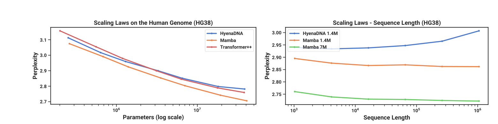

**Hình 5: DNA Scaling Laws.** Pretraining trên HG38. **(Trái)** Cố định context length ngắn `2¹⁰ = 1024`, tăng model size từ khoảng `200K` tới `40M` tham số; Mamba scale tốt hơn baseline. **(Phải)** Cố định model size, tăng sequence length trong khi giữ token mỗi batch và tổng token training không đổi. Khác với baseline, cơ chế chọn lọc của Mamba giúp hiệu năng cải thiện khi context dài hơn.

#### 4.3.3 Synthetic Species Classification

Chúng tôi đánh giá các mô hình trên tác vụ downstream phân loại 5 loài bằng cách lấy ngẫu nhiên một đoạn DNA liên tục. Tác vụ được điều chỉnh từ HyenaDNA, vốn dùng các loài `{human, lemur, mouse, pig, hippo}`. Chúng tôi làm tác vụ khó hơn đáng kể bằng cách phân loại năm loài great apes `{human, chimpanzee, gorilla, orangutan, bonobo}`, vốn được biết là chia sẻ khoảng `99%` DNA.

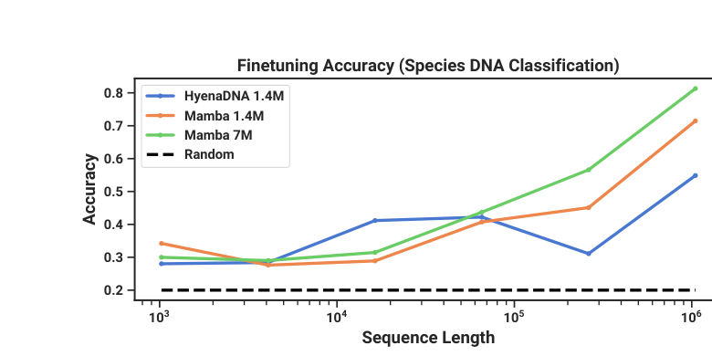

**Hình 6: Phân loại DNA great apes.** Accuracy sau fine-tuning trên chuỗi dài từ `2¹⁰ = 1024` tới `2²⁰ = 1,048,576`, dùng mô hình pretrained có cùng context length. Số liệu đầy đủ ở Bảng 13.

### 4.4 Audio Modeling and Generation

Với modality waveform audio, chúng tôi chủ yếu so sánh theo kiến trúc và giao thức training của SaShiMi. Mô hình này gồm một U-Net backbone có hai stage pooling với hệ số `p`, mỗi stage làm model dimension `D` tăng gấp đôi, và các block S4 xen kẽ MLP trong từng stage. Chúng tôi xem xét thay các block S4+MLP bằng Mamba block. Chi tiết thí nghiệm nằm ở Phụ lục E.4.

#### 4.4.1 Long-Context Autoregressive Pretraining

Chúng tôi đánh giá chất lượng pretraining, tức dự đoán autoregressive next-sample, trên YouTubeMix, dataset piano tiêu chuẩn gồm 4 giờ độc tấu piano lấy mẫu ở `16,000 Hz`. Thiết lập pretraining phần lớn theo language modeling. Hình 7 đánh giá tác động của việc tăng sequence length training từ `2¹³ = 8192` lên `2²⁰ ≈ 10⁶`, trong khi giữ lượng tính toán không đổi. Dữ liệu chỉ có clip tối đa một phút nên sequence length thực tế bị chặn ở `60 s × 16,000 Hz = 960,000`; chi tiết curate dữ liệu này có thể tạo các điểm gãy trên scaling curve.

**Cả Mamba và baseline SaShiMi, tức S4+MLP, đều cải thiện nhất quán khi context dài hơn; Mamba tốt hơn ở mọi độ dài và khoảng cách tăng lên khi chuỗi dài hơn.** Metric chính là bits per byte (BPB), khác negative log-likelihood chuẩn một hệ số hằng `log(2)`.

Đây là thí nghiệm duy nhất trong bài báo chuyển từ tham số hóa số thực sang số phức. Các ablation bổ sung nằm ở Phụ lục E.4.

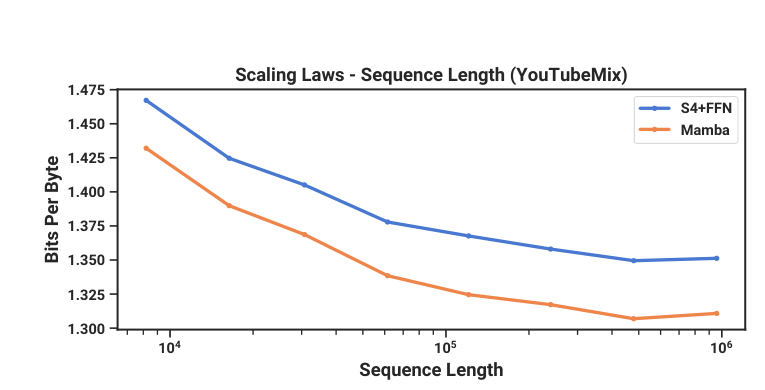

**Hình 7: Audio Pretraining.** Mamba cải thiện so với state-of-the-art trước đó, SaShiMi, trong autoregressive audio modeling, đồng thời tiếp tục cải thiện tới ngữ cảnh dài một phút, tương ứng chuỗi gần một triệu phần tử, khi kiểm soát lượng tính toán.

#### 4.4.2 Autoregressive Speech Generation

SC09 là benchmark sinh tiếng nói gồm các clip một giây, lấy mẫu ở `16,000 Hz`, của các chữ số “zero” tới “nine” với đặc tính rất đa dạng. Chúng tôi phần lớn tuân theo thiết lập autoregressive training và giao thức generation của SaShiMi.

Bảng 4 trình bày các metric tự động của Mamba-UNet so với SampleRNN, WaveNet, WaveGAN, DiffWave và SaShiMi. **Một Mamba nhỏ vượt state-of-the-art trước đó, gồm các mô hình GAN và diffusion lớn hơn nhiều.** Mô hình lớn hơn, có số tham số khớp baseline, tiếp tục cải thiện mạnh các metric về fidelity.

Bảng 5 dùng Mamba nhỏ và khảo sát tổ hợp kiến trúc ở outer stage và center stage. Kết quả cho thấy Mamba nhất quán tốt hơn S4+MLP ở outer block, còn tại center block có thứ tự `Mamba > S4+MLP > MHA+MLP`.

<table border="1" cellpadding="4" style="border-collapse:collapse; min-width:800px;">
<caption style="caption-side:top; text-align:left;"><b>Bảng 4: SC09.</b> Metric tự động cho generation vô điều kiện trên dataset clip tiếng nói độ dài cố định. Từ trên xuống: baseline autoregressive, baseline non-autoregressive, Mamba và metric của dataset.</caption>
<tr><th>Model</th><th>Params</th><th>NLL ↓</th><th>FID ↓</th><th>IS ↑</th><th>mIS ↑</th><th>AM ↓</th></tr>
<tr><td>SampleRNN</td><td>35.0M</td><td>2.042</td><td>8.96</td><td>1.71</td><td>3.02</td><td>1.76</td></tr>
<tr><td>WaveNet</td><td>4.2M</td><td>1.925</td><td>5.08</td><td>2.27</td><td>5.80</td><td>1.47</td></tr>
<tr><td>SaShiMi</td><td>5.8M</td><td>1.873</td><td>1.99</td><td>5.13</td><td>42.57</td><td>0.74</td></tr>
<tr><td>WaveGAN</td><td>19.1M</td><td>-</td><td>2.03</td><td>4.90</td><td>36.10</td><td>0.80</td></tr>
<tr><td>DiffWave</td><td>24.1M</td><td>-</td><td>1.92</td><td>5.26</td><td>51.21</td><td>0.68</td></tr>
<tr><td>DiffWave + SaShiMi</td><td>23.0M</td><td>-</td><td>1.42</td><td>5.94</td><td>69.17</td><td>0.59</td></tr>
<tr><td><b>Mamba</b></td><td>6.1M</td><td><b>1.852</b></td><td><u>0.94</u></td><td><u>6.26</u></td><td><u>88.54</u></td><td><u>0.52</u></td></tr>
<tr><td><b>Mamba</b></td><td>24.3M</td><td><u>1.860</u></td><td><b>0.67</b></td><td><b>7.33</b></td><td><b>144.9</b></td><td><b>0.36</b></td></tr>
<tr><td>Train</td><td>-</td><td>-</td><td>0.00</td><td>8.56</td><td>292.5</td><td>0.16</td></tr>
<tr><td>Test</td><td>-</td><td>-</td><td>0.02</td><td>8.33</td><td>257.6</td><td>0.19</td></tr>
</table>

<table border="1" cellpadding="4" style="border-collapse:collapse; min-width:800px;">
<caption style="caption-side:top; text-align:left;"><b>Bảng 5: Ablation mô hình SC09.</b> Các mô hình có khoảng 6M tham số. SaShiMi U-Net có 8 center block ở sequence length 1000, được kẹp bởi 8 outer block mỗi phía ở length 4000, rồi 8 outer block mỗi phía ở length 16000, tổng 40 block. Chỉ kiến trúc 8 center block được ablate độc lập. Transformer không được kiểm tra ở outer block quan trọng hơn vì giới hạn hiệu quả.</caption>
<tr><th>Outer</th><th>Center</th><th>NLL ↓</th><th>FID ↓</th><th>IS ↑</th><th>mIS ↑</th><th>AM ↓</th></tr>
<tr><td>S4+MLP</td><td>MHA+MLP</td><td>1.859</td><td>1.45</td><td>5.06</td><td>47.03</td><td>0.70</td></tr>
<tr><td>S4+MLP</td><td>S4+MLP</td><td>1.867</td><td>1.43</td><td>5.42</td><td>53.54</td><td>0.65</td></tr>
<tr><td>S4+MLP</td><td>Mamba</td><td>1.859</td><td>1.42</td><td>5.71</td><td>56.51</td><td>0.64</td></tr>
<tr><td>Mamba</td><td>MHA+MLP</td><td><b>1.850</b></td><td>1.37</td><td>5.63</td><td>58.23</td><td>0.62</td></tr>
<tr><td>Mamba</td><td>S4+MLP</td><td>1.853</td><td><u>1.07</u></td><td><u>6.05</u></td><td><u>73.34</u></td><td><u>0.55</u></td></tr>
<tr><td>Mamba</td><td>Mamba</td><td><u>1.852</u></td><td><b>0.94</b></td><td><b>6.26</b></td><td><b>88.54</b></td><td><b>0.52</b></td></tr>
</table>

### 4.5 Speed and Memory Benchmarks

Chúng tôi benchmark tốc độ của phép scan SSM với state expansion `N = 16`, cùng throughput inference end-to-end của Mamba, trong Hình 8. Selective scan hiệu quả nhanh hơn triển khai attention tốt nhất mà chúng tôi biết, FlashAttention-2, khi sequence length vượt 2K; đồng thời nhanh hơn scan chuẩn bằng PyTorch tới `20-40×`. Mamba đạt throughput inference cao hơn Transformer cùng kích thước `4-5×`, vì không có KV cache nên có thể dùng batch size lớn hơn nhiều. Chẳng hạn, Mamba-6.9B chưa train vẫn có throughput inference cao hơn Transformer-1.3B nhỏ hơn 5 lần. Phụ lục E.5 cung cấp chi tiết và benchmark bộ nhớ.

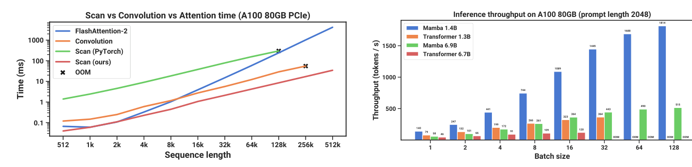

**Hình 8: Benchmark hiệu quả.** **(Trái, training)** Selective scan hiệu quả nhanh hơn triển khai chuẩn khoảng `40×`. **(Phải, inference)** Vì là mô hình hồi quy, Mamba có thể đạt throughput cao hơn Transformer khoảng `5×`.

### 4.6 Model Ablations

Chúng tôi thực hiện một loạt ablation chi tiết trên các thành phần mô hình, tập trung vào language modeling với mô hình khoảng `350M` tham số và số token theo Chinchilla, cùng thiết lập với Hình 4.

#### 4.6.1 Architecture

Bảng 6 khảo sát tác động của kiến trúc block và lớp SSM bên trong. Kết quả:

- Trong các SSM không chọn lọc trước đây, tức mô hình LTI tương đương global convolution, hiệu năng rất giống nhau.
- Thay S4 complex-valued bằng biến thể real-valued hầu như không ảnh hưởng hiệu năng, gợi ý rằng ít nhất với language modeling, SSM real-valued có thể tốt hơn khi xét thêm hiệu quả phần cứng.
- Thay bất kỳ lớp nào bằng selective SSM, tức S6, cải thiện đáng kể, xác nhận động lực của Mục 3.
- Kiến trúc Mamba hoạt động tương tự H3 và có vẻ nhỉnh hơn khi dùng lớp selective.

Chúng tôi cũng khảo sát việc xen Mamba block với MLP hoặc MHA trong Phụ lục E.2.2.

<table border="1" cellpadding="4" style="border-collapse:collapse; width:100%;">
<caption style="caption-side:top; text-align:left;"><b>Bảng 6: Ablation kiến trúc và lớp SSM.</b> Mamba block tương tự H3 nhưng đơn giản hơn. Các tham số hóa LTI cho kết quả gần nhau; selective SSM, tức S6, tạo cải thiện lớn. S4 real là S4D-Real; S4 complex là S4D-Lin.</caption>
<tr><th>Model</th><th>Kiến trúc</th><th>SSM layer</th><th>Perplexity</th></tr>
<tr><td>Hyena</td><td>H3</td><td>Hyena</td><td>10.24</td></tr>
<tr><td>H3</td><td>H3</td><td>S4 (complex)</td><td>10.30</td></tr>
<tr><td>-</td><td>H3</td><td>S4 (real)</td><td>10.34</td></tr>
<tr><td>-</td><td>H3</td><td>S6</td><td><b>8.95</b></td></tr>
<tr><td>-</td><td>Mamba</td><td>Hyena</td><td>10.75</td></tr>
<tr><td>-</td><td>Mamba</td><td>S4 (complex)</td><td>10.54</td></tr>
<tr><td>-</td><td>Mamba</td><td>S4 (real)</td><td>10.56</td></tr>
<tr><td>Mamba</td><td>Mamba</td><td>S6</td><td><b>8.69</b></td></tr>
</table>

#### 4.6.2 Selective SSM

Bảng 7 ablate selective SSM bằng các tổ hợp khác nhau của `Δ`, `B`, `C` phụ thuộc đầu vào, cho thấy `Δ` là tham số quan trọng nhất do mối liên hệ với RNN gating. Bảng 8 khảo sát các cách khởi tạo SSM; trong language modeling, các khởi tạo diagonal real-valued đơn giản, như S4D-Real, tốt hơn tham số hóa complex-valued S4D-Lin. Khởi tạo ngẫu nhiên cũng hoạt động tốt.

Bảng 9 và Bảng 10 lần lượt thay đổi chiều projection của `Δ` và chiều state của `(B, C)`. Chuyển từ static sang selective mang lại phần lớn cải thiện; tăng chiều thêm thường cải thiện vừa phải với mức tăng tham số nhỏ.

<table border="1" cellpadding="4" style="border-collapse:collapse; width:100%;">
<caption style="caption-side:top; text-align:left;"><b>Bảng 7: Ablation các tham số selective.</b> `Δ` là tham số quan trọng nhất, nhưng dùng đồng thời nhiều tham số selective tạo hiệu ứng hiệp đồng.</caption>
<tr><th>Selective Δ</th><th>Selective B</th><th>Selective C</th><th>Perplexity</th></tr>
<tr><td>✗</td><td>✗</td><td>✗</td><td>10.93</td></tr>
<tr><td>✗</td><td>✓</td><td>✗</td><td>10.15</td></tr>
<tr><td>✗</td><td>✗</td><td>✓</td><td>9.98</td></tr>
<tr><td>✓</td><td>✗</td><td>✗</td><td>9.81</td></tr>
<tr><td>✓</td><td>✓</td><td>✓</td><td><b>8.71</b></td></tr>
</table>

<table border="1" cellpadding="4" style="border-collapse:collapse; width:100%;">
<caption style="caption-side:top; text-align:left;"><b>Bảng 8: Ablation tham số hóa A.</b> Khi SSM có tính chọn lọc, khởi tạo S4D-Lin tiêu chuẩn kém hơn S4D-Real hoặc khởi tạo ngẫu nhiên.</caption>
<tr><th>Khởi tạo An</th><th>Trường số</th><th>Perplexity</th></tr>
<tr><td><i>A</i>n = -1/2 + <i>n i</i></td><td>Complex</td><td>9.16</td></tr>
<tr><td><i>A</i>n = -1/2</td><td>Real</td><td>8.85</td></tr>
<tr><td><i>A</i>n = -(<i>n</i> + 1)</td><td>Real</td><td>8.71</td></tr>
<tr><td><i>A</i>n ~ exp(N(0, 1))</td><td>Real</td><td>8.71</td></tr>
</table>

<table border="1" cellpadding="4" style="border-collapse:collapse; width:100%;">
<caption style="caption-side:top; text-align:left;"><b>Bảng 9: Khả năng biểu đạt của Δ.</b> Chỉ chiếu đầu vào xuống dimension 1 đã cải thiện lớn; tăng dimension tiếp tục cải thiện với mức tăng tham số vừa phải. State size cố định `N = 16`.</caption>
<tr><th>Dimension projection Δ</th><th>Tham số (M)</th><th>Perplexity</th></tr>
<tr><td>-</td><td>358.9</td><td>9.12</td></tr>
<tr><td>1</td><td>359.1</td><td>8.97</td></tr>
<tr><td>2</td><td>359.3</td><td>8.97</td></tr>
<tr><td>4</td><td>359.7</td><td>8.91</td></tr>
<tr><td>8</td><td>360.5</td><td>8.83</td></tr>
<tr><td>16</td><td>362.1</td><td>8.84</td></tr>
<tr><td>32</td><td>365.2</td><td>8.80</td></tr>
<tr><td>64</td><td>371.5</td><td>8.71</td></tr>
</table>

<table border="1" cellpadding="4" style="border-collapse:collapse; width:100%;">
<caption style="caption-side:top; text-align:left;"><b>Bảng 10: Chiều trạng thái SSM.</b> Nhóm trên dùng `B`, `C` hằng; nhóm dưới dùng `B`, `C` selective. Tăng state dimension `N`, có thể xem như expansion factor của recurrent state, cải thiện đáng kể với chi phí tham số/FLOP không đáng kể, nhưng chỉ khi `B`, `C` cũng selective. Dimension projection `Δ` cố định 64.</caption>
<tr><th>B, C</th><th>State dimension N</th><th>Tham số (M)</th><th>Perplexity</th></tr>
<tr><td rowspan="5">Hằng</td><td>1</td><td>367.1</td><td>9.88</td></tr>
<tr><td>2</td><td>367.4</td><td>9.86</td></tr>
<tr><td>4</td><td>368.0</td><td>9.82</td></tr>
<tr><td>8</td><td>369.1</td><td>9.82</td></tr>
<tr><td>16</td><td>371.5</td><td>9.81</td></tr>
<tr><td rowspan="5">Selective</td><td>1</td><td>367.1</td><td>9.73</td></tr>
<tr><td>2</td><td>367.4</td><td>9.40</td></tr>
<tr><td>4</td><td>368.0</td><td>9.09</td></tr>
<tr><td>8</td><td>369.1</td><td>8.84</td></tr>
<tr><td>16</td><td>371.5</td><td>8.71</td></tr>
</table>

Đáng chú ý nhất là mức cải thiện mạnh của selective SSM khi state size `N` tăng: perplexity giảm hơn `1.0` với chi phí chỉ khoảng `1%` tham số bổ sung. Kết quả này xác nhận động lực cốt lõi ở Mục 3.1 và Mục 3.3.

## 5. Discussion

Chúng tôi thảo luận các công trình liên quan, hạn chế và một số hướng nghiên cứu tương lai.

**Related Work.** Phụ lục A thảo luận quan hệ giữa cơ chế chọn lọc và các khái niệm tương tự. Phụ lục B trình bày phần related work mở rộng về SSM và các mô hình liên quan.

**No Free Lunch: Continuous-Discrete Spectrum.** Structured SSM ban đầu được định nghĩa như discretization của hệ liên tục ở Phương trình (1), nên có inductive bias mạnh cho modality dữ liệu continuous-time như tín hiệu cảm nhận, chẳng hạn audio và video. Như đã thảo luận ở Mục 3.1 và 3.5, cơ chế chọn lọc khắc phục điểm yếu của chúng trên modality rời rạc như text và DNA; nhưng ngược lại, nó có thể cản trở hiệu năng trên loại dữ liệu mà LTI SSM vốn làm tốt. Các ablation trên waveform audio khảo sát kỹ hơn đánh đổi này.

**Downstream Affordances.** Foundation model dựa trên Transformer, đặc biệt là LLM, có một hệ sinh thái phong phú về tính chất và cách tương tác với mô hình pretrained: fine-tuning, adaptation, prompting, in-context learning, instruction tuning, RLHF, quantization, v.v. Chúng tôi đặc biệt quan tâm liệu các lựa chọn thay thế Transformer như SSM có những tính chất và khả năng tương tự hay không.

**Scaling.** Đánh giá thực nghiệm của chúng tôi giới hạn ở model size nhỏ, thấp hơn ngưỡng của phần lớn LLM mã nguồn mở mạnh như LLaMA, cũng như các mô hình hồi quy khác như RWKV và RetNet, vốn đã được đánh giá ở quy mô 7B tham số trở lên. Vẫn cần đánh giá liệu Mamba có giữ ưu thế ở kích thước lớn hơn hay không. Chúng tôi cũng lưu ý rằng scaling SSM có thể đặt ra thêm các thách thức engineering và yêu cầu điều chỉnh mô hình chưa được thảo luận trong bài báo này.

## 6. Conclusion

Chúng tôi đưa cơ chế chọn lọc vào structured state space model, cho phép chúng thực hiện suy luận phụ thuộc ngữ cảnh trong khi vẫn scale tuyến tính theo sequence length. Khi được tích hợp vào một kiến trúc đơn giản không có attention, Mamba đạt kết quả state-of-the-art trên nhiều miền dữ liệu, ngang bằng hoặc vượt các Transformer mạnh. Chúng tôi kỳ vọng selective state space model có thể được ứng dụng rộng rãi để xây dựng foundation model cho nhiều miền, đặc biệt là các modality mới nổi cần ngữ cảnh dài như genomics, audio và video. Kết quả cho thấy Mamba là một ứng viên mạnh cho backbone mô hình chuỗi tổng quát.

### Acknowledgments

Chúng tôi cảm ơn Karan Goel, Arjun Desai và Kush Bhatia vì những phản hồi hữu ích cho bản thảo.

> **Tài liệu tham khảo.** Tên công trình và danh mục tài liệu tham khảo được giữ nguyên trong PDF gốc; bản dịch giữ hệ trích dẫn tác giả-năm để đối chiếu.

## Appendix A. Discussion: Selection Mechanism

Cơ chế chọn lọc của chúng tôi được gợi cảm hứng và có liên hệ với các khái niệm như gating, hypernetwork và data-dependence. Nó cũng có thể được xem là liên quan tới “fast weights”, khái niệm kết nối RNN cổ điển với cơ chế linear attention. Tuy nhiên, chúng tôi cho rằng selection là một khái niệm riêng biệt cần được làm rõ.

**Gating.** Ban đầu, gating chỉ các cơ chế gate của RNN như LSTM, GRU hoặc phương trình có gate trong Định lý 1. Nó được diễn giải như một cơ chế cụ thể để điều khiển việc có đưa đầu vào vào hidden state của RNN hay không. Đặc biệt, nó tác động lên sự lan truyền tín hiệu theo thời gian và khiến các đầu vào tương tác dọc chiều sequence length.

Tuy nhiên, cách dùng phổ biến về sau đã nới lỏng “gating” thành bất kỳ tương tác nhân nào, thường đi cùng activation. Chẳng hạn, thành phần nhân theo từng phần tử trong kiến trúc neural network, không tương tác dọc sequence length, hiện cũng thường được gọi là gated architecture, dù ý nghĩa rất khác với RNN ban đầu. Vì vậy, **RNN gating** theo nghĩa gốc và **multiplicative gating** theo cách dùng phổ biến thực chất có ý nghĩa ngữ nghĩa rất khác nhau.

**Hypernetworks.** Hypernetwork là mạng neural có tham số được sinh bởi một mạng neural nhỏ hơn. Ý tưởng ban đầu dùng theo nghĩa hẹp để định nghĩa một RNN lớn mà recurrent parameter được sinh bởi một RNN nhỏ hơn; nhiều biến thể khác đã tồn tại từ lâu.

**Data-dependence.** Tương tự hypernetwork, data-dependence có thể chỉ bất kỳ trường hợp nào mà một số tham số của mô hình phụ thuộc vào dữ liệu.

**Ví dụ: GLU Activation.** Xét một linear layer diagonal đơn giản `y = Dx`, trong đó `D` là tham số trọng số diagonal. Giả sử chính `D` được sinh từ một linear transformation của `x`, với nonlinearity tùy chọn: `D = σ(Wx)`. Vì `D` là diagonal, phép nhân trở thành tích theo từng phần tử: `y = σ(Wx) ∘ x`.

Đây là một phép biến đổi khá tầm thường, nhưng về mặt kỹ thuật vẫn thỏa các nghĩa thông dụng của gating, vì có một “nhánh” nhân; hypernetwork, vì tham số `D` được sinh bởi một layer khác; và data-dependent, vì `D` phụ thuộc dữ liệu `x`. Tuy nhiên, nó thực chất chỉ định nghĩa một hàm GLU, đơn giản tới mức thường được xem như activation function thay vì một layer có ý nghĩa độc lập.

**Selection.** Vì vậy, dù cơ chế chọn lọc có thể được xem là một trường hợp đặc biệt của architectural gating, hypernetwork hoặc data-dependence, thì vô số cấu trúc khác cũng vậy: gần như mọi thứ có phép nhân, gồm cả attention chuẩn. Cách phân loại đó không cung cấp nhiều thông tin.

Thay vào đó, chúng tôi xem selection gần nhất với cơ chế gate của RNN truyền thống, vốn là một trường hợp đặc biệt theo Định lý 1 và có lịch sử liên hệ sâu hơn với SSM thông qua discretization `Δ` biến thiên, phụ thuộc đầu vào. Chúng tôi cũng tránh thuật ngữ “gating” và dùng **selection** để giảm nhập nhằng do “gating” đã bị dùng quá tải. Theo nghĩa hẹp, selection chỉ hành động cơ học của mô hình nhằm chọn hoặc bỏ qua đầu vào và tạo điều kiện cho dữ liệu tương tác dọc sequence length. Ngoài selective SSM và gated RNN, các ví dụ khác có thể gồm convolution phụ thuộc đầu vào và cả attention.

## Appendix B. Related Work

Phần này khái quát các công trình trước liên quan tới phương pháp của chúng tôi. Những mô hình gần nhất gồm các recurrent layer như S4, S5 và quasi-RNN, cùng các kiến trúc end-to-end như H3, RetNet và RWKV.

### B.1 S4 Variants and Derivatives

- **S4** giới thiệu structured SSM đầu tiên, mô tả cấu trúc diagonal và diagonal-plus-low-rank (DPLR). Công trình tập trung vào thuật toán convolution hiệu quả cho DPLR SSM nhờ mối liên hệ với bài toán ghi nhớ online continuous-time, HiPPO.
- **DSS** đầu tiên phát hiện hiệu quả thực nghiệm của diagonal structured SSM bằng cách xấp xỉ khởi tạo HiPPO. Kết quả này sau đó được mở rộng về lý thuyết trong S4D.
- **S5** độc lập phát hiện xấp xỉ diagonal SSM và là mô hình S4 đầu tiên được tính hồi quy bằng parallel scan. Tuy nhiên, cách này phải giảm chiều trạng thái hiệu dụng bằng cách chuyển từ SISO, single-input single-output, sang MIMO, multi-input multi-output. S6 cũng dùng scan nhưng khác ở ba điểm: giữ cấu trúc SISO để có recurrent state hiệu dụng lớn hơn; dùng thuật toán hardware-aware để giải quyết chi phí tính toán; thêm cơ chế chọn lọc.

  Lu et al. (2023) áp dụng S5 cho meta-RL để reset trạng thái SSM giữa các episode trajectory. Cơ chế này có thể xem là một trường hợp selection được hard-code, trong đó `Ā` được đặt thủ công bằng `0`, thay vì cơ chế học được và phụ thuộc đầu vào. Một hướng thú vị là áp dụng selective SSM tổng quát vào thiết lập này và kiểm tra liệu mô hình có tự học reset trạng thái tại biên episode hay không.
- **Mega** đơn giản hóa S4 từ complex-valued thành real-valued, cho phép diễn giải như exponential moving average (EMA), đồng thời liên hệ bước discretization của SSM với hệ số damping của EMA. Trái với các bài S4 ban đầu, đây là mô hình đầu tiên cho thấy SSM real-valued có hiệu quả thực nghiệm trong một số thiết lập hoặc khi kết hợp với thành phần kiến trúc khác.
- **Liquid S4** cũng được thúc đẩy bởi việc bổ sung state transition phụ thuộc đầu vào cho S4. Theo góc nhìn này, nó tương tự selection nhưng ở dạng hạn chế, vẫn được tính bằng convolution và gần LTI.
- **SGConv, Hyena, LongConv, MultiresConv và Toeplitz Neural Network** tập trung vào biểu diễn convolution của S4 và xây dựng global hoặc long convolution kernel bằng nhiều tham số hóa khác nhau. Tuy nhiên, các phương pháp này không trực tiếp hỗ trợ autoregressive inference nhanh.

Đáng chú ý, mọi phương pháp trên, cùng mọi structured SSM khác mà chúng tôi biết, đều không có tính chọn lọc và thường hoàn toàn LTI.

### B.2 SSM Architectures

Chúng tôi dùng “SSM architecture” hoặc “state space neural network - SSNN” để chỉ kiến trúc deep neural network tích hợp một SSM trước đó như black-box layer.

- **GSS** là kiến trúc neural network có gate đầu tiên tích hợp SSM. Nó được thúc đẩy bởi Gated Attention Unit và khá giống block của chúng tôi, nhưng có thêm projection. Quan trọng nhất, projection của GSS **co** model dimension để giảm state size của SSM, còn Mamba **mở rộng** model dimension để tăng state size theo động lực ở Mục 3.1.
- **Mega** kết hợp phiên bản EMA đơn giản hóa của S4 với kiến trúc hybrid dùng xấp xỉ attention hiệu quả.
- **H3** được thúc đẩy bởi việc kết hợp S4 với linear attention. Đây là phương pháp đầu tiên tổng quát hóa công thức linear attention sang recurrence tổng quát hơn và trở thành nền tảng cho các kiến trúc sau.
- **Selective S4** dùng S4 như black box để sinh binary mask rồi nhân mask với đầu vào. Dù cùng dùng tên “selection”, chúng tôi xem đây là sửa đổi kiến trúc gần architectural gating hơn cơ chế chọn lọc. Chúng tôi giả thuyết nó không giải được Selective Copying, vì chỉ mask đầu vào không liên quan không thay đổi khoảng cách giữa các đầu vào liên quan; thực tế tác vụ này có thể xem như đã được mask sẵn nếu noise token được embedding thành 0.
- **RetNet** cũng dựa trên Linear Attention và rất giống H3, nhưng giảm S4 bên trong về trường hợp đặc biệt có state dimension `N = 1`. Dù không được trình bày như vậy, recurrence của nó có thể xem là một linear SSM. Nguồn cải thiện chính là linear attention có head dimension lớn, tức một cách khác để mở rộng trạng thái phụ thuộc đầu vào. H3 từng dùng head dimension lớn nhưng chi phí tính toán tăng tương ứng. RetNet tránh vấn đề này bằng một cách song song hóa khác, dùng biến thể multi-head attention chuẩn thay vì convolution, khả thi vì SSM đặc biệt của nó chỉ là EMA đơn giản.
- **RWKV** là RNN gần đây cho language modeling, dựa trên AFT, attention-free Transformer, một biến thể linear attention khác. Cơ chế “WKV” chính gồm các LTI recurrence và có thể xem là tỉ số của hai SSM.

Chúng tôi cũng nhấn mạnh Gated Attention Unit, được thúc đẩy bởi việc hợp nhất MHA và MLP block của Transformer, và là nguồn cảm hứng cho kiến trúc Mamba khi hợp nhất H3 và MLP block.

### B.3 Relationship to RNNs

RNN và SSM có quan hệ rộng vì đều dựa trên recurrence trên một trạng thái tiềm ẩn.

Một số RNN cũ như strongly typed RNN, quasi-RNN (QRNN) và simple recurrent unit (SRU) có dạng gated RNN không dùng nonlinearity theo thời gian. Do mối liên hệ giữa gating và selection, có thể xem chúng là các trường hợp selective SSM, và theo một nghĩa nào đó mạnh hơn họ LTI structured SSM ở trên. Khác biệt chính là:

- Chúng không dùng state expansion, tức `N = 1`, hoặc tham số `B`, `C` selective; cả hai đều quan trọng cho hiệu năng.
- Chúng dùng cơ chế gate theo heuristic, trong khi chúng tôi khái quát gate như hệ quả của selection kết hợp discretization. Mối liên hệ với lý thuyết SSM có nguyên lý cung cấp tham số hóa và khởi tạo tốt hơn.

RNN cũ cũng nổi tiếng gặp vấn đề hiệu quả và vanishing gradient, đều bắt nguồn từ tính tuần tự. Vấn đề hiệu quả có thể được giải cho một số RNN bằng parallel scan, nhưng vanishing gradient khó xử lý nếu thiếu lý thuyết được phát triển sau này cho SSM. Structured SSM hiện đại khác ở việc tham số hóa cẩn thận recurrent dynamics dựa trên lý thuyết SSM cổ điển, chẳng hạn qua discretization hoặc phân tích trực tiếp.

Ngoài ra còn có một dòng nghiên cứu dài về orthogonal RNN, trong đó ma trận chuyển `Ā` bị ràng buộc là orthogonal hoặc unitary để kiểm soát eigenvalue và ngăn vanishing gradient. Tuy nhiên, chúng có hạn chế khác mà chúng tôi cho rằng xuất phát từ việc orthogonal/unitary RNN vẫn là LTI. Chẳng hạn, chúng gần như luôn được đánh giá trên Copying, tác vụ mà chúng giải hoàn hảo, nhưng lại gặp khó với Selective Copying.

### B.4 Linear Attention

Linear Attention (LA) là kết quả quan trọng giúp phổ biến kernel attention và chỉ ra quan hệ của nó với mô hình autoregressive hồi quy. Nhiều biến thể đề xuất kernel hoặc sửa đổi khác nhau.

- **Random Feature Attention - RFA** chọn kernel feature map để xấp xỉ softmax attention, tức feature map `exp`, bằng xấp xỉ random Fourier feature của Gaussian kernel.
- **Performer** tìm một xấp xỉ exponential kernel chỉ dùng feature dương, đồng thời hỗ trợ normalization term của softmax.
- **TransNormer** chỉ ra denominator của LA có thể không ổn định và đề xuất thay bằng LayerNorm.
- **cosFormer** bổ sung cosine reweighting vào RFA, đưa positional information vào để nhấn mạnh tính cục bộ.
- **Linear Randomized Attention** tổng quát RFA từ góc nhìn importance sampling, nhằm ước lượng tốt hơn toàn bộ softmax kernel thay vì chỉ numerator sau biến đổi `exp`.

Ngoài kernel attention còn có nhiều biến thể efficient attention khác; Tay et al. (2022) cung cấp một phân loại mở rộng.

### B.5 Long Context Models

Long context đã trở thành chủ đề phổ biến và nhiều mô hình gần đây tuyên bố scale tới chuỗi ngày càng dài. Tuy nhiên, các tuyên bố thường chỉ xét khả năng tính toán và chưa được xác nhận thực nghiệm đầy đủ.

- **Recurrent Memory Transformer** là wrapper nhẹ quanh Transformer backbone. Nó khái quát tới chuỗi 1M nhưng chỉ trên tác vụ ghi nhớ tổng hợp; kết quả chính tương tự thí nghiệm ngoại suy Induction Heads của chúng tôi.
- **LongNet** tuyên bố scale tới độ dài 1B nhưng chỉ đánh giá tác vụ thực ở độ dài dưới 100K.
- **Hyena và HyenaDNA** tuyên bố tận dụng ngữ cảnh tới 1M. Tuy nhiên, thí nghiệm dùng lượng dữ liệu tăng theo context length, nên khó kết luận cải thiện ở 1M đến từ ngữ cảnh hay từ nhiều dữ liệu và tính toán hơn.
- **Sparse Transformer** trình bày proof-of-concept dùng strided sparse attention để mô hình hóa waveform audio dài `2²⁰ = 1,048,576`, nhưng không thảo luận đánh đổi hiệu năng khi kiểm soát lượng tính toán và model size.

Ngược lại, chúng tôi cho rằng công trình này là một trong những cách tiếp cận đầu tiên chứng minh có ý nghĩa rằng hiệu năng thực sự tăng khi ngữ cảnh dài hơn.

## Appendix C. Mechanics of Selective SSMs

### Chứng minh Định lý 1

Xét selective SSM trong Thuật toán 2 với `N = 1`, `A = -1`, `B = 1`, `s_Δ = Linear(x)` và `τ_Δ = softplus`. SSM continuous-time tương ứng trong Phương trình (1) là:

<table style="margin:auto; font-family:'Times New Roman',serif;"><tr><td><i>h</i>′(<i>t</i>) = -<i>h</i>(<i>t</i>) + <i>x</i>(<i>t</i>)</td></tr></table>

Hệ này còn được gọi là **leaky integrator**.

Discretization step size là:

<table style="margin:auto; font-family:'Times New Roman',serif;">
<tr><td>Δt = <i>τ</i>Δ(Parameter + <i>s</i>Δ(<i>x</i>t))</td></tr>
<tr><td>= softplus(Parameter + Linear(<i>x</i>t))</td></tr>
<tr><td>= softplus(Linear(<i>x</i>t))</td></tr>
</table>

trong đó parameter có thể xem như learnable bias và được gộp vào linear projection.

Áp dụng công thức zero-order hold (ZOH):

<table style="margin:auto; font-family:'Times New Roman',serif;">
<tr><td><b>Ā</b>t = exp(Δ<b>A</b>) = 1 / (1 + exp(Linear(<i>x</i>t))) = σ(-Linear(<i>x</i>t))</td></tr>
<tr><td style="text-align:center;">= 1 - σ(Linear(<i>x</i>t))</td></tr>
<tr><td><b>B̄</b>t = (Δ<b>A</b>)-1(exp(Δ<b>A</b>) - <b>I</b>) · Δ<b>B</b> = -(exp(Δ<b>A</b>) - <b>I</b>) = 1 - <b>Ā</b></td></tr>
<tr><td style="text-align:center;">= σ(Linear(<i>x</i>t))</td></tr>
</table>

Do đó, recurrence rời rạc cuối cùng là:

<table style="margin:auto; font-family:'Times New Roman',serif;">
<tr><td><i>g</i>t = σ(Linear(<i>x</i>t))</td></tr>
<tr><td><i>h</i>t = (1 - <i>g</i>t)<i>h</i>t-1 + <i>g</i>t<i>x</i>t</td></tr>
</table>

đúng như cần chứng minh.

## Appendix D. Hardware-aware Algorithm for Selective SSMs

Khi không có selectivity phụ thuộc đầu vào, SSM có thể được triển khai hiệu quả bằng convolution dựa trên FFT. Khi có selectivity, SSM không còn tương đương convolution, nhưng có thể dùng parallel associative scan. Dù scan SSM hiệu quả về lý thuyết, dùng `O(BLDN)` FLOP và scale tuyến tính theo `L`, việc train foundation model bằng selective SSM còn đòi hỏi hiệu quả trên GPU. Phần này mô tả cách dùng **kernel fusion** và **recomputation** để scan vừa nhanh vừa tiết kiệm bộ nhớ.

Benchmark ở Mục 4.5 cho thấy triển khai scan nhanh hơn attention tới `7×` ở sequence length 32K và có hiệu quả bộ nhớ ngang triển khai attention tốt nhất, FlashAttention.

### D.1 Speed

Trên GPU hiện đại, phần lớn phép toán ngoài matrix multiplication bị giới hạn bởi memory bandwidth. Scan cũng vậy; kernel fusion giảm lượng memory I/O và tăng tốc đáng kể so với triển khai chuẩn.

Cách chuẩn để triển khai scan trong Mục 3.2 là chuẩn bị `Ā`, `B̄` kích thước `(B, L, D, N)` trong HBM của GPU, gọi parallel associative scan để ghi đầu ra scan cùng kích thước `(B, L, D, N)` trở lại HBM, rồi nhân với `C` để tạo đầu ra `(B, L, D)`. Cách này cần số lần đọc/ghi bộ nhớ bậc `O(BLDN)`.

Thay vào đó, có thể fuse discretization, scan và phép nhân với `C` vào một kernel:

1. Đọc `O(BLD + DN)` byte dữ liệu `(Δ, A, B, C)` từ HBM chậm vào SRAM nhanh.
2. Discretize trong SRAM để tạo `Ā`, `B̄` kích thước `(B, L, D, N)`.
3. Thực hiện parallel associative scan trong SRAM, tạo intermediate state kích thước `(B, L, D, N)`.
4. Nhân và cộng với `C` để tạo đầu ra `(B, L, D)`, rồi ghi đầu ra vào HBM.

Cách này giảm I/O theo hệ số `O(N)`, tức state dimension, và trong thực tế tăng tốc phép toán `20-40×`.

Khi sequence length `L` quá dài để toàn bộ chuỗi vừa trong SRAM, vốn nhỏ hơn HBM nhiều, chúng tôi chia chuỗi thành các chunk và thực hiện fused scan trên từng chunk. Chỉ cần giữ intermediate scan state là có thể tiếp tục scan với chunk kế tiếp.

### D.2 Memory

Chúng tôi dùng kỹ thuật **recomputation** để giảm tổng bộ nhớ cần cho training selective SSM layer.

Trong forward pass đã fuse, intermediate state kích thước `(B, L, D, N)` không được lưu để tránh memory blowup. Tuy nhiên, các state này cần cho backward pass để tính gradient. Thay vì lưu, chúng tôi tính lại chúng trong backward pass. Vì đầu vào `Δ`, `A`, `B`, `C` và output gradient đọc từ HBM vào SRAM có tổng kích thước `O(BLN + DN)`, còn input gradient cũng có kích thước `O(BLN + DN)`, recomputation tránh chi phí đọc `O(BLND)` phần tử từ HBM. Do đó, tính lại state SSM trong backward pass thậm chí nhanh hơn lưu rồi đọc chúng từ HBM.

Ngoài tối ưu bộ nhớ riêng của scan, chúng tôi còn dùng recomputation cho toàn bộ selective SSM block: input projection, convolution, activation, scan và output projection. Cụ thể, các activation trung gian tốn nhiều bộ nhớ nhưng tính lại nhanh, như đầu ra activation function hoặc short convolution, không được lưu.

Kết quả là selective SSM layer có yêu cầu bộ nhớ tương đương Transformer tối ưu bằng FlashAttention. Mỗi attention layer dùng FlashAttention lưu khoảng 12 byte activation mỗi token; mỗi MLP layer lưu khoảng 20 byte mỗi token, tổng 32 byte trong mixed-precision FP16 hoặc BF16. Mỗi selective SSM lưu khoảng 16 byte activation mỗi token. Vì vậy, hai selective SSM layer có activation memory xấp xỉ một attention layer cộng một MLP layer.

## Appendix E. Experimental Details and Additional Results

### E.1 Synthetic Tasks

**Selective Copying.** Thiết lập dùng chuỗi dài `4096`, vocabulary size `16`, gồm token “noise” màu trắng trong Hình 2, và yêu cầu mô hình ghi nhớ 16 “data token”. Mô hình có 2 layer, model dimension `D = 64`. Training kéo dài `400K` step, learning rate hằng `0.0001`, batch size `64`.

**Induction Heads.** Dữ liệu được sinh ngẫu nhiên ở mỗi step, batch size `8`. Một “epoch” gồm `8192` step; accuracy được theo dõi trên các validation set cố định, cũng được sinh ngẫu nhiên, cho từng target sequence length. Kết quả MHA-Abs và Mamba được báo cáo sau epoch 25, tức `204,800` step. MHA-RoPE và MHA-xPos sau epoch 50, tức `409,600` step. H3 và Hyena LTI sau epoch 10, tức `81,920` step, vì đã hội tụ và không cải thiện thêm.

Optimizer là Adam, không weight decay. Mọi mô hình được train với learning rate hằng `2e-4` và `1e-3`; báo cáo kết quả tốt hơn cho từng mô hình, trong đó mọi mô hình trừ Mamba tốt nhất ở `2e-4`. Attention và Hyena không học được ở `1e-3`. H3 học ở cả hai learning rate nhưng khái quát tốt hơn tới chuỗi ngắn ở `2e-4`. Mamba học ở cả hai nhưng ngoại suy tốt hơn ở `1e-3`.

<table border="1" cellpadding="2" style="border-collapse:collapse; width:100%; font-size:.52em;">
<caption style="caption-side:top; text-align:left; font-size:1.8em;"><b>Bảng 11: Induction Heads.</b> Train ở length `2⁸ = 256`, test từ `2⁶ = 64` tới `2²⁰ = 1,048,576`. `✓` là accuracy khái quát hoàn hảo; `✗` là out-of-memory. Hyena có phần lớn tham số nằm trong positional encoding học được.</caption>
<tr><th>Model</th><th>Params</th><th>2⁶</th><th>2⁷</th><th><b>2⁸</b></th><th>2⁹</th><th>2¹⁰</th><th>2¹¹</th><th>2¹²</th><th>2¹³</th><th>2¹⁴</th><th>2¹⁵</th><th>2¹⁶</th><th>2¹⁷</th><th>2¹⁸</th><th>2¹⁹</th><th>2²⁰</th></tr>
<tr><td>MHA-Abs</td><td>137K</td><td>✓</td><td>99.6</td><td>100.0</td><td>58.6</td><td>26.6</td><td>18.8</td><td>9.8</td><td>10.9</td><td>7.8</td><td>✗</td><td>✗</td><td>✗</td><td>✗</td><td>✗</td><td>✗</td></tr>
<tr><td>MHA-RoPE</td><td>137K</td><td>✓</td><td>✓</td><td>100.0</td><td>83.6</td><td>31.3</td><td>18.4</td><td>8.6</td><td>9.0</td><td>5.5</td><td>✗</td><td>✗</td><td>✗</td><td>✗</td><td>✗</td><td>✗</td></tr>
<tr><td>MHA-xPos</td><td>137K</td><td>✓</td><td>✓</td><td>100.0</td><td>99.6</td><td>67.6</td><td>25.4</td><td>7.0</td><td>9.0</td><td>7.8</td><td>✗</td><td>✗</td><td>✗</td><td>✗</td><td>✗</td><td>✗</td></tr>
<tr><td>H3</td><td>153K</td><td>✓</td><td>✓</td><td>100.0</td><td>80.9</td><td>39.5</td><td>23.8</td><td>14.8</td><td>8.2</td><td>5.9</td><td>6.6</td><td>8.2</td><td>4.7</td><td>8.2</td><td>6.3</td><td>7.4</td></tr>
<tr><td>Hyena</td><td>69M*</td><td>97.7</td><td>✓</td><td>100.0</td><td>✓</td><td>44.1</td><td>12.5</td><td>6.6</td><td>5.1</td><td>7.0</td><td>5.9</td><td>6.6</td><td>6.6</td><td>5.9</td><td>6.3</td><td>9.8</td></tr>
<tr><td>Mamba</td><td>74K</td><td>✓</td><td>✓</td><td>100.0</td><td>✓</td><td>✓</td><td>✓</td><td>✓</td><td>✓</td><td>✓</td><td>✓</td><td>✓</td><td>✓</td><td>✓</td><td>✓</td><td>✓</td></tr>
</table>

### E.2 Language Modeling

#### E.2.1 Scaling Law Details

Các thí nghiệm scaling law nhìn chung tuân theo công thức GPT-3. Mọi mô hình được train trên The Pile bằng GPT-2 tokenizer.

**Model size.** Bảng 12 liệt kê các kích thước dùng cho scaling law, lấy trực tiếp từ đặc tả GPT-3 với hai thay đổi nhỏ. Thứ nhất, batch size của mô hình 1.3B giảm từ 1M xuống 0.5M token vì chúng tôi không dùng mức song song hóa cần batch lớn hơn. Thứ hai, số training step và tổng token được đổi để gần scaling law Chinchilla, trong đó số token training tăng tỷ lệ với model size.

<table border="1" cellpadding="3" style="border-collapse:collapse; width:100%; font-size:.78em;">
<caption style="caption-side:top; text-align:left;"><b>Bảng 12: Kích thước mô hình cho scaling law.</b> Model dimension, số head và head dimension chỉ áp dụng cho Transformer.</caption>
<tr><th>Params</th><th>n_layers</th><th>d_model</th><th>n_heads / d_head</th><th>Training steps</th><th>Learning rate</th><th>Batch size</th><th>Tokens</th></tr>
<tr><td>125M</td><td>12</td><td>768</td><td>12 / 64</td><td>4,800</td><td>6e-4</td><td>0.5M token</td><td>2.5B</td></tr>
<tr><td>350M</td><td>24</td><td>1024</td><td>16 / 64</td><td>13,500</td><td>3e-4</td><td>0.5M token</td><td>7B</td></tr>
<tr><td>760M</td><td>24</td><td>1536</td><td>16 / 96</td><td>29,000</td><td>2.5e-4</td><td>0.5M token</td><td>15B</td></tr>
<tr><td>1.3B</td><td>24</td><td>2048</td><td>32 / 64</td><td>50,000</td><td>2e-4</td><td>0.5M token</td><td>26B</td></tr>
</table>

**Training recipe.** Mọi mô hình dùng AdamW với gradient clipping `1.0`, weight decay `0.1`, không dropout, linear learning-rate warmup và cosine decay. Mặc định, peak learning rate theo đặc tả GPT-3.

Một số mô hình được dùng “improved recipe”, lấy cảm hứng từ PaLM và LLaMA:

- linear warmup rồi cosine decay xuống `1e-5`, peak learning rate bằng `5×` giá trị GPT-3;
- không dùng linear bias;
- RMSNorm thay LayerNorm;
- AdamW `β = (0.9, 0.95)`, theo GPT-3, thay vì mặc định PyTorch `(0.9, 0.999)`.

**Kiến trúc và chi tiết training.** Các mô hình gồm:

- **Transformer:** Transformer chuẩn dựa trên GPT-3.
- **Transformer++:** Transformer có kiến trúc cải tiến, gồm RoPE và SwiGLU MLP, dùng improved recipe.
- **Hyena:** xen kẽ Hyena block, tức H3 block với S4 được thay bằng global convolution do MLP tham số hóa, và MLP block chuẩn. MLP có expansion factor 2 thay vì 4; số layer tăng `1.5×` để giữ số tham số.
- **H3++:** H3 với chiều “mỏng” như Hyena, improved recipe và linear-attention head dimension 8.
- **RWKV:** mô hình RWKV mặc định, gồm MLP block đã sửa đổi; chúng tôi dùng nhiều nhất có thể training recipe được chỉ định, chẳng hạn tăng learning rate `2×` hoặc `3×` cho một số tham số.
- **RetNet:** mô hình RetNet mặc định, dùng improved recipe.
- **Mamba:** kiến trúc Mamba chuẩn, dùng improved recipe.

#### E.2.2 Additional Scaling Law Ablations

Các ablation bổ sung dùng cùng giao thức scaling law context 2K ở Hình 4 bên trái.

**Mamba Architecture: Interleaving Blocks.** Có thể xem Mamba block là SwiGLU block chuẩn được thêm đường `conv → SSM`. Từ đó có hai ablation tự nhiên:

- Xen Mamba block với MLP chuẩn thay vì xếp chồng đồng nhất; tương đương bỏ một nửa số SSM khỏi Mamba.
- Xen Mamba block với MHA; tương đương lấy Transformer có SwiGLU MLP, tức Transformer++, rồi thêm SSM vào MLP block.

Hình 9 bên trái cho thấy cả hai thay đổi đều không ảnh hưởng nhiều. Mamba-MLP chỉ kém nhẹ và vẫn tốt hơn mọi mô hình trừ Transformer++. Mamba-MHA chỉ tốt hơn nhẹ, khá bất ngờ vì nhiều công trình gần đây thấy kết hợp LTI SSM với attention tạo cải thiện đáng kể.

**H3 Architecture: Training Recipes.** Tiếp theo, chúng tôi tách biệt khác biệt giữa Hyena và H3++, lần lượt là mô hình yếu nhất và mạnh nhất ngoài Transformer++ và Mamba:

- **Hyena:** Hyena block với kiến trúc gốc và GPT-3 recipe.
- **Hyena+:** cùng kiến trúc nhưng dùng improved recipe.
- **H3+:** cùng kiến trúc Hyena+ nhưng thay Hyena convolution kernel bằng S4D convolution kernel.
- **H3++:** giống H3+ nhưng linear-attention head dimension bằng 8; tăng tính toán bên trong SSM recurrence nhưng không tăng tham số.

Quy ước chung là “Model+” chỉ base model dùng improved recipe, còn “Model++” cho phép thêm thay đổi kiến trúc.

Hình 9 bên phải cho thấy: improved recipe tạo cải thiện lớn và được dùng cho RetNet, H3++, Transformer++ và Mamba trong thí nghiệm chính; lựa chọn LTI SSM bên trong, như Hyena hay S4, không quan trọng; mở rộng head dimension cải thiện hiệu năng, phù hợp với chủ đề chính rằng state dimension lớn hơn giúp SSM tốt hơn.

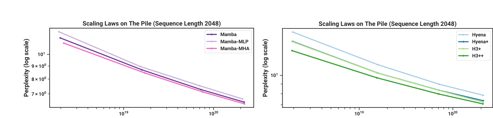

**Hình 9: Scaling law - ablation bổ sung.** **(Trái)** Xen Mamba block với MLP hoặc MHA. **(Phải)** Tách ảnh hưởng của improved training recipe, lựa chọn LTI kernel và head-dimension expansion trong họ H3/Hyena.

#### E.2.3 Downstream Evaluation Details

Quy trình pretraining giống scaling law nhưng được kéo dài tới `300B` token và dùng GPT-NeoX tokenizer thay GPT-2. Với mô hình 1.3B, batch size là 1M token để khớp đặc tả GPT-3. Chúng tôi báo cáo perplexity trên Pile validation set; với metric này chỉ so sánh mô hình dùng cùng dataset và tokenizer, đặc biệt là Pythia và RWKV.

Đánh giá downstream dùng LM Evaluation Harness của EleutherAI, như phần lớn công trình trong lĩnh vực. Các tác vụ common-sense reasoning gồm LAMBADA, HellaSwag, PIQA, ARC-challenge, ARC-easy và WinoGrande. Chúng tôi báo cáo accuracy cho LAMBADA, WinoGrande, PIQA và ARC-easy; với HellaSwag và ARC-challenge, báo cáo accuracy chuẩn hóa theo sequence length vì normalized accuracy cao hơn cho gần như mọi mô hình.

### E.3 DNA Modeling

#### E.3.1 Pretraining Details

Dataset HG38 theo split của Enformer. Training split có `S = 34,021` segment, mỗi segment dài `2¹⁷ = 131,072`, phủ bộ gene, tổng xấp xỉ `4.5B` token DNA. Mỗi segment được mô tả bởi cặp `(chromosome number, start index, end index)` và có thể mở rộng khi cần chuỗi dài hơn.

Khi training sequence length khác `2¹⁷`, cách dùng dữ liệu khác HyenaDNA. HyenaDNA luôn lấy một sub-segment cố định, chẳng hạn đầu hoặc giữa segment, nên mỗi epoch luôn có `34,021` sample và không nhất thiết đi qua toàn bộ genome. Chúng tôi dùng toàn bộ dữ liệu:

- Khi context length `L ≤ 2¹⁷`, mỗi segment được chia thành các sub-segment không chồng lấn dài `L`, tạo tổng `S × 2¹⁷/L` sample và `S × 2¹⁷ ≈ 4.5B` token mỗi epoch.
- Khi `L > 2¹⁷`, mỗi segment được biến thành hai sample: một sample bắt đầu bằng segment đã cho và một sample kết thúc bằng segment đó. Mỗi epoch có `2S` item và `2SL` token. Ở length `2¹⁸`, lượng token gấp 4 lần mặc định; ở `2²⁰`, gấp 16 lần.

Các chi tiết training còn lại theo language modeling: AdamW với `(β₁, β₂) = (0.9, 0.95)`, không dropout, weight decay `0.1`; cosine learning-rate schedule với linear warmup trong `10%` tổng step.

#### E.3.2 Scaling: Model Size Details

**Models.** Các mô hình gồm Transformer++ dùng RoPE, tốt hơn đáng kể positional encoding chuẩn trong thử nghiệm không chính thức; HyenaDNA, gần như Transformer với MHA được thay bằng H3 block dùng global convolution do MLP tham số hóa; và Mamba chuẩn.

**Model size.** Các kích thước được dùng:

<table border="1" cellpadding="4" style="border-collapse:collapse; width:100%;">
<tr><th>Blocks</th><td>4</td><td>5</td><td>6</td><td>7</td><td>8</td><td>10</td><td>12</td></tr>
<tr><th>Model dimension</th><td>64</td><td>96</td><td>128</td><td>192</td><td>256</td><td>384</td><td>512</td></tr>
<tr><th>Params xấp xỉ</th><td>250K</td><td>700K</td><td>1.4M</td><td>3.5M</td><td>7.0M</td><td>19.3M</td><td>40.7M</td></tr>
</table>

Số block của Mamba được nhân đôi vì một “layer” Transformer gồm cả MHA và MLP block, tương tự Hyena, nên cần hai Mamba block để khớp số tham số.

**Training.** Với mỗi mô hình, chúng tôi sweep learning rate trong `{1e-3, 2e-3, 4e-3, 8e-3}`. Transformer và HyenaDNA tốt nhất ở `2e-3` cho mọi kích thước. Mamba tốt nhất ở `8e-3`; Mamba vẫn tốt hơn baseline khi khớp learning rate `2e-3`, nhưng ổn định hơn và cải thiện thêm ở learning rate cao. Vì `8e-3` nằm ở biên trên của sweep, kết quả có thể vẫn chưa tối ưu.

Khác scaling law language model chuẩn, learning rate được giữ cố định theo model size để đơn giản. Về nguyên tắc, model lớn hơn nên dùng learning rate thấp hơn, nhưng ở kích thước nhỏ, tối đa vài triệu tham số, chúng tôi không thấy ảnh hưởng rõ.

#### E.3.3 Scaling: Context Length Details

Mỗi sequence length dùng tổng batch size `2²⁴ ≈ 16M` token cho mỗi training step; chẳng hạn, length `2²⁰` có 16 segment mỗi batch, còn length `2¹⁰` có 16,384 segment. Đây là batch lớn so với model size theo chuẩn language modeling, nhưng `2²³` đã là batch nhỏ nhất có thể trên máy 8 GPU với sequence length `2²⁰`; HyenaDNA dùng batch còn lớn hơn là `2²⁸`.

Learning rate là `0.008` cho Mamba và `0.001` cho HyenaDNA. Ban đầu, chúng tôi dùng `0.002` cho HyenaDNA như mục trước nhưng mô hình không ổn định ở context dài nhất.

**Sequence Length Warmup.** Theo HyenaDNA, chúng tôi dùng sequence length warmup (SLW) trong pretraining: 2 epoch ở mỗi sequence length lũy thừa hai, bắt đầu từ `2¹⁰ = 1024`. Do cách curate dữ liệu, các stage dài nhất xử lý nhiều step và token hơn: mỗi stage tới `2¹⁷` xử lý cùng số token; length `2¹⁸`, `2¹⁹`, `2²⁰` lần lượt xử lý nhiều hơn `4×`, `8×`, `16×`.

Khác HyenaDNA, số token mỗi gradient update luôn được kiểm soát, nên batch size giảm một nửa mỗi khi sequence length tăng gấp đôi.

> **Nhận xét.** Schedule này chưa được tune và chúng tôi chưa thử tắt SLW cho pretraining DNA. Sau đó, chúng tôi thấy SLW không cải thiện đáng kể pretraining audio ở độ dài tương tự, nên có thể nó cũng không cần thiết cho DNA.

#### E.3.4 Species (Great Apes) Classification

Mô hình causal nên classification head chỉ dùng phần tử cuối cùng theo chiều sequence length. Chúng tôi kiểm soát tổng số phần tử tham gia loss mỗi gradient step. Với pretraining, mọi vị trí đều tham gia loss, nên giữ `batch_size × sequence_length` không đổi; batch size giảm khi sequence length tăng. Với classification, chỉ vị trí cuối tham gia loss nên batch size được giữ cố định. Vì vậy, fine-tuning chuỗi dài tốn tính toán hơn.

Training gồm 10 epoch, mỗi epoch 1024 gradient step. Mỗi step dùng batch size 64; từng sample được lấy độc lập bằng cách chọn đều một loài, một chromosome, rồi một đoạn DNA liên tục.

Theo HyenaDNA, mô hình có context lớn hơn `2¹⁴ = 16,384` dùng sequence length warmup: 1 epoch ở `2¹⁴`, 1 epoch ở `2¹⁵`, 1 epoch ở `2¹⁶`, tiếp tục tới maximum length. Mô hình context `2²⁰` trải qua 6 epoch warmup rồi 4 epoch ở maximum length.

Learning rate của mọi Hyena model là `4e-5`, của mọi Mamba model là `1e-4`. Các giá trị này được chọn bằng sweep `{1e-5, 2e-5, 4e-5, 1e-4, 2e-4}` ở các length nhỏ `2¹⁰`, `2¹²`, `2¹⁴`, `2¹⁶`; một sweep rút gọn ở `2¹⁸` xác nhận lựa chọn, còn `2²⁰` chỉ chạy một lần vì chi phí tỷ lệ với sequence length. Learning rate dùng cosine decay, với 5 epoch linear warmup tới maximum và 5 epoch cosine decay xuống `1e-6`. Warmup dài được chọn vì sequence-length warmup cũng dài; lựa chọn này chưa được ablate.

<table border="1" cellpadding="3" style="border-collapse:collapse; width:100%; font-size:.82em;">
<caption style="caption-side:top; text-align:left;"><b>Bảng 13: Phân loại DNA great apes.</b> Accuracy sau fine-tuning trên chuỗi `2¹⁰` tới `2²⁰`, dùng mô hình pretrained có cùng context length. Đoán ngẫu nhiên là 20%.</caption>
<tr><th>Model</th><th>Params</th><th>2¹⁰</th><th>2¹²</th><th>2¹⁴</th><th>2¹⁶</th><th>2¹⁸</th><th>2²⁰</th></tr>
<tr><td>HyenaDNA</td><td>1.4M</td><td>28.04</td><td>28.43</td><td>41.17</td><td>42.22</td><td>31.10</td><td>54.87</td></tr>
<tr><td>Mamba</td><td>1.4M</td><td>31.47</td><td>27.50</td><td>27.66</td><td>40.72</td><td>42.41</td><td><b>71.67</b></td></tr>
<tr><td>Mamba</td><td>7M</td><td>30.00</td><td>29.01</td><td>31.48</td><td>43.73</td><td>56.60</td><td><b>81.31</b></td></tr>
</table>

### E.4 Audio Details

#### E.4.1 YouTubeMix Audio Pretraining

**Model.** Mỗi stage có 3 block, tổng `3 × 5 = 15` Mamba block, pooling factor `p = 16`, outer dimension `D = 64`, khoảng `3.5M` tham số.

**Dataset.** Dữ liệu được mu-law encode 8 bit, nên mô hình xử lý token rời rạc với vocabulary size `256`. Dataset gồm clip dài tối đa một phút, tức length `960,000`, được subsample và chia thành segment ở sequence length mong muốn. Kiến trúc có hai stage pooling hệ số 16; để sequence length sau pooling là bội số 8 nhằm tăng hiệu quả phần cứng, chuỗi dài nhất là `468 × 2048 = 958,464`. Các length còn lại được tạo bằng cách liên tiếp chia đôi rồi làm tròn lên bội số gần nhất của 2048.

Ngoài batch size khác nhau, số segment hợp lệ trong training set cũng thay đổi theo sequence length, nên số training step mỗi epoch không cố định; điều này có thể tạo các điểm gãy trên scaling curve.

<table border="1" cellpadding="4" style="border-collapse:collapse; width:100%;">
<caption style="caption-side:top; text-align:left;"><b>Bảng 14: Sequence length và batch size cho scaling YouTubeMix.</b></caption>
<tr><th>Sequence length</th><th>Batch size</th><th>Token / batch</th></tr>
<tr><td>468 × 2048 = 958,464</td><td>1</td><td>958,464</td></tr>
<tr><td>234 × 2048 = 479,232</td><td>2</td><td>958,464</td></tr>
<tr><td>117 × 2048 = 239,616</td><td>4</td><td>958,464</td></tr>
<tr><td>59 × 2048 = 120,832</td><td>8</td><td>966,656</td></tr>
<tr><td>30 × 2048 = 61,440</td><td>16</td><td>983,040</td></tr>
<tr><td>15 × 2048 = 30,720</td><td>32</td><td>983,040</td></tr>
<tr><td>8 × 2048 = 16,384</td><td>64</td><td>1,048,576</td></tr>
<tr><td>4 × 2048 = 8192</td><td>128</td><td>1,048,576</td></tr>
</table>

**Training.** Mô hình được train `200K` step với maximum learning rate `0.002`, `20K` step warmup, tức `10%`, và weight decay `0.1`, tương tự pretraining recipe chung ở các domain.

**Ablation bổ sung: tham số hóa SSM.** Chúng tôi khảo sát tham số hóa SSM trên pretraining waveform audio dài trong thiết lập Hình 7. Thiết lập được sửa nhẹ: mô hình lớn hơn, 8 layer và `D = 64` cho 6M tham số theo mặc định SaShiMi; chuỗi ngắn hơn, từ `2¹¹ = 2048` tới `2¹⁸ = 262,144`; learning rate thấp hơn, `0.001`; và training ngắn hơn, `100K` step.

Hình 10 cho thấy thay S4 bằng S6, tức thêm selection, không phải lúc nào cũng có lợi. Trên waveform audio dài, selection làm giảm hiệu năng đáng kể. Điều này hợp trực giác vì audio được lấy mẫu đều và rất trơn, nên phù hợp inductive bias continuous LTI. Khi bỏ selection, mô hình còn lại là S4 layer trong Mamba block; để phân biệt, chúng tôi gọi nó là **Mamba-S4**, còn kiến trúc Mamba mặc định là **Mamba-S6**.

Ở biểu đồ phải, outer layer của U-Net được giữ là Mamba-S4 và chỉ ablate inner layer. Khác biệt hiệu năng giảm mạnh, củng cố giả thuyết rằng layer gần waveform thô nên là LTI; sau khi tín hiệu được “tokenize” và nén bởi outer layer, inner layer không còn cần LTI. Tuy nhiên, ngay cả trong thiết lập này, SSM real-valued vẫn kém complex-valued.

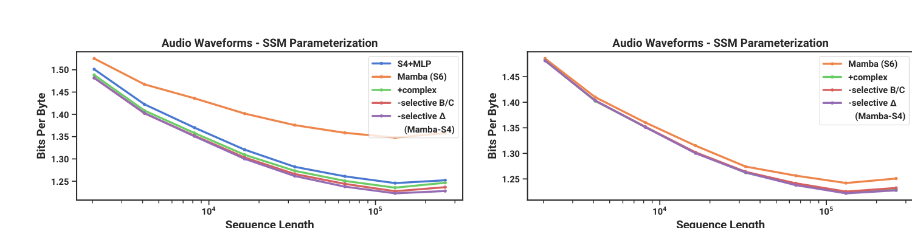

**Hình 10: Ablation pretraining audio YouTubeMix.** Waveform audio là tín hiệu “liên tục” được lấy mẫu đều nên hưởng lợi từ inductive bias của mô hình LTI. **(Trái)** Mô hình đồng nhất, mọi block cùng tham số hóa. **(Phải)** Chỉ ablate center U-Net block; outer block là Mamba-S4. Đường màu tím trùng với biểu đồ bên trái.

#### E.4.2 SC09 Speech Generation

Autoregressive training phần lớn theo giao thức language modeling:

- weight decay `0.1`;
- learning-rate warmup trong `10%` tổng step;
- AdamW với `β = (0.9, 0.95)`;
- gradient clipping `0.1`.

Learning rate là `0.002`; training `200,000` step với batch size `16`.

Mamba lớn trong Bảng 4 có 15 layer mỗi stage, outer dimension `D = 96`, pooling factor 4. Dataset nhỏ, training đi qua khoảng 100 epoch; mô hình lớn bị overfit rõ trên BPB hoặc NLL, nhưng metric tự động của sample được sinh vẫn tiếp tục cải thiện trong suốt training.

Các mô hình trong ablation kiến trúc ở Bảng 5 đều có 8 layer mỗi stage, outer dimension `D = 64`, pooling factor 4. S4+MLP block có xấp xỉ `2D² + 4D²` tham số, với expansion factor 2 trong MLP. Transformer block có `4D² + 2D²`, với expansion factor 1 trong MLP. Mamba block có xấp xỉ `6D²`. Mọi mô hình có khoảng 6M tham số.

### E.5 Efficiency Benchmark

**Scan operation.** Chúng tôi so sánh phép toán cốt lõi của selective SSM, parallel scan, với convolution và attention trên GPU A100 80GB PCIe. Các benchmark không gồm chi phí phép toán ngoài phần lõi, chẳng hạn tính convolution kernel trong global-convolution model hoặc QKV projection trong attention.

Baseline scan là parallel scan chuẩn viết bằng PyTorch, không kernel fusion, nên phải materialize `Ā`, `B̄`, `C` trong HBM. Triển khai của chúng tôi fuse discretization và parallel scan, tránh materialize các tham số lớn trong HBM.

Convolution dùng triển khai PyTorch chuẩn: FFT riêng đầu vào và filter, nhân trong miền tần số, rồi inverse FFT; độ phức tạp lý thuyết `O(L log L)`. Attention dùng FlashAttention-2 với causal mask, triển khai nhanh nhất mà chúng tôi biết. FlashAttention-2 có causal mask nhanh hơn khoảng `1.7×` so với không mask vì chỉ tính gần một nửa số phần tử attention.

Batch size là 1; sequence length tăng từ `2⁹ = 512`, `2¹⁰ ≈ 1K`, `2¹¹ ≈ 2K` tới `2¹⁹ ≈ 500K`, dù một số baseline hết bộ nhớ sớm hơn. Model dimension `D = 1024`, state dimension `N = 16`. Đầu vào dùng BF16, kiểu dữ liệu phổ biến trong large-scale training.

**End-to-end inference.** Chúng tôi đo throughput inference của Mamba-1.4B và Mamba-6.9B chưa train, so với Transformer chuẩn theo kiến trúc GPT-3 ở kích thước 1.3B và 6.7B. Transformer dùng triển khai chuẩn trong thư viện Hugging Face `transformers`.

Prompt length là 2048, generation length là 128. Batch size thay đổi trong `{1, 2, 4, 8, 16, 32, 64, 128}`; thời gian sinh 128 token được đo rồi tính throughput bằng `batch_size × 128 / time`. Mỗi phép đo lặp 3 lần và lấy trung bình trên A100 80GB PCIe.

**Memory benchmark.** Bộ nhớ tăng tỷ lệ với kích thước activation tensor như phần lớn deep sequence model. Chúng tôi đo yêu cầu memory training của mô hình 125M trên một A100 80GB; mỗi batch gồm chuỗi dài 2048. Baseline là Transformer tiết kiệm bộ nhớ nhất mà chúng tôi biết, dùng kernel fusion từ `torch.compile` và FlashAttention-2.

Bảng 15 cho thấy yêu cầu bộ nhớ của Mamba tương đương Transformer cùng cỡ với triển khai cực kỳ tối ưu. Chúng tôi kỳ vọng memory footprint của Mamba còn có thể được cải thiện.

<table border="1" cellpadding="4" style="border-collapse:collapse; width:100%;">
<caption style="caption-side:top; text-align:left;"><b>Bảng 15: Benchmark bộ nhớ.</b> Memory footprint của Mamba tương đương Transformer tối ưu nhất. Kết quả cho mô hình 125M.</caption>
<tr><th>Batch size</th><th>Transformer + FlashAttention-2</th><th>Mamba</th></tr>
<tr><td>1</td><td>4.6GB</td><td>4.8GB</td></tr>
<tr><td>2</td><td>5.2GB</td><td>5.8GB</td></tr>
<tr><td>4</td><td>6.9GB</td><td>7.3GB</td></tr>
<tr><td>8</td><td>11.5GB</td><td>12.3GB</td></tr>
<tr><td>16</td><td>20.7GB</td><td>23.1GB</td></tr>
<tr><td>32</td><td>34.5GB</td><td>38.2GB</td></tr>
</table>

## Ghi chú thuật ngữ

- **Foundation model** : mô hình nền tảng, thường được pretrain trên dữ liệu lớn rồi fine-tune/adapt cho downstream task.
- **Sequence model** : mô hình xử lý dữ liệu dạng chuỗi.
- **Attention** : cơ chế tính trọng số tương tác giữa các token để định tuyến và tổng hợp thông tin theo nội dung.
- **Recurrence** : phép tính hồi quy, cập nhật state hiện tại từ state trước và input hiện tại.
- **Convolution / global convolution** : phép tích chập; global convolution có kernel bao phủ toàn chuỗi.
- **State space model - SSM** : mô hình không gian trạng thái, dùng state ẩn để biểu diễn lịch sử.
- **Structured SSM** : SSM có cấu trúc đặc biệt trên ma trận tham số để tính hiệu quả.
- **Selective SSM** : SSM có tham số phụ thuộc input, cho phép chọn lọc thông tin theo nội dung.
- **Linear time invariance - LTI** : tính bất biến theo thời gian; tham số không đổi tại mọi timestep.
- **Discretization** : rời rạc hóa hệ liên tục để tính trên các timestep rời rạc.
- **Zero-order hold - ZOH** : quy tắc rời rạc hóa giả sử input giữ không đổi trong mỗi khoảng lấy mẫu.
- **HiPPO** : họ ma trận/khởi tạo giúp hệ state space nén lịch sử tín hiệu theo các đa thức trực giao.
- **Scan** : phép tính prefix áp dụng tuần tự hoặc song song trên chuỗi phần tử.
- **Associative scan** : scan dùng toán tử kết hợp, cho phép tổ chức phép tính theo cây để chạy song song.
- **Selective scan** : thuật toán scan song song để tính recurrence của selective SSM.
- **Hardware-aware algorithm** : thuật toán được thiết kế theo đặc tính bộ nhớ và tính toán của phần cứng.
- **Kernel fusion** : hợp nhất nhiều phép toán vào một GPU kernel để giảm đọc/ghi bộ nhớ trung gian.
- **Recomputation** : tính lại activation/state trong backward thay vì lưu từ forward để giảm bộ nhớ.
- **Memory I/O** : lượng dữ liệu đọc và ghi giữa các tầng bộ nhớ.
- **HBM - High Bandwidth Memory** : bộ nhớ chính của GPU, dung lượng lớn nhưng độ trễ cao hơn SRAM on-chip.
- **SRAM - Static Random-Access Memory** : bộ nhớ on-chip nhanh, dung lượng nhỏ, gần đơn vị tính toán.
- **State expansion** : mở rộng mỗi channel thành state nhiều chiều `N`; tăng khả năng biểu diễn nhưng tạo tensor trung gian lớn.
- **Content-based reasoning** : suy luận dựa trên nội dung token, không chỉ dựa vào vị trí.
- **Gating** : cơ chế nhân một nhánh tín hiệu với gate để điều khiển lượng thông tin truyền qua.
- **Induction head** : cơ chế nhận diện mẫu token từng xuất hiện và dự đoán phần tiếp theo bằng cách truy hồi mẫu đó.
- **Autoregressive modeling** : mô hình hóa phần tử tiếp theo dựa trên các phần tử trước đó.
- **KV cache** : bộ nhớ lưu key và value của các token trước trong Transformer khi autoregressive inference.
- **Perplexity** : metric language model; thấp hơn thường biểu thị dự đoán token tốt hơn.
- **Throughput** : lượng token hoặc mẫu xử lý trong một đơn vị thời gian.
- **Modality** : dạng dữ liệu như text, audio, image, video hoặc DNA.
- **Ablation** : thí nghiệm thay đổi từng thành phần để đo đóng góp của thành phần đó.
- **Zero-shot evaluation** : đánh giá mà không fine-tune trên dữ liệu huấn luyện riêng của tác vụ.
- **Scaling law** : quan hệ thực nghiệm giữa loss/hiệu năng với model size, dữ liệu và lượng tính toán.

## Ghi chú của người dịch: Ý nghĩa với Action Recognition trên Edge Device

- Mamba phù hợp với edge device vì inference có thể dùng state cố định, giảm nhu cầu bộ nhớ so với KV cache của Transformer.
- Với dữ liệu video/action recognition, chuỗi frame dài có thể gây chi phí lớn nếu dùng attention đầy đủ.
- Selective SSM có tiềm năng chọn lọc frame/đặc trưng quan trọng theo thời gian, thay vì xử lý mọi frame với attention bậc hai.
- Tuy nhiên, cần kiểm chứng thực nghiệm vì Mamba nén lịch sử vào state, có thể mất chi tiết không gian-thời gian nếu thiết kế feature extractor hoặc temporal module chưa phù hợp.
