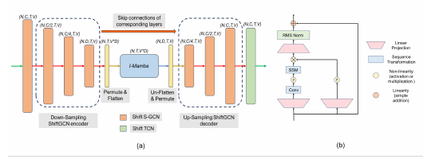

# Simba: Mamba-Augmented U-ShiftGCN cho Skeleton Action Recognition trong video

**Tên gốc:** *Simba: Mamba augmented U-ShiftGCN for Skeletal Action Recognition in Videos*  
**Tác giả:** Soumyabrata Chaudhuri, Saumik Bhattacharya  
**Cơ quan:** IIT Bhubaneswar; IIT Kharagpur  
**Công bố:** arXiv:2404.07645v1 [cs.CV], ngày 11 tháng 4 năm 2024  
**PDF:** `2404.07645v1.pdf`

> **Quy ước thuật ngữ:** Giữ nguyên keyword AI/CV gồm *skeleton*, *joint*, *bone*, *pose*, *spatial*, *temporal*, *graph*, *stream*, *encoder*, *decoder*, *down-sampling*, *up-sampling*, *embedding*, *State Space Model* (SSM), *selective scan*, *modality*, *partition gating*, *benchmark* và *state-of-the-art* (SOTA).

## Abstract

Skeleton Action Recognition (SAR) nhận dạng hành động từ skeleton joint coordinate và liên kết giữa các joint. Plain Transformer đã được thử nghiệm nhưng vẫn kém các phương pháp GCN dẫn đầu vì thiếu structural prior. Mamba, một selective State Space Model, là lựa chọn thay thế attention có khả năng mô hình hóa long sequence hiệu quả.

Bài báo đề xuất framework SAR đầu tiên tích hợp Mamba. Mỗi block cơ sở dùng kiến trúc U-ShiftGCN với Mamba ở lõi. Encoder dùng down-sampling Shift S-GCN để extract spatial feature. Intermediate Mamba Block tiếp tục temporal modeling trước khi feature đi qua up-sampling Shift S-GCN decoder. Shift T-GCN (ShiftTCN) được đặt ở cuối mỗi module để refine temporal representation. Mô hình hoàn chỉnh được gọi là **Simba**.

Simba đạt SOTA trên NTU RGB+D, NTU RGB+D 120 và Northwestern-UCLA. U-ShiftGCN, tức Simba không có Intermediate Mamba Block, cũng vượt baseline.

## 1. Introduction

Skeleton-based Action Recognition được quan tâm nhờ computational efficiency, khả năng chống thay đổi môi trường và camera viewpoint. Body keypoint có thể lấy từ Kinect [52] hoặc pose estimation algorithm [1], khiến pose trở thành modality đáng tin cậy so với RGB, optical flow hoặc depth.

GCN [15] phù hợp với non-Euclidean data. Yan et al. [45] biểu diễn joint và liên kết giữa chúng thành node và edge của graph, sau đó dùng GCN để học joint interaction. Các hướng tiếp theo khai thác joint, bone, joint velocity, bone velocity [2, 3, 36], multi-view graph như MV-IGNet [40], hoặc graph Transformer như ST-TR [25] và DSTA [30].

Mamba [9] đã cho thấy khả năng mô hình hóa long temporal sequence trong language và genomics. Bài báo đặt hai câu hỏi: Mamba có thể học graph relationship hay không; Mamba có thể mô hình hóa hiệu quả temporal sequence của graph snapshot trong video hay không.

Simba trả lời bằng U-ShiftGCN encoder-decoder. Down-sampling Shift S-GCN extract spatial feature; Intermediate Mamba học temporal relationship; up-sampling Shift S-GCN khôi phục channel space; ShiftTCN thực hiện temporal aggregation cuối. U-ShiftGCN tự thân cũng là một kiến trúc mới và vượt baseline.

Đóng góp chính:

1. Framework SAR đầu tiên dùng Mamba cho temporal sequence modeling trên graph data.
2. Simba đạt SOTA trên ba benchmark phổ biến.
3. U-ShiftGCN, phiên bản bỏ Mamba, vẫn vượt baseline.

## 2. Related Works

### 2.1. Skeleton-based Action Recognition

RNN [6, 34] và CNN [14, 22] từng được dùng cho SAR nhưng thường bỏ qua spatial interaction giữa joint. GCN trở thành hướng chính vì graph modeling biểu diễn tốt spatial configuration.

**GCN-based approach.** ShiftGCN [2] thay regular graph convolution nặng bằng shift graph operation và lightweight point-wise convolution, tạo flexible receptive field cho spatial và temporal graph. ShiftGCN++ [3] tiếp tục giảm computation, phù hợp low-power device.

**Transformer-based approach.** ST-TR [25] dùng dual stream với spatial self-attention và temporal self-attention để học intra-frame và inter-frame correlation. DSTA-Net [30] luân phiên modeling spatial và temporal dimension. Tuy nhiên các phương pháp này chưa ngang GCN SOTA vì conventional Transformer thiếu prior phù hợp với skeleton structure.

### 2.2. Long Sequence Modeling

Self-attention có dense information routing trong context window nhưng bị giới hạn bởi finite window và quadratic complexity theo sequence length. Structured State Space Sequence Model [10, 11] kết hợp đặc tính của RNN, CNN và classical state-space model; computation scale tuyến tính hoặc gần tuyến tính theo sequence length.

H3 [8] dùng S4 giữa hai gated connection và thêm local convolution gọi là shift-SSM. Hyena [26] thay S4 bằng global convolution được parameterize bởi MLP [27]. Mamba [9] đưa ra Selective Structured State Space Sequence Model (S6), một lựa chọn cạnh tranh với Transformer. Điều này thúc đẩy việc đưa Mamba vào SAR, nơi temporal modeling giữ vai trò lớn.

## 3. Methodology



> **Hình 1:** (a) Simba module gồm Down-sampling Shift S-GCN Encoder, Intermediate Mamba Block, Up-sampling Shift S-GCN Decoder và ShiftTCN. (b) I-Mamba Block dùng SSM, RMSNorm, Linear projection, SiLU gate và residual connection.

### 3.1. Down-sampling ShiftGCN Encoder

Encoder gồm ba Shift S-GCN block. Một Shift S-GCN đầu tiên tăng channel dimension; sau đó hai block đầu trong encoder down-sample channel theo hệ số 2. Mục tiêu là extract spatial detail nhưng giảm node-embedding dimension trước khi đưa vào Mamba, tạo trade-off giữa accuracy và computation.

$$x_2^l=\operatorname{ShiftSGCN}(x^l).\tag{1}$$

$$x_3^l=\operatorname{ShiftSGCN}(x_2^l).\tag{2}$$

$$x_4^l=\operatorname{ShiftSGCN}(x_3^l).\tag{3}$$

Tại đây $x_4^l\in\mathbb{R}^{N\times D\times T\times V}$, với $N$ là batch size, $D$ là channel dimension, $T$ là temporal dimension và $V$ là số graph vertex. Tensor được permute và flatten thành $\mathbb{R}^{N\times T\times(V D)}$ để mỗi graph snapshot trở thành một vector embedding đưa vào I-Mamba.

### 3.2. Intermediate Mamba Block

#### SSM Fundamentals

S4 và Mamba ánh xạ input sequence $x(t)\in\mathbb{R}$ sang $y(t)\in\mathbb{R}$ thông qua hidden state $h(t)\in\mathbb{R}^{W}$:

$$h'(t)=Ah(t)+Bx(t),\qquad y(t)=Ch(t).\tag{4}$$

$A$ điều khiển hidden-state evolution; $B$ và $C$ là projection parameter. Zero-order hold (ZOH) discretize hệ liên tục:

$$\bar A=\exp(\Delta A),\qquad \bar B=(\Delta A)^{-1}(\exp(\Delta A)-I)\Delta B.\tag{5}$$

$$h_t=\bar A h_{t-1}+\bar Bx_t,\qquad y_t=Ch_t.\tag{6}$$

$$\bar K=(C\bar B,C\bar A\bar B,\ldots,C\bar A^{M-1}\bar B).\tag{7}$$

$M$ là sequence length và $\bar K$ là structured convolution kernel. Khác linear time-invariant SSM, Mamba dùng selective scan S6: $B$, $C$, $\Delta$ được suy ra từ input $x$, khiến weight thay đổi theo context và time step.

#### Block Equations

I-Mamba nhận $x_4^l\in\mathbb{R}^{N\times T\times D^p}$, với $D^p=V D$, và giữ nguyên shape:

$$B=f_B(x),\qquad C=f_C(x),\qquad \Delta=\tau_\Delta(P+s_\Delta(x)).\tag{8}$$

$$y=\sigma(\operatorname{Conv1d}(\operatorname{Linear}(x_4^l))),\qquad z=\sigma(\operatorname{Linear}(x_4^l)).\tag{9}$$

$$x^m=\operatorname{RMSNorm}(\operatorname{Linear}(\operatorname{SSM}(A,B,C,y)\odot z))+x_4^l.\tag{10}$$

$\sigma$ là SiLU, $P$ là parameter của $\Delta$, $A\in\mathbb{R}^{D^p\times W}$. Tác giả chọn $f_B=\operatorname{Linear}^{W}$, $f_C=\operatorname{Linear}^{W}$, $s_\Delta=\operatorname{Broadcast}^{D^p}(\operatorname{Linear}^{1})$ và $\tau_\Delta=\operatorname{softplus}$. Output được unflatten và permute về $\mathbb{R}^{N\times D\times T\times V}$.

### 3.3. Up-sampling ShiftGCN Decoder

Decoder gồm ba Shift S-GCN block. Channel dimension được tăng dần theo hệ số 2; block đầu chuyển $D$ về $C$. Mục tiêu là giảm information loss trong encoder và tạo output tương thích với Simba module kế tiếp.

$$x_5^l=\operatorname{ShiftSGCN}(x^n)+x_3^l.\tag{11}$$

$$x_6^l=\operatorname{ShiftSGCN}(x_5^l)+x_2^l.\tag{12}$$

$$x_7^l=\operatorname{ShiftSGCN}(x_6^l)+x^l.\tag{13}$$

Skip connection theo U-Net [28] bảo toàn feature ban đầu và hỗ trợ gradient flow. Output decoder tiếp tục qua Shift T-GCN, hay ShiftTCN, để refine temporal representation.

### 3.4. Overall Model Architecture

Với input $x(l)$ của Simba layer thứ $l$:

$$x^l=\operatorname{ShiftSGCN}(x(l)).\tag{14}$$

$$x_4^l=\operatorname{ShiftGCN}_{down}(x^l).\tag{15}$$

$$x_4^l=\operatorname{Flatten}(\operatorname{Permute}(x_4^l)).\tag{16}$$

$$x^m=\operatorname{IMamba}(x_4^l).\tag{17}$$

$$x^n=\operatorname{Permute}(\operatorname{UnFlatten}(x^m)).\tag{18}$$

$$x_7^l=\operatorname{ShiftGCN}_{up}(x^n).\tag{19}$$

$$x(l+1)=\rho(\operatorname{ShiftTCN}(x_7^l)+\operatorname{Residual}(x(l))).\tag{20}$$

$\rho$ là ReLU. Residual là unit TCN gồm Conv2D và BatchNorm2D. Output Simba module cuối đi qua Fully Connected layer; training dùng Cross Entropy loss.

**Intuition.** Linear layer down/up-sample channel quá đột ngột và làm giảm performance. U-shaped encoder-decoder tạo gradual shrinkage và smooth enlargement của channel space. ShiftGCN backbone giữ spatial information; skip connection cân bằng information loss với module complexity.

## 4. Experiments & Results

### 4.1. Datasets

**NTU RGB+D 60 [29].** Gồm 56.880 skeleton action sequence do một hoặc hai người thực hiện, ghi đồng thời bằng ba Kinect-V2. X-Sub chia subject thành hai nhóm train/test, mỗi nhóm 20 người. X-View dùng 37.920 sample từ camera 2 và 3 để train; 18.960 sample từ camera 1 để test.

**NTU RGB+D 120 [21].** Bổ sung 57.367 sequence và 60 action class, tổng cộng 120 class. Dataset có 3D joint annotation trong 32 setup, đánh giá bằng X-Sub và X-Setup.

**Northwestern-UCLA [39].** Gồm 1.494 video sequence, 10 action category, ghi bởi ba Kinect từ nhiều viewpoint.

### 4.2. Implementation Details

NTU RGB+D 60/120 dùng 90 epoch, learning rate 0,025, decay 0,1 tại epoch 75 và 85, train/test batch size 64/512, window size 64. NW-UCLA dùng 400 epoch, train/test batch size 16/64, window size 52. Weight decay là 0,0001 cho NTU và 0,0004 cho NW-UCLA.

Mamba `d_model=500`. Channel dimension cạnh Mamba được đặt 20 cho NTU và 25 cho NW-UCLA, phù hợp với số skeleton node tương ứng 25 và 20. Model depth $l=10$.

### 4.3. State-of-the-art Comparison

Mô hình dùng four-stream fusion: **joint**, **bone**, **joint motion**, **bone motion**. Joint chứa raw skeleton coordinate; bone chứa spatial coordinate difference; joint motion và bone motion chứa temporal difference. Softmax score của các stream được cộng để tạo fused score.

**Bảng 1. NW-UCLA.**

| Method | Year | Top-1 (%) |
|---|---:|---:|
| Lie Group [38] | 2015 | 74.2 |
| HBRNN-L [7] | 2015 | 78.5 |
| Ensemble TS-LSTM [16] | 2017 | 89.2 |
| 2s AGC-LSTM [32] | 2019 | 93.3 |
| VA-CNN (aug.) [50] | 2019 | 90.7 |
| 1s Shift-GCN [2] | 2020 | 89.85 |
| 4s Shift-GCN [2] | 2020 | 94.6 |
| DC-GCN + ADG [30] | 2020 | 95.3 |
| 1s Shift-GCN++ [3] | 2021 | 93.8 |
| 4s Shift-GCN++ [3] | 2021 | 95.0 |
| Ta-CNN [44] | 2022 | 96.1 |
| GAP (joint) [43] | 2023 | 94.0 |
| U-ShiftGCN (joint) | Ours | 91.81 |
| Simba (joint) | Ours | 94.18 |
| **Simba (4-ensemble)** | **Ours** | **96.34** |

**Bảng 2. NTU RGB+D 60, joint modality.**

| Method | Year | X-Sub (%) | X-View (%) |
|---|---:|---:|---:|
| VA-LSTM [49] | 2017 | 79.4 | 87.6 |
| ST-GCN [46] | 2018 | 81.5 | 88.3 |
| SR-TSL [33] | 2018 | 84.8 | 92.4 |
| Motif + VTDB [42] | 2019 | 84.2 | 90.2 |
| 2s AS-GCN [18] | 2019 | 86.8 | 94.2 |
| 1s-AGCN [19] | 2019 | 86.0 | 93.7 |
| 1s Shift-GCN [2] | 2020 | 87.8 | 93.0 |
| TS-SAN [4] | 2020 | 87.2 | 92.7 |
| MS-TGN [20] | 2020 | 86.6 | 94.1 |
| MS TE-GCN [17] | 2020 | 87.4 | 93.4 |
| NAS-GCN (joint) [24] | 2020 | 87.5 | 94.7 |
| 1s Shift-GCN++ [3] | 2021 | 87.9 | 94.8 |
| 1s IIP-Transformer [41] | 2023 | 88.9 | 94.2 |
| SNAS-GCN (joint) [12] | 2023 | 87.1 | 94.3 |
| AutoGCN [37] | 2024 | 88.3 | 95.5 |
| **Simba (joint)** | **Ours** | **89.03** | **94.38** |

**Bảng 3. NTU RGB+D 120, joint modality.**

| Method | Year | X-Sub (%) | X-Set (%) |
|---|---:|---:|---:|
| ST-GCN [46] | 2018 | 70.7 | 73.2 |
| AS-GCN [18] | 2019 | 77.9 | 78.5 |
| 2s-AGCN [19] | 2019 | 82.5 | 84.2 |
| 1s Shift-GCN [2] | 2020 | 80.9 | 83.2 |
| SGN [51] | 2020 | 79.2 | 81.5 |
| MS-G3D (joint) [23] | 2020 | 82.3 | 84.1 |
| ST-TR [25] | 2021 | 82.7 | 84.7 |
| AutoGCN [37] | 2024 | 83.3 | 84.1 |
| **Simba (joint)** | **Ours** | **79.75** | **86.28** |

Simba đạt SOTA trên NW-UCLA dù dataset ít training sample. Trên NTU RGB+D 60, joint-only Simba dẫn đầu X-Sub nhưng thấp hơn một số phương pháp ở X-View; 2-stream result trong Appendix cho kết quả cạnh tranh hơn. Trên NTU RGB+D 120, Simba đạt SOTA ở X-Set với 86,28%, nhưng X-Sub 79,75% không phải SOTA.

### 4.4. Ablation Study

**Effect of I-Mamba.** Bỏ I-Mamba tạo U-ShiftGCN. Trên NW-UCLA, Simba joint đạt 94,18%, cao hơn U-ShiftGCN 2,37 điểm phần trăm và cao hơn 1s Shift-GCN baseline 4,33 điểm.

| Model | Accuracy (%) |
|---|---:|
| 1s Shift-GCN | 89.85 |
| U-ShiftGCN (joint) | 91.81 |
| **Simba (joint)** | **94.18** |

**Optimal number of layers.** Trong tập $\{6,10,12\}$, depth 10 cho accuracy cao nhất.

| Number of layers | Accuracy (%) |
|---:|---:|
| 6 | 86.75 |
| **10** | **91.81** |
| 12 | 88.16 |

## 5. Conclusion

Simba đưa Mamba vào SAR và temporal graph data bằng encoder-decoder có Shift-GCN backbone. Mamba tăng temporal modeling trong khi ShiftGCN bảo toàn spatial information và structural prior. Kiến trúc giảm rồi tăng channel dimension theo từng bước, thay vì dùng Linear layer thay đổi đột ngột; skip connection hạn chế information loss.

Simba đạt kết quả mạnh trên NTU RGB+D, NTU RGB+D 120 và Northwestern-UCLA. U-ShiftGCN vẫn vượt baseline khi bỏ I-Mamba, nhưng ablation cho thấy I-Mamba đóng góp rõ rệt. Framework mở ra khả năng kết hợp Mamba với các encoder-decoder architecture khác cho SAR.

## Appendix A. Partition Gating Mechanism

Với NTU RGB+D 60/120, tác giả thêm partition gating để kết hợp joint-level và partition-level information. $W\in\mathbb{R}^{1\times C\times1\times1}$ là learnable gate; $K$ là số partition; $V$ là số graph vertex; `label` là one-hot joint-to-partition membership matrix.

$$\operatorname{label}_{ij}=\begin{cases}1,&\operatorname{joint}(i)\in\operatorname{partition}(j)\\0,&\text{otherwise}\end{cases}.\tag{21}$$

$$z=x(l)\left(\frac{\operatorname{label}}{\sum_{i=1}^{V}\operatorname{label}_i}\right),\quad z\in\mathbb{R}^{N\times C\times T\times K}.\tag{22}$$

$$e=\Pi(\operatorname{proj}(z)),\quad e\in\mathbb{R}^{N\times C'\times T\times V}.\tag{23}$$

$$x_p^l=W\odot x(l)+(1-W)\odot e.\tag{24}$$

$x_p^l$ được đưa vào $\operatorname{ShiftGCN}_{down}$ thay cho $x^l$. Cơ chế giúp model học đồng thời feature mức joint và mức group/partition.

## Appendix B. Extended NTU RGB+D 60 Results

| Method | Year | X-Sub J | X-Sub B | X-Sub J+B | X-View J | X-View B | X-View J+B |
|---|---:|---:|---:|---:|---:|---:|---:|
| VA-LSTM [49] | 2017 | 79.40 | - | - | 87.60 | - | - |
| ST-GCN [46] | 2018 | 81.50 | - | - | 88.30 | - | - |
| SR-TSL [33] | 2018 | 84.80 | - | - | 92.40 | - | - |
| Motif+VTDB [42] | 2019 | 84.20 | - | - | 90.20 | - | - |
| 2s-AGCN [19] | 2019 | - | - | 88.50 | 93.70 | 93.20 | 95.10 |
| TS-SAN [4] | 2020 | 87.20 | - | - | 92.70 | - | - |
| MS-TGN [20] | 2020 | 86.60 | 87.50 | 89.50 | 94.10 | 93.90 | 95.90 |
| 3s RA-GCN [35] | 2020 | - | - | 87.30 | - | - | 93.60 |
| 2s Shift-GCN [2] | 2020 | - | - | 88.50 | - | - | 94.10 |
| NAS-GCN [24] | 2020 | 87.50 | - | 89.40 | 94.70 | - | 95.70 |
| UNIK [47] | 2021 | - | - | 86.80 | - | - | 94.40 |
| AdaSGN [31] | 2021 | - | - | 89.10 | - | - | 94.70 |
| SNAS-GCN [20] | 2023 | 87.10 | - | 89.00 | 94.30 | - | 95.00 |
| AutoGCN [37] | 2024 | 88.30 | - | - | 95.50 | - | - |
| **Simba** | **Ours** | **89.03** | **88.48** | **90.54** | **94.38** | **93.41** | **95.21** |

## Appendix C. Extended Training Recipe

| Configuration | NW-UCLA | NTU RGB+D 60/120 |
|---|---:|---:|
| Training batch size | 16 | 64 |
| Test batch size | 64 | 512 |
| Weight decay | 0.0004 | 0.0001 |
| Window size | 52 | 64 |
| Epochs | 400 | 90 |
| LR decay step | [110] | [75, 85] |
| Repeat augmentation | True | False |
| Optimizer | SGD | SGD |
| Base LR | 0.025 | 0.025 |
| LR decay rate | 0.1 | 0.1 |
| Warm-up epochs | 5 | 5 |
| Channel dimension | 216 | 216 |
| Mamba hidden dimension | 500 | 500 |

## Appendix D. Pseudo-code

```text
Input:  x(l) (N, Ci, T, V)
Output: x(l+1) (N, C, T, V)

x_l  = ShiftSGCN(x(l))
x_l4 = ShiftGCN_down(x_l)
x_l4 = Flatten(Permute(x_l4))
x_m  = IMamba(x_l4)
x_n  = Permute(UnFlatten(x_m))
x_l7 = ShiftGCN_up(x_n)
x(l+1) = ReLU(ShiftTCN(x_l7) + Residual(x(l)))
return x(l+1)
```

## Tài liệu tham khảo

Danh mục 52 tài liệu tham khảo giữ nguyên trong `2404.07645v1.pdf`; citation trong bản dịch dùng cùng numbering.

## Ghi chú thuật ngữ

| Keyword | Ý nghĩa trong bài |
|---|---|
| SAR | Skeleton Action Recognition |
| Graph snapshot | Skeleton graph tại một frame |
| U-ShiftGCN | Encoder-decoder ShiftGCN không có I-Mamba |
| I-Mamba | Intermediate Mamba Block ở latent stage |
| Joint motion | Temporal difference của joint coordinate |
| Bone motion | Temporal difference của bone feature |
| Partition gating | Learnable fusion giữa joint-level và partition-level feature |
