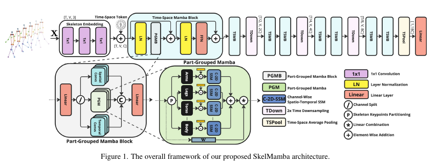
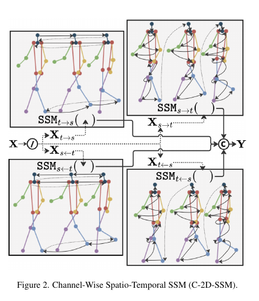

# SkelMamba: State Space Model hiệu quả cho Skeleton-based Action Recognition trong chẩn đoán rối loạn thần kinh

**Tên bài báo gốc:** *SkelMamba: A State Space Model for Efficient Skeleton Action Recognition of Neurological Disorders*  
**Tác giả:** Niki Martinel, Mariano Serrao, Christian Micheloni  
**Cơ quan:** University of Udine; Sapienza Università di Roma  
**Công bố:** arXiv:2411.19544v1 [cs.CV], ngày 29 tháng 11 năm 2024  
**PDF gốc:** `2411.19544v1.pdf`

> **Quy ước thuật ngữ:** Bản dịch giữ nguyên các keyword thường dùng trong paper AI/CV: *skeleton*, *joint*, *bone*, *spatial*, *temporal*, *spatio-temporal*, *stream*, *State Space Model* (SSM), *scanning*, *channel partitioning*, *body-part partitioning*, *gait*, *attention*, *modality*, *embedding*, *benchmark* và *state-of-the-art* (SOTA). Cụm *anatomically guided/aware* không chỉ một module phân tích anatomy; trong bài này nó chỉ cách tổ chức mô hình theo các *body part* có ý nghĩa như arms, legs, torso và các tổ hợp của chúng. Vì vậy bản dịch dùng **định hướng theo body part** hoặc **body-part-aware**. Tên mô hình, tập dữ liệu, metric, ký hiệu toán học và citation được giữ nguyên.

## Tóm tắt (Abstract)

Chúng tôi giới thiệu một framework mới dựa trên *State Space Model* (SSM) cho *Skeleton-based Human Action Recognition*. Kiến trúc được định hướng theo các *body part* như arms, legs và torso, qua đó cải thiện hiệu năng SOTA trên cả tác vụ chẩn đoán lâm sàng và nhận dạng hành động tổng quát. Phương pháp phân rã quá trình phân tích *skeleton motion* thành ba *stream*: *spatial*, *temporal* và *spatio-temporal*; đồng thời dùng *channel partitioning* để xử lý hiệu quả các đặc trưng chuyển động khác nhau. Với chiến lược *multi-directional scanning* có cấu trúc trong SSM, mô hình thu nhận cả *local joint interactions* lẫn *global motion patterns* trên nhiều body part. Phép phân rã *body-part-aware* này tăng khả năng phát hiện các motion pattern tinh tế có ý nghĩa trong chẩn đoán y khoa, chẳng hạn *gait anomaly* liên quan đến bệnh lý thần kinh.

Trên các public benchmark gồm NTU RGB+D, NTU RGB+D 120 và NW-UCLA, mô hình vượt các phương pháp SOTA hiện tại, cải thiện accuracy tới 3,2% với computational complexity thấp hơn những mô hình Transformer dẫn đầu trước đó. Chúng tôi cũng giới thiệu một medical dataset mới để phân tích rối loạn thần kinh của bệnh nhân từ motion, qua đó kiểm chứng tiềm năng của phương pháp trong automated diagnosis.

## 1. Giới thiệu (Introduction)

Human Action Recognition là tác vụ phân loại hành động từ chuyển động của con người. Bài toán thường khai thác đặc trưng ngữ cảnh phong phú trong video RGB, nhưng phải đánh đổi bằng nguy cơ làm lộ danh tính. *Skeleton-based Action Recognition* là lựa chọn bảo vệ quyền riêng tư cho các ứng dụng nhạy cảm, từ theo dõi bệnh nhân và vật lý trị liệu đến môi trường hỗ trợ sinh hoạt.

Biểu diễn 3D joint của skeleton nhỏ gọn và ít bị ảnh hưởng bởi background clutter hoặc thay đổi ánh sáng, nhưng tính thưa của dữ liệu khiến bài toán khó hơn. Trong y khoa, việc mô hình hóa chính xác *dynamic spatio-temporal relationships* giữa các joint đặc biệt quan trọng để phân tích những chuyển động nhỏ biểu thị bệnh lý. Ví dụ, phân tích *gait* của bệnh nhân có thể cung cấp thông tin về rối loạn thần kinh, bất thường hệ cơ xương và các tình trạng sức khỏe khác.

Các skeleton joint và liên kết giữa chúng, tức bone, tương ứng với vertex và edge của một graph. Những phương pháp Skeleton-based Action Recognition gần đây mô hình hóa spatial dependency và temporal dependency giữa các joint bằng Graph Convolutional Network (GCN) hoặc kiến trúc kiểu Transformer. Phương pháp GCN đưa vào adaptive graph structure [9, 48, 49], joint encoding chuyên biệt [4, 32] và nhiều modality [34] để học robust representation [24, 32, 74]. Phương pháp Transformer xử lý long-range dependency trong skeleton data mà GCN thường gặp khó khăn. Các phương pháp hiện có dùng self-attention [11, 75] để mô hình hóa spatio-temporal relationship giữa những joint hoặc frame gần và xa nhau, trong thiết lập one-shot [77] hoặc huấn luyện chung (*joint training*) trên nhiều action task và dataset [14].

Kiến trúc kiểu Transformer có computational cost lớn, trong khi GCN gặp khó khăn khi mô hình hóa quan hệ giữa các joint cách xa nhau vì thông tin chủ yếu truyền qua những joint được nối trực tiếp. Điều này thúc đẩy kiến trúc SSM mới của chúng tôi. Kiến trúc mô hình hóa mọi joint relationship bằng một chiến lược *spatio-temporal scanning* hiệu quả, được thiết kế để phân tích skeleton data phục vụ nhận dạng bệnh.

Phương pháp phân rã có cấu trúc skeleton motion data theo ba hướng bổ trợ. Với một input sequence, channel representation được chia thành các nhóm chuyên biệt cho *spatial stream*, *temporal stream* và *spatio-temporal stream*. Spatial stream và temporal stream thu nhận local pattern cùng short-range frame transition; spatio-temporal stream dùng SSM để mô hình hóa motion phức tạp.

Rối loạn thần kinh tác động đến các body part khác nhau trong quá trình vận động, tạo ra disease-specific motion pattern. Trong spatio-temporal stream, đầu vào tiếp tục được chia theo những body part có ý nghĩa như legs, torso, arms và các tương tác chính như arms-legs coordination; mỗi partition được phân tích bởi một SSM riêng. Mỗi SSM dùng chiến lược *four-way scanning*: chia từng body-part group thành bốn channel subgroup rồi gán một scanning direction cho mỗi subgroup. Cách làm này cho phép parallel processing hiệu quả, giảm computational cost, đồng thời phân tích motion theo temporal-to-spatial, spatial-to-temporal và hai hướng đảo ngược tương ứng. Multi-directional scanning thu nhận cả local joint relationship lẫn global motion pattern với chi phí tính toán thấp.

Kiến trúc *body-part-aware* đặc biệt phù hợp với automated medical diagnosis, nơi các motion abnormality nhỏ thường biểu hiện qua tương tác phức tạp giữa nhiều body part theo thời gian. Tuy vậy, mô hình vẫn có tính tổng quát và cải thiện đáng kể kết quả SOTA trên các action recognition dataset khó, cho thấy tính linh hoạt và robustness.

Các đóng góp của chúng tôi gồm ba điểm:

1. Đề xuất multi-stream architecture dùng SSM, phân rã motion analysis thành spatial, temporal và spatio-temporal stream bằng channel partitioning, cho phép xử lý song song các đặc trưng chuyển động khác nhau.
2. Đưa vào body-part-aware partitioning, định hướng SSM theo các body part và tương tác giữa chúng, qua đó thu nhận cả local joint dynamics lẫn cross-body motion pattern quan trọng cho chẩn đoán y khoa.
3. Phát triển channel-split scanning: input feature được chia thành bốn subgroup, mỗi subgroup do một direction-specific SSM xử lý. Cơ chế này phân tích motion theo nhiều hướng, đồng thời giữ computational efficiency nhờ giảm channel dimensionality trên mỗi nhánh.

Thông qua thí nghiệm trên medical diagnosis task - gồm dataset mới về gait của bệnh nhân - và các standard action recognition benchmark, chúng tôi chứng minh phương pháp đạt hiệu năng SOTA trong khi vẫn có computational efficiency cao.

## 2. Công trình liên quan (Related Work)

### Graph Convolutional Network

Graph Convolutional Network (GCN) lần đầu được khai thác cho Skeleton-based Action Recognition trong [65]. Công trình nền tảng giới thiệu Spatial-Temporal Graph Convolutional Network (ST-GCN), biểu diễn human joint bằng spatio-temporal graph. Các kiến trúc sau đó phát triển theo nhiều hướng: joint-bone fusion [43], multi-scale feature extraction [51], adaptive graph topology learning [48], context-aware architecture [7, 71], dual-stream temporal model [50], adaptive graph structure [37, 67] và efficient convolution [8, 12]. Kết hợp với multi-modal integration [34], các hướng này cải thiện khả năng học motion representation phong phú và robust trong nhiều điều kiện.

GCN phụ thuộc vào local graph operation và predefined adjacency matrix, nên bị hạn chế khi mô hình hóa long-range dependency và dynamic motion pattern. Phương pháp của chúng tôi dùng SSM để phân chia latent space một cách động, qua đó thu nhận hiệu quả cả local interaction và global interaction.

### Transformer

Transformer là kiến trúc mạnh cho Skeleton-based Action Recognition nhờ khả năng mô hình hóa quan hệ phức tạp giữa joint và temporal motion bằng self-attention [55]. Spatio-temporal attention framework [14, 44] mô hình hóa đồng thời structural information và dynamic information; global-local attention [26] chọn lọc key motion pattern ở nhiều temporal scale. Frequency-aware architecture [61] cải thiện data efficiency bằng spectral augmentation; thiết kế chuyên biệt [11] tối ưu cho từng motion type. Multi-modal approach [57] dùng dữ liệu cảm biến bổ trợ để tăng robustness. Self-supervised pretraining [75] tận dụng unlabeled data, còn efficient architecture [40, 41] duy trì accuracy cao với computational cost thấp hơn.

Dù vậy, pairwise attention của Transformer có quadratic computational complexity. Đây là động lực để khảo sát kiến trúc hiệu quả hơn cho real-time application.

### State Space Model

State Space Model là cách tiếp cận hiệu quả cho sequence modeling có long-range dependency. Linear state-space layer [18] đặt nền tảng cho S4 [19]; các biến thể sau đó [22, 23, 53] đạt hiệu năng tương đương với kiến trúc đơn giản hơn. Mamba [17] xử lý hạn chế về content-based reasoning bằng input-dependent parameter [16]. Trong vision task, các SSM adaptation [2, 35, 39, 42] chủ yếu dùng fixed unidirectional scanning. Video-based method [6, 66, 73] xử lý temporal information tuần tự sau spatial encoding; phương pháp 3D [31, 47, 68] dùng predetermined serialization. SSM cũng được mở rộng sang image restoration [10] và speech processing [30], với tổng quan trong [64].

Dù linh hoạt, SSM vẫn khó áp dụng trực tiếp cho Skeleton-based Action Recognition. Công trình [5] dùng temporal-driven one-direction scanning trên GCN latent-space embedding. Trái lại, SkelMamba thực hiện đồng thời four-way scanning: spatial-to-temporal và temporal-to-spatial, ở cả forward lẫn backward direction, thông qua channel grouping. Thực nghiệm cho thấy multi-directional processing thu nhận motion dependency phong phú hơn.

### Chẩn đoán tự động rối loạn thần kinh

Automated diagnosis of neurological disorders đã tiến bộ nhờ multi-modal approach và kiến trúc mới. Các phương pháp gần đây kết hợp skeleton data với foot-pressure information để đánh giá Parkinson's Disease (PD) [38]; graph network có causality mechanism cải thiện phát hiện *Freezing of Gait* [20]. Fine-tuned motion encoder thu nhận pathological gait pattern [1], kết hợp với spatio-temporal architecture cho PD recognition [69]. Vision-based ensemble phân biệt gait của PD và knee osteoarthritis [27], dựa trên đặc trưng lâm sàng của disease-specific gait pattern [15, 45]. Transformer gần đây cũng cho kết quả hứa hẹn trong early PD detection [36]. Các kết quả này cho thấy tiềm năng của computer vision trong objective clinical gait assessment [21].

Các phương pháp hiện có thường cần preprocessing/modeling pipeline phức tạp hoặc gây lo ngại về privacy khi phân tích video. SkelMamba hoạt động trực tiếp trên skeleton data, thu nhận spatio-temporal dynamics trong gait pattern mà không cần computational resource lớn hoặc làm lộ danh tính bệnh nhân.

## 3. SkelMamba

> **Hình 1:** Framework tổng thể của kiến trúc SkelMamba được đề xuất.

Kiến trúc SkelMamba được minh họa trong Hình 1. Một skeleton sequence được ký hiệu là $\mathbf{X} \in \mathbb{R}^{T \times V \times C}$, trong đó $T$ là sequence length, $V$ là số joint trên mỗi frame và $C$ là joint coordinates.

Ba Linear layer chiếu skeleton data số chiều thấp lên embedding space số chiều cao hơn. Một learnable time-space token được cộng vào embedding, sau đó input đi qua $L$ Time-Space Mamba Block (TSMB). Mỗi TSMB chứa Part-Grouped Mamba Block (PGMB) để mô hình hóa skeleton-temporal relationship và feed-forward network (FFN) để refine feature. Để giữ temporal dynamics trong khi giảm computational complexity, sau mỗi hai TSMB mô hình dùng TDown gồm Conv1D stride 2 và Batch Normalization (BN). Feature sau $L$ TSMB được skeleton-temporal average pooling rồi qua Linear layer, tạo dự đoán $\hat{\mathbf{y}} \in \mathbb{R}^{C}$, với $C$ là số class.

### 3.1. Time-Space Mamba Block (TSMB)

TSMB dùng cấu trúc tương tự Transformer block truyền thống [55]. Phần đầu mô hình hóa spatio-temporal dynamics thông qua part-grouped interaction:

$$
\mathbf{X} = \mathbf{X} + \operatorname{PGMB}(\operatorname{LN}(\mathbf{X})). \tag{1}
$$

PGMB thực hiện các phép tính:

$$
[\mathbf{X}_s, \mathbf{X}_m, \mathbf{X}_t] = \operatorname{Split}(\operatorname{Linear}(\mathbf{X})), \tag{2}
$$

$$
\mathbf{X}_s = \operatorname{SpatialConv}(\mathbf{X}_s), \tag{3}
$$

$$
\mathbf{X}_m = \operatorname{PGM}(\mathbf{X}_m), \tag{4}
$$

$$
\mathbf{X}_t = \operatorname{TemporalConv}(\mathbf{X}_t), \tag{5}
$$

$$
\mathbf{X} = \operatorname{Linear}(\operatorname{Concat}(\mathbf{X}_s, \mathbf{X}_m, \mathbf{X}_t)). \tag{6}
$$

Trong đó LN là Layer Normalization; Split và Concat là hai thao tác channel splitting và channel concatenation. Input $\mathbf{X}$ được chia thành $\mathbf{X}_s$, $\mathbf{X}_m$ và $\mathbf{X}_t$ với số channel tương ứng $C/4$, $C/2$ và $C/4$.

Tương tự multi-head attention, mô hình có $H/4$ toán tử PGM, SpatialConv và TemporalConv chạy song song, với $H$ là số head. PGM mô hình hóa spatio-temporal relationship giữa các body part trong $\mathbf{X}_m$. Mỗi SpatialConv là GCN một lớp với learnable matrix kích thước $(H/4,V,V)$ thay cho predefined adjacency matrix, nhằm học nhiều spatial connectivity pattern giữa joint trong $\mathbf{X}_s$. Mỗi TemporalConv dùng $H/4$-grouped Conv1D với kernel size $k_t$ để mô hình hóa temporal dynamics trong $\mathbf{X}_t$.

Phần thứ hai của block refine các skeleton spatio-temporal dynamics đã thu nhận:

$$
\mathbf{X} = \mathbf{X} + \operatorname{Linear}\left(\operatorname{GELU}\left(\operatorname{Linear}(\operatorname{LN}(\mathbf{X}))\right)\right). \tag{7}
$$

Biểu thức này tương ứng với đầu ra của một TSMB.

### 3.2. Part-Grouped Mamba (PGM)

Bản gốc ghi PGM được thiết kế từ “ba nhận định chính”, nhưng phần liệt kê trong PDF chỉ có hai ý: (i) SpatialConv và TemporalConv mô hình hóa short-range spatial/temporal dynamics của toàn thân; (ii) mỗi bệnh tác động đến những body part khác nhau, tạo ra long-range temporal dynamics riêng nhưng vẫn có liên hệ. Vì vậy, PGM đưa *channel-wise scanning* và *part-based decomposition* vào SSM [19] để thu nhận long-range local/global motion pattern.

#### State Space Model

State Space Model ánh xạ 1D input sequence $x(t) \in \mathbb{R}$ thành output $y(t) \in \mathbb{R}$ thông qua hidden state $h(t) \in \mathbb{R}^{N}$. Ánh xạ được mô tả bằng ordinary differential equation (ODE):

$$
h'(t) = \mathbf{A}h(t) + \mathbf{B}x(t), \qquad y(t) = \mathbf{C}h(t), \tag{8}
$$

trong đó $\mathbf{A} \in \mathbb{R}^{N \times N}$ là state evolution matrix; $\mathbf{B} \in \mathbb{R}^{N \times 1}$ và $\mathbf{C} \in \mathbb{R}^{1 \times N}$ là projection matrix. SSM hiện đại [19] discretize Công thức (8) bằng zero-order hold (ZOH):

$$
\overline{\mathbf{A}} = \exp(\Delta \mathbf{A}), \qquad
\overline{\mathbf{B}} = (\Delta \mathbf{A})^{-1}\left(\exp(\Delta \mathbf{A})-\mathbf{I}\right)\Delta\mathbf{B}, \tag{9}
$$

với timescale parameter $\Delta$, có thể xem là resolution của continuous input $x(t)$. Khi đó ta có discrete state-space equation:

$$
\mathbf{h}_t = \overline{\mathbf{A}}\mathbf{h}_{t-1} + \overline{\mathbf{B}}x_t, \qquad
y_t = \mathbf{C}\mathbf{h}_t, \tag{10}
$$

Các phương trình này có thể được tính hiệu quả bằng convolution:

$$
\overline{\mathbf{K}} = \left(\mathbf{C}\overline{\mathbf{B}},\; \mathbf{C}\overline{\mathbf{A}}\overline{\mathbf{B}},\; \ldots,\; \mathbf{C}\overline{\mathbf{A}}^{L-1}\overline{\mathbf{B}}\right),
\qquad \mathbf{y}=\mathbf{x}*\overline{\mathbf{K}}, \tag{11}
$$

trong đó $L$ là input sequence length và $\overline{\mathbf{K}}$ là SSM convolution kernel.

Khác với linear time-invariant SSM truyền thống, Mamba [17] dùng Selective Scan Mechanism (S6): các tham số $\mathbf{B}$, $\mathbf{C}$ và $\Delta$ được suy ra trực tiếp từ input, cho phép input-dependent interaction dọc theo sequence.

#### Channel-Wise Spatio-Temporal SSM (C-2D-SSM)

> **Hình 2:** Channel-Wise Spatio-Temporal SSM (C-2D-SSM), gồm bốn direction-specific scan chạy trên bốn channel group.

Mamba đã được mở rộng từ 1D sang bidirectional 2D modeling [2, 35, 64]. Các mô hình này cho kết quả tốt trên vision task nhưng có thể mất ổn định khi scale lên parameter space lớn [42]. Nguyên nhân là input/output projection trong Mamba block có computational complexity và parameter complexity tăng tuyến tính theo input channel dimension.

Để giảm vấn đề trên, nhóm tác giả giả định các channel group khác nhau trong skeleton data biểu diễn những khía cạnh motion riêng nhưng bổ trợ nhau. Như Hình 2, input $\mathbf{X}$ được split theo channel dimension thành bốn tensor cùng kích thước:

$$
[\mathbf{X}_{t\rightarrow s},\mathbf{X}_{s\rightarrow t},\mathbf{X}_{t\leftarrow s},\mathbf{X}_{s\leftarrow t}]
=\operatorname{Split}(\mathbf{X}). \tag{12}
$$

Mỗi tensor được xử lý độc lập bởi direction-specific 2D-SSM, sau đó concatenate để tạo output cuối:

$$
\mathbf{Y}=\operatorname{Concat}\left(
\begin{array}{c}
\operatorname{SSM}_{t\rightarrow s}(\mathbf{X}_{t\rightarrow s}),\\
\operatorname{SSM}_{s\rightarrow t}(\mathbf{X}_{s\rightarrow t}),\\
\operatorname{SSM}_{t\leftarrow s}(\mathbf{X}_{t\leftarrow s}),\\
\operatorname{SSM}_{s\leftarrow t}(\mathbf{X}_{s\leftarrow t})
\end{array}\right)
=\operatorname{C2DSSM}(\mathbf{X}). \tag{13}
$$

Phép xử lý bảo toàn dimensionality của input tensor. $t$ và $s$ lần lượt là temporal dimension và spatial dimension; mũi tên biểu thị spatio-temporal scanning direction.

Parallel design này thu nhận complementary motion feature trên nhiều channel group, đồng thời giảm computational complexity vì mỗi branch chỉ xử lý $C/4$ channel. Direction-specific spatio-temporal scanning thu nhận đa dạng contextual information, giúp mô hình học cả local dependency và global dependency.

#### Part-Grouped Modeling

Joint location thay đổi theo thời gian tùy loại bệnh. Các deficit khác nhau liên quan đến nhiều hệ như cerebellar, pyramidal và extrapyramidal. Ví dụ, hereditary spastic paraparesis chủ yếu ảnh hưởng lower-body joint [45], trong khi Parkinson và cerebellar ataxia ảnh hưởng toàn thân [15]. Vì vậy, mô hình dùng cả part-based SSM và global SSM để thu nhận fine-grained local motion ở từng body part, đồng thời giữ global understanding về full-body motion.

Body keypoint được chia thành các partition tương ứng với arms, legs, torso và những tổ hợp arms-legs, arms-torso, torso-legs. Các partition này giúp mô hình thu nhận cả localized movement lẫn inter-segment temporal dynamics quan trọng cho disease recognition.

Với mỗi partition $p \in \{1,\ldots,P\}$, mô hình áp dụng:

$$
\mathbf{X}_p=\operatorname{C2DSSM}_p\left(\mathbf{b}_p+\mathbf{X}[:,\mathcal{I}_p]\right), \tag{14}
$$

trong đó $\mathcal{I}_p$ là index set, $\mathbf{b}_p \in \mathbb{R}^{T\times|\mathcal{I}_p|\times C}$ là learnable partition token và $\operatorname{C2DSSM}_p$ là C-2D-SSM dành cho partition $p$.

Partition token $\mathbf{b}_p$ cho phép mỗi SSM học specialized representation cho motion dynamics của từng body part hoặc tổ hợp body part, tăng khả năng phân biệt fine-grained movement. Xử lý riêng từng partition giúp mô hình học part-specific temporal pattern, chẳng hạn sự luân phiên nhịp nhàng của arms và legs khi walking, hoặc vai trò ổn định của torso khi giữ thăng bằng.

Để không bỏ sót full-body motion pattern khi tập trung vào từng body part, mô hình bổ sung global branch $\mathbf{X}_g=\operatorname{C2DSSM}(\mathbf{X})$.

#### Attentive SSM

Output từ các specialized SSM được tích hợp bằng learnable weighted sum:

$$
\mathbf{X}_{\mathrm{SSM}}=\sum_p \beta_p\mathbf{X}_p+\beta_g\mathbf{X}_g, \tag{15}
$$

trong đó $\beta_p$ và $\beta_g$ là learnable parameter. Cơ chế này cho phép mô hình điều chỉnh động tầm quan trọng của part-specific motion information và global motion information theo input.

Để refine feature representation và tăng adaptability, mô hình thêm channel attention sau SSM processing:

$$
\mathbf{w}=\sigma\left(\operatorname{Linear}\left(\operatorname{GELU}\left(\operatorname{Linear}\left(\operatorname{Pool}(\mathbf{X}_{\mathrm{SSM}})\right)\right)\right)\right), \tag{16}
$$

trong đó Pool là spatio-temporal average pooling và $\sigma$ là sigmoid. Output PGM được tính bằng:

$$
\operatorname{PGM}(\mathbf{X})=(\mathbf{X}_{\mathrm{SSM}}+\mathbf{X})\odot\mathbf{w}. \tag{17}
$$

Tích Hadamard được ký hiệu bằng $\odot$. Residual connection $(+\mathbf{X})$ hỗ trợ gradient flow khi training; channel attention $(\odot\mathbf{w})$ adaptively recalibrate channel-wise feature response [25], giúp tập trung vào feature quan trọng nhất của từng input sequence.

> **Ghi chú đối chiếu:** Phần mô tả ngay sau Công thức (17) của bản gốc nhắc tới một tham số học được $\alpha$, nhưng $\alpha$ không xuất hiện trong công thức được in. Bản dịch giữ công thức đúng như PDF.

## 4. Experiments

### 4.1. Datasets

#### Medical Diagnosis

Mục tiêu là automated diagnosis cho các motion-related disorder. Phương pháp được đánh giá trên một dataset mới và một public benchmark. Cả hai đều là bài toán khó: mô hình phải phân biệt nhiều neurological condition và healthy control chỉ từ những khác biệt motion rất nhỏ trong skeleton sequence.

**Neurological Disorders (ND).** Dataset mới gồm 396 video sequence của 40 subject thuộc bốn class:

- Primary degenerative cerebellar ataxia: 11 bệnh nhân, 112 sequence.
- Hereditary spastic paraparesis: 12 bệnh nhân, 105 sequence.
- Idiopathic Parkinson's disease: 7 bệnh nhân, 80 sequence.
- Healthy control: 10 subject, 99 sequence.

Dữ liệu được thu trong controlled environment để bảo đảm consistency và reliability. Mỗi sequence ghi lại gait của bệnh nhân trong môi trường chuẩn hóa, theo cả hướng đi về phía và đi ra xa camera. Video được ghi bằng camera HD ở 30 fps. Sequence length trung bình là 140,64 frame, dao động từ 69 đến 465 frame, cung cấp đủ temporal context để phân tích motion characteristic của từng condition.

**KOA-PD-NM [27].** Dataset gồm marker-based sequence của ba nhóm: Knee Osteoarthritis (KOA, 50 bệnh nhân), Parkinson's Disease (PD, 20 bệnh nhân) và Normal (NM, 30 người). Dữ liệu được ghi trong controlled indoor environment bằng camera HD 50 fps; subject đi trên thảm xanh theo sagittal plane. KOA và PD có ba severity level: mild, moderate, severe, do medical specialist đánh giá. Kết quả được báo cáo theo thiết lập 7 class có severity và 3 class không tách severity.

**Bảng 1. So sánh trên ba medical diagnosis benchmark.** $M_j$: joint; $M_{jb}$: joint + bone; $M_{jbm}$: joint + bone + motion.

| Loại | Mô hình | ND $M_j$ | ND $M_{jb}$ | ND $M_{jbm}$ | KOA-PD-NM $M_j$ | KOA-PD-NM $M_{jb}$ | KOA-PD-NM $M_{jbm}$ | Severity $M_j$ | Severity $M_{jb}$ | Severity $M_{jbm}$ |
|---|---|---:|---:|---:|---:|---:|---:|---:|---:|---:|
| CNN | PoseC3D [13] | 98.95 | 99.21 | 99.35 | 84.79 | 89.40 | 89.86 | 95.79 | 98.95 | 98.95 |
| GCN | 2S-AAGCN [48] | 94.74 | 97.89 | 98.95 | 91.22 | 92.39 | 93.18 | 89.47 | 93.68 | 93.68 |
| GCN | STGCN++ [65] | 93.68 | 94.74 | 95.79 | 93.54 | 94.31 | 95.32 | 95.32 | 95.79 | 96.84 |
| Transformer | Hyperformer [75] | 99.21 | 99.35 | 99.21 | 96.82 | 96.94 | 98.14 | 95.79 | 96.84 | 98.95 |
| **SSM** | **SkelMamba (Ours)** | **99.35** | **99.35** | **99.64** | **97.45** | **98.23** | **98.62** | **96.84** | **98.95** | **99.21** |

#### General Action Recognition

Dù chủ yếu được thiết kế cho automated diagnosis, SkelMamba cũng được đánh giá trên các public benchmark phổ biến của Skeleton-based Action Recognition để kiểm tra tính tổng quát.

**NTU RGB+D [46].** Dataset gồm 60 action class, 56.880 video sample từ 40 subject và 155 camera viewpoint. Kinect v2 cung cấp RGB, IR, depth và 3D skeleton data. Hai evaluation protocol là cross-subject (X-Sub60) và cross-view (X-View60). Trong đó 11 class là two-person interaction, tạo thành NTU-Inter subset [11, 14, 41].

**NTU RGB+D 120 [33].** Dataset mở rộng lên 120 action class với 114.480 video sample từ 106 subject. Hai protocol là cross-subject (X-Sub120) và cross-setup (X-Set120). Trong đó 26 class về human interaction tạo thành NTU-Inter 120 [11, 14, 41].

**NW-UCLA [56].** Dataset gồm 1.475 video sample, 10 action class, 10 subject và ba camera view. Dữ liệu gồm RGB, IR, depth và 3D skeleton. Cross-view protocol [11, 75] dùng hai view để training và một view để testing.

### 4.2. Implementation Details

Mô hình được training trên NVIDIA L40S bằng PyTorch trong 500 epoch, batch size 128, optimizer AdamW và weight decay $5\times10^{-4}$. Learning rate warm-up tuyến tính từ $10^{-7}$ lên $10^{-3}$ trong 25 epoch đầu, sau đó dùng cosine annealing scheduler. Gradient có $\ell_2$-norm lớn hơn 1 được clipping. Loss là label-smoothed cross-entropy với $\alpha=0{,}1$. Với ND và KOA-PD-NM, skeleton joint được extract bằng [54]; các dataset còn lại dùng keypoint có sẵn.

### 4.3. State-of-the-art Comparison

SkelMamba được so sánh với các phương pháp SOTA của Skeleton-based Action Recognition. Theo [11, 74, 75], ba modality gồm: (i) joint only ($M_j$); (ii) joint + bone ($M_{jb}$); (iii) joint + bone + motion ($M_{jbm}$). Nhóm tác giả training một model cho mỗi modality rồi ensemble output.

#### Medical Diagnosis Results

Bảng 1 so sánh các mô hình trên ba thiết lập chẩn đoán y khoa. SkelMamba đạt độ chính xác cao nhất trên mọi tập dữ liệu và mọi metric ensemble. Trên ND, mô hình đạt 99,35% với $M_j$ và $M_{jb}$, tăng lên 99,64% với $M_{jbm}$, cho thấy hiệu năng bền vững trong chẩn đoán rối loạn thần kinh.

Trên KOA-PD-NM, phương pháp đạt 98,62% với $M_{jbm}$. Trên KOA-PD-NM-Severity khó hơn, mô hình phân biệt tốt hơn fine-grained severity level và vượt các baseline hiện có.

Kiến trúc SSM đạt improvement rõ rệt trên nhiều dataset. Nhóm tác giả cho rằng kết quả đến từ khả năng học long-range local/global joint interaction một cách động.

#### General Action Recognition Results

**Bảng 2. So sánh trên NTU RGB+D, NTU RGB+D 120 và NW-UCLA.** Dấu `-` biểu thị bài báo được so sánh không báo cáo kết quả tương ứng.

| Loại | Phương pháp | Frame | X-Sub60 $M_j$ | X-Sub60 $M_{jb}$ | X-Sub60 $M_{jbm}$ | X-View60 $M_j$ | X-View60 $M_{jb}$ | X-View60 $M_{jbm}$ | X-Sub120 $M_j$ | X-Sub120 $M_{jb}$ | X-Sub120 $M_{jbm}$ | X-Set120 $M_j$ | X-Set120 $M_{jb}$ | X-Set120 $M_{jbm}$ | NW-UCLA |
|---|---|---:|---:|---:|---:|---:|---:|---:|---:|---:|---:|---:|---:|---:|---:|
| RNN | AGC-LSTM [52] | 100 | 87.5 | 89.2 | - | 93.5 | 95.0 | - | - | - | - | - | - | - | 93.3 |
| CNN | TA-CNN [63] | 64 | 88.8 | - | 90.4 | 93.6 | - | 94.8 | 82.4 | - | 85.4 | 84.0 | - | 86.8 | 96.1 |
| CNN | Ske2Grid [3] | 100 | 88.3 | - | - | 95.7 | - | - | 82.7 | - | - | 85.1 | - | - | - |
| GCN | SGN [70] | 20 | - | 89.0 | - | - | 94.5 | - | 79.2 | - | - | 81.5 | - | - | - |
| GCN | CTR-GCN [7] | 64 | 89.9 | - | 92.4 | - | - | 96.8 | 84.9 | 88.7 | 88.9 | - | 90.1 | 90.6 | 96.5 |
| GCN | ST-GCN++ [65] | 100 | 89.3 | 91.4 | 92.1 | 95.6 | 96.7 | 97.0 | 83.2 | 87.0 | 87.5 | 85.6 | 87.5 | 89.8 | - |
| GCN | InfoGCN [9] | 64 | - | - | 92.7 | - | - | 96.9 | 85.1 | 88.5 | 89.4 | 86.3 | 89.7 | 90.7 | 96.6 |
| GCN | FR-Head [74] | 64 | 90.3 | 92.3 | 92.8 | 95.3 | 96.4 | 96.8 | 85.5 | - | 89.5 | 87.3 | - | 90.9 | 96.8 |
| GCN | Koopman [59] | 64 | 90.2 | - | 92.9 | 95.2 | - | 96.8 | 85.7 | - | 90.0 | 87.4 | - | 91.3 | 97.0 |
| GCN | LST [62] | 64 | 90.2 | - | 92.9 | 95.6 | - | 97.0 | 85.5 | - | 89.9 | 87.0 | - | 91.1 | 97.2 |
| GCN | HD-GCN [29] | 64 | 90.6 | 92.4 | 93.0 | 95.7 | 96.6 | 97.0 | 85.7 | 89.1 | 89.8 | 87.3 | 90.6 | 91.2 | 96.9 |
| GCN | STC-Net [28] | 64 | - | 92.5 | 93.0 | - | 96.7 | 97.1 | - | 89.3 | 89.9 | - | 90.7 | 91.3 | 97.2 |
| GCN | BlockGCN [76] | 64 | 90.9 | - | 93.1 | 95.4 | - | 97.0 | 86.9 | - | 90.3 | 88.2 | - | 91.5 | 96.9 |
| Transformer | DSTA-Net [50] | 128 | - | - | 91.5 | - | - | 96.4 | - | - | 86.6 | - | - | 89.0 | - |
| Transformer | STST [72] | 128 | - | - | 91.9 | - | - | 96.8 | - | - | - | - | - | - | - |
| Transformer | FG-STFormer [58] | 128 | - | - | 92.6 | - | - | 96.7 | - | - | 89.0 | - | - | 90.6 | 97.0 |
| Transformer | Hyperformer [75] | 64 | 90.7 | - | 92.9 | 95.1 | - | 96.5 | 86.6 | - | 88.0 | 88.0 | - | 91.3 | 96.7 |
| SSM | Simba [42] | 64 | 89.0 | 90.5 | - | 94.4 | 95.2 | - | 79.7 | - | - | 86.3 | - | - | 96.3 |
| **SSM** | **SkelMamba (Ours)** | **64** | **91.8** | **92.8** | **93.4** | **96.8** | **97.1** | **97.4** | **87.1** | **89.4** | **89.9** | **89.1** | **90.7** | **91.5** | **97.6** |

Bảng 2 cho thấy SkelMamba đạt performance dẫn đầu trên các general action recognition benchmark. Trên NTU RGB+D X-Sub60, accuracy lần lượt là 91,8%, 92,8% và 93,4% với ba modality/ensemble setting, cho thấy khả năng học spatio-temporal dependency. Mô hình cũng cải thiện so với GCN và Transformer trên NTU RGB+D 120, đồng thời đạt accuracy cao nhất 97,6% trên NW-UCLA.

**Bảng 3. So sánh nhận dạng tương tác người trên NTU-Inter và NTU-Inter 120 với modality $M_j$.**

| Loại | Phương pháp | NTU-Inter X-Sub60 | NTU-Inter X-View60 | NTU-Inter 120 X-Sub120 | NTU-Inter 120 X-Set120 | Tham số (M) | FLOPs (G) | Thời gian (ms) |
|---|---|---:|---:|---:|---:|---:|---:|---:|
| Transformer | IGFormer [41] | 93.6 | 96.5 | 85.4 | 86.5 | - | - | - |
| Transformer | SkeleTR [14] | 94.9 | 97.7 | 87.8 | 88.3 | 3.82 | 7.30 | - |
| Transformer | ISTA-Net [60] | - | - | 90.6 | 91.7 | 6.22 | 68.18 | 21.71 |
| **SSM** | **SkelMamba (Ours)** | **96.5** | **98.9** | **92.0** | **92.8** | **6.84** | **9.7** | **7.06** |

Trên NTU-Inter và NTU-Inter 120, SkelMamba cũng vượt các human interaction recognition baseline, cho thấy robustness khi xử lý complex human interaction.

#### Complexity Analysis

**Bảng 4. So sánh tham số, FLOPs, thời gian suy luận và độ chính xác top-1 trung bình cho modality khớp.**

| Loại | Phương pháp | Tham số (M) ↓ | FLOPs (G) ↓ | Thời gian (ms) ↓ | NTU RGB+D (%) ↑ | NTU RGB+D 120 (%) ↑ |
|---|---|---:|---:|---:|---:|---:|
| GCN | InfoGCN [9] | 1.56 | 3.34 | 12.97 | - | 85.7 |
| GCN | FR-Head [74] | 1.45 | 3.60 | 18.49 | 92.8 | 86.4 |
| GCN | Koopman [59] | 5.38 | 8.76 | 17.86 | 92.7 | 86.6 |
| GCN | LST [62] | 2.10 | 3.60 | 18.85 | 92.9 | 86.3 |
| GCN | HD-GCN [29] | 1.66 | 3.44 | 72.81 | 93.2 | 86.5 |
| Transformer | DSTA-Net [50] | 3.45 | 16.18 | 13.80 | - | - |
| Transformer | Hyperformer [75] | 2.71 | 9.64 | 18.07 | 92.9 | 87.3 |
| **SSM** | **SkelMamba (Ours)** | **6.84** | **9.7** | **7.06** | **94.3** | **88.1** |

Bảng 4 so sánh parameter, FLOPs, inference time và accuracy. Với joint modality, SkelMamba đạt average accuracy 94,3% trên NTU RGB+D và 88,1% trên NTU RGB+D 120. Mô hình có 6,84M parameter và 9,7G FLOPs, cao hơn một số lightweight GCN, nhưng inference time chỉ 7,06 ms. Trong nhóm phương pháp được so sánh, đây là model có accuracy cao nhất và inference nhanh nhất.

### 4.4. Ablation Study

#### Part-Grouped Mamba Block Components

Bảng 5 khảo sát SpatialConv, TemporalConv và PGM. Bỏ spatial component hoặc temporal component đều làm accuracy giảm đáng kể. PGM, module mô hình hóa interaction giữa các body part, cải thiện accuracy trong mọi configuration; kết quả cho thấy PGM học hiệu quả spatial relationship giữa body part.

**Bảng 5. Ablation các thành phần SpatialConv, TemporalConv và PGM. Kết quả là top-1 accuracy với modality $M_j$.**

| SpatialConv | TemporalConv | PGM | X-Sub60 (%) ↑ | X-View60 (%) ↑ | Tham số (M) ↓ | FLOPs (G) ↓ | Thời gian (ms) ↓ |
|:---:|:---:|:---:|---:|---:|---:|---:|---:|
| ✓ |  |  | 89.9 | 94.6 | 4.3 | 8.2 | 2.65 |
|  | ✓ |  | 87.2 | 93.5 | 4.1 | 8.1 | 1.80 |
|  |  | ✓ | 90.9 | 95.1 | 6.6 | 9.5 | 6.90 |
| ✓ | ✓ |  | 90.6 | 94.8 | 4.3 | 8.2 | 2.99 |
| ✓ |  | ✓ | 91.0 | 95.8 | 6.7 | 9.4 | 3.85 |
|  | ✓ | ✓ | 91.1 | 95.4 | 6.6 | 9.4 | 5.76 |
| **✓** | **✓** | **✓** | **91.8** | **96.8** | **6.8** | **9.7** | **7.06** |

#### Body Partitioning and SSM Scanning

Bảng 6 ablate từng thành phần của PGM. Chuyển từ 1D SSM sang C-2D-SSM cải thiện rõ rệt performance, cho thấy lợi ích của spatio-temporal dependency modeling. Attentive SSM tăng khả năng học long-range dependency; channel attention tiếp tục refine feature representation. PGM đầy đủ đạt accuracy cao nhất, xác nhận hiệu quả của part-based skeleton modeling.

**Bảng 6. Đóng góp của các thành phần được đưa vào lớp PGM. Kết quả là top-1 accuracy với modality $M_j$.**

| Cấu hình PGM | X-Sub60 (%) | X-View60 (%) |
|---|---:|---:|
| 1D SSM Baseline | 88.6 | 94.1 |
| + Chuyển 1D SSM thành C-2D-SSM | 90.2 (+1.6) | 95.3 (+1.2) |
| + Partition Token ($\mathbf{b}_p$) | 90.5 (+0.3) | 95.6 (+0.3) |
| + Attentive SSM ($\mathbf{X}_{\mathrm{SSM}}$) | 91.6 (+1.1) | 96.4 (+0.8) |
| **+ Channel attention ($\mathbf{w}$)** | **91.8 (+0.7)** | **96.8 (+0.4)** |

## 5. Kết luận (Conclusion)

SkelMamba là framework Skeleton-based Action Recognition tích hợp body-part-aware SSM để phân tích fine-grained spatio-temporal motion pattern. Multi-stream architecture chia skeleton data thành spatial, temporal và spatio-temporal stream, cho phép xử lý motion phức tạp theo từng loại dependency. Body-part partitioning và multi-directional scanning giúp mô hình học cả local joint dynamics lẫn global motion interaction, đặc biệt phù hợp với automated medical diagnosis.

Kết quả trên NTU RGB+D, NTU RGB+D 120 và NW-UCLA cho thấy improvement rõ rệt so với các baseline. Trên medical dataset mới về gait analysis, framework phát hiện được motion pattern nhỏ liên quan đến rối loạn thần kinh. Hạn chế chính là medical dataset còn nhỏ; việc mở rộng bị ràng buộc bởi privacy, regulation và chi phí thu thập dữ liệu.

## Tài liệu tham khảo

Danh mục 77 tài liệu tham khảo được giữ nguyên trong các trang cuối của `2411.19544v1.pdf`. Các số citation trong bản dịch tương ứng trực tiếp với danh mục đó.

## Ghi chú thuật ngữ

| Thuật ngữ | Nghĩa sử dụng trong bản dịch |
|---|---|
| Skeleton | Chuỗi tọa độ các joint và liên kết bone của cơ thể |
| Joint modality ($M_j$) | Dữ liệu joint coordinate |
| Joint-bone modality ($M_{jb}$) | Ensemble feature từ joint và bone |
| Joint-bone-motion modality ($M_{jbm}$) | Ensemble joint, bone và motion feature |
| SpatialConv | GCN branch học spatial relationship giữa joint |
| TemporalConv | Grouped Conv1D branch học short-range temporal dynamics |
| C-2D-SSM | Channel-wise spatio-temporal SSM với four-way scanning |
| PGM | Mamba module dùng body-part partitioning và global branch |
| PGMB | Block hợp nhất SpatialConv, PGM và TemporalConv |
| TSMB | Block Time-Space Mamba gồm PGMB và FFN |
