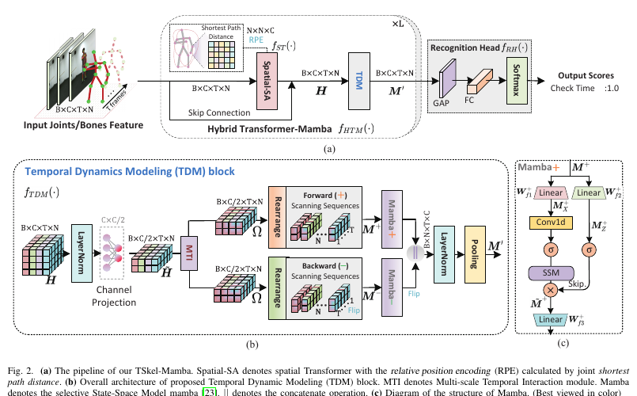
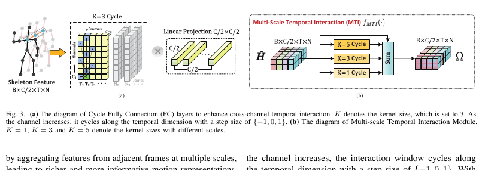

# TSkel-Mamba: Temporal Dynamic Modeling bằng State Space Model cho Skeleton-based Action Recognition

**Tên gốc:** *TSkel-Mamba: Temporal Dynamic Modeling via State Space Model for Human Skeleton-based Action Recognition*  
**Tác giả:** Yanan Liu, Jun Liu, Hao Zhang, Dan Xu, Hossein Rahmani, Mohammed Bennamoun, Qiuhong Ke  
**Công bố:** arXiv:2512.11503v1 [cs.CV], ngày 12 tháng 12 năm 2025  
**PDF:** `2512.11503v1.pdf`

> **Quy ước thuật ngữ:** Giữ nguyên keyword AI/CV: *skeleton*, *joint*, *bone*, *spatial*, *temporal*, *spatio-temporal*, *State Space Model* (SSM), *Mamba*, *channel*, *scanning*, *stream*, *pooling*, *knowledge distillation*, *benchmark*, *inference* và *state-of-the-art* (SOTA).

## Abstract

TSkel-Mamba là hybrid Transformer–Mamba framework: Spatial Transformer học spatial feature, còn Mamba học temporal dynamics. Vanilla Mamba dùng SSM riêng cho từng channel nên khả năng học inter-channel dependency bị hạn chế. Tác giả đề xuất Temporal Dynamics Modeling (TDM), một plug-and-play block chứa Multi-scale Temporal Interaction (MTI). MTI dùng multi-scale Cycle operator để học cross-channel temporal interaction giữa adjacent frame.

Thí nghiệm trên NTU RGB+D 60, NTU RGB+D 120, NW-UCLA và UAV-Human cho thấy TSkel-Mamba đạt SOTA với inference time thấp.

## I. Introduction

Skeleton-based Action Recognition robust trước background noise và camera-view variation. Phần lớn phương pháp tập trung spatial pattern bằng GCN hoặc Spatial Transformer. Tuy nhiên action là chuỗi pose thay đổi theo thời gian, vì vậy temporal dynamic modeling quyết định khả năng cải thiện tiếp theo.

Temporal CNN bị giới hạn bởi local receptive field; Temporal Transformer có quadratic complexity theo sequence length. Mamba [23] dùng input-dependent SSM parameter, near-linear complexity và hardware-aware algorithm, phù hợp long sequence modeling. Nhưng Mamba xử lý từng channel bằng SSM riêng, thiếu direct cross-channel interaction - yếu tố quan trọng khi nhiều body component phối hợp tạo thành action.

TSkel-Mamba dùng Spatial Transformer cho spatial learning và TDM cho temporal learning. Trong TDM, MTI tổng hợp feature từ adjacent frame ở nhiều scale; bidirectional temporal Mamba xử lý forward/backward sequence.

Đóng góp:

1. Đề xuất TSkel-Mamba, một trong những framework đầu tiên khai thác Mamba cho temporal information trong skeleton sequence.
2. Đề xuất TDM với MTI để tăng cross-channel temporal interaction.
3. Đạt SOTA trên bốn benchmark với inference hiệu quả.

## II. Related Work

### A. Skeleton-based Action Recognition

RNN [27-29] học temporal dependency nhưng spatial modeling yếu. CNN trên pseudo-image [30-32] cũng khó học spatial interaction. ST-GCN [9] đưa skeleton thành spatio-temporal graph. Các phương pháp sau dùng learnable topology [7, 10, 11, 17] hoặc Transformer [3, 4, 14, 18] để học global joint interaction. Temporal learning gồm key-frame selection [16], Koopman pooling [35] và Temporal Convolution [11, 17, 33, 36, 37], nhưng temporal operator vẫn chưa được phát triển tương xứng với spatial module.

### B. Mamba in Computer Vision

Mamba là selective SSM có near-linear scaling theo sequence length. VMamba [42] mở rộng Mamba sang 2D image bằng 2D selective scan; PointMamba [43] học inter-group relationship của point cloud; Motion Mamba [44] dùng U-Net và hierarchical Mamba cho motion generation. Bài báo khai thác Mamba như temporal plugin cho skeleton data.

## III. Method

### A. Preliminaries

Selective SSM ánh xạ $x(t)\in\mathbb{R}^{D}$ sang $y(t)\in\mathbb{R}^{D}$ qua hidden state $h(t)\in\mathbb{R}^{N}$:

$$h'(t)=Ah(t)+Bx(t),\qquad y(t)=Ch(t).\tag{1}$$

Sau discretization:

$$h_t=\bar Ah_{t-1}+\bar Bx_t,\qquad y_t=Ch_t.\tag{2}$$

Skeleton input $P\in\mathbb{R}^{B\times C\times T\times N}$ gồm batch size $B$, channel $C$, frame $T$, joint $N$. Initial representation là $H^{(0)}=P$; thông thường $C=3$ cho tọa độ $(x_n,y_n,z_n)$.

### B. Overall Architecture

> **Hình 2:** (a) Pipeline TSkel-Mamba. (b) TDM block. (c) Selective SSM bên trong Mamba.

TSkel-Mamba gồm $L$ Hybrid Transformer-Mamba layer và recognition head. Mỗi HTM layer có Spatial Transformer $f_{ST}$ dùng relative position encoding (RPE), tiếp theo là TDM $f_{TDM}$. Recognition head dùng Global Average Pooling, Fully Connected và Softmax.

### C. Mamba-based Temporal Dynamics Modeling

TDM nhận skeleton feature $H\in\mathbb{R}^{B\times C\times T\times N}$. LayerNorm và Conv1x1 project channel từ $C$ xuống $C/2$, tạo $\tilde H\in\mathbb{R}^{B\times C/2\times T\times N}$. Việc giảm channel trước khi tách hai stream giúp giảm parameter từ quy mô $C^2$ xuống khoảng $2(C/2)^2$.

#### Multi-scale Temporal Interaction

> **Hình 3:** Cycle Fully Connected trộn channel feature giữa adjacent frame; MTI chạy nhiều temporal kernel song song.

Với joint thứ $n$ tại frame $t$, Cycle-FC kernel $K$ được viết:

$$f^{K}_{Cycle}(\tilde H_{(:,t,n)})=\sum_{c=0}^{C_{in}}\tilde H_{(c,t+\delta_t(c),n)}W_c+b,\tag{3}$$

trong đó $\delta_t(c)=(c\bmod K)-1$ là temporal offset. MTI dùng nhiều kernel size $S_K$, mặc định $\{1,3,5\}$:

$$f_{MTI}(\tilde H)=\tilde H+\sum_{K\in S_K}f^K_{Cycle}(\tilde H).\tag{4}$$

Kernel 1 giữ same-frame channel interaction; kernel 3 và 5 đưa feature từ adjacent frame vào, tạo multi-scale cross-channel temporal interaction.

#### Temporal-prioritized Scanning

Flatten skeleton theo temporal scanning hoặc spatial-temporal scanning có thể phá temporal continuity. TSkel-Mamba tạo một temporal token sequence riêng cho từng joint: $v_1,\ldots,v_T$. Như vậy Mamba chuyên học temporal dependency, còn Spatial Transformer xử lý joint dependency.

#### Bidirectional Temporal Dynamic Modeling

Feature $\Omega$ được reshape thành forward sequence $M^+$. Flip theo temporal dimension tạo backward sequence $M^-$. Hai Linear projection tạo nhánh SSM và gate:

$$M_x^+=M^+W_{f1}^+,\quad M_z^+=M^+W_{f2}^+,\quad M_x^-=M^-W_{f1}^-,\quad M_z^-=M^-W_{f2}^-.\tag{5}$$

$$\tilde M^+=SSM^+(\sigma(Conv1D^+(M_x^+)))\odot\sigma(M_z^+),\tag{6a}$$

$$\tilde M^-=SSM^-(\sigma(Conv1D^-(M_x^-)))\odot\sigma(M_z^-).\tag{6b}$$

Hai direction được concatenate sau khi backward feature được flip lại, rồi LayerNorm và temporal pooling:

$$M'=Pool(LN(Cat(\tilde M^+W_{f3}^+,Flip(\tilde M^-W_{f3}^-)))).\tag{7}$$

### D. Spatial Transformer with Topological Positional Encoding

Spatial Transformer dùng RPE từ shortest-path distance trên skeleton topology:

$$H_{SA}=softmax(QK^T+QR^T)V.\tag{8}$$

$R\in\mathbb{R}^{N\times N\times C}$ mã hóa khoảng cách đường đi ngắn nhất giữa joint. RPE giúp giữ physical-topology prior mà vanilla Transformer thường bỏ qua.

### E. Covariance Pooling with Knowledge Distillation

Covariance Pooling (CP) học second-order interaction giữa channel nhưng tăng parameter trong recognition head. CPKD dùng pretrained TSkel-Mamba+CP làm teacher và TSkel-Mamba+GAP làm student, chỉ dùng CP khi training.

Với feature $O\in\mathbb{R}^{B\times C\times d}$:

$$\Sigma=O\bar IO^T,\qquad \bar I=\frac{1}{d}\left(I-\frac{1}{d}I_1\right).\tag{9}$$

Newton-Schulz iteration xấp xỉ matrix square root:

$$Y_{k+1}=\frac12Y_k(3I-Z_kY_k),\qquad Z_{k+1}=\frac12(3I-Z_kY_k)Z_k.\tag{10}$$

Knowledge-distillation loss tách target-class KD và non-target-class KD:

$$L_{KD}(P^S,P^T)=\alpha KL(P_b^S\Vert P_b^T)+\beta KL(P_m^S\Vert P_m^T),\tag{11}$$

với $\alpha=1$, $\beta=8$. CPKD tăng training overhead nhưng không thay đổi parameter, FLOPs hoặc latency khi inference của student.

## IV. Experiments

### A. Datasets

- **NTU RGB+D 60:** 56.880 sample, 60 action class, 25 joint; protocol X-Sub và X-View.
- **NTU RGB+D 120:** 114.480 sample, 120 class, 106 subject; protocol X-Sub và X-Set.
- **NW-UCLA:** 20 joint, ba camera view; train hai view, test view còn lại.
- **UAV-Human:** 22.476 clip, 155 action class, 89 subject train và 30 subject test; UAV footage trong điều kiện thực tế đa dạng.

### B. Implementation Details

Code dùng Python/PyTorch, training trên một RTX 4090. Mỗi sample resize thành 64 frame. Optimizer SGD, weight decay 0,0004, initial LR 0,025, decay 0,1 trong epoch 110-120, batch size 64. TSkel-Mamba gồm 7 HTM layer, channel dimension 216 và 9 attention head.

### C. Multi-stream Strategy

- $S_1$: joint stream.
- $S_2$: joint + bone stream.
- $S_4$: joint + bone + joint-motion + bone-motion stream.

### D. State-of-the-art Comparison

**Kết quả chính của TSkel-Mamba.**

| Model | Params | NTU60 X-Sub $S_1/S_2/S_4$ | NTU60 X-View $S_1/S_2/S_4$ | NTU120 X-Set $S_1/S_2/S_4$ | NTU120 X-Sub $S_1/S_2/S_4$ | NW-UCLA |
|---|---:|---:|---:|---:|---:|---:|
| TSkel-Mamba | 2.4M | 91.4 / 92.9 / 93.1 | 95.8 / 96.8 / 97.2 | 88.7 / 90.9 / 91.6 | 87.4 / 89.7 / 90.4 | 97.0 |
| **TSkel-Mamba + CPKD** | **2.4M** | **91.6 / 93.0 / 93.2** | **96.2 / 97.1 / 97.4** | **88.9 / 91.0 / 91.7** | **87.9 / 90.0 / 90.6** | **97.2** |

So với spatial-dominant method, TSkel-Mamba cải thiện khoảng 0,7-1,3 điểm trên NTU. So với Temporal Transformer ST-TR, joint-stream TSkel-Mamba cao hơn 8,1 điểm trên NTU120 X-Sub với khoảng 1/5 parameter. So với Koopman pooling, model tăng 1,4 điểm trên NTU60 X-Sub, 1,0 trên X-View, 1,4 trên NTU120 X-Set và 2,2 trên X-Sub với ít parameter hơn.

**UAV-Human.**

| Method | C5v1 (%) |
|---|---:|
| DGCN [8] | 29.9 |
| ST-GCN [9] | 30.3 |
| 2s-AGCN [7] | 34.8 |
| Shift-GCN [13] | 38.0 |
| CTR-GCN [17] | 43.4 |
| MKE-GCN [66] | 44.6 |
| ACFI-CTR [66] | 44.2 |
| Koopman [35] | 44.2 |
| TD-GCN [67] | 45.4 |
| **TSkel-Mamba** | **47.2** |

### E. Ablation Studies

**Bảng III - thành phần TDM.**

| Method | NTU120 X-Sub $S_1$ |
|---|---:|
| Baseline | 84.2 |
| T-Scan Mamba | 85.8 (+1.6) |
| T-Scan Mamba + MTI single-scale | 86.4 (+2.2) |
| T-Scan Mamba + MTI multi-scale | 86.7 (+2.5) |
| **TDM** | **87.4 (+3.2)** |

**Bảng IV - scanning strategy.**

| Strategy | Accuracy |
|---|---:|
| Baseline | 84.2 |
| Temporal-prioritized T-Scan | 85.3 |
| Spatial-temporal ST-Scan | 85.5 |
| Spatial-only S-Scan | 84.6 |
| **T-Scan Mamba đầy đủ** | **85.8** |

Temporal-prioritized scanning tốt nhất vì giữ temporal continuity tự nhiên cho từng joint.

**Bảng V - interaction trong MTI.**

| Method | Accuracy |
|---|---:|
| Baseline | 84.2 |
| MTI không channel aggregation | 86.2 |
| MTI không temporal aggregation, có multi-scale | 86.6 |
| MTI không multi-scale | 87.1 |
| **TDM đầy đủ** | **87.4** |

**Bảng VI - TDM như temporal plugin.**

| Backbone | Params | Accuracy | + TDM | Params | Accuracy |
|---|---:|---:|---|---:|---:|
| CTR-GCN | 1.4M | 84.9 | CTR-GCN + TDM | 1.7M | 85.4 |
| Block-GCN | 1.4M | 86.5 | Block-GCN + TDM | 1.8M | 87.3 |
| Hyperformer | 2.7M | 86.4 | Hyperformer + TDM | 3.0M | 87.3 |

**Bảng VII - temporal scale của MTI.**

| Kernel set $S_K$ | Accuracy |
|---|---:|
| Baseline | 84.2 |
| {3} | 86.4 |
| {1,3} | 86.5 |
| {1,3,5,7} | 86.4 |
| **{1,3,5}** | **86.7** |

Kernel 7 làm receptive field quá thô; $\{1,3,5\}$ tốt nhất.

**Bảng VIII - CPKD và lightweight model.**

| Method | Accuracy | Params | FLOPs |
|---|---:|---:|---:|
| TSkel-Mamba + CP | 87.8 | 3.9M | 8.3G |
| light-TSkel-Mamba | 86.5 | 0.9M | 3.5G |
| **light-TSkel-Mamba + CPKD** | **87.7** | **0.9M** | **3.5G** |

**Long sequence.** Baseline tăng rồi giảm khi số frame tăng; TSkel-Mamba tiếp tục cải thiện tới 256 frame, với gain trên 4,5 điểm. Điều này cho thấy TDM xử lý temporal redundancy và long-range dependency tốt hơn.

**Per-action analysis.** Trên 120 label của NTU120 X-Sub, TDM cải thiện 105 label với average gain +3,76%, giảm trên 10 label với average -0,94%, không đổi 5 label. Với 10 hard action có baseline accuracy thấp nhất, maximum gain là 16,18% ở A12 và average gain 9,38%.

**Bảng IX - hard action summary.**

| Positive labels | Max hard-action gain | Average hard-action gain |
|---:|---:|---:|
| 105, trung bình +3.76% | 16.18% | 9.38% |

**Bảng X - efficiency.**

| Method | Params | FLOPs | Accuracy |
|---|---:|---:|---:|
| ST-TR | 12.1M | 259.4G | 82.7 |
| DSTA-Net | 3.4M | 16.2G | 84.0 |
| Hyperformer | 2.7M | 9.6G | 86.6 |
| Koopman | 5.3M | 8.8G | 85.7 |
| **TSkel-Mamba** | **2.4M** | **8.2G** | **87.9** |

t-SNE cho thấy feature sau TDM tạo cluster compact hơn. Thiết kế hai stream forward/backward sau channel downsampling đạt 87,4% với 2,4M parameter; Bi-SSM baseline không downsample đạt 86,7% với 3,9M parameter.

## V. Limitations

TDM mạnh hơn Temporal Convolution trong temporal dynamic modeling nhưng dùng nhiều parameter hơn TCN. Vì vậy ở một số backbone, hybrid TDM-TCN có thể cho trade-off tốt hơn pure TDM. Lợi thế của TDM ít rõ khi sequence rất ngắn; hiệu quả tăng khi sequence dài và temporal dependency phức tạp.

## VI. Conclusion

TDM là Mamba-based temporal plugin cho Skeleton-based Action Recognition. Khi kết hợp Spatial Transformer, nó tạo backbone TSkel-Mamba đạt SOTA với inference cạnh tranh. TDM cũng tương thích với GCN và Transformer backbone khác. Hướng tiếp theo gồm language-supervised action recognition, online action recognition và downstream task dùng skeleton feature extractor.

## Tài liệu tham khảo

Danh mục 69 tài liệu tham khảo giữ nguyên trong `2512.11503v1.pdf`; citation trong bản dịch dùng cùng numbering.

## Ghi chú thuật ngữ

| Keyword | Ý nghĩa trong bài |
|---|---|
| TDM | Temporal Dynamics Modeling block |
| MTI | Multi-scale Temporal Interaction module |
| Cycle-FC | Fully Connected operator dịch temporal offset theo channel |
| T-Scan | Temporal-prioritized scanning cho từng joint |
| RPE | Topological relative position encoding |
| CP | Covariance Pooling |
| CPKD | CP teacher + GAP student qua logit knowledge distillation |
