# VideoMamba: Mô hình không gian trạng thái cho việc hiểu video hiệu quả

**Tên bài báo gốc:** *VideoMamba: State Space Model for Efficient Video Understanding*  
**Tác giả:** Kunchang Li, Xinhao Li, Yi Wang, Yinan He, Yali Wang, Limin Wang, Yu Qiao  
**Đơn vị:** Shenzhen Institute of Advanced Technology - Chinese Academy of Sciences; University of Chinese Academy of Sciences; OpenGVLab - Shanghai AI Laboratory; State Key Laboratory for Novel Software Technology - Nanjing University  
**Mã nguồn và mô hình:** <https://github.com/OpenGVLab/VideoMamba>

> **Ghi chú tác giả:** Kunchang Li và Xinhao Li là thực tập sinh tại Shanghai AI Laboratory. Yi Wang, Yali Wang, Limin Wang và Yu Qiao là các tác giả liên hệ.

> **Quy ước bản dịch sát nguyên văn:** Mỗi câu tiếng Việt tương ứng trực tiếp với một câu trong bản gốc; giữ nguyên thứ tự mệnh đề, mức độ khẳng định và quan hệ logic. Không rút gọn, diễn giải thêm, thay thế bằng hàm ý gần nghĩa hoặc bổ sung kết luận không có trong bản gốc. Các thuật ngữ kỹ thuật quan trọng được giữ bằng tiếng Anh và chú thích nghĩa tiếng Việt ở lần xuất hiện đầu tiên, chẳng hạn *state space model* (mô hình không gian trạng thái, SSM), *spatiotemporal representation* (biểu diễn không-thời gian), *selective scan* (quét chọn lọc), *self-distillation* (tự chưng cất), *masked modeling* (mô hình hóa có che), *fine-tuning* (tinh chỉnh) và *backbone* (mạng nền). Tên mô hình, tập dữ liệu, metric (thước đo), ký hiệu toán học và citation được giữ theo bản gốc. Hình và bảng được chụp trực tiếp từ PDF để bảo toàn sơ đồ và số liệu; caption được dịch sát nguyên văn.

## Tóm tắt (Abstract)

Khi giải quyết hai thách thức là dư thừa cục bộ và các phụ thuộc toàn cục trong việc hiểu video, công trình này điều chỉnh Mamba cho miền video theo một cách sáng tạo. VideoMamba được đề xuất khắc phục các hạn chế của các mạng nơ-ron tích chập 3D (*3D convolutional neural networks*, CNN) và các video Transformer hiện có. Toán tử có độ phức tạp tuyến tính (*linear-complexity operator*) của nó cho phép mô hình hóa dài hạn hiệu quả, điều có tính then chốt đối với việc hiểu video dài có độ phân giải cao. Các đánh giá quy mô rộng cho thấy bốn năng lực cốt lõi của VideoMamba: (1) Khả năng mở rộng trong miền thị giác mà không cần pretraining trên tập dữ liệu quy mô lớn, nhờ một kỹ thuật *self-distillation* mới; (2) Độ nhạy trong việc nhận dạng các hành động ngắn hạn, ngay cả khi có những khác biệt chuyển động tinh tế; (3) Tính vượt trội trong việc hiểu video dài hạn, cho thấy những tiến bộ đáng kể so với các mô hình truyền thống dựa trên đặc trưng; và (4) Khả năng tương thích với các phương thức khác, cho thấy tính vững trong các ngữ cảnh đa phương thức. Thông qua các ưu điểm này, VideoMamba thiết lập một mốc chuẩn mới, cung cấp một giải pháp có khả năng mở rộng và hiệu quả cho việc hiểu video toàn diện.

**Từ khóa:** Mamba · Video Understanding (hiểu video) · Multimodal Learning (học đa phương thức)

## 1. Giới thiệu (Introduction)

Mục tiêu cốt lõi của việc hiểu video nằm ở việc làm chủ các *spatiotemporal representations* (biểu diễn không-thời gian), điều đặt ra hai thách thức khó khăn: mức dư thừa không-thời gian lớn trong các clip video ngắn và các phụ thuộc không-thời gian phức tạp trong các ngữ cảnh dài. Mặc dù các 3D CNN [9,20,77] và video Transformer [2,4] từng chiếm ưu thế xử lý hiệu quả một trong hai thách thức này bằng cách tận dụng tích chập cục bộ hoặc attention tầm xa, chúng không đáp ứng được việc giải quyết đồng thời cả hai. UniFormer [44] cố gắng tích hợp các ưu điểm của cả hai phương pháp, nhưng gặp khó khăn với việc mô hình hóa video dài; việc này đã là xu hướng chính trong nghiên cứu gần đây về hiểu video [48,73] và sinh video [5,92].

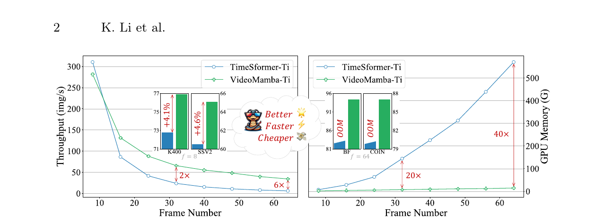

> **Hình 1:** So sánh *throughput* (thông lượng) và bộ nhớ. TimeSformer-Ti [4] được xây dựng dựa trên DeiT-Ti [76] với *joint spatiotemporal attention* (attention không-thời gian kết hợp). VideoMamba của chúng tôi tốt hơn, nhanh hơn và ít tốn kém hơn đối với cả việc hiểu video ngắn hạn và dài hạn.

Sự xuất hiện của các toán tử chi phí thấp như S4 [26], RWKV [74] và RetNet [71] trong miền NLP đã mở ra một con đường mới cho mô hình thị giác. Mamba [25] nổi bật với *selective state space model* (mô hình không gian trạng thái chọn lọc, SSM), tạo sự cân bằng giữa việc duy trì độ phức tạp tuyến tính và tạo thuận lợi cho mô hình hóa động dài hạn. Đổi mới này đã thúc đẩy việc áp dụng nó trong các tác vụ thị giác, như được minh chứng bởi Vision Mamba [91] và VMamba [50], các mô hình tận dụng SSM đa hướng để tăng cường xử lý ảnh 2D. Các mô hình này ngang bằng các kiến trúc dựa trên attention về hiệu năng trong khi giảm đáng kể mức sử dụng bộ nhớ. Xét các chuỗi dài hơn vốn được video tạo ra, một câu hỏi tự nhiên xuất hiện: **Mamba có thể hoạt động tốt cho việc hiểu video không?**

Được truyền cảm hứng từ điều này, chúng tôi giới thiệu VideoMamba, một mô hình thuần dựa trên SSM được thiết kế riêng cho việc hiểu video. VideoMamba kết hợp hài hòa các thế mạnh của convolution và attention theo phong cách vanilla ViT [16]. Nó cung cấp một phương pháp có độ phức tạp tuyến tính cho việc mô hình hóa ngữ cảnh không-thời gian động, lý tưởng đối với các video dài có độ phân giải cao. Phần đánh giá liên quan tập trung vào bốn năng lực chính của VideoMamba:

1. **Scalability in the Visual Domain (khả năng mở rộng trong miền thị giác).** Chúng tôi khảo sát khả năng mở rộng của VideoMamba và nhận thấy rằng, trong khi mô hình Mamba thuần có xu hướng overfit khi được tăng quy mô, việc chúng tôi đưa vào một chiến lược *self-distillation* đơn giản nhưng hiệu quả cho phép VideoMamba đạt được những cải thiện hiệu năng đáng kể khi kích thước mô hình và đầu vào tăng lên mà không cần pretraining trên tập dữ liệu quy mô lớn.
2. **Sensitivity for Short-term Action Recognition (độ nhạy đối với nhận dạng hành động ngắn hạn).** Phân tích của chúng tôi mở rộng sang việc đánh giá năng lực phân biệt chính xác các hành động ngắn hạn của VideoMamba, đặc biệt là những hành động có khác biệt chuyển động tinh tế, ví dụ như mở và đóng. Các phát hiện cho thấy hiệu năng vượt trội của VideoMamba so với các mô hình dựa trên attention hiện có [2,4,52]. Quan trọng hơn, nó cũng phù hợp với *masked modeling*, điều làm tăng thêm độ nhạy theo thời gian của nó.
3. **Superiority in Long-term Video Understanding (tính vượt trội trong việc hiểu video dài hạn).** Sau đó, chúng tôi đánh giá năng lực của VideoMamba trong việc diễn giải các video dài. Nó cho thấy tính vượt trội đáng kể so với các phương pháp thông thường dựa trên đặc trưng [36,47] thông qua huấn luyện end-to-end. Đáng chú ý, VideoMamba hoạt động nhanh hơn TimeSformer [4] 6 lần và yêu cầu ít hơn 40 lần bộ nhớ GPU đối với các video 64 frame (xem Hình 1).
4. **Compatibility with Other Modalities (khả năng tương thích với các phương thức khác).** Cuối cùng, chúng tôi đánh giá khả năng thích ứng của VideoMamba với các phương thức khác. Các kết quả trong truy hồi video-văn bản cho thấy hiệu năng được cải thiện của nó so với ViT, đặc biệt trong các video dài có những bối cảnh phức tạp. Điều này nhấn mạnh tính vững và năng lực tích hợp đa phương thức của nó.

Tóm lại, các thí nghiệm của chúng tôi cho thấy tiềm năng của VideoMamba trong việc hiểu cả nội dung video ngắn hạn (K400 [37] và SthSthV2 [24]) lẫn dài hạn (Breakfast [38], COIN [72] và LVU [86]). Xét hiệu suất và hiệu quả của nó, VideoMamba có vị thế để trở thành một nền tảng cốt lõi trong việc hiểu video dài.

## 2. Các công trình liên quan (Related Works)

### 2.1. Các mô hình không gian trạng thái (State Space Models)

Gần đây, các *State Space Models* (mô hình không gian trạng thái, SSM) đã cho thấy hiệu quả đáng kể trong việc nắm bắt động lực và các phụ thuộc của chuỗi ngôn ngữ. Công trình [26] giới thiệu một *structured state-space sequence model* (mô hình chuỗi không gian trạng thái có cấu trúc, S4), được thiết kế để mô hình hóa các phụ thuộc tầm xa với độ phức tạp tuyến tính. Dựa trên nó, nhiều mô hình khác nhau đã được phát triển, ví dụ S5 [67], H3 [21] và GSS [57]. Mamba [25] tạo sự khác biệt bằng cách đưa vào một lớp SSM phụ thuộc dữ liệu và một cơ chế lựa chọn sử dụng *parallel scan* (quét song song, S6). So với các Transformer [6,54] có attention với độ phức tạp bậc hai, Mamba vượt trội trong việc xử lý các chuỗi dài với độ phức tạp tuyến tính.

Trong miền thị giác, [26] lần đầu áp dụng SSM trong phân loại ảnh ở cấp pixel, và [36] sử dụng S4 để xử lý các phụ thuộc thời gian tầm xa cho việc phân loại clip phim. Tiềm năng của Mamba đã thúc đẩy một loạt công trình [11,28,30,32,46,50,56,79,80,88,91], cho thấy hiệu năng tốt hơn và hiệu quả GPU cao hơn các Transformer trên các tác vụ thị giác như phát hiện đối tượng và phân đoạn ngữ nghĩa. Không giống các công trình trước, VideoMamba của chúng tôi là mô hình video thuần dựa trên SSM đầu tiên, cho thấy hiệu suất và hiệu quả vượt trội trong cả việc hiểu video ngắn hạn và dài hạn.

### 2.2. Hiểu video (Video Understanding)

Hiểu video là một nền tảng cốt lõi của computer vision, được gia tăng bởi sự phát triển của các nền tảng video ngắn. Để thúc đẩy lĩnh vực này, nhiều tập dữ liệu với lượng dữ liệu lớn và các chú thích tỉ mỉ của con người đã được phát triển nhằm nâng cao nhận dạng hành động. Các ví dụ đáng chú ý gồm UCF101 [68] và Kinetics [7,8,37], những tập dữ liệu giữ vai trò then chốt trong việc đo chuẩn tiến bộ. Các tập dữ liệu khác [22,27,31,35,49,63] cung cấp các video hoạt động có chú thích cho *action localization* (định vị hành động), thúc đẩy nghiên cứu sâu hơn về các hoạt động của con người. Bên cạnh nhận dạng hành động, các tập dữ liệu video-văn bản quy mô lớn [10,13,58,84,87,89] mở rộng việc hiểu video sang các tác vụ đa phương thức như tạo chú thích video, truy hồi và trả lời câu hỏi.

Kiến trúc đã phát triển từ CNN sang các kỹ thuật tiên tiến hơn. Ban đầu, các 3D CNN [9,18,77,78] mở rộng các CNN 2D truyền thống để nắm bắt thông tin không-thời gian. Two-Stream [66], TSN [82] và SlowFast [20] tiếp tục nâng cao nhận dạng hành động bằng cách lần lượt kết hợp các luồng không gian và thời gian, đề xuất lấy mẫu thưa và sử dụng các mạng song song.

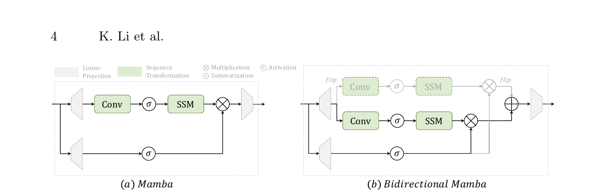

> **Hình 2:** Các khối Mamba cho chuỗi 1D [25] và 2D [91]. Chúng tôi lược bỏ normalization ban đầu và residual cuối cùng để đơn giản hóa.

Các mô hình dựa trên attention [2,4,60,64,90] như TimeSformer [4] và ViViT [2] đã thúc đẩy lĩnh vực này tiến lên đáng kể bằng cách nắm bắt các phụ thuộc tầm xa, qua đó cải thiện việc hiểu các quan hệ thời gian. Các mô hình gần đây [42,44,52,85] tập trung vào các video Transformer hiệu quả, với những đổi mới như *window attention* (attention cửa sổ) của VideoSwin [52] và sự tích hợp convolution với self-attention của UniFormer [44], cân bằng hiệu quả tính toán với hiệu năng. Bất chấp các tiến bộ này, chi phí tính toán cao vẫn tồn tại đối với các chuỗi dài. Ngược lại, VideoMamba của chúng tôi đưa vào một toán tử có độ phức tạp tuyến tính cho việc mô hình hóa dài hạn hiệu quả, vượt các phương pháp hiện có với tốc độ nhanh hơn và mức tiêu thụ GPU thấp hơn.

## 3. Phương pháp (Method)

### 3.1. Kiến thức sơ bộ (Preliminaries)

#### SSM cho chuỗi 1D

Các State Space Model (SSM) được khái niệm hóa dựa trên các hệ liên tục ánh xạ một hàm hoặc chuỗi 1D $x(t) \in \mathbb{R}^{L}$ sang $y(t) \in \mathbb{R}^{L}$ thông qua một trạng thái ẩn $h(t) \in \mathbb{R}^{N}$. Về mặt hình thức, SSM sử dụng phương trình vi phân thường (*ordinary differential equation*, ODE) sau để mô hình hóa dữ liệu đầu vào:

$$
h'(t)=Ah(t)+Bx(t), \tag{1}
$$

$$
y(t)=Ch(t), \tag{2}
$$

trong đó $A \in \mathbb{R}^{N \times N}$ biểu diễn ma trận tiến hóa của hệ, còn $B \in \mathbb{R}^{N \times 1}$ và $C \in \mathbb{R}^{N \times 1}$ là các ma trận chiếu. ODE liên tục này được xấp xỉ thông qua rời rạc hóa trong các SSM hiện đại. Mamba [25] là một trong các phiên bản rời rạc của hệ liên tục, bao gồm một tham số thang thời gian $\Delta$ để biến đổi các tham số liên tục $A,B$ thành các đối tác rời rạc $\bar{A},\bar{B}$. Phép biến đổi thường sử dụng phương pháp *zero-order hold* (giữ bậc không, ZOH), được định nghĩa bởi:

$$
\bar{A}=\exp(\Delta A), \tag{3}
$$

$$
\bar{B}=(\Delta A)^{-1}\left(\exp(\Delta A)-I\right)\cdot \Delta B, \tag{4}
$$

$$
h_t=\bar{A}h_{t-1}+\bar{B}x_t, \tag{5}
$$

$$
y_t=Ch_t. \tag{6}
$$

Trái với các mô hình truyền thống chủ yếu dựa trên các SSM tuyến tính bất biến theo thời gian, Mamba tạo sự khác biệt bằng cách triển khai một *Selective Scan Mechanism* (cơ chế quét chọn lọc, S6) làm toán tử SSM cốt lõi của nó. Trong S6, các tham số $B \in \mathbb{R}^{B \times L \times N}$, $C \in \mathbb{R}^{B \times L \times N}$ và $\Delta \in \mathbb{R}^{B \times L \times D}$ được suy ra trực tiếp từ dữ liệu đầu vào $x \in \mathbb{R}^{B \times L \times D}$, cho thấy một năng lực nội tại về độ nhạy ngữ cảnh và điều biến trọng số thích nghi. Hình 2(a) cho thấy các chi tiết của khối Mamba.

#### SSM hai chiều cho thị giác

Khối Mamba ban đầu, được thiết kế cho các chuỗi 1D, không đáp ứng được các tác vụ thị giác yêu cầu nhận biết không gian. Dựa trên điều này, Vision Mamba đưa vào một khối *bidirectional Mamba* (Mamba hai chiều, B-Mamba) trong Hình 2(b), khối này điều chỉnh mô hình hóa chuỗi hai chiều cho các ứng dụng chuyên biệt về thị giác. Khối này xử lý các chuỗi thị giác đã được làm phẳng thông qua các SSM thuận và ngược đồng thời, tăng cường năng lực xử lý có nhận biết không gian của nó. Trong công trình này, chúng tôi mở rộng khối B-Mamba cho việc hiểu video 3D.

### 3.2. VideoMamba

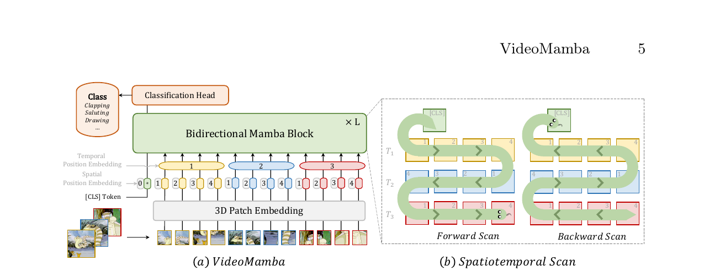

> **Hình 3:** Khung của VideoMamba. Chúng tôi tuân thủ nghiêm ngặt kiến trúc của vanilla ViT [16] và điều chỉnh khối bidirectional Mamba [91] cho các chuỗi video 3D.

#### Tổng quan (Overview)

Hình 3 minh họa framework tổng thể của VideoMamba. Cụ thể, trước tiên chúng tôi sử dụng convolution 3D, tức $1 \times 16 \times 16$, để chiếu các video đầu vào

$$
X_v \in \mathbb{R}^{3 \times T \times H \times W}
$$

thành $L$ patch không-thời gian không chồng lấp

$$
X_p \in \mathbb{R}^{L \times C},
$$

trong đó $L=t \times h \times w$, với $t=T$, $h=H/16$ và $w=W/16$. Chuỗi token đầu vào của encoder VideoMamba tiếp theo là:

$$
X=[X_{\mathrm{cls}},X_p]+p_s+p_t, \tag{7}
$$

trong đó $X_{\mathrm{cls}}$ là một classification token có thể học được đặt ở đầu chuỗi. Theo các công trình trước [2,4,16], chúng tôi thêm một spatial position embedding có thể học $p_s \in \mathbb{R}^{(hw+1) \times C}$ và một temporal position embedding bổ sung $p_t \in \mathbb{R}^{t \times C}$ để giữ lại thông tin vị trí không-thời gian, vì việc mô hình hóa SSM nhạy với vị trí token. Sau đó, các token $X$ được truyền qua $L$ khối B-Mamba xếp chồng, và biểu diễn của token `[CLS]` tại lớp cuối được xử lý bằng normalization và một linear layer để phân loại.

#### Quét không-thời gian (Spatiotemporal Scan)

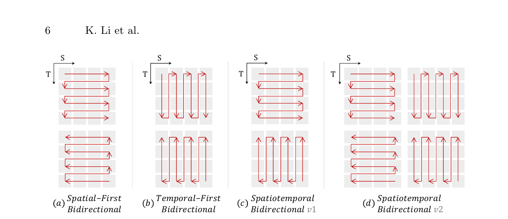

> **Hình 4:** Các phương pháp quét khác nhau. Chúng tôi lược bỏ token `[CLS]` để đơn giản hóa.

Để áp dụng lớp B-Mamba cho đầu vào không-thời gian, chúng tôi mở rộng phép quét 2D ban đầu thành các phép quét 3D hai chiều khác nhau trong Hình 4:

- **Spatial-First:** tổ chức các spatial token theo vị trí, sau đó xếp chồng chúng theo từng frame.
- **Temporal-First:** sắp xếp các temporal token theo frame, sau đó xếp chồng chúng dọc theo chiều không gian.
- **Spatiotemporal:** một dạng lai của Spatial-First và Temporal-First, trong đó v1 thực hiện một nửa và v2 thực hiện đầy đủ với lượng tính toán gấp 2 lần.

Các thí nghiệm của chúng tôi trong Hình 7(a) cho thấy phép quét hai chiều Spatial-First là hiệu quả nhất và đơn giản nhất. Nhờ độ phức tạp tuyến tính của Mamba, VideoMamba của chúng tôi có thể xử lý hiệu quả các video dài, độ phân giải cao.

#### So sánh với Vim [91] và VMamba [50]

VideoMamba của chúng tôi được xây dựng trên Vim, tinh gọn kiến trúc của nó bằng cách lược bỏ token `[CLS]` ở giữa và *Rotary Position Embedding* (mã hóa vị trí xoay, RoPE [69]), dẫn đến hiệu năng vượt trội trên ImageNet-1K với mức tăng lần lượt $+0.8\%$ và $+0.7\%$ cho Vim-Ti và Vim-S. Không giống VMamba, mô hình tích hợp thêm depthwise convolution, VideoMamba tuân thủ nghiêm ngặt thiết kế ViT mà không có các lớp downsampling. Để chống lại các vấn đề overfitting được quan sát trong VMamba, chúng tôi đưa vào một kỹ thuật self-distillation hiệu quả được trình bày trong Mục 3.3, cho thấy khả năng mở rộng lớn của VideoMamba đối với các tác vụ ảnh và video.

#### So sánh với TimeSformer [4] và ViViT [2]

Các mô hình truyền thống dựa trên attention như TimeSformer và ViViT xử lý độ phức tạp bậc hai của cơ chế self-attention bằng cách sử dụng *divided spatiotemporal attention* (attention không-thời gian phân chia). Mặc dù hiệu quả hơn, cơ chế này đưa vào các tham số bổ sung và có hiệu năng kém hơn joint attention, đặc biệt trong các kịch bản masked pretraining [43,75]. Ngược lại, VideoMamba xử lý các token không-thời gian với độ phức tạp tuyến tính, vượt TimeSformer trên Kinetics-400 $+2.6\%$ và đạt bước tiến đáng kể trên SthSthV2 với mức cải thiện $+5.9\%$ (xem Bảng 3 và 4). Hơn nữa, VideoMamba đạt mức tăng 6 lần về tốc độ xử lý và yêu cầu ít hơn 40 lần bộ nhớ GPU đối với các video dài (xem Hình 1), cho thấy hiệu suất và hiệu quả của nó trong việc xử lý các tác vụ video dài.

### 3.3. Kiến trúc (Architecture)

Đối với SSM trong lớp B-Mamba, chúng tôi sử dụng các hyperparameter mặc định như trong Mamba [25], đặt *state dimension* (số chiều trạng thái) và *expansion ratio* (tỷ lệ mở rộng) lần lượt thành 16 và 2. Theo ViT [16], chúng tôi điều chỉnh độ sâu và các số chiều embedding để tạo ra các mô hình có kích thước tương đương trong Bảng 1, bao gồm VideoMamba-Ti, VideoMamba-S và VideoMamba-M.

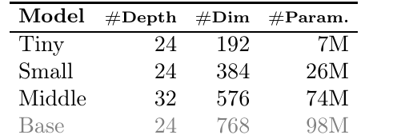

> **Bảng 1:** Các kích thước mô hình khác nhau. Mô hình Base cuối cùng bị loại do *suboptimization* (tối ưu dưới mức).

| Mô hình | Độ sâu | Số chiều embedding | Số tham số |
|---|---:|---:|---:|
| Tiny | 24 | 192 | 7M |
| Small | 24 | 384 | 26M |
| Middle | 32 | 576 | 74M |
| Base | 24 | 768 | 98M |

Tuy nhiên, chúng tôi quan sát thấy VideoMamba lớn hơn có xu hướng overfit trong các thí nghiệm của chúng tôi, dẫn đến hiệu năng dưới tối ưu như được minh họa trong Hình 6(a). Vấn đề overfitting này không chỉ có ở các mô hình của chúng tôi mà cũng được tìm thấy trong VMamba [50], nơi hiệu năng tối ưu của VMamba-B đạt được tại ba phần tư tổng số epoch huấn luyện. Để chống lại overfitting trong các mô hình Mamba lớn hơn, chúng tôi đưa vào một chiến lược *Self-Distillation* hiệu quả, sử dụng một mô hình nhỏ hơn và được huấn luyện tốt làm “teacher” để hướng dẫn việc huấn luyện mô hình “student” lớn hơn. Các kết quả được mô tả trong Hình 6(a) cho thấy chiến lược này dẫn đến sự hội tụ tốt hơn như kỳ vọng.

### 3.4. Mô hình hóa có che (Masked Modeling)

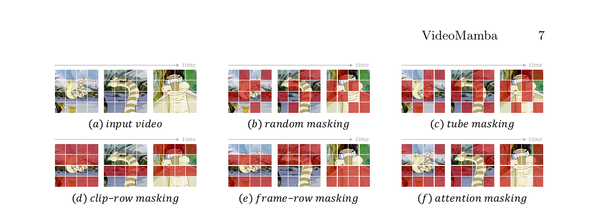

> **Hình 5:** Các chiến lược masking khác nhau. *Row masking*, được điều chỉnh riêng cho VideoMamba xét đến convolution 1D đứng trước SSM, tăng cường hiệu năng với các token liên tục. Khác biệt giữa *clip-row masking* và *frame-row masking* là phương pháp trước che toàn bộ clip video, trong khi phương pháp sau che từng frame riêng lẻ.

Gần đây, VideoMAE và ST-MAE [19,75] đã cho thấy các lợi ích đáng kể của masked modeling trong việc nâng cao năng lực hiểu thời gian *fine-grained* (chi tiết) của một mô hình. UMT [43] đưa điều này tiến xa hơn bằng cách đưa vào một kỹ thuật *masked alignment* (căn chỉnh có che) hiệu quả, tạo ra các kết quả vững trên các tác vụ video đơn phương thức và đa phương thức. Để tăng độ nhạy thời gian của VideoMamba và xác minh khả năng thích ứng của nó với các phương thức văn bản, chúng tôi sử dụng một phương pháp masked alignment lấy cảm hứng từ UMT.

Trước tiên, VideoMamba được huấn luyện from scratch chỉ trên dữ liệu video, căn chỉnh các token không bị che với các token từ CLIP-ViT. Sau đó, nó được tích hợp với một text encoder và một cross-modal decoder, tức BERT [15], để pretraining trên cả tập dữ liệu ảnh-văn bản và video-văn bản.

Lưu ý rằng, khác với UMT sử dụng căn chỉnh nhiều lớp giữa các mô hình student và teacher, chúng tôi chỉ căn chỉnh các đầu ra cuối cùng do kiến trúc riêng của VideoMamba, tức SSM so với Transformer. Đối với chiến lược masking, chúng tôi đề xuất các kỹ thuật row masking khác nhau được mô tả trong Hình 5, được điều chỉnh theo sự ưu tiên các token liên tục của khối B-Mamba. Ngoài ra, chúng tôi khảo sát *attention masking* để bảo toàn sự kề nhau có ý nghĩa giữa các token, tận dụng convolution 1D bên trong khối B-Mamba để cải thiện hiệu năng.

## 4. Thí nghiệm (Experiments)

### 4.1. Mở rộng quy mô (Scaling Up)

#### Các tập dữ liệu và thiết lập

Trước tiên, chúng tôi tiến hành các thí nghiệm trên ImageNet-1K [14], tập dữ liệu gồm 1,28 triệu ảnh huấn luyện và 50 nghìn ảnh validation trên 1.000 hạng mục. Để so sánh công bằng, chúng tôi tuân theo phần lớn các chiến lược huấn luyện của DeiT [76], nhưng sử dụng data augmentation yếu hơn cho biến thể Tiny. Chúng tôi điều chỉnh tỷ lệ *stochastic depth* thành $0/0.15/0.5$ cho VideoMamba-Ti/S/M.

Các mô hình của chúng tôi được huấn luyện bằng optimizer AdamW với cosine learning-rate schedule trong 300 epoch, trong đó 5 epoch đầu dành cho linear warm-up. Các thiết lập mặc định cho learning rate, weight decay và batch size lần lượt là $10^{-3}$, $0.05$ và 1024. Chúng tôi sử dụng độ chính xác BFloat16 trong khi huấn luyện để tăng tính ổn định mà không dùng EMA. Đối với mô hình VideoMamba-M, chúng tôi sử dụng một mô hình VideoMamba-S đã pretrain làm “teacher” để hướng dẫn quá trình huấn luyện bằng cách căn chỉnh các feature map cuối cùng thông qua L2 loss. Đối với fine-tuning ở độ phân giải lớn, tức lớn hơn $224$, chúng tôi sử dụng learning rate giảm còn $5\times10^{-6}$ và weight decay tối thiểu $10^{-8}$ trong 30 epoch.

#### Ảnh hưởng của Self-Distillation

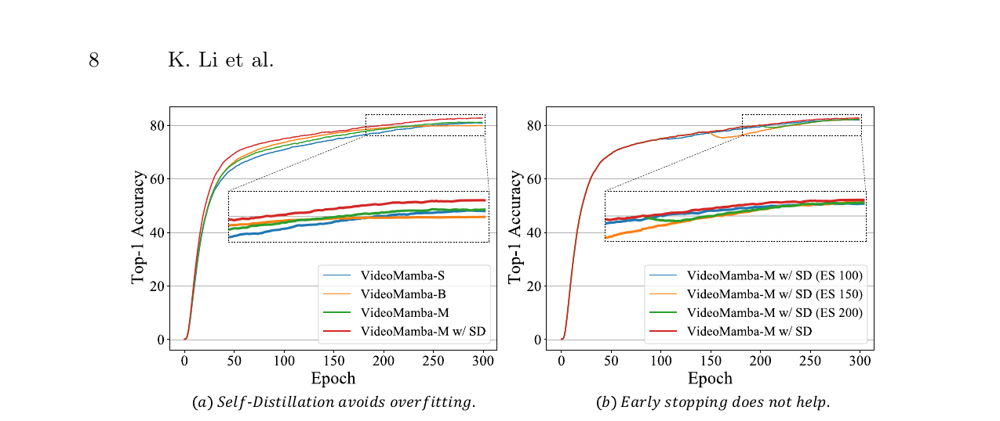

> **Hình 6:** Các nghiên cứu ablation của Self-Distillation và Early Stopping.

Hình 6(a) cho thấy rằng khi được huấn luyện from scratch, VideoMamba-B có xu hướng dễ overfit hơn và có hiệu năng kém hơn VideoMamba-S, trong khi VideoMamba-M đạt hiệu năng tương tự. May mắn thay, self-distillation của chúng tôi đã cho thấy hiệu quả trong việc đạt được sự tối ưu mong muốn với chi phí tính toán bổ sung không đáng kể. Để giảm sự định hướng quá mức tiềm tàng của teacher, chúng tôi đã thử nghiệm *early stopping* [12] trong Hình 6(b), mặc dù nó không tạo ra các kết quả có lợi. Các phát hiện này cho thấy self-distillation cung cấp một chiến lược khả thi để nâng cao khả năng mở rộng của kiến trúc Mamba mà không có overhead tính toán đáng kể.

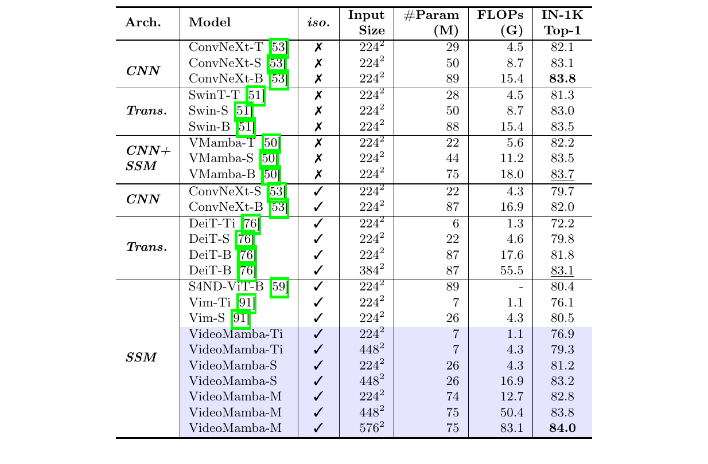

> **Bảng 2:** So sánh với state-of-the-art trên ImageNet. `iso.` có nghĩa là kiến trúc *isotropic* (đẳng hướng) không có các lớp downsampling.

#### Kết quả

Bảng 2 trình bày các kết quả trên tập dữ liệu ImageNet-1K. Đáng chú ý, VideoMamba-M vượt các kiến trúc isotropic khác với biên đáng kể, đạt mức cải thiện $+0.8\%$ so với ConvNeXt-B [53] và mức tăng $+2.0\%$ so với DeiT-B [76], trong khi sử dụng ít tham số hơn. Ngoài ra, VideoMamba-M vẫn đứng vững trước các backbone non-isotropic tận dụng các đặc trưng phân cấp để nâng cao hiệu năng. Xét hiệu quả của Mamba trong việc xử lý các chuỗi dài, chúng tôi tiếp tục nâng cao hiệu năng bằng cách tăng độ phân giải, đạt top-1 accuracy $84.0\%$ với chỉ 74M tham số. Sự cải thiện đáng kể này mở rộng sang các tác vụ video, như được trình bày chi tiết trong Mục 4.2, nhấn mạnh tính hiệu quả và khả năng mở rộng của VideoMamba.

### 4.2. Hiểu video ngắn hạn (Short-term Video Understanding)

#### Các tập dữ liệu và thiết lập

Chúng tôi đánh giá VideoMamba trên Kinetics-400 [37] liên quan đến scene và Something-Something V2 [24] liên quan đến thời gian, với độ dài video trung bình lần lượt là 10 giây và 4 giây. Đối với supervised pretraining, chúng tôi fine-tune các mô hình đã pretrain trên ImageNet-1K bằng cùng chiến lược như VideoMAE [75].

Cụ thể, đối với VideoMamba-M, số warm-up epoch, tổng số epoch, stochastic-depth rate và weight decay được đặt lần lượt thành $5,50,0.8,0.05$ cho K400 và $5,30,0.8,0.05$ cho SthSthV2. Đối với các mô hình nhỏ hơn, tất cả hyperparameter đều giống nhau, ngoại trừ stochastic-depth rate được giảm và số epoch huấn luyện được tăng. Chúng tôi scale tuyến tính các base learning rate theo batch size:

$$
2\times10^{-4}\cdot\frac{\text{batch size}}{256}
$$

cho K400 và

$$
4\times10^{-4}\cdot\frac{\text{batch size}}{256}
$$

cho SthSthV2. Đối với self-supervised pretraining, chúng tôi sử dụng recipe của UMT [43], dùng CLIP-ViT-B [61] để distill VideoMamba-M trong 800 epoch. Trong fine-tuning, chúng tôi sử dụng các hyperparameter tương tự nhưng chọn stochastic-depth rate và learning rate nhỏ hơn cho cả hai tập dữ liệu.

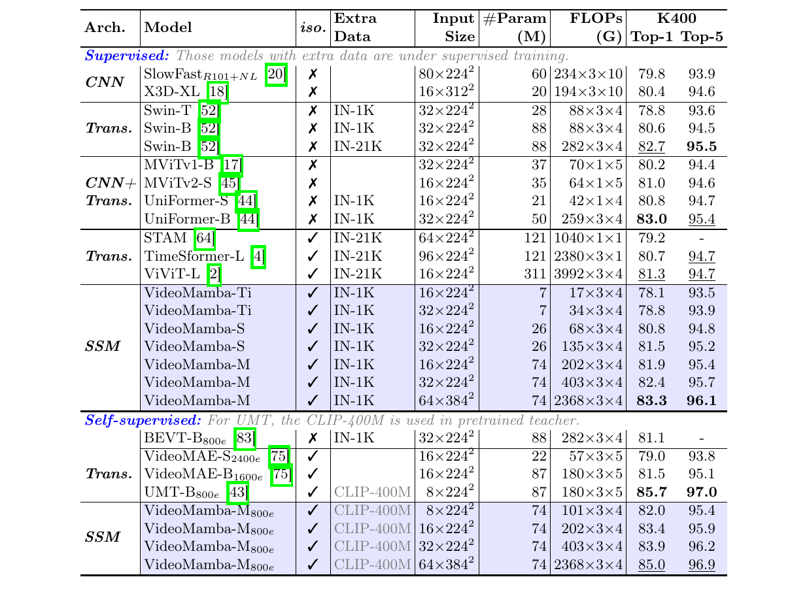

> **Bảng 3:** So sánh với state-of-the-art trên Kinetics-400 liên quan đến scene. `iso.` có nghĩa là kiến trúc isotropic không có các lớp downsampling. Masked modeling [43] cũng hoạt động đối với Mamba, nhưng kiến trúc không nhất quán dẫn đến alignment kém hơn.

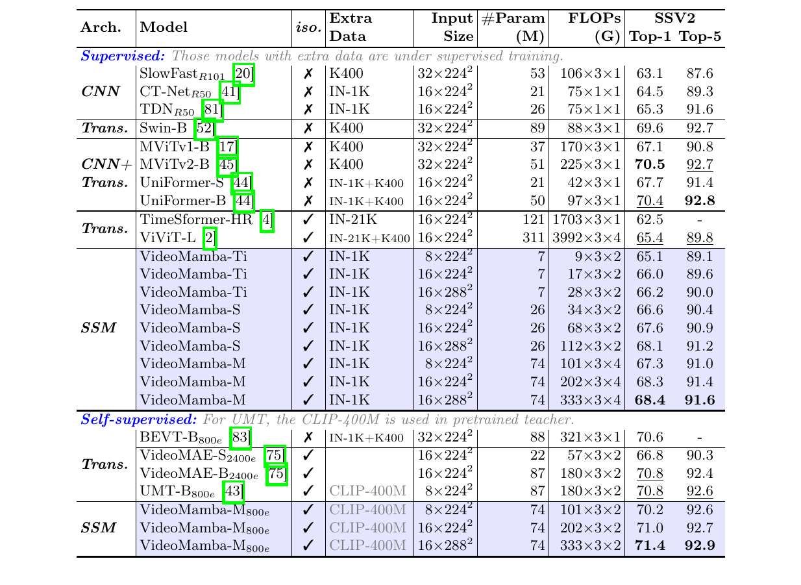

> **Bảng 4:** So sánh với state-of-the-art trên SthSthV2 liên quan đến thời gian. `iso.` có nghĩa là kiến trúc isotropic không có các lớp downsampling. Masked modeling [43] cũng hoạt động đối với Mamba và có hiệu năng tốt hơn VideoMAE.

#### Kết quả

Bảng 3 và 4 liệt kê các kết quả trên các tập dữ liệu video ngắn hạn.

**Supervised.** So với các phương pháp thuần dựa trên attention [2,4], VideoMamba-M dựa trên SSM của chúng tôi giành được một lợi thế đáng chú ý, vượt ViViT-L [2] lần lượt $+2.0\%$ và $+3.0\%$ trên tập dữ liệu K400 liên quan đến scene và SthSthV2 liên quan đến thời gian. Sự cải thiện này đi cùng yêu cầu tính toán giảm đáng kể và ít dữ liệu pretraining hơn. Hơn nữa, VideoMamba-M cung cấp các kết quả ngang bằng UniFormer [44] SOTA, mô hình tích hợp khéo léo convolution với attention trong một cấu trúc non-isotropic.

**Self-supervised.** Hiệu năng của VideoMamba dưới masked pretraining vượt hiệu năng của VideoMAE [75], mô hình được biết đến với năng lực đối với hành động fine-grained. Thành tựu này nhấn mạnh tiềm năng của mô hình thuần dựa trên SSM của chúng tôi trong việc hiểu các video ngắn hạn với hiệu suất cao và hiệu quả, đồng thời làm nổi bật tính phù hợp của nó đối với cả mô thức học supervised và self-supervised.

#### Nghiên cứu ablation

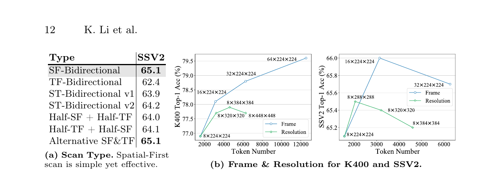

> **Hình 7:** Các nghiên cứu ablation về kiểu quét, frame và độ phân giải. Tất cả các mô hình được fine-tune từ VideoMamba-Ti đã pretrain trên ImageNet.

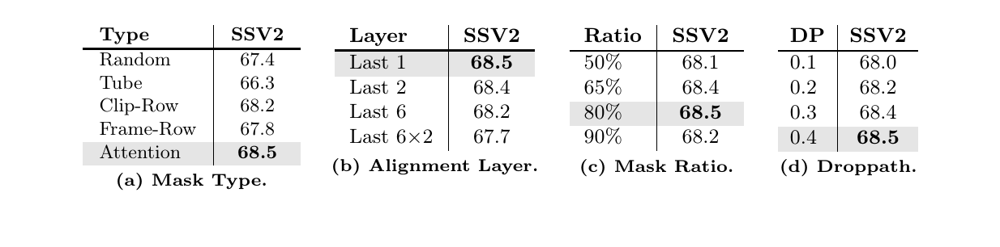

> **Bảng 5:** Các nghiên cứu ablation của masked pretraining. Chúng tôi sử dụng CLIP-ViT-B [61] làm teacher để distill VideoMamba-M trong 200 epoch.

Thông qua các nghiên cứu ablation toàn diện được trình bày chi tiết trong Hình 7 và Bảng 5, chúng tôi khảo sát nhiều khía cạnh khác nhau của mô hình:

1. **Scan Type.** Trong tất cả các phương pháp, cách tiếp cận Spatial-First là hiệu quả nhất, trong khi chiến lược Temporal-First là kém nhất. Tính vượt trội của phương pháp Spatial-First bắt nguồn từ khả năng tận dụng tri thức đã pretrain 2D bằng cách quét theo từng frame.
2. **Frame and Resolution.** Trái với các phát hiện từ ImageNet, xem Bảng 2, độ phân giải cao hơn không dẫn đến hiệu năng tốt hơn một cách đồng đều. Việc tăng số lượng frame liên tục nâng cao các kết quả trên tập dữ liệu K400. Tuy nhiên, điều này không xảy ra với SthSthV2, có thể do thời lượng ngắn của các video trong tập này, vốn có thể không thích ứng hiệu quả với các đầu vào dài hơn.
3. **Masked Pretraining.** Các phát hiện của chúng tôi cho thấy row masking, do đặc biệt tương thích với convolution 1D, vượt random masking và tube masking. Clip-row masking vượt trội nhờ mức độ ngẫu nhiên cao hơn của nó. Attention masking nổi bật là phương pháp hiệu quả nhất bằng cách bảo toàn nội dung kề nhau có ý nghĩa. Chỉ căn chỉnh đầu ra cuối cùng của mô hình là hiệu quả nhất, có khả năng do các khác biệt kiến trúc. Cuối cùng, một masking ratio tối ưu, $80\%$, kết hợp với regularization mạnh hơn mang lại lợi ích đáng kể cho VideoMamba trong masked pretraining.

### 4.3. Hiểu video dài hạn (Long-term Video Understanding)

#### Các tập dữ liệu và thiết lập

Chúng tôi đánh giá nghiêm ngặt mức độ thành thạo của VideoMamba trong việc xử lý các video dài hạn bằng ba tập dữ liệu toàn diện: Breakfast [38], COIN [72] và *Long-form Video Understanding* (LVU [86]). Breakfast bao gồm 1.712 video về 10 hoạt động nấu ăn phức tạp trong 77 giờ. COIN có 11.827 video trên 180 tác vụ theo quy trình, với thời lượng trung bình 2,36 phút. Benchmark LVU gồm khoảng 30 nghìn clip phim kéo dài từ 1 đến 3 phút, bao gồm chín tác vụ trên ba hạng mục: hiểu nội dung, dự đoán metadata và mức độ tương tác của người dùng.

Đối với các tác vụ regression, chúng tôi đánh giá bằng *mean-squared error* (sai số bình phương trung bình, MSE); đối với các tác vụ classification, accuracy là metric được lựa chọn. Không giống các nghiên cứu trước [36,47] dựa vào các đặc trưng từ các mô hình video đã pretrain như Swin-B [51] được huấn luyện trên Kinetics-600, phương pháp của chúng tôi sử dụng huấn luyện end-to-end như được trình bày chi tiết trong Mục 4.2. Để so sánh công bằng, chúng tôi fine-tune các mô hình của mình đã pretrain trên K400.

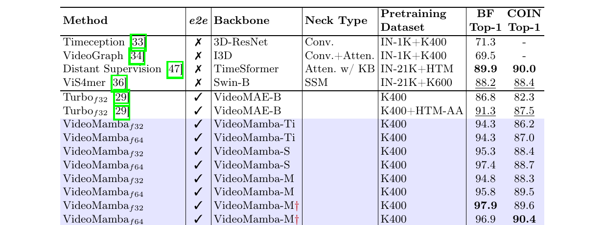

> **Bảng 6:** So sánh với state-of-the-art trên Breakfast và COIN. `e2e` có nghĩa là các phương pháp end-to-end không có bước trích xuất đặc trưng tốn kém. Ký hiệu $\dagger$ đánh dấu backbone có masked pretraining.

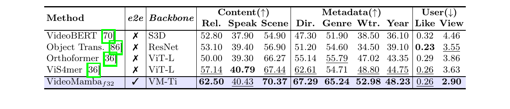

> **Bảng 7:** So sánh với state-of-the-art trên LVU. `e2e` có nghĩa là các phương pháp end-to-end không có bước trích xuất đặc trưng tốn kém. `Rel.`, `Dir.` và `Wtr.` lần lượt chỉ `Relation`, `Director` và `Writer`.

#### Kết quả

Như được minh họa trong Hình 1, độ phức tạp tuyến tính của VideoMamba làm cho nó rất phù hợp với huấn luyện end-to-end bằng các video có thời lượng dài. Các so sánh trong Bảng 6 và 7 làm nổi bật tính đơn giản và hiệu quả của VideoMamba trước các phương pháp truyền thống dựa trên đặc trưng [36,47] trên các tác vụ này. Nó tạo ra các cải thiện hiệu năng đáng kể, đạt các kết quả SOTA ngay cả với kích thước mô hình nhỏ hơn.

Ví dụ, VideoMamba-Ti cho thấy mức tăng đáng chú ý $+6.1\%$ so với ViS4mer sử dụng các đặc trưng Swin-B và mức tăng $+3.0\%$ so với phương pháp căn chỉnh đa phương thức của Turbo [29]. Đáng chú ý, các kết quả nhấn mạnh tác động tích cực của việc tăng quy mô mô hình và số lượng frame đối với các tác vụ dài hạn. Trong tập hợp đa dạng và đầy thách thức gồm chín tác vụ do LVU đưa ra, VideoMamba-Ti của chúng tôi, được fine-tune theo cách end-to-end, cung cấp các kết quả nổi bật hoặc tương đương với các phương pháp SOTA hiện tại. Các kết quả này không chỉ làm nổi bật hiệu quả của VideoMamba mà còn cho thấy tiềm năng lớn của nó đối với việc hiểu video dài trong tương lai.

### 4.4. Hiểu video đa phương thức (Multi-modality Video Understanding)

#### Các tập dữ liệu và thiết lập

Theo UMT [43], chúng tôi sử dụng các cặp video-văn bản WebVid-2M [3] và các cặp ảnh-văn bản CC3M [65] để joint pretraining với bốn mục tiêu:

1. *vision-text contrastive learning* (học tương phản thị giác-văn bản) [3];
2. *vision-text matching* (ghép cặp thị giác-văn bản) [40];
3. *masked language modeling* (mô hình hóa ngôn ngữ có che) [15];
4. *unmasked token alignment* (căn chỉnh token không bị che) [43].

Ban đầu, chúng tôi che $50\%$ token ảnh và $80\%$ token video, tiến hành pretraining trên 8 frame trong 10 epoch. Xét độ nhạy của Mamba với thông tin vị trí, một giai đoạn tuning không che bổ sung được thực hiện trong một epoch để tinh chỉnh thêm khả năng hiểu của nó. Để đánh giá, chúng tôi thực hiện các tác vụ *zero-shot video-text retrieval* (truy hồi video-văn bản zero-shot) trên năm benchmark nổi bật, gồm MSRVTT [87], DiDeMo [1], ActivityNet [31], LSMDC [62] và MSVD [10].

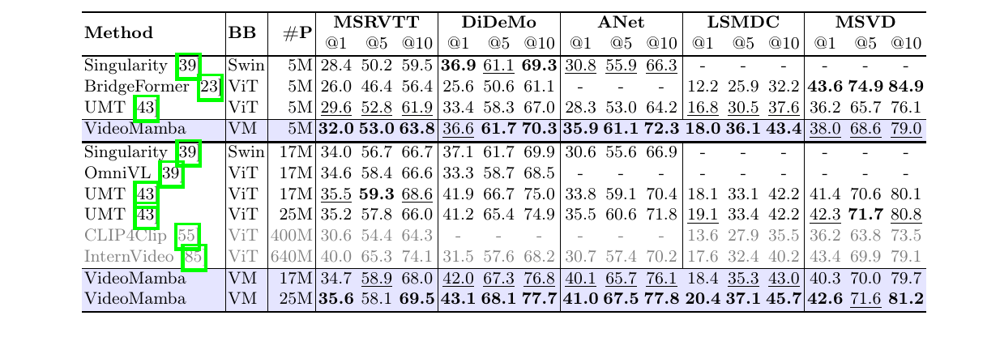

> **Bảng 8:** Truy hồi text-to-video zero-shot trên MSRVTT, DiDeMo, ActivityNet, LSMDC và MSVD. `BB` có nghĩa là visual backbone. `#P` chỉ số lượng cặp pretraining. Các mô hình được pretrain với các cặp quy mô lớn được ghi bằng màu xám.

#### Kết quả

Như được chỉ ra trong Bảng 8, dưới cùng pretraining corpus và các chiến lược huấn luyện tương tự, VideoMamba của chúng tôi đạt hiệu năng truy hồi video zero-shot vượt trội so với UMT [43] dựa trên ViT [16]. Điều này nhấn mạnh hiệu suất và khả năng mở rộng tương đương ViT của Mamba trong việc xử lý các tác vụ video đa phương thức. Đáng chú ý, đối với các tập dữ liệu có độ dài video lớn hơn, ví dụ ActivityNet và DiDeMo, và các bối cảnh phức tạp hơn, ví dụ LSMDC, VideoMamba cho thấy một sự cải thiện đáng kể. Điều này cho thấy năng lực của Mamba đối với các yêu cầu của cross-modality alignment ngay cả trong các ngữ cảnh đa phương thức đầy thách thức.

## 5. Kết luận (Conclusion)

Trong bài báo này, chúng tôi đề xuất VideoMamba, một mô hình thuần dựa trên SSM cho việc hiểu video hiệu quả. Các thí nghiệm mở rộng của chúng tôi cho thấy khả năng mở rộng của nó trong miền thị giác, độ nhạy đối với nhận dạng hành động ngắn hạn, tính vượt trội trong việc hiểu video dài hạn và khả năng tương thích với các phương thức khác. Chúng tôi hy vọng nó có thể mở đường cho việc thiết kế mô hình trong tương lai dành cho việc hiểu video dài.

### Hạn chế (Limitations)

Do các hạn chế về tài nguyên, chúng tôi vẫn chưa xác thực đầy đủ khả năng mở rộng của VideoMamba, chẳng hạn như mở rộng VideoMamba sang các kích thước lớn hơn, ví dụ VideoMamba-g, tích hợp các phương thức bổ sung, ví dụ audio, và tích hợp với các large language model để hiểu video ở mức hàng giờ. Bất chấp các hạn chế này, các phát hiện của chúng tôi xác nhận tiềm năng đầy hứa hẹn của VideoMamba, và chúng tôi dự định tiến hành các khảo sát kỹ lưỡng về các năng lực của nó trong tương lai.

## Lời cảm ơn (Acknowledgements)

Công trình này được hỗ trợ một phần bởi Chương trình R&D Trọng điểm Quốc gia Trung Quốc (số 2022ZD0160505) và Quỹ Khoa học Tự nhiên Quốc gia Trung Quốc theo các khoản tài trợ 62272450 và 62076119.

## Tài liệu tham khảo (References)

> Tên tác giả, tên công trình và thông tin xuất bản được giữ nguyên theo bản gốc.

1. Anne Hendricks, L., Wang, O., Shechtman, E., Sivic, J., Darrell, T., Russell, B.: Localizing moments in video with natural language. In: ICCV (2017)
2. Arnab, A., Dehghani, M., Heigold, G., Sun, C., Lučić, M., Schmid, C.: Vivit: A video vision transformer. In: ICCV (2021)
3. Bain, M., Nagrani, A., Varol, G., Zisserman, A.: Frozen in time: A joint video and image encoder for end-to-end retrieval. In: ICCV (2021)
4. Bertasius, G., Wang, H., Torresani, L.: Is space-time attention all you need for video understanding? In: ICML (2021)
5. Brooks, T., Peebles, B., Holmes, C., DePue, W., Guo, Y., Jing, L., Schnurr, D., Taylor, J., Luhman, T., Luhman, E., Ng, C., Wang, R., Ramesh, A.: Video generation models as world simulators (2024), https://openai.com/research/video-generation-models-as-world-simulators
6. Brown, T., Mann, B., Ryder, N., Subbiah, M., Kaplan, J.D., Dhariwal, P., Neelakantan, A., Shyam, P., Sastry, G., Askell, A., et al.: Language models are few-shot learners. In: NeurIPS (2020)
7. Carreira, J., Noland, E., Banki-Horvath, A., Hillier, C., Zisserman, A.: A short note about kinetics-600. ArXiv abs/1808.01340 (2018)
8. Carreira, J., Noland, E., Hillier, C., Zisserman, A.: A short note on the kinetics-700 human action dataset. ArXiv abs/1907.06987 (2019)
9. Carreira, J., Zisserman, A.: Quo vadis, action recognition? a new model and the kinetics dataset. In: CVPR (2017)
10. Chen, D.L., Dolan, W.B.: Collecting highly parallel data for paraphrase evaluation. In: ACL (2011)
11. Chen, G., Huang, Y., Xu, J., Pei, B., Chen, Z., Li, Z., Wang, J., Li, K., Lu, T., Wang, L.: Video mamba suite: State space model as a versatile alternative for video understanding. ArXiv abs/2403.09626 (2024)
12. Cho, J.H., Hariharan, B.: On the efficacy of knowledge distillation. In: ICCV (2019)
13. Das, P., Xu, C., Doell, R.F., Corso, J.J.: A thousand frames in just a few words: Lingual description of videos through latent topics and sparse object stitching. In: CVPR (2013)
14. Deng, J., Dong, W., Socher, R., Li, L.J., Li, K., Fei-Fei, L.: Imagenet: A large-scale hierarchical image database. In: CVPR (2009)
15. Devlin, J., Chang, M.W., Lee, K., Toutanova, K.: Bert: Pre-training of deep bidirectional transformers for language understanding. ArXiv abs/1810.04805 (2018)
16. Dosovitskiy, A., Beyer, L., Kolesnikov, A., Weissenborn, D., Zhai, X., Unterthiner, T., Dehghani, M., Minderer, M., Heigold, G., Gelly, S., Uszkoreit, J., Houlsby, N.: An image is worth 16x16 words: Transformers for image recognition at scale. In: ICLR (2021)
17. Fan, H., Xiong, B., Mangalam, K., Li, Y., Yan, Z., Malik, J., Feichtenhofer, C.: Multiscale vision transformers. In: ICCV (2021)
18. Feichtenhofer, C.: X3d: Expanding architectures for efficient video recognition. In: CVPR (2020)
19. Feichtenhofer, C., Fan, H., Li, Y., He, K.: Masked autoencoders as spatiotemporal learners. NeurIPS (2022)
20. Feichtenhofer, C., Fan, H., Malik, J., He, K.: Slowfast networks for video recognition. In: ICCV (2019)
21. Fu, D.Y., Dao, T., Saab, K.K., Thomas, A.W., Rudra, A., Ré, C.: Hungry hungry hippos: Towards language modeling with state space models. In: ICLR (2023)
22. Gao, J., Sun, C., Yang, Z., Nevatia, R.: Tall: Temporal activity localization via language query. In: ICCV (2017)
23. Ge, Y., Ge, Y., Liu, X., Li, D., Shan, Y., Qie, X., Luo, P.: Bridging video-text retrieval with multiple choice questions. In: CVP (2022)
24. Goyal, R., Kahou, S.E., Michalski, V., Materzynska, J., Westphal, S., Kim, H., Haenel, V., Fründ, I., Yianilos, P., Mueller-Freitag, M., Hoppe, F., Thurau, C., Bax, I., Memisevic, R.: The “something something” video database for learning and evaluating visual common sense. In: ICCV (2017)
25. Gu, A., Dao, T.: Mamba: Linear-time sequence modeling with selective state spaces. ArXiv abs/2312.00752 (2023)
26. Gu, A., Goel, K., Ré, C.: Efficiently modeling long sequences with structured state spaces. In: ICLR (2022)
27. Gu, C., Sun, C., Vijayanarasimhan, S., Pantofaru, C., Ross, D.A., Toderici, G., Li, Y., Ricco, S., Sukthankar, R., Schmid, C., Malik, J.: Ava: A video dataset of spatio-temporally localized atomic visual actions. CVPR (2017)
28. Guo, H., Li, J., Dai, T., Ouyang, Z., Ren, X., Xia, S.T.: Mambair: A simple baseline for image restoration with state-space model. ArXiv abs/2402.15648 (2024)
29. Han, T., Xie, W., Zisserman, A.: Turbo training with token dropout. In: BMVC (2022)
30. He, X., Cao, K., Yan, K., Li, R., Xie, C., Zhang, J., Zhou, M.: Pan-mamba: Effective pan-sharpening with state space model. ArXiv abs/2402.12192 (2024)
31. Heilbron, F.C., Escorcia, V., Ghanem, B., Niebles, J.C.: Activitynet: A large-scale video benchmark for human activity understanding. In: CVPR (2015)
32. Hu, V.T., Baumann, S.A., Gui, M., Grebenkova, O., Ma, P., Fischer, J.S., Ommer, B.: Zigma: A dit-style zigzag mamba diffusion model. In: ECCV (2024)
33. Hussein, N., Gavves, E., Smeulders, A.W.M.: Timeception for complex action recognition. In: CVPR (2019)
34. Hussein, N., Gavves, E., Smeulders, A.W.M.: Videograph: Recognizing minuteslong human activities in videos. ArXiv abs/1905.05143 (2019)
35. Idrees, H., Zamir, A.R., Jiang, Y.G., Gorban, A., Laptev, I., Sukthankar, R., Shah, M.: The thumos challenge on action recognition for videos “in the wild”. Computer Vision and Image Understanding (2017)
36. Islam, M.M., Bertasius, G.: Long movie clip classification with state-space video models. In: ECCV (2022)
37. Kay, W., Carreira, J., Simonyan, K., Zhang, B., Hillier, C., Vijayanarasimhan, S., Viola, F., Green, T., Back, T., Natsev, A., Suleyman, M., Zisserman, A.: The kinetics human action video dataset. ArXiv abs/1705.06950 (2017)
38. Kuehne, H., Arslan, A., Serre, T.: The language of actions: Recovering the syntax and semantics of goal-directed human activities. In: CVPR (2014)
39. Lei, J., Berg, T.L., Bansal, M.: Revealing single frame bias for video-and-language learning. ArXiv abs/2206.03428 (2022)
40. Li, J., Selvaraju, R., Gotmare, A., Joty, S., Xiong, C., Hoi, S.C.H.: Align before fuse: Vision and language representation learning with momentum distillation. In: NeurIPS (2021)
41. Li, K., Li, X., Wang, Y., Wang, J., Qiao, Y.: Ct-net: Channel tensorization network for video classification. In: ICLR (2020)
42. Li, K., Wang, Y., He, Y., Li, Y., Wang, Y., Wang, L., Qiao, Y.: Uniformerv2: Spatiotemporal learning by arming image vits with video uniformer. In: ICCV (2023)
43. Li, K., Wang, Y., Li, Y., Wang, Y., He, Y., Wang, L., Qiao, Y.: Unmasked teacher: Towards training-efficient video foundation models. In: ICCV (2023)
44. Li, K., Wang, Y., Peng, G., Song, G., Liu, Y., Li, H., Qiao, Y.: Uniformer: Unified transformer for efficient spatial-temporal representation learning. In: ICLR (2022)
45. Li, Y., Wu, C., Fan, H., Mangalam, K., Xiong, B., Malik, J., Feichtenhofer, C.: Improved multiscale vision transformers for classification and detection. ArXiv abs/2112.01526 (2021)
46. Liang, D., Zhou, X., Wang, X., Zhu, X., Xu, W., Zou, Z., Ye, X., Bai, X.: Pointmamba: A simple state space model for point cloud analysis. ArXiv abs/2402.10739 (2024)
47. Lin, X., Petroni, F., Bertasius, G., Rohrbach, M., Chang, S.F., Torresani, L.: Learning to recognize procedural activities with distant supervision. CVPR (2022)
48. Liu, H., Yan, W., Zaharia, M., Abbeel, P.: World model on million-length video and language with ringattention. ArXiv abs/2402.08268 (2024)
49. Liu, Y., Wang, L., Wang, Y., Ma, X., Qiao, Y.: Fineaction: A fine-grained video dataset for temporal action localization. TIP (2022)
50. Liu, Y., Tian, Y., Zhao, Y., Yu, H., Xie, L., Wang, Y., Ye, Q., Liu, Y.: Vmamba: Visual state space model. ArXiv abs/2401.10166 (2024)
51. Liu, Z., Lin, Y., Cao, Y., Hu, H., Wei, Y., Zhang, Z., Lin, S., Guo, B.: Swin transformer: Hierarchical vision transformer using shifted windows. In: ICCV (2021)
52. Liu, Z., Ning, J., Cao, Y., Wei, Y., Zhang, Z., Lin, S., Hu, H.: Video swin transformer. In: CVPR (2022)
53. Liu, Z., Mao, H., Wu, C., Feichtenhofer, C., Darrell, T., Xie, S.: A convnet for the 2020s. In: CVPR (2022)
54. Lu, J., Batra, D., Parikh, D., Lee, S.: Vilbert: Pretraining task-agnostic visiolinguistic representations for vision-and-language tasks. NeurIPS (2019)
55. Luo, H., Ji, L., Zhong, M., Chen, Y., Lei, W., Duan, N., Li, T.: Clip4clip: An empirical study of clip for end to end video clip retrieval and captioning. Neurocomputing (2022)
56. Ma, J., Li, F., Wang, B.: U-mamba: Enhancing long-range dependency for biomedical image segmentation. ArXiv abs/2401.04722 (2024)
57. Mehta, H., Gupta, A., Cutkosky, A., Neyshabur, B.: Long range language modeling via gated state spaces. ArXiv abs/2206.13947 (2022)
58. Miech, A., Zhukov, D., Alayrac, J.B., Tapaswi, M., Laptev, I., Sivic, J.: Howto100m: Learning a text-video embedding by watching hundred million narrated video clips. In: ICCV (2019)
59. Nguyen, E., Goel, K., Gu, A., Downs, G.W., Shah, P., Dao, T., Baccus, S.A., Ré, C.: S4nd: Modeling images and videos as multidimensional signals with state spaces. In: NeurIPS (2022)
60. Patrick, M., Campbell, D., Asano, Y., Misra, I., Metze, F., Feichtenhofer, C., Vedaldi, A., Henriques, J.F.: Keeping your eye on the ball: Trajectory attention in video transformers. In: NeurIPS (2021)
61. Radford, A., Kim, J.W., Hallacy, C., Ramesh, A., Goh, G., Agarwal, S., Sastry, G., Askell, A., Mishkin, P., Clark, J., Krueger, G., Sutskever, I.: Learning transferable visual models from natural language supervision. In: ICML (2021)
62. Rohrbach, A., Torabi, A., Rohrbach, M., Tandon, N., Pal, C.J., Larochelle, H., Courville, A.C., Schiele, B.: Movie description. International Journal of Computer Vision (2016)
63. Shao, D., Zhao, Y., Dai, B., Lin, D.: Finegym: A hierarchical video dataset for fine-grained action understanding. CVPR (2020)
64. Sharir, G., Noy, A., Zelnik-Manor, L.: An image is worth 16x16 words, what is a video worth? ArXiv abs/2103.13915 (2021)
65. Sharma, P., Ding, N., Goodman, S., Soricut, R.: Conceptual captions: A cleaned, hypernymed, image alt-text dataset for automatic image captioning. In: ACL (2018)
66. Simonyan, K., Zisserman, A.: Two-stream convolutional networks for action recognition in videos. NeurIPS (2014)
67. Smith, J.T., Warrington, A., Linderman, S.W.: Simplified state space layers for sequence modeling. In: ICLR (2023)
68. Soomro, K., Zamir, A.R., Shah, M.: Ucf101: A dataset of 101 human actions classes from videos in the wild. arXiv preprint arXiv:1212.0402 (2012)
69. Su, J., Lu, Y., Pan, S., Wen, B., Liu, Y.: Roformer: Enhanced transformer with rotary position embedding. ArXiv abs/2104.09864 (2021)
70. Sun, C., Myers, A., Vondrick, C., Murphy, K., Schmid, C.: Videobert: A joint model for video and language representation learning. In: ICCV (2019)
71. Sun, Y., Dong, L., Huang, S., Ma, S., Xia, Y., Xue, J., Wang, J., Wei, F.: Retentive network: A successor to transformer for large language models. ArXiv abs/2307.08621 (2023)
72. Tang, Y., Ding, D., Rao, Y., Zheng, Y., Zhang, D., Zhao, L., Lu, J., Zhou, J.: Coin: A large-scale dataset for comprehensive instructional video analysis. In: CVPR (2019)
73. Team, G.: Gemini: A family of highly capable multimodal models. ArXiv abs/2312.11805 (2023)
74. Team, R.: Rwkv: Reinventing rnns for the transformer era. In: EMNLP (2023)
75. Tong, Z., Song, Y., Wang, J., Wang, L.: VideoMAE: Masked autoencoders are data-efficient learners for self-supervised video pre-training. In: NeurIPS (2022)
76. Touvron, H., Cord, M., Douze, M., Massa, F., Sablayrolles, A., J’egou, H.: Training data-efficient image transformers & distillation through attention. In: ICML (2021)
77. Tran, D., Bourdev, L.D., Fergus, R., Torresani, L., Paluri, M.: Learning spatiotemporal features with 3d convolutional networks. In: IEEE International Conference on Computer Vision (2015)
78. Tran, D., xiu Wang, H., Torresani, L., Ray, J., LeCun, Y., Paluri, M.: A closer look at spatiotemporal convolutions for action recognition. In: CVPR (2018)
79. Wang, C., Tsepa, O., Ma, J., Wang, B.: Graph-mamba: Towards long-range graph sequence modeling with selective state spaces. ArXiv abs/2402.00789 (2024)
80. Wang, J., Yan, J.N., Gu, A., Rush, A.M.: Pretraining without attention. ArXiv abs/2212.10544 (2022)
81. Wang, L., Tong, Z., Ji, B., Wu, G.: TDN: Temporal difference networks for efficient action recognition. In: CVPR (2021)
82. Wang, L., Xiong, Y., Wang, Z., Qiao, Y., Lin, D., Tang, X., Gool, L.V.: Temporal segment networks: Towards good practices for deep action recognition. In: ECCV (2016)
83. Wang, R., Chen, D., Wu, Z., Chen, Y., Dai, X., Liu, M., Jiang, Y.G., Zhou, L., Yuan, L.: Bevt: Bert pretraining of video transformers. CVPR (2022)
84. Wang, Y., He, Y., Li, Y., Li, K., Yu, J., Ma, X.J., Chen, X., Wang, Y., Luo, P., Liu, Z., Wang, Y., Wang, L., Qiao, Y.: Internvid: A large-scale video-text dataset for multimodal understanding and generation. In: ICLR (2024)
85. Wang, Y., Li, K., Li, Y., He, Y., Huang, B., Zhao, Z., Zhang, H., Xu, J., Liu, Y., Wang, Z., Xing, S., Chen, G., Pan, J., Yu, J., Wang, Y., Wang, L., Qiao, Y.: Internvideo: General video foundation models via generative and discriminative learning. ArXiv abs/2212.03191 (2022)
86. Wu, C.Y., Krahenbuhl, P.: Towards long-form video understanding. In: CVPR (2021)
87. Xu, J., Mei, T., Yao, T., Rui, Y.: Msr-vtt: A large video description dataset for bridging video and language. In: CVPR (2016)
88. Yang, Y., Xing, Z., Zhu, L.: Vivim: a video vision mamba for medical video object segmentation. ArXiv abs/2401.14168 (2024)
89. Yu, Z., Xu, D., Yu, J., Yu, T., Zhao, Z., Zhuang, Y., Tao, D.: Activitynet-qa: A dataset for understanding complex web videos via question answering. In: AAAI (2019)
90. Zhang, D.J., Li, K., Wang, Y., Chen, Y., Chandra, S., Qiao, Y., Liu, L., Shou, M.Z.: Morphmlp: An efficient mlp-like backbone for spatial-temporal representation learning. In: ECCV (2022)
91. Zhu, L., Liao, B., Zhang, Q., Wang, X., Liu, W., Wang, X.: Vision mamba: Efficient visual representation learning with bidirectional state space model. ArXiv abs/2401.09417 (2024)
92. Zhuang, S., Li, K., Chen, X., Wang, Y., Liu, Z., Qiao, Y., Wang, Y.: Vlogger: Make your dream a vlog. ArXiv abs/2401.09414 (2024)
