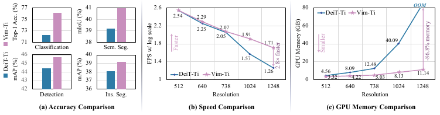
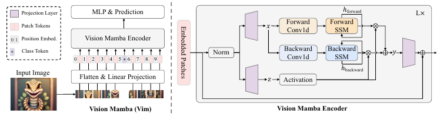
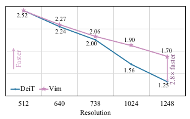
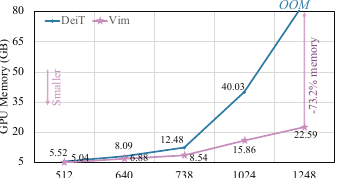
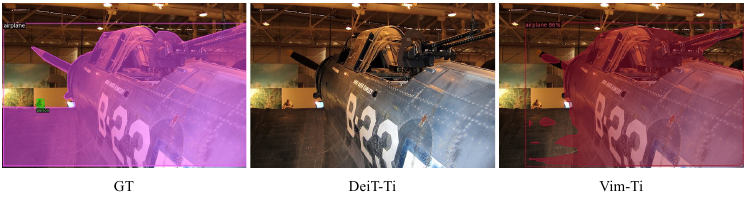

# Vision Mamba: Học biểu diễn thị giác hiệu quả bằng mô hình không gian trạng thái hai chiều

**Tên bài báo gốc:** *Vision Mamba: Efficient Visual Representation Learning with Bidirectional State Space Model*  
**Tác giả:** Lianghui Zhu, Bencheng Liao, Qian Zhang, Xinlong Wang, Wenyu Liu, Xinggang Wang  
**Công bố:** *Proceedings of the 41st International Conference on Machine Learning (ICML 2024)*, PMLR 235, Vienna, Austria  
**Mã nguồn:** <https://github.com/hustvl/Vim>

> **Quy ước bản dịch:** Các thuật ngữ kỹ thuật quan trọng được giữ bằng English và bổ sung nghĩa tiếng Việt ở lần xuất hiện đầu tiên, ví dụ: *state space model* (mô hình không gian trạng thái, SSM), *self-attention* (cơ chế tự chú ý), *backbone* (mạng trích xuất đặc trưng nền), *patch* (mảnh ảnh), *embedding* (biểu diễn nhúng), *fine-tuning* (tinh chỉnh).



> **Hình 1:** So sánh hiệu năng và hiệu quả giữa DeiT (Touvron et al., 2021a) và mô hình Vim. Kết quả cho thấy Vim vượt DeiT trên cả phân loại ImageNet lẫn các tác vụ hạ nguồn gồm phát hiện và phân đoạn, đồng thời hiệu quả hơn về tính toán và bộ nhớ. Ví dụ, Vim nhanh hơn DeiT 2,8 lần và tiết kiệm 86,8% bộ nhớ GPU khi suy luận theo batch để trích xuất đặc trưng từ ảnh độ phân giải $1248 \times 1248$, tức khoảng 6.084 token trên mỗi ảnh.

## Tóm tắt (Abstract)

Gần đây, các mô hình không gian trạng thái (state space models - SSMs) với thiết kế hiệu quả, nhận biết phần cứng, tức mô hình học sâu Mamba, đã cho thấy tiềm năng lớn cho mô hình hóa chuỗi dài. Đồng thời, việc xây dựng các backbone thị giác hiệu quả và tổng quát hoàn toàn dựa trên SSMs là một hướng đi hấp dẫn. Tuy nhiên, biểu diễn dữ liệu thị giác là thách thức đối với SSMs do dữ liệu thị giác nhạy cảm với vị trí và yêu cầu ngữ cảnh toàn cục cho hiểu biết thị giác. Trong bài báo này, chúng tôi chỉ ra rằng sự phụ thuộc vào self-attention cho học biểu diễn thị giác là không cần thiết và đề xuất một backbone thị giác tổng quát mới với các khối Mamba hai chiều (Vim), đánh dấu các chuỗi ảnh bằng position embeddings và nén biểu diễn thị giác bằng các mô hình không gian trạng thái hai chiều. Trên các tác vụ phân loại ImageNet, phát hiện đối tượng COCO, và phân đoạn ngữ nghĩa ADE20k, Vim đạt hiệu năng cao hơn so với các vision transformers đã được thiết lập vững chắc như DeiT, đồng thời cũng thể hiện hiệu quả tính toán và bộ nhớ được cải thiện đáng kể. Ví dụ, Vim nhanh hơn DeiT 2.8× và tiết kiệm 86.8% bộ nhớ GPU khi thực hiện suy luận theo batch để trích xuất đặc trưng trên ảnh có độ phân giải 1248×1248. Các kết quả chứng minh rằng Vim có khả năng vượt qua các ràng buộc về tính toán và bộ nhớ khi thực hiện hiểu biết kiểu Transformer cho ảnh độ phân giải cao, và có tiềm năng lớn trở thành backbone thế hệ tiếp theo cho các mô hình nền tảng thị giác. Mã nguồn và mô hình được phát hành tại https://github.com/hustvl/Vim

## 1. Giới thiệu (Introduction)

Những tiến bộ nghiên cứu gần đây đã dẫn đến sự gia tăng mạnh mẽ mối quan tâm đối với mô hình không gian trạng thái (state space model - SSM). Bắt nguồn từ mô hình bộ lọc Kalman cổ điển (Kalman, 1960), các SSM hiện đại vượt trội trong việc nắm bắt các phụ thuộc tầm xa và hưởng lợi từ huấn luyện song song. Một số phương pháp dựa trên SSM, chẳng hạn các lớp không gian trạng thái tuyến tính (linear state-space layers - LSSL) (Gu et al., 2021b), mô hình chuỗi không gian trạng thái có cấu trúc (structured state space sequence model - S4) (Gu et al., 2021a), không gian trạng thái đường chéo (diagonal state space - DSS) (Gupta et al., 2022), và S4D (Gu et al., 2022), được đề xuất để xử lý dữ liệu chuỗi trên một phạm vi rộng các tác vụ và phương thức, đặc biệt trong mô hình hóa các phụ thuộc tầm xa. Chúng hiệu quả trong xử lý chuỗi dài nhờ tính toán tích chập và tính toán gần tuyến tính. 2-D SSM (Baron et al., 2023), SGConvNeXt (Li et al., 2022b), và ConvSSM (Smith et al., 2023a) kết hợp SSM với kiến trúc CNN hoặc Transformer để xử lý dữ liệu 2-D. Công trình gần đây, Mamba (Gu & Dao, 2023), đưa các tham số biến thiên theo thời gian vào SSM và đề xuất một thuật toán nhận biết phần cứng để cho phép huấn luyện và suy luận rất hiệu quả. Hiệu năng mở rộng vượt trội của Mamba cho thấy nó là một giải pháp thay thế đầy hứa hẹn cho Transformer trong mô hình hóa ngôn ngữ. Tuy nhiên, một mạng backbone tổng quát thuần dựa trên SSM vẫn chưa được khám phá để xử lý dữ liệu thị giác, chẳng hạn ảnh và video.

Vision Transformers (ViTs) đã đạt được thành công lớn trong học biểu diễn thị giác, vượt trội trong tiền huấn luyện tự giám sát quy mô lớn và đạt hiệu năng cao trên các tác vụ hạ nguồn. So với các mạng nơ-ron tích chập, lợi thế cốt lõi nằm ở việc ViT có thể cung cấp cho từng patch ảnh ngữ cảnh toàn cục phụ thuộc vào dữ liệu/patch thông qua self-attention. Điều này khác với các mạng tích chập sử dụng cùng các tham số, tức các bộ lọc tích chập, cho mọi vị trí. Một lợi thế khác là mô hình hóa bất khả tri phương thức bằng cách xem ảnh như một chuỗi các patch mà không có thiên kiến quy nạp 2D, khiến nó trở thành kiến trúc được ưu tiên cho các ứng dụng đa phương thức (Bavishi et al., 2023; Li et al., 2023; Liu et al., 2023). Đồng thời, cơ chế self-attention trong Transformers đặt ra các thách thức về tốc độ và mức sử dụng bộ nhớ khi xử lý các phụ thuộc thị giác tầm xa, ví dụ xử lý ảnh độ phân giải cao.

Được thúc đẩy bởi thành công của Mamba trong mô hình hóa ngôn ngữ, việc chuyển thành công này từ ngôn ngữ sang thị giác, tức thiết kế một backbone thị giác tổng quát và hiệu quả với phương pháp SSM tiên tiến, là điều hấp dẫn. Tuy nhiên, Mamba có hai thách thức, tức mô hình hóa một chiều và thiếu nhận thức vị trí. Để giải quyết các thách thức này, chúng tôi đề xuất mô hình Vision Mamba (Vim), tích hợp các SSM hai chiều cho mô hình hóa ngữ cảnh thị giác toàn cục phụ thuộc dữ liệu và position embeddings cho nhận dạng thị giác nhận biết vị trí. Trước tiên, chúng tôi chia ảnh đầu vào thành các patch và chiếu tuyến tính chúng thành các vector đưa vào Vim. Các patch ảnh được xem là dữ liệu chuỗi trong các khối Vim, nơi nén hiệu quả biểu diễn thị giác bằng không gian trạng thái chọn lọc hai chiều được đề xuất. Hơn nữa, position embedding trong khối Vim cung cấp nhận thức về thông tin không gian, giúp Vim mạnh mẽ hơn trong các tác vụ dự đoán dày đặc. Ở giai đoạn hiện tại, chúng tôi huấn luyện mô hình Vim trên tác vụ phân loại ảnh có giám sát bằng bộ dữ liệu ImageNet và sau đó dùng Vim đã tiền huấn luyện làm backbone để thực hiện học biểu diễn thị giác tuần tự cho các tác vụ dự đoán dày đặc hạ nguồn, tức phân đoạn ngữ nghĩa, phát hiện đối tượng, và phân đoạn thực thể. Giống Transformers, Vim có thể được tiền huấn luyện trên dữ liệu thị giác không giám sát quy mô lớn để có biểu diễn thị giác tốt hơn. Nhờ hiệu quả tốt hơn của Mamba, tiền huấn luyện quy mô lớn của Vim có thể đạt được với chi phí tính toán thấp hơn.

So với các mô hình dựa trên SSM khác cho tác vụ thị giác, Vim là một phương pháp thuần dựa trên SSM và mô hình hóa ảnh theo cách tuần tự, hứa hẹn hơn cho một backbone tổng quát và hiệu quả. Nhờ mô hình hóa nén hai chiều với nhận thức vị trí, Vim là mô hình thuần dựa trên SSM đầu tiên xử lý các tác vụ dự đoán dày đặc. So với mô hình dựa trên Transformer thuyết phục nhất, tức DeiT (Touvron et al., 2021a), Vim đạt hiệu năng vượt trội trên phân loại ImageNet. Hơn nữa, Vim hiệu quả hơn về bộ nhớ GPU và thời gian suy luận cho ảnh độ phân giải cao. Hiệu quả về bộ nhớ và tốc độ cho phép Vim trực tiếp thực hiện học biểu diễn thị giác tuần tự mà không dựa vào các prior 2D (chẳng hạn cửa sổ cục bộ 2D trong ViTDet (Li et al., 2022c)) cho các tác vụ hiểu biết thị giác độ phân giải cao, trong khi đạt độ chính xác cao hơn DeiT.

Các đóng góp chính của chúng tôi có thể được tóm tắt như sau:

- Chúng tôi đề xuất Vision Mamba (Vim), tích hợp SSM hai chiều cho mô hình hóa ngữ cảnh thị giác toàn cục phụ thuộc dữ liệu và position embeddings cho hiểu biết thị giác nhận biết vị trí.
- Không cần attention, Vim được đề xuất có cùng năng lực mô hình hóa như ViT trong khi chỉ có độ phức tạp tính toán dưới bậc hai và độ phức tạp bộ nhớ tuyến tính. Cụ thể, Vim nhanh hơn DeiT 2.8× và tiết kiệm 86.8% bộ nhớ GPU khi thực hiện suy luận theo batch để trích xuất đặc trưng trên ảnh ở độ phân giải 1248×1248.
- Chúng tôi tiến hành các thí nghiệm mở rộng trên phân loại ImageNet và các tác vụ dự đoán dày đặc hạ nguồn. Kết quả chứng minh rằng Vim đạt hiệu năng vượt trội so với plain vision Transformer đã được thiết lập vững chắc và tối ưu hóa cao, tức DeiT.

## 2. Công trình liên quan (Related Work)

**Kiến trúc cho backbone thị giác tổng quát.** Trong giai đoạn đầu, ConvNet (LeCun et al., 1998) đóng vai trò là thiết kế mạng tiêu chuẩn trên thực tế cho thị giác máy tính. Nhiều kiến trúc nơ-ron tích chập (Krizhevsky et al., 2012; Szegedy et al., 2015; Simonyan & Zisserman, 2014; He et al., 2016; Tan & Le, 2019; Wang et al., 2020a; Huang et al., 2017; Xie et al., 2017; Tan & Le, 2021; Radosavovic et al., 2020) đã được đề xuất làm backbone thị giác cho nhiều ứng dụng thị giác khác nhau. Công trình tiên phong Vision Transformer (ViT) (Dosovitskiy et al., 2020) đã làm thay đổi cục diện. Nó xem một ảnh như một chuỗi các patch 2D đã được làm phẳng và trực tiếp áp dụng một kiến trúc Transformer thuần túy. Các kết quả đáng kinh ngạc của ViT trên phân loại ảnh cùng khả năng mở rộng của nó đã thúc đẩy nhiều công trình tiếp nối (Touvron et al., 2021b; Tolstikhin et al., 2021; Touvron et al., 2022; Fang et al., 2022). Một hướng nghiên cứu tập trung vào thiết kế kiến trúc lai bằng cách đưa các prior tích chập 2D vào ViT (Wu et al., 2021; Dai et al., 2021; d’Ascoli et al., 2021; Dong et al., 2022). PVT (Wang et al., 2021) đề xuất một Transformer có cấu trúc kim tự tháp. Swin Transformer (Liu et al., 2021) áp dụng self-attention trong các cửa sổ dịch chuyển. Một hướng nghiên cứu khác tập trung cải thiện các ConvNet 2D truyền thống bằng những thiết lập tiên tiến hơn (Wang et al., 2023b; Liu et al., 2022a). ConvNeXt (Liu et al., 2022b) xem xét không gian thiết kế và đề xuất các ConvNet thuần túy có thể mở rộng tương tự ViT cùng các biến thể của nó. RepLKNet (Ding et al., 2022) đề xuất tăng kích thước kernel của các ConvNet hiện có để mang lại cải thiện.

Mặc dù các công trình tiếp nối chủ đạo này thể hiện hiệu năng vượt trội và hiệu quả tốt hơn trên ImageNet (Deng et al., 2009) cùng nhiều tác vụ hạ nguồn (Lin et al., 2014; Zhou et al., 2019) bằng cách đưa vào các prior 2D, trước sự bùng nổ của tiền huấn luyện thị giác quy mô lớn (Bao et al., 2022; Fang et al., 2023; Caron et al., 2021) và các ứng dụng đa phương thức (Radford et al., 2021; Li et al., 2022a; 2023; Liu et al., 2023; Bavishi et al., 2023; Jia et al., 2021), mô hình kiểu Transformer nguyên bản đã quay trở lại vị trí trung tâm của thị giác máy tính. Các ưu điểm như năng lực mô hình hóa lớn hơn, biểu diễn đa phương thức thống nhất, phù hợp với học tự giám sát, v.v., khiến nó trở thành kiến trúc được ưu tiên. Tuy nhiên, số lượng token thị giác bị giới hạn do độ phức tạp bậc hai của Transformer. Có nhiều công trình (Choromanski et al., 2021; Wang et al., 2020b; Kitaev et al., 2020; Child et al., 2019; Ding et al., 2023; Qin et al., 2023; Sun et al., 2023) nhằm giải quyết thách thức nổi bật và tồn tại lâu dài này, nhưng chỉ một số ít tập trung vào các ứng dụng thị giác. Gần đây, LongViT (Wang et al., 2023c) xây dựng một kiến trúc Transformer hiệu quả cho các ứng dụng bệnh học tính toán thông qua dilated attention. Độ phức tạp tính toán tuyến tính của LongViT cho phép nó mã hóa chuỗi thị giác cực dài. Trong công trình này, chúng tôi lấy cảm hứng từ Mamba (Gu & Dao, 2023) và khám phá việc xây dựng một mô hình thuần dựa trên SSM làm backbone thị giác tổng quát mà không sử dụng attention, đồng thời duy trì ưu điểm mô hình hóa tuần tự, bất khả tri phương thức của ViT.

**Các mô hình không gian trạng thái cho mô hình hóa chuỗi dài.** (Gu et al., 2021a) đề xuất mô hình Structured State-Space Sequence (S4), một phương án thay thế mới cho CNN hoặc Transformer để mô hình hóa phụ thuộc tầm xa. Đặc tính đầy hứa hẹn về khả năng mở rộng tuyến tính theo độ dài chuỗi đã thu hút các nghiên cứu sâu hơn. (Wang et al., 2022) đề xuất Bidirectional Gated SSM để tái tạo kết quả của BERT (Devlin et al., 2018) mà không cần attention. (Smith et al., 2023b) đề xuất một lớp S5 mới bằng cách đưa MIMO SSM và phép quét song song hiệu quả vào lớp S4. (Fu et al., 2023) thiết kế một lớp SSM mới, H3, gần như thu hẹp hoàn toàn khoảng cách hiệu năng giữa SSM và Transformer attention trong mô hình hóa ngôn ngữ. (Mehta et al., 2023) xây dựng lớp Gated State Space trên S4 bằng cách bổ sung nhiều đơn vị gating hơn để cải thiện khả năng biểu đạt. Gần đây, (Gu & Dao, 2023) đề xuất một lớp SSM phụ thuộc dữ liệu và xây dựng Mamba, một backbone mô hình ngôn ngữ tổng quát vượt trội hơn Transformers ở nhiều kích thước khác nhau trên dữ liệu thực quy mô lớn, đồng thời có khả năng mở rộng tuyến tính theo độ dài chuỗi. Trong công trình này, chúng tôi khám phá việc chuyển thành công của Mamba sang thị giác, tức xây dựng một backbone thị giác tổng quát hoàn toàn dựa trên SSM mà không dùng attention.

**Các mô hình không gian trạng thái cho ứng dụng thị giác.** (Islam & Bertasius, 2022) sử dụng S4 1D để xử lý các phụ thuộc thời gian tầm xa cho phân loại video. (Nguyen et al., 2022) tiếp tục mở rộng S4 1D để xử lý dữ liệu đa chiều, bao gồm ảnh 2D và video 3D. (Islam et al., 2023) kết hợp các thế mạnh của S4 và self-attention để xây dựng mô hình TranS4mer, đạt hiệu năng tiên tiến nhất cho phát hiện cảnh phim. (Wang et al., 2023a) đưa một cơ chế chọn lọc mới vào S4, cải thiện đáng kể hiệu năng của S4 trong hiểu video thời lượng dài với mức sử dụng bộ nhớ thấp hơn nhiều. (Yan et al., 2023) thay thế các cơ chế attention bằng một backbone dựa trên SSM có khả năng mở rộng tốt hơn để sinh ảnh độ phân giải cao và xử lý biểu diễn chi tiết với chi phí tính toán hợp lý. (Ma et al., 2024) đề xuất U-Mamba, một kiến trúc lai CNN-SSM, để xử lý các phụ thuộc tầm xa trong phân đoạn ảnh y sinh. Các công trình trên (Xing et al., 2024; Ma et al., 2024; Yan et al., 2023; Wang et al., 2023a; Islam et al., 2023; Nguyen et al., 2022; Islam & Bertasius, 2022) hoặc áp dụng SSM cho các ứng dụng thị giác cụ thể, hoặc xây dựng một kiến trúc lai bằng cách kết hợp SSM với convolution hay attention. Khác với chúng, chúng tôi xây dựng một mô hình thuần dựa trên SSM có thể được sử dụng làm backbone thị giác tổng quát. Đáng chú ý, VMamba (Liu et al., 2024), một công trình được thực hiện đồng thời với phương pháp của chúng tôi, đã chứng minh các kết quả ấn tượng trong nhận dạng thị giác bằng cách kết hợp Mamba với phép quét đa hướng và kiến trúc mạng phân cấp. Ngược lại, Vim chủ yếu tập trung vào học chuỗi thị giác và cung cấp một biểu diễn thống nhất cho dữ liệu đa phương thức.

## 3. Phương pháp (Method)

Mục tiêu của Vision Mamba (Vim) là đưa mô hình không gian trạng thái (state space model - SSM) tiên tiến, tức Mamba (Gu & Dao, 2023), vào thị giác máy tính. Mục này bắt đầu bằng phần mô tả kiến thức sơ bộ về SSM. Tiếp theo là phần tổng quan về Vim. Sau đó, chúng tôi trình bày chi tiết cách khối Vim xử lý các chuỗi token đầu vào và tiếp tục minh họa các chi tiết kiến trúc của Vim. Mục này kết thúc bằng phần phân tích hiệu quả của Vim được đề xuất.

### 3.1. Kiến thức nền (Preliminaries)

Các mô hình dựa trên SSM, tức các mô hình chuỗi không gian trạng thái có cấu trúc (S4) và Mamba, được lấy cảm hứng từ hệ liên tục, ánh xạ một hàm hoặc chuỗi 1-D $x(t) \in \mathbb{R}$ thành $y(t) \in \mathbb{R}$ thông qua trạng thái ẩn $h(t) \in \mathbb{R}^{N}$. Hệ này sử dụng $\mathbf{A} \in \mathbb{R}^{N \times N}$ làm tham số diễn tiến và $\mathbf{B} \in \mathbb{R}^{N \times 1}$, $\mathbf{C} \in \mathbb{R}^{1 \times N}$ làm các tham số chiếu. Hệ liên tục hoạt động như sau: $h'(t) = \mathbf{A}h(t) + \mathbf{B}x(t)$ và $y(t) = \mathbf{C}h(t)$.

S4 và Mamba là các phiên bản rời rạc của hệ liên tục, trong đó có một tham số thang thời gian $\Delta$ để chuyển các tham số liên tục $\mathbf{A}, \mathbf{B}$ thành các tham số rời rạc $\overline{\mathbf{A}}, \overline{\mathbf{B}}$. Phương pháp chuyển đổi thường được sử dụng là giữ bậc không (zero-order hold - ZOH), được định nghĩa như sau:

$$
\begin{aligned}
\overline{\mathbf{A}} &= \exp(\Delta \mathbf{A}), \\
\overline{\mathbf{B}} &= (\Delta \mathbf{A})^{-1}\bigl(\exp(\Delta \mathbf{A}) - \mathbf{I}\bigr) \cdot \Delta \mathbf{B}.
\end{aligned}
\tag{1}
$$

Sau khi rời rạc hóa $\mathbf{A}, \mathbf{B}$, phiên bản rời rạc sử dụng bước $\Delta$ có thể được viết lại như sau:

$$
\begin{aligned}
h_t &= \overline{\mathbf{A}}h_{t-1} + \overline{\mathbf{B}}x_t, \\
y_t &= \mathbf{C}h_t.
\end{aligned}
\tag{2}
$$

Cuối cùng, các mô hình tính toán đầu ra thông qua một phép tích chập toàn cục:

$$
\begin{aligned}
\overline{\mathbf{K}} &= \left(\mathbf{C}\overline{\mathbf{B}},\; \mathbf{C}\overline{\mathbf{A}}\overline{\mathbf{B}},\; \ldots,\; \mathbf{C}\overline{\mathbf{A}}^{M-1}\overline{\mathbf{B}}\right), \\
\mathbf{y} &= \mathbf{x} * \overline{\mathbf{K}},
\end{aligned}
\tag{3}
$$

trong đó $M$ là độ dài của chuỗi đầu vào $\mathbf{x}$ và $\overline{\mathbf{K}} \in \mathbb{R}^{M}$ là một kernel tích chập có cấu trúc.

### 3.2. Vision Mamba

Tổng quan về Vim được đề xuất được trình bày trong Hình 2. Mamba tiêu chuẩn được thiết kế cho chuỗi 1-D. Để xử lý các tác vụ thị giác, trước tiên chúng tôi biến đổi ảnh 2-D $\mathbf{t} \in \mathbb{R}^{H \times W \times C}$ thành các patch 2-D đã được làm phẳng $\mathbf{x}_p \in \mathbb{R}^{J \times (P^2 \cdot C)}$, trong đó $(H, W)$ là kích thước ảnh đầu vào, $C$ là số kênh và $P$ là kích thước của các patch ảnh. Tiếp theo, chúng tôi chiếu tuyến tính $\mathbf{x}_p$ thành vector có kích thước $D$ và cộng các position embeddings $\mathbf{E}_{pos} \in \mathbb{R}^{(J+1) \times D}$ như sau:

$$
\mathbf{T}_0 = \left[t_{cls};\; t_p^1\mathbf{W};\; t_p^2\mathbf{W};\; \cdots;\; t_p^J\mathbf{W}\right] + \mathbf{E}_{pos},
\tag{4}
$$

trong đó $t_p^j$ là patch thứ $j$ của $\mathbf{t}$, $\mathbf{W} \in \mathbb{R}^{(P^2 \cdot C) \times D}$ là ma trận chiếu có thể học. Lấy cảm hứng từ ViT (Dosovitskiy et al., 2020) và BERT (Kenton & Toutanova, 2019), chúng tôi cũng sử dụng class token để biểu diễn toàn bộ chuỗi patch, được ký hiệu là $t_{cls}$. Sau đó, chúng tôi đưa chuỗi token $\mathbf{T}_{l-1}$ vào lớp thứ $l$ của bộ mã hóa Vim và thu được đầu ra $\mathbf{T}_l$. Cuối cùng, chúng tôi chuẩn hóa class token đầu ra $\mathbf{T}_L^0$ rồi đưa nó vào đầu MLP (multi-layer perceptron) để nhận dự đoán cuối cùng $\hat{p}$ như sau:

$$
\mathbf{T}_l = \operatorname{Vim}(\mathbf{T}_{l-1}) + \mathbf{T}_{l-1}, \qquad
\mathbf{f} = \operatorname{Norm}(\mathbf{T}_L^0), \qquad
\hat{p} = \operatorname{MLP}(\mathbf{f}),
$$

trong đó $\operatorname{Vim}$ là khối Vision Mamba được đề xuất, $L$ là số lớp và $\operatorname{Norm}$ là lớp chuẩn hóa.



> **Hình 2:** Tổng quan mô hình Vim được đề xuất. Trước tiên, ảnh đầu vào được chia thành các *patch* rồi chiếu thành *patch token*. Chuỗi token được đưa vào bộ mã hóa Vim. Với phân loại ImageNet, một *classification token* (token phân loại) có thể học được ghép thêm vào chuỗi patch token. Khác với Mamba dành cho chuỗi văn bản, bộ mã hóa Vim xử lý chuỗi token theo cả hướng xuôi và hướng ngược.

### 3.3. Khối Vim (Vim Block)

Khối Mamba ban đầu được thiết kế cho chuỗi 1-D, không phù hợp với các tác vụ thị giác yêu cầu hiểu biết có nhận thức không gian. Trong mục này, chúng tôi giới thiệu khối Vim, tích hợp mô hình hóa chuỗi hai chiều cho các tác vụ thị giác. Khối Vim được trình bày trong Hình 2.

Cụ thể, chúng tôi trình bày các phép toán của khối Vim trong Thuật toán 1. Chuỗi token đầu vào $\mathbf{T}_{l-1}$ trước tiên được chuẩn hóa bởi lớp chuẩn hóa. Tiếp theo, chúng tôi chiếu tuyến tính chuỗi đã chuẩn hóa thành $\mathbf{x}$ và $\mathbf{z}$ với kích thước chiều $E$. Sau đó, chúng tôi xử lý $\mathbf{x}$ theo các hướng xuôi và ngược. Với mỗi hướng, trước tiên chúng tôi áp dụng phép tích chập 1-D lên $\mathbf{x}$ và thu được $\mathbf{x}'_o$. Sau đó, chúng tôi lần lượt chiếu tuyến tính $\mathbf{x}'_o$ thành $\mathbf{B}_o$, $\mathbf{C}_o$, $\Delta_o$. Tiếp theo, $\Delta_o$ được sử dụng để biến đổi tương ứng $\mathbf{A}_o$, $\mathbf{B}_o$. Cuối cùng, chúng tôi tính $\mathbf{y}_{forward}$ và $\mathbf{y}_{backward}$ thông qua SSM. Sau đó, $\mathbf{y}_{forward}$ và $\mathbf{y}_{backward}$ được điều khiển bởi $\mathbf{z}$ rồi cộng lại để thu được chuỗi token đầu ra $\mathbf{T}_l$.

**Thuật toán 1: Quy trình xử lý khối Vim**

**Yêu cầu:** chuỗi token $\mathbf{T}_{l-1}: (B, M, D)$  
**Đảm bảo:** chuỗi token $\mathbf{T}_l: (B, M, D)$

```text
 1: /* chuẩn hóa chuỗi đầu vào T'_{l-1} */
 2: T'_{l-1}: (B,M,D) ← Norm(T_{l-1})
 3: x: (B,M,E) ← Linear^x(T'_{l-1})
 4: z: (B,M,E) ← Linear^z(T'_{l-1})
 5: /* xử lý theo các hướng khác nhau */
 6: for o in {forward, backward} do
 7:     x'_o: (B,M,E) ← SiLU(Conv1d_o(x))
 8:     B_o: (B,M,N) ← Linear^B_o(x'_o)
 9:     C_o: (B,M,N) ← Linear^C_o(x'_o)
10:     /* softplus bảo đảm Δ_o dương */
11:     Δ_o: (B,M,E) ← log(1 + exp(Linear^Δ_o(x'_o) + Parameter^Δ_o))
12:     /* shape của Parameter^A_o là (E,N) */
13:     Ā_o: (B,M,E,N) ← Δ_o ⊗ Parameter^A_o
14:     B̄_o: (B,M,E,N) ← Δ_o ⊗ B_o
15:     /* khởi tạo h_o và y_o bằng 0 */
16:     h_o: (B,E,N) ← zeros(B,E,N)
17:     y_o: (B,M,E) ← zeros(B,M,E)
18:     /* truy hồi SSM */
19:     for i in {0,...,M-1} do
20:         h_o = Ā_o[:,i,:,:] ⊙ h_o + B̄_o[:,i,:,:] ⊙ x'_o[:,i,:,None]
21:         y_o[:,i,:] = h_o ⊗ C_o[:,i,:]
22:     end for
23: end for
24: /* lấy y đã qua gating */
25: y'_forward: (B,M,E) ← y_forward ⊙ SiLU(z)
26: y'_backward: (B,M,E) ← y_backward ⊙ SiLU(z)
27: /* kết nối phần dư */
28: T_l: (B,M,D) ← Linear^T(y'_forward + y'_backward) + T_{l-1}
29: Return: T_l
```

### 3.4. Chi tiết kiến trúc (Architecture Details)

Tóm lại, các siêu tham số của kiến trúc được liệt kê như sau: $L$ biểu thị số lượng khối, $D$ biểu thị chiều trạng thái ẩn, $E$ biểu thị chiều trạng thái mở rộng và $N$ biểu thị chiều SSM. Theo ViT (Dosovitskiy et al., 2020) và DeiT (Touvron et al., 2021b), trước tiên chúng tôi sử dụng một lớp chiếu có kernel kích thước $16 \times 16$ để thu được chuỗi 1-D gồm các patch embedding không chồng lấn. Sau đó, chúng tôi trực tiếp xếp chồng $L$ khối Vim. Theo mặc định, chúng tôi đặt số lượng khối $L$ là 24 và chiều SSM $N$ là 16. Để căn chỉnh với kích thước mô hình của chuỗi DeiT, chúng tôi đặt chiều trạng thái ẩn $D$ là 192 và chiều trạng thái mở rộng $E$ là 384 cho biến thể kích thước tiny. Đối với biến thể kích thước small, chúng tôi đặt $D$ là 384 và $E$ là 768.

### 3.5. Phân tích hiệu quả (Efficiency Analysis)

Các phương pháp truyền thống dựa trên SSM tận dụng biến đổi Fourier nhanh để tăng tốc phép tích chập như trình bày trong Công thức (3). Đối với các phương pháp phụ thuộc dữ liệu như Mamba, phép toán SSM ở dòng 11 của Thuật toán 1 không còn tương đương với phép tích chập. Để giải quyết vấn đề này, Mamba và Vim được đề xuất lựa chọn một phương thức thân thiện với phần cứng hiện đại nhằm bảo đảm hiệu quả. Ý tưởng chính của phép tối ưu hóa này là tránh các nút thắt I/O và bộ nhớ của các bộ tăng tốc phần cứng hiện đại (GPU).

**Hiệu quả I/O.** Bộ nhớ băng thông cao (high bandwidth memory - HBM) và SRAM là hai thành phần quan trọng của GPU. Trong đó, SRAM có băng thông lớn hơn còn HBM có dung lượng bộ nhớ lớn hơn. Cách triển khai tiêu chuẩn phép toán SSM của Vim với HBM yêu cầu số thao tác I/O bộ nhớ ở cấp độ $O(BMEN)$. Lấy cảm hứng từ Mamba, trước tiên Vim đọc lượng dữ liệu bộ nhớ cỡ $O(BME + EN)$ byte, gồm $(\Delta_o, \mathbf{A}_o, \mathbf{B}_o, \mathbf{C}_o)$, từ HBM chậm sang SRAM nhanh. Sau đó, Vim thu được các tham số rời rạc $\overline{\mathbf{A}}_o$, $\overline{\mathbf{B}}_o$ có kích thước $(B, M, E, N)$ trong SRAM. Cuối cùng, Vim thực hiện các phép toán SSM trong SRAM và ghi đầu ra có kích thước $(B, M, E)$ trở lại HBM. Phương pháp này giúp giảm số thao tác I/O từ $O(BMEN)$ xuống $O(BME + EN)$.

**Hiệu quả bộ nhớ.** Để tránh vấn đề hết bộ nhớ và giảm mức sử dụng bộ nhớ khi xử lý các chuỗi dài, Vim lựa chọn cùng phương pháp tái tính toán như Mamba. Đối với các trạng thái trung gian có kích thước $(B, M, E, N)$ dùng để tính gradient, Vim tái tính toán chúng trong lượt truyền ngược của mạng. Đối với các activation trung gian, chẳng hạn đầu ra của các hàm kích hoạt và phép tích chập, Vim cũng tái tính toán chúng để tối ưu yêu cầu bộ nhớ GPU, vì các giá trị activation chiếm nhiều bộ nhớ nhưng có thể được tái tính toán nhanh chóng.

**Hiệu quả tính toán.** SSM trong khối Vim (dòng 11 của Thuật toán 1) và self-attention trong Transformer đều đóng vai trò then chốt trong việc cung cấp ngữ cảnh toàn cục một cách thích ứng. Với một chuỗi thị giác $\mathbf{T} \in \mathbb{R}^{1 \times M \times D}$ và thiết lập mặc định $E = 2D$, độ phức tạp tính toán của self-attention toàn cục và SSM lần lượt là:

$$
\Omega(\text{self-attention}) = 4MD^2 + 2M^2D,
\tag{5}
$$

$$
\Omega(\text{SSM}) = 3M(2D)N + M(2D)N,
\tag{6}
$$

trong đó self-attention có độ phức tạp bậc hai theo độ dài chuỗi $M$, còn SSM có độ phức tạp tuyến tính theo độ dài chuỗi $M$ ($N$ là tham số cố định, mặc định được đặt là 16). Hiệu quả tính toán này giúp Vim có khả năng mở rộng cho các ứng dụng ảnh gigapixel với độ dài chuỗi lớn.


## 4. Thí nghiệm (Experiment)

### 4.1. Phân loại ảnh (Image Classification)

**Bảng 1. So sánh các backbone trên tập validation ImageNet-1K.** Ký hiệu $\dagger$ cho biết mô hình được *fine-tuning* (tinh chỉnh) bằng thiết lập chuỗi dài.

| Nhóm | Phương pháp | Kích thước ảnh | Số tham số | ImageNet Top-1 Acc. (%) |
|---|---|---:|---:|---:|
| ConvNets | ResNet-18 | $224 \times 224$ | 12M | 69.8 |
| ConvNets | ResNet-50 | $224 \times 224$ | 25M | 76.2 |
| ConvNets | ResNet-101 | $224 \times 224$ | 45M | 77.4 |
| ConvNets | ResNet-152 | $224 \times 224$ | 60M | 78.3 |
| ConvNets | ResNeXt50-32x4d | $224 \times 224$ | 25M | 77.6 |
| ConvNets | RegNetY-4GF | $224 \times 224$ | 21M | 80.0 |
| Transformers | ViT-B/16 | $384 \times 384$ | 86M | 77.9 |
| Transformers | ViT-L/16 | $384 \times 384$ | 307M | 76.5 |
| Transformers | DeiT-Ti | $224 \times 224$ | 6M | 72.2 |
| Transformers | DeiT-S | $224 \times 224$ | 22M | 79.8 |
| Transformers | DeiT-B | $224 \times 224$ | 86M | 81.8 |
| SSMs | S4ND-ViT-B | $224 \times 224$ | 89M | 80.4 |
| SSMs | Vim-Ti | $224 \times 224$ | 7M | 76.1 |
| SSMs | Vim-Ti$^{\dagger}$ | $224 \times 224$ | 7M | **78.3 (+2.2)** |
| SSMs | Vim-S | $224 \times 224$ | 26M | 80.3 |
| SSMs | Vim-S$^{\dagger}$ | $224 \times 224$ | 26M | **81.4 (+1.1)** |
| SSMs | Vim-B | $224 \times 224$ | 98M | 81.9 |
| SSMs | Vim-B$^{\dagger}$ | $224 \times 224$ | 98M | **83.2 (+1.3)** |

**Thiết lập (Settings).** Chúng tôi đánh giá Vim trên ImageNet-1K (Deng et al., 2009), gồm 1,28 triệu ảnh huấn luyện và 50 nghìn ảnh validation thuộc 1.000 lớp. Tất cả mô hình được huấn luyện trên tập training và báo cáo độ chính xác top-1 trên tập validation. Để so sánh công bằng, thiết lập huấn luyện chủ yếu tuân theo DeiT (Touvron et al., 2021b). Cụ thể, các phép *data augmentation* (tăng cường dữ liệu) gồm random cropping, random horizontal flipping, label-smoothing regularization, mixup và random erasing. Khi huấn luyện với ảnh đầu vào $224 \times 224$, chúng tôi dùng AdamW (Loshchilov & Hutter, 2019) với momentum 0,9, tổng batch size 1.024 và weight decay 0,05. Các mô hình Vim được huấn luyện trong 300 epoch bằng cosine schedule, learning rate khởi tạo $1 \times 10^{-3}$ và EMA (*exponential moving average* - trung bình trượt hàm mũ). Khi kiểm thử, ảnh trong tập validation được center crop về $224 \times 224$. Thí nghiệm được thực hiện trên 8 GPU A800.

**Tinh chỉnh chuỗi dài (Long Sequence Fine-tuning).** Để khai thác đầy đủ năng lực mô hình hóa chuỗi dài hiệu quả của Vim, sau giai đoạn pretraining chúng tôi tiếp tục fine-tuning Vim trong 30 epoch với thiết lập chuỗi dài. Cụ thể, stride trích xuất patch được đặt bằng 8 trong khi giữ nguyên patch size, learning rate cố định là $10^{-5}$ và weight decay là $10^{-8}$.

**Kết quả (Results).** Bảng 1 so sánh Vim với các backbone dựa trên ConvNet, Transformer và SSM. So với ResNet dựa trên ConvNet (He et al., 2016), Vim cho hiệu năng cao hơn. Chẳng hạn, với số tham số gần tương đương, Vim-Small đạt top-1 accuracy 80,3%, cao hơn ResNet-50 4,1 điểm phần trăm. So với ViT dùng self-attention truyền thống (Dosovitskiy et al., 2020), Vim vượt trội đáng kể về cả số tham số và độ chính xác phân loại.

Khi so với biến thể ViT đã được tối ưu hóa cao là DeiT (Touvron et al., 2021b), Vim vượt DeiT ở các quy mô khác nhau với số tham số tương đương: Vim-Tiny cao hơn DeiT-Tiny 3,9 điểm, Vim-Small cao hơn DeiT-Small 0,5 điểm và Vim-Base cao hơn DeiT-Base 0,1 điểm. So với S4ND-ViT-B dựa trên SSM (Nguyen et al., 2022), Vim đạt top-1 accuracy tương đương nhưng dùng ít hơn khoảng 3 lần số tham số. Sau fine-tuning chuỗi dài, Vim-Tiny$^{\dagger}$, Vim-S$^{\dagger}$ và Vim-B$^{\dagger}$ đều đạt kết quả cao hơn; trong đó Vim-S$^{\dagger}$ đạt kết quả gần tương đương DeiT-B. Điều này cho thấy Vim có thể thích nghi dễ dàng với mô hình hóa chuỗi dài và trích xuất biểu diễn thị giác mạnh hơn.

Hình 1(b) và 1(c) so sánh FPS và bộ nhớ GPU của Vim và DeiT cỡ tiny. Khi độ phân giải ảnh tăng, Vim thể hiện hiệu quả tốt hơn cả về tốc độ lẫn bộ nhớ. Với ảnh $512 \times 512$, Vim có FPS và mức sử dụng bộ nhớ gần tương đương DeiT. Khi ảnh tăng lên $1248 \times 1248$, Vim nhanh hơn DeiT 2,8 lần và tiết kiệm 86,8% bộ nhớ GPU. Ưu thế rõ rệt nhờ khả năng mở rộng tuyến tính theo độ dài chuỗi giúp Vim phù hợp với các ứng dụng thị giác hạ nguồn độ phân giải cao và các ứng dụng đa phương thức chuỗi dài.

### 4.2. Phân đoạn ngữ nghĩa (Semantic Segmentation)

**Thiết lập (Settings).** Chúng tôi tiến hành thí nghiệm phân đoạn ngữ nghĩa trên ADE20K (Zhou et al., 2019) và sử dụng UperNet (Xiao et al., 2018b) làm framework phân đoạn. Thiết lập chi tiết được trình bày trong Phụ lục B.

**Bảng 2. Kết quả phân đoạn ngữ nghĩa trên tập validation ADE20K.**

| Phương pháp | Backbone | Kích thước ảnh | Số tham số | Val mIoU (%) |
|---|---|---:|---:|---:|
| DeepLab v3+ | ResNet-101 | $512 \times 512$ | 63M | 44.1 |
| UperNet | ResNet-50 | $512 \times 512$ | 67M | 41.2 |
| UperNet | ResNet-101 | $512 \times 512$ | 86M | 44.9 |
| UperNet | DeiT-Ti | $512 \times 512$ | 11M | 39.2 |
| UperNet | DeiT-S | $512 \times 512$ | 43M | 44.0 |
| UperNet | Vim-Ti | $512 \times 512$ | 13M | **41.0** |
| UperNet | Vim-S | $512 \times 512$ | 46M | **44.9** |

**Kết quả (Results).** Như Bảng 2, Vim nhất quán vượt DeiT ở các quy mô khác nhau: Vim-Ti cao hơn DeiT-Ti 1,8 mIoU và Vim-S cao hơn DeiT-S 0,9 mIoU. So với backbone ResNet-101, Vim-S đạt cùng hiệu năng phân đoạn nhưng dùng số tham số ít hơn gần 2 lần.

Để đánh giá thêm hiệu quả trên các tác vụ hạ nguồn gồm phân đoạn, phát hiện và phân đoạn thực thể, chúng tôi kết hợp các backbone với module *feature pyramid network* (mạng kim tự tháp đặc trưng, FPN) thường dùng, sau đó đo FPS và bộ nhớ GPU. Như Hình 3 và Hình 4, các đường cong hiệu quả cho kết quả so sánh tương tự backbone thuần ở Hình 1 dù một FPN nặng đã được gắn thêm. Khả năng mở rộng tuyến tính nổi bật đến từ backbone Vim hiệu quả, tạo nền tảng cho việc học biểu diễn thị giác ở mức gigapixel theo kiểu end-to-end mà không cần mã hóa nhiều giai đoạn, ví dụ với ảnh hàng không, ảnh y khoa và bệnh học tính toán.



> **Hình 3:** So sánh FPS giữa DeiT-Ti (Touvron et al., 2021a) và Vim-Ti trên framework hạ nguồn thường dùng. Nhóm tác giả thực hiện batch inference và đo FPS theo thang log trên kiến trúc gồm backbone và FPN. Ở độ phân giải nhỏ $512 \times 512$, Vim có hiệu năng gần tương đương DeiT. Khi độ phân giải đầu vào tăng, Vim đạt FPS cao hơn.



> **Hình 4:** So sánh hiệu quả bộ nhớ GPU giữa DeiT-Ti (Touvron et al., 2021a) và Vim-Ti trên framework hạ nguồn thường dùng. Nhóm tác giả thực hiện batch inference và đo bộ nhớ GPU trên kiến trúc gồm backbone và FPN. Với ảnh nhỏ $512 \times 512$, Vim cần lượng bộ nhớ gần tương đương DeiT; khi độ phân giải tăng, Vim sử dụng ít bộ nhớ GPU hơn đáng kể.


### 4.3. Phát hiện đối tượng và phân đoạn thực thể (Object Detection and Instance Segmentation)

**Thiết lập (Settings).** Chúng tôi tiến hành thí nghiệm phát hiện đối tượng và phân đoạn thực thể trên COCO 2017 (Lin et al., 2014), sử dụng thiết lập ViTDet làm framework cơ sở. Chi tiết được trình bày trong Phụ lục B.

**Bảng 3. Kết quả phát hiện đối tượng và phân đoạn thực thể trên tập validation COCO bằng Cascade Mask R-CNN (Cai & Vasconcelos, 2019).**

| Tác vụ | Backbone | AP | AP$_{50}$ | AP$_{75}$ | AP$_s$ | AP$_m$ | AP$_l$ |
|---|---|---:|---:|---:|---:|---:|---:|
| Box | DeiT-Ti | 44.4 | 63.0 | 47.8 | 26.1 | 47.4 | 61.8 |
| Box | Vim-Ti | **45.7** | **63.9** | **49.6** | 26.1 | **49.0** | **63.2** |
| Mask | DeiT-Ti | 38.1 | 59.9 | 40.5 | 18.1 | 40.5 | 58.4 |
| Mask | Vim-Ti | **39.2** | **60.9** | **41.7** | **18.2** | **41.8** | **60.2** |

**Kết quả (Results).** Bảng 3 so sánh Vim-Ti với DeiT-Ti bằng framework Cascade Mask R-CNN (Cai & Vasconcelos, 2019). Vim-Ti vượt DeiT-Ti 1,3 box AP và 1,1 mask AP. Với đối tượng cỡ vừa và lớn, Vim-Ti cao hơn DeiT-Ti lần lượt 1,6 AP$_m^{box}$/1,3 AP$_m^{mask}$ và 1,4 AP$_l^{box}$/1,8 AP$_l^{mask}$, cho thấy khả năng học ngữ cảnh tầm xa tốt hơn DeiT (Hình 5).

Ưu thế độ chính xác này đáng chú ý vì DeiT được trang bị *window attention* (attention theo cửa sổ), còn Vim hoạt động hoàn toàn theo cách mô hình hóa chuỗi. Cụ thể, để học biểu diễn trên ảnh độ phân giải cao $1024 \times 1024$, nhóm tác giả tuân theo ViTDet (Li et al., 2022c) và sửa backbone DeiT bằng 2D window attention. Cách làm này đưa prior 2D vào mô hình và phá vỡ bản chất mô hình hóa tuần tự của Transformer. Nhờ hiệu quả được trình bày trong Mục 3.5, Hình 1 và Hình 4, Vim có thể được áp dụng trực tiếp cho ảnh $1024 \times 1024$, học biểu diễn thị giác tuần tự cho phát hiện đối tượng và phân đoạn thực thể mà không cần prior 2D trong backbone.

### 4.4. Nghiên cứu loại bỏ thành phần (Ablation Study)

#### SSM hai chiều (Bidirectional SSM)

Chúng tôi thực hiện ablation (loại bỏ hoặc thay đổi có kiểm soát) thiết kế hai chiều chủ chốt của Vim bằng bài toán phân loại ImageNet-1K và framework phân đoạn ngữ nghĩa Segmenter (Strudel et al., 2021) trên ADE20K. Để đánh giá đầy đủ chất lượng biểu diễn học được trên ImageNet, một Segmenter head đơn giản chỉ gồm 2 lớp được dùng để transfer learning sang phân đoạn ngữ nghĩa.

Các chiến lược hai chiều được khảo sát gồm:

- **None (không dùng hai chiều):** dùng trực tiếp khối Mamba để xử lý chuỗi thị giác chỉ theo hướng xuôi.
- **Bidirectional Sequence (chuỗi hai chiều):** lật ngẫu nhiên chuỗi thị giác trong khi huấn luyện; thao tác này hoạt động như một dạng data augmentation.
- **Bidirectional Block/Layer (khối/lớp hai chiều):** ghép cặp các khối xếp chồng; khối thứ nhất của mỗi cặp xử lý theo hướng xuôi, khối thứ hai xử lý theo hướng ngược.
- **Bidirectional SSM (SSM hai chiều):** thêm một SSM cho mỗi khối để xử lý chuỗi theo hướng ngược.
- **Bidirectional SSM + Conv1d:** trên cơ sở Bidirectional SSM, thêm một Conv1d hướng ngược trước SSM hướng ngược như Hình 2.

**Bảng 4. Ablation đối với thiết kế hai chiều.** Để so sánh công bằng, class token không được dùng trong các thí nghiệm. Dòng in đậm là thiết lập mặc định của Vim.

| Chiến lược hai chiều | ImageNet Top-1 Acc. (%) | ADE20K mIoU (%) |
|---|---:|---:|
| None | 73.2 | 32.3 |
| Bidirectional Layer | 70.9 | 33.6 |
| Bidirectional SSM | 72.8 | 33.2 |
| **Bidirectional SSM + Conv1d** | **73.9** | **35.9** |

Như Bảng 4, việc dùng trực tiếp khối Mamba cho hiệu năng phân loại tốt. Tuy nhiên, cơ chế một chiều không tự nhiên gây khó khăn cho các tác vụ dự đoán dày đặc hạ nguồn. Chiến lược sơ bộ Bidirectional Block làm giảm độ chính xác top-1 trên phân loại nhưng cải thiện 1,3 mIoU so với khối Mamba một chiều thuần túy. Khi bổ sung SSM hướng ngược và Conv1d, mô hình đạt độ chính xác phân loại cao hơn (73,9 so với 73,2 top-1) và ưu thế phân đoạn rõ rệt (35,9 so với 32,3 mIoU). Vì vậy, Bidirectional SSM + Conv1d được chọn làm thiết lập mặc định của khối Vim.

> **Lưu ý đối chiếu:** Phần văn bản gốc ghi Bidirectional Block làm giảm 7 điểm top-1, nhưng số liệu Bảng 4 là 73,2 xuống 70,9, tương ứng chênh lệch 2,3 điểm.

#### Thiết kế phân loại (Classification Design)

Chúng tôi thực hiện ablation thiết kế phân loại của Vim trên ImageNet-1K với các chiến lược sau:

- **Mean pool (gộp trung bình):** mean pooling đầu ra của khối Vim cuối cùng rồi phân loại trên đặc trưng đã gộp.
- **Max pool (gộp cực đại):** áp dụng classification head lên từng token của chuỗi thị giác, sau đó max pooling toàn chuỗi để nhận dự đoán.
- **Head class token (class token ở đầu):** theo DeiT (Touvron et al., 2021b), ghép class token vào đầu chuỗi thị giác rồi thực hiện phân loại.
- **Double class token (hai class token):** dựa trên chiến lược class token ở đầu, bổ sung một class token ở cuối chuỗi.
- **Middle class token (class token ở giữa):** đặt class token ở giữa chuỗi thị giác và phân loại bằng class token giữa ở đầu ra cuối cùng.

**Bảng 5. Ablation đối với thiết kế phân loại.** Dòng in đậm là thiết lập mặc định của Vim.

| Chiến lược phân loại | ImageNet Top-1 Acc. (%) |
|---|---:|
| Mean pool | 73.9 |
| Max pool | 73.4 |
| Head class token | 75.2 |
| Double class token | 74.3 |
| **Middle class token** | **76.1** |

Như Bảng 5, chiến lược middle class token khai thác tốt bản chất truy hồi của SSM và prior đối tượng trung tâm trong ImageNet, đạt top-1 accuracy tốt nhất là 76,1%.

## 5. Kết luận và hướng nghiên cứu tương lai (Conclusion and Future Work)

Chúng tôi đề xuất Vision Mamba (Vim) nhằm khảo sát mô hình không gian trạng thái hiệu quả mới là Mamba với vai trò một backbone thị giác tổng quát. Khác với các mô hình không gian trạng thái trước đây cho tác vụ thị giác vốn dùng kiến trúc lai hoặc kernel tích chập 2D toàn cục tương đương, Vim học biểu diễn thị giác theo cách mô hình hóa chuỗi và không đưa vào các *inductive bias* (thiên kiến quy nạp) riêng cho ảnh.

Nhờ mô hình hóa không gian trạng thái hai chiều, Vim thu được ngữ cảnh thị giác toàn cục phụ thuộc dữ liệu và có năng lực mô hình hóa tương đương Transformer nhưng độ phức tạp tính toán thấp hơn. Hưởng lợi từ thiết kế nhận biết phần cứng của Mamba, tốc độ suy luận và mức sử dụng bộ nhớ của Vim tốt hơn đáng kể so với ViT khi xử lý ảnh độ phân giải cao. Kết quả trên các benchmark thị giác máy tính tiêu chuẩn xác nhận năng lực mô hình hóa và hiệu quả cao của Vim, cho thấy Vim có tiềm năng lớn trở thành backbone thị giác thế hệ tiếp theo.

Trong tương lai, Vim với SSM hai chiều và position embedding phù hợp cho các tác vụ không giám sát như pretraining bằng *masked image modeling* (mô hình hóa ảnh bị che). Kiến trúc tương đồng với Mamba cũng hỗ trợ các tác vụ đa phương thức như pretraining kiểu CLIP. Từ trọng số Vim đã pretrain, việc khảo sát Vim cho ảnh y khoa độ phân giải cao, ảnh viễn thám và video dài dưới dạng các tác vụ hạ nguồn là một hướng mở trực tiếp.

## Tuyên bố tác động (Impact Statement)

Công trình nâng cao hiệu quả của backbone thị giác tổng quát. Những hệ quả hoặc tác động xã hội thường gắn với nghiên cứu tăng hiệu quả cũng áp dụng ở đây, vì công trình làm cho backbone thị giác trở nên thực tiễn hơn trong nhiều ứng dụng thị giác sử dụng ảnh đầu vào độ phân giải cao.

## Lời cảm ơn (Acknowledgement)

Công trình được hỗ trợ một phần bởi National Science and Technology Major Project, mã tài trợ 2023YFF0905400, và National Natural Science Foundation of China (NSFC), mã tài trợ 62276108.

Nhóm tác giả cảm ơn Tianheng Cheng, Yuxin Fang, Shusheng Yang, Bo Jiang và Jingfeng Yao vì những phản hồi hữu ích cho bản thảo.


## Tài liệu tham khảo (References)

> Danh mục tài liệu tham khảo được giữ nguyên bằng English để bảo toàn tên công trình, tên hội nghị/tạp chí và thông tin truy xuất của bản gốc.

1. Bao, H., Dong, L., Piao, S., and Wei, F. Beit: BERT pre-training of image transformers. In ICLR, 2022. URL https://openreview.net/forum?id=p-BhZSz59o4.

2. Baron, E., Zimerman, I., and Wolf, L. 2-d ssm: A general spatial layer for visual transformers. arXiv preprint arXiv:2306.06635, 2023.

3. Bavishi, R., Elsen, E., Hawthorne, C., Nye, M., Odena, A., Somani, A., and Taşırlar, S. Introducing our multimodal models, 2023. URL https://www.adept.ai/blog/fuyu-8b.

4. Cai, Z. and Vasconcelos, N. Cascade r-cnn: High quality object detection and instance segmentation. TPAMI, 2019.

5. Caron, M., Touvron, H., Misra, I., Jégou, H., Mairal, J., Bojanowski, P., and Joulin, A. Emerging properties in self-supervised vision transformers. In ICCV, 2021.

6. Child, R., Gray, S., Radford, A., and Sutskever, I. Generating long sequences with sparse transformers. arXiv preprint arXiv:1904.10509, 2019.

7. Choromanski, K. M., Likhosherstov, V., Dohan, D., Song, X., Gane, A., Sarlos, T., Hawkins, P., Davis, J. Q., Mohiuddin, A., Kaiser, L., Belanger, D. B., Colwell, L. J., and Weller, A. Rethinking attention with performers. In ICLR, 2021. URL https://openreview.net/forum?id=Ua6zuk0WRH.

8. Dai, Z., Liu, H., Le, Q. V., and Tan, M. Coatnet: Marrying convolution and attention for all data sizes. NeurIPS, 34, 2021.

9. Deng, J., Dong, W., Socher, R., Li, L.-J., Li, K., and Fei-Fei, L. Imagenet: A large-scale hierarchical image database. In CVPR, 2009.

10. Devlin, J., Chang, M.-W., Lee, K., and Toutanova, K. Bert: Pre-training of deep bidirectional transformers for language understanding. arXiv preprint arXiv:1810.04805, 2018.

11. Ding, J., Ma, S., Dong, L., Zhang, X., Huang, S., Wang, W., Zheng, N., and Wei, F. Longnet: Scaling transformers to 1,000,000,000 tokens. arXiv preprint arXiv:2307.02486, 2023.

12. Ding, X., Zhang, X., Han, J., and Ding, G. Scaling up your kernels to 31x31: Revisiting large kernel design in cnns. In CVPR, 2022.

13. Dong, X., Bao, J., Chen, D., Zhang, W., Yu, N., Yuan, L., Chen, D., and Guo, B. Cswin transformer: A general vision transformer backbone with cross-shaped windows. In CVPR, 2022.

14. Dosovitskiy, A., Beyer, L., Kolesnikov, A., Weissenborn, D., Zhai, X., Unterthiner, T., Dehghani, M., Minderer, M., Heigold, G., Gelly, S., et al. An image is worth 16x16 words: Transformers for image recognition at scale. In ICLR, 2020.

15. d’Ascoli, S., Touvron, H., Leavitt, M. L., Morcos, A. S., Biroli, G., and Sagun, L. Convit: Improving vision transformers with soft convolutional inductive biases. In ICML, 2021.

16. Fang, J., Xie, L., Wang, X., Zhang, X., Liu, W., and Tian, Q. Msg-transformer: Exchanging local spatial information by manipulating messenger tokens. In CVPR, 2022.

17. Fang, Y., Wang, W., Xie, B., Sun, Q., Wu, L., Wang, X., Huang, T., Wang, X., and Cao, Y. Eva: Exploring the limits of masked visual representation learning at scale. In CVPR, 2023.

18. Fu, D. Y., Dao, T., Saab, K. K., Thomas, A. W., Rudra, A., and Re, C. Hungry hungry hippos: Towards language modeling with state space models. In ICLR, 2023. URL https://openreview.net/forum?id=COZDy0WYGg.

19. Ghiasi, G., Cui, Y., Srinivas, A., Qian, R., Lin, T.-Y., Cubuk, E. D., Le, Q. V., and Zoph, B. Simple copy-paste is a strong data augmentation method for instance segmentation. In CVPR, 2021.

20. Gu, A. and Dao, T. Mamba: Linear-time sequence modeling with selective state spaces. arXiv preprint arXiv:2312.00752, 2023.

21. Gu, A., Goel, K., and Ré, C. Efficiently modeling long sequences with structured state spaces. arXiv preprint arXiv:2111.00396, 2021a.

22. Gu, A., Johnson, I., Goel, K., Saab, K., Dao, T., Rudra, A., and Ré, C. Combining recurrent, convolutional, and continuous-time models with linear state space layers. In NeurIPS, 2021b.

23. Gu, A., Goel, K., Gupta, A., and Ré, C. On the parameterization and initialization of diagonal state space models. In NeurIPS, 2022.

24. Gupta, A., Gu, A., and Berant, J. Diagonal state spaces are as effective as structured state spaces. In NeurIPS, 2022.

25. He, K., Zhang, X., Ren, S., and Sun, J. Deep residual learning for image recognition. In CVPR, 2016.

26. Huang, G., Liu, Z., Van Der Maaten, L., and Weinberger, K. Q. Densely connected convolutional networks. In CVPR, 2017.

27. Islam, M. M. and Bertasius, G. Long movie clip classification with state-space video models. In ECCV, 2022.

28. Islam, M. M., Hasan, M., Athrey, K. S., Braskich, T., and Bertasius, G. Efficient movie scene detection using statespace transformers. In CVPR, 2023.

29. Jia, C., Yang, Y., Xia, Y., Chen, Y.-T., Parekh, Z., Pham, H., Le, Q., Sung, Y.-H., Li, Z., and Duerig, T. Scaling up visual and vision-language representation learning with noisy text supervision. In ICML, 2021.

30. Kalman, R. E. A new approach to linear filtering and prediction problems. 1960.

31. Kenton, J. D. M.-W. C. and Toutanova, L. K. Bert: Pretraining of deep bidirectional transformers for language understanding. In NAACL-HLT, 2019.

32. Kitaev, N., Kaiser, L., and Levskaya, A. Reformer: The efficient transformer. In ICLR, 2020. URL https://openreview.net/forum?id=rkgNKkHtvB.

33. Krizhevsky, A., Sutskever, I., and Hinton, G. E. Imagenet classification with deep convolutional neural networks. In NeurIPS, 2012.

34. LeCun, Y., Bottou, L., Bengio, Y., and Haffner, P. Gradientbased learning applied to document recognition. Proceedings of the IEEE, 86(11):2278–2324, 1998.

35. Li, J., Li, D., Xiong, C., and Hoi, S. Blip: Bootstrapping language-image pre-training for unified vision-language understanding and generation. In ICML, 2022a.

36. Li, J., Li, D., Savarese, S., and Hoi, S. Blip-2: Bootstrapping language-image pre-training with frozen image encoders and large language models. arXiv preprint arXiv:2301.12597, 2023.

37. Li, Y., Cai, T., Zhang, Y., Chen, D., and Dey, D. What makes convolutional models great on long sequence modeling? In ICLR, 2022b.

38. Li, Y., Mao, H., Girshick, R., and He, K. Exploring plain vision transformer backbones for object detection. In ECCV, 2022c.

39. Lin, T.-Y., Maire, M., Belongie, S., Hays, J., Perona, P., Ramanan, D., Dollár, P., and Zitnick, C. L. Microsoft coco: Common objects in context. In ECCV, 2014.

40. Liu, H., Li, C., Wu, Q., and Lee, Y. J. Visual instruction tuning. arXiv preprint arXiv:2304.08485, 2023.

41. Liu, S., Chen, T., Chen, X., Chen, X., Xiao, Q., Wu, B., Kärkkäinen, T., Pechenizkiy, M., Mocanu, D., and Wang, Z. More convnets in the 2020s: Scaling up kernels beyond 51x51 using sparsity. arXiv preprint arXiv:2207.03620, 2022a.

42. Liu, Y., Tian, Y., Zhao, Y., Yu, H., Xie, L., Wang, Y., Ye, Q., and Liu, Y. Vmamba: Visual state space model. arXiv preprint arXiv:2401.10166, 2024.

43. Liu, Z., Lin, Y., Cao, Y., Hu, H., Wei, Y., Zhang, Z., Lin, S., and Guo, B. Swin transformer: Hierarchical vision transformer using shifted windows. In ICCV, 2021.

44. Liu, Z., Mao, H., Wu, C.-Y., Feichtenhofer, C., Darrell, T., and Xie, S. A convnet for the 2020s. In CVPR, 2022b.

45. Loshchilov, I. and Hutter, F. Decoupled weight decay regularization. In ICLR, 2019.

46. Ma, J., Li, F., and Wang, B. U-mamba: Enhancing longrange dependency for biomedical image segmentation. arXiv preprint arXiv:2401.04722, 2024.

47. Mehta, H., Gupta, A., Cutkosky, A., and Neyshabur, B. Long range language modeling via gated state spaces. In ICLR, 2023. URL https://openreview.net/forum?id=5MkYIYCbva.

48. Nguyen, E., Goel, K., Gu, A., Downs, G., Shah, P., Dao, T., Baccus, S., and Ré, C. S4nd: Modeling images and videos as multidimensional signals with state spaces. In NeurIPS, 2022.

49. Qin, Z., Yang, S., and Zhong, Y. Hierarchically gated recurrent neural network for sequence modeling. In NeurIPS, 2023. URL https://openreview.net/forum?id=P1TCHxJwLB.

50. Radford, A., Kim, J. W., Hallacy, C., Ramesh, A., Goh, G., Agarwal, S., Sastry, G., Askell, A., Mishkin, P., Clark, J., et al. Learning transferable visual models from natural language supervision. In ICML, 2021.

51. Radosavovic, I., Kosaraju, R. P., Girshick, R., He, K., and Dollár, P. Designing network design spaces. In CVPR, 2020.

52. Rao, Y., Zhao, W., Zhu, Z., Lu, J., and Zhou, J. Global filter networks for image classification. Advances in neural information processing systems, 34:980–993, 2021.

53. Simonyan, K. and Zisserman, A. Very deep convolutional networks for large-scale image recognition. arXiv preprint arXiv:1409.1556, 2014.

54. Smith, J. T., De Mello, S., Kautz, J., Linderman, S., and Byeon, W. Convolutional state space models for longrange spatiotemporal modeling. In NeurIPS, 2023a.

55. Smith, J. T., Warrington, A., and Linderman, S. Simplified state space layers for sequence modeling. In ICLR, 2023b. URL https://openreview.net/forum?id=Ai8Hw3AXqks.

56. Strudel, R., Garcia, R., Laptev, I., and Schmid, C. Segmenter: Transformer for semantic segmentation. In ICCV, 2021.

57. Sun, Y., Dong, L., Huang, S., Ma, S., Xia, Y., Xue, J., Wang, J., and Wei, F. Retentive network: A successor to transformer for large language modelss. arXiv preprint arXiv:2307.08621, 2023.

58. Szegedy, C., Liu, W., Jia, Y., Sermanet, P., Reed, S., Anguelov, D., Erhan, D., Vanhoucke, V., and Rabinovich, A. Going deeper with convolutions. In CVPR, 2015.

59. Tan, M. and Le, Q. Efficientnet: Rethinking model scaling for convolutional neural networks. In ICML, 2019.

60. Tan, M. and Le, Q. Efficientnetv2: Smaller models and faster training. In ICML, 2021.

61. Tolstikhin, I. O., Houlsby, N., Kolesnikov, A., Beyer, L., Zhai, X., Unterthiner, T., Yung, J., Steiner, A., Keysers, D., Uszkoreit, J., et al. Mlp-mixer: An all-mlp architecture for vision. In NeurIPS, 2021.

62. Touvron, H., Cord, M., Douze, M., Massa, F., Sablayrolles, A., and Jégou, H. Training data-efficient image transformers & distillation through attention. In ICML, 2021a.

63. Touvron, H., Cord, M., Douze, M., Massa, F., Sablayrolles, A., and Jégou, H. Training data-efficient image transformers & distillation through attention. In ICML, 2021b.

64. Touvron, H., Bojanowski, P., Caron, M., Cord, M., El- Nouby, A., Grave, E., Izacard, G., Joulin, A., Synnaeve, G., Verbeek, J., et al. Resmlp: Feedforward networks for image classification with data-efficient training. TPAMI, 2022.

65. Wang, J., Sun, K., Cheng, T., Jiang, B., Deng, C., Zhao, Y., Liu, D., Mu, Y., Tan, M., Wang, X., et al. Deep highresolution representation learning for visual recognition. TPAMI, 2020a.

66. Wang, J., Yan, J. N., Gu, A., and Rush, A. M. Pretraining without attention. arXiv preprint arXiv:2212.10544, 2022.

67. Wang, J., Zhu, W., Wang, P., Yu, X., Liu, L., Omar, M., and Hamid, R. Selective structured state-spaces for long-form video understanding. In CVPR, 2023a.

68. Wang, S., Li, B. Z., Khabsa, M., Fang, H., and Ma, H. Linformer: Self-attention with linear complexity. arXiv preprint arXiv:2006.04768, 2020b.

69. Wang, W., Xie, E., Li, X., Fan, D.-P., Song, K., Liang, D., Lu, T., Luo, P., and Shao, L. Pyramid vision transformer: A versatile backbone for dense prediction without convolutions. In ICCV, 2021.

70. Wang, W., Dai, J., Chen, Z., Huang, Z., Li, Z., Zhu, X., Hu, X., Lu, T., Lu, L., Li, H., et al. Internimage: Exploring large-scale vision foundation models with deformable convolutions. In CVPR, 2023b.

71. Wang, W., Ma, S., Xu, H., Usuyama, N., Ding, J., Poon, H., and Wei, F. When an image is worth 1,024 x 1,024 words: A case study in computational pathology. arXiv preprint arXiv:2312.03558, 2023c.

72. Wu, H., Xiao, B., Codella, N., Liu, M., Dai, X., Yuan, L., and Zhang, L. Cvt: Introducing convolutions to vision transformers. In ICCV, 2021.

73. Xiao, T., Liu, Y., Zhou, B., Jiang, Y., and Sun, J. Unified perceptual parsing for scene understanding. In ECCV, 2018a.

74. Xiao, T., Liu, Y., Zhou, B., Jiang, Y., and Sun, J. Unified perceptual parsing for scene understanding. In ECCV, 2018b.

75. Xie, S., Girshick, R., Dollár, P., Tu, Z., and He, K. Aggregated residual transformations for deep neural networks. In CVPR, 2017.

76. Xing, Z., Ye, T., Yang, Y., Liu, G., and Zhu, L. Segmamba: Long-range sequential modeling mamba for 3d medical image segmentation. arXiv preprint arXiv:2401.13560, 2024.

77. Yan, J. N., Gu, J., and Rush, A. M. Diffusion models without attention. arXiv preprint arXiv:2311.18257, 2023.

78. Yang, J., Li, C., Zhang, P., Dai, X., Xiao, B., Yuan, L., and Gao, J. Focal self-attention for local-global interactions in vision transformers. arXiv preprint arXiv:2107.00641, 2021.

79. Yu, W., Luo, M., Zhou, P., Si, C., Zhou, Y., Wang, X., Feng, J., and Yan, S. Metaformer is actually what you need for vision. In Proceedings of the IEEE/CVF conference on computer vision and pattern recognition, pp. 10819– 10829, 2022.

80. Zhou, B., Zhao, H., Puig, X., Xiao, T., Fidler, S., Barriuso, A., and Torralba, A. Semantic understanding of scenes through the ade20k dataset. IJCV, 2019.

## Phụ lục A. Trực quan hóa (Visualization)



> **Hình 5:** So sánh trực quan DeiT-Ti (Touvron et al., 2021b) và Vim-Ti trên framework Cascade Mask R-CNN (Cai & Vasconcelos, 2019). Nhờ khả năng học ngữ cảnh tầm xa của SSM, Vim-Ti có thể nhận biết đối tượng rất lớn trong ảnh, trong khi DeiT-Ti không nhận biết đầy đủ đối tượng này. *GT* là *ground truth* (nhãn chuẩn).

## Phụ lục B. Thiết lập bổ sung (Additional Setting)

### Thiết lập cho phân đoạn ngữ nghĩa

Chúng tôi tiến hành thí nghiệm phân đoạn ngữ nghĩa trên ADE20K (Zhou et al., 2019). ADE20K gồm 150 lớp ngữ nghĩa chi tiết, với lần lượt 20 nghìn, 2 nghìn và 3 nghìn ảnh cho tập huấn luyện, validation và test. UperNet (Xiao et al., 2018a) được chọn làm framework cơ sở.

Trong huấn luyện, mô hình được tối ưu bằng AdamW với weight decay 0,01 và tổng batch size 16. Lịch huấn luyện dùng learning rate khởi tạo $6 \times 10^{-5}$, linear learning-rate decay, linear warmup trong 1.500 iteration và tổng cộng 160 nghìn iteration. Data augmentation tuân theo thiết lập phổ biến, gồm random horizontal flipping, random rescaling trong khoảng tỷ lệ $[0.5, 2.0]$ và random photometric distortion. Khi đánh giá, ảnh được rescale để cạnh ngắn bằng 512 pixel.

### Thiết lập cho phát hiện đối tượng và phân đoạn thực thể

Chúng tôi tiến hành thí nghiệm phát hiện đối tượng và phân đoạn thực thể trên COCO 2017 (Lin et al., 2014). COCO 2017 gồm 118 nghìn ảnh huấn luyện, 5 nghìn ảnh validation và 20 nghìn ảnh test. Cascade Mask R-CNN chuẩn (Cai & Vasconcelos, 2019) được dùng làm framework cơ sở.

Đối với backbone dựa trên ViT, nhóm tác giả áp dụng các cấu hình bổ sung, ví dụ xen kẽ window attention và global attention, để xử lý ảnh độ phân giải cao theo ViTDet (Li et al., 2022c). Đối với Vim dựa trên SSM, mô hình được sử dụng trực tiếp mà không sửa đổi; các thiết lập huấn luyện và đánh giá còn lại giống nhau.

Trong huấn luyện, AdamW được dùng với weight decay 0,1 và tổng batch size 64. Lịch huấn luyện dùng learning rate khởi tạo $1 \times 10^{-4}$, linear learning-rate decay và tổng cộng 380 nghìn iteration. Data augmentation dùng *large-scale jitter* (nhiễu co giãn quy mô lớn) (Ghiasi et al., 2021) cho ảnh đầu vào $1024 \times 1024$. Khi đánh giá, ảnh được rescale để cạnh ngắn bằng 1.024 pixel.

## Phụ lục C. So sánh mở rộng với kiến trúc phân cấp (Extended Comparison on Hierarchical Architecture)

Để so sánh sâu hơn với các kiến trúc phân cấp, nhóm tác giả đề xuất biến thể Hier-Vim bằng cách thay thế shifted local window attention trong Swin Transformer bằng SSM hai chiều toàn cục. Cấu hình chi tiết được trình bày trong Bảng 6.

**Bảng 6. Cấu hình chi tiết của các biến thể Hier-Vim.** Bảng cho biết số block và số channel trong 4 stage.

| Mô hình | Số block | Số channel | Số tham số |
|---|---|---|---:|
| Hier-Vim-T | [2, 2, 5, 2] | [96, 192, 384, 768] | 30M |
| Hier-Vim-S | [2, 2, 15, 2] | [96, 192, 384, 768] | 50M |
| Hier-Vim-B | [2, 2, 15, 2] | [128, 256, 512, 1024] | 89M |

### Phân loại trên ImageNet

Theo các quy trình huấn luyện và validation tiêu chuẩn (Liu et al., 2021; 2024), nhóm tác giả so sánh Hier-Vim với các kiến trúc phân cấp phổ biến ở ba quy mô tiny, small và base trong Bảng 7.

**Bảng 7. So sánh với các kiến trúc phân cấp trên tập validation ImageNet-1K.**

| Phương pháp | Kích thước ảnh | Số tham số | ImageNet Top-1 Acc. (%) |
|---|---:|---:|---:|
| Swin-T (Liu et al., 2021) | $224 \times 224$ | 28M | 81.2 |
| FocalTransformer-T (Yang et al., 2021) | $224 \times 224$ | 29M | 82.2 |
| CVT-21 (Wu et al., 2021) | $224 \times 224$ | 32M | 82.5 |
| MetaFormer-S35 (Yu et al., 2022) | $224 \times 224$ | 31M | 81.4 |
| GFNet-H-S (Rao et al., 2021) | $224 \times 224$ | 32M | 81.5 |
| **Hier-Vim-T** | $224 \times 224$ | 30M | **82.5** |
| Swin-S (Liu et al., 2021) | $224 \times 224$ | 50M | 83.2 |
| FocalTransformer-S (Yang et al., 2021) | $224 \times 224$ | 51M | 83.5 |
| MetaFormer-S35 (Yu et al., 2022) | $224 \times 224$ | 73M | 82.5 |
| GFNet-H-B (Rao et al., 2021) | $224 \times 224$ | 54M | 82.9 |
| **Hier-Vim-S** | $224 \times 224$ | 50M | **83.4** |
| Swin-B (Liu et al., 2021) | $224 \times 224$ | 88M | 83.5 |
| FocalTransformer-B (Yang et al., 2021) | $224 \times 224$ | 90M | 83.8 |
| **Hier-Vim-B** | $224 \times 224$ | 89M | **83.9** |

Kết quả cho thấy Hier-Vim vượt Swin Transformer 1,3 điểm phần trăm ở quy mô tiny, 0,2 điểm ở quy mô small và 0,4 điểm ở quy mô base, thể hiện hiệu năng cạnh tranh với các kiến trúc phân cấp hiện đại đã được thiết lập vững chắc và tối ưu hóa cao.
