# VideoMamba: Mô hình không gian trạng thái chọn lọc không-thời gian

**Tên bài báo gốc:** *VideoMamba: Spatio-Temporal Selective State Space Model*  
**Tác giả:** Jinyoung Park, Hee-Seon Kim, Kangwook Ko, Minbeom Kim, Changick Kim  
**Đơn vị:** Korea Advanced Institute of Science and Technology (KAIST)  
**Mã nguồn:** <https://github.com/jinyjelly/VideoMamba>

> **Ghi chú tác giả:** Jinyoung Park, Hee-Seon Kim và Kangwook Ko có đóng góp ngang nhau.

> **Quy ước bản dịch sát nguyên văn:** Mỗi câu tiếng Việt tương ứng trực tiếp với một câu trong bản gốc; giữ nguyên thứ tự mệnh đề, mức độ khẳng định và quan hệ logic. Không rút gọn, diễn giải thêm hoặc bổ sung kết luận không có trong bản gốc. Các thuật ngữ kỹ thuật quan trọng được giữ bằng tiếng Anh và chú thích nghĩa tiếng Việt ở lần xuất hiện đầu tiên. Tên mô hình, tập dữ liệu, metric, ký hiệu toán học và citation được giữ theo bản gốc. Hình và bảng được chụp trực tiếp từ PDF để bảo toàn sơ đồ và số liệu; caption được dịch sát nguyên văn.

## Tóm tắt (Abstract)

Chúng tôi giới thiệu VideoMamba, một sự điều chỉnh mới của kiến trúc Mamba thuần, được thiết kế riêng cho nhận dạng video. Không giống các Transformer dựa vào cơ chế self-attention, dẫn đến chi phí tính toán cao do độ phức tạp bậc hai, VideoMamba tận dụng độ phức tạp tuyến tính và cơ chế SSM chọn lọc của Mamba để xử lý hiệu suất cao hơn. *Spatio-Temporal Forward and Backward SSM* (SSM thuận và ngược không-thời gian) được đề xuất cho phép mô hình nắm bắt hiệu quả mối quan hệ phức tạp giữa thông tin không gian không tuần tự và thông tin thời gian tuần tự trong video. Do đó, VideoMamba không chỉ tiết kiệm tài nguyên mà còn hiệu quả trong việc nắm bắt phụ thuộc tầm xa trong video, được chứng minh bằng hiệu năng cạnh tranh và hiệu suất nổi bật trên nhiều benchmark hiểu video. Công trình của chúng tôi làm nổi bật tiềm năng của VideoMamba như một công cụ mạnh cho việc hiểu video, cung cấp một baseline đơn giản nhưng hiệu quả cho nghiên cứu tương lai về phân tích video.

**Từ khóa:** Efficient Video Recognition (nhận dạng video hiệu suất cao) · State Space Models (các mô hình không gian trạng thái) · Mamba

## 1. Giới thiệu (Introduction)

Trong lĩnh vực xử lý ngôn ngữ tự nhiên, Transformer [43] đã cho thấy hiệu năng đáng chú ý. Sau thành công của Vision Transformer [9], các Transformer bắt đầu được sử dụng trên nhiều bài toán computer vision khác nhau, vượt hiệu năng của các phương pháp dựa trên CNN trước đó [2,5,7,46,54]. Tuy nhiên, toán tử cốt lõi của Transformer, self-attention, đặt ra một thách thức do độ phức tạp bậc hai của nó. Điều này trở nên đặc biệt có vấn đề trong các tác vụ nhận dạng video yêu cầu xử lý nhiều frame, làm hạn chế khả năng áp dụng trong các môi trường bị giới hạn tài nguyên.

Gần đây, Mamba [15] được giới thiệu, cung cấp một phương án thay thế hấp dẫn cho vấn đề này. Dựa trên các *structured Selective State Space Models* (mô hình không gian trạng thái chọn lọc có cấu trúc, SSM), Mamba sử dụng một cơ chế selective scan tự động điều chỉnh các tham số dựa trên đầu vào. Với cơ chế selective scan và thuật toán nhận biết phần cứng, Mamba nắm bắt hiệu quả phụ thuộc tầm xa với nhận biết ngữ cảnh, đồng thời duy trì độ phức tạp tuyến tính. Do đó, Mamba đạt hiệu năng vượt trội so với các Transformer trong nhiều bài toán mô hình hóa chuỗi 1D, chẳng hạn mô hình hóa ngôn ngữ, xử lý âm thanh và genomics. Các nỗ lực áp dụng cơ chế mới này cho nhiều tác vụ thị giác, chẳng hạn phân loại ảnh và phân đoạn, hiện đang được tiến hành [30,32,56].

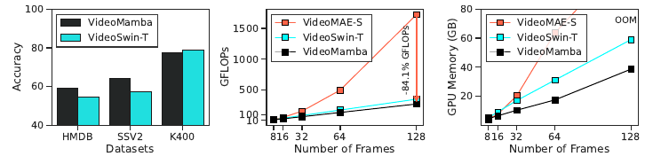

> **Hình 1:** So sánh hiệu năng và hiệu suất giữa các mô hình video đã pretrain trên ImageNet-1K. VideoMamba cho thấy hiệu năng vượt trội hoặc tương đương VideoSwin-T [33], đồng thời có lợi thế rõ ràng về GFLOPs và mức tiêu thụ bộ nhớ được giảm so với VideoSwin-T [33] và VideoMAE-S [45].

Được truyền cảm hứng từ thành công của Mamba, chúng tôi đề xuất VideoMamba, mô hình video đầu tiên cung cấp một phân tích toàn diện về việc điều chỉnh kiến trúc Mamba thuần cho các tác vụ video. Mô hình video của chúng tôi không chỉ yêu cầu ít tài nguyên tính toán hơn mà còn cung cấp hiệu năng cạnh tranh so với các đối tác Transformer có kích thước tương tự. Mặc dù độ phức tạp tuyến tính và khả năng nắm bắt phụ thuộc tầm xa của mô hình Mamba rất phù hợp với các ứng dụng video, việc biểu diễn thông tin không-thời gian của video thành một chuỗi 1D đặt ra một thách thức đáng kể. Để xử lý hiệu quả vấn đề xử lý thông tin không gian không tuần tự, các biến thể được giới thiệu gần đây của mô hình Mamba trong thị giác [29,32,56] sử dụng các phương pháp quét hai chiều. Xây dựng trên nền tảng này, VideoMamba cũng sử dụng chiến lược quét hai chiều cho dữ liệu video, trình bày một nghiên cứu tiên phong về việc mở rộng các mô hình thị giác sang các ứng dụng video và cung cấp mô hình đã pretrain. Tuy nhiên, dữ liệu video đưa vào một kịch bản khó hơn do mối quan hệ liên kết giữa thông tin không gian không tuần tự, ví dụ vị trí và tư thế của một người trong các frame cụ thể, và thông tin thời gian tuần tự, ví dụ những thay đổi trong hành động của một người qua các frame. Các thí nghiệm được thiết kế cẩn thận của chúng tôi nhằm xử lý độ phức tạp vốn có của việc xử lý thông tin không-thời gian. Để mở rộng hiệu quả mô-đun SSM hai chiều, chúng tôi phát triển nó thành các mô-đun Spatio-Temporal Forward and Backward SSM. Tập trung vào việc xác định hướng quét ngược, chúng tôi khảo sát các ảnh hưởng của quét không-thời gian giữa đảo ngược không gian, đảo ngược thời gian và đảo ngược không-thời gian. Thông qua các thí nghiệm và nghiên cứu ablation quy mô rộng, chúng tôi cung cấp các hiểu biết và khảo sát nhiều lựa chọn thiết kế cùng các training recipe khác nhau. Ngoài ra, chúng tôi phân tích cách mô hình VideoMamba phản ứng với tính nhất quán thời gian, khảo sát liệu mô hình có chỉ xem video như một bó ảnh hay không. Hơn nữa, một phân tích về Delta, một trong các thành phần cốt lõi của Mamba, cung cấp những hiểu biết có giá trị về cách mô hình nắm bắt và xử lý thông tin không-thời gian.

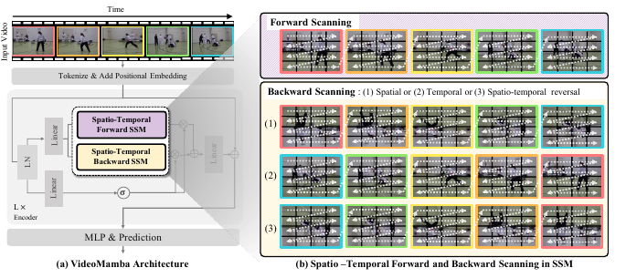

> **Hình 2:** Góc nhìn toàn diện về framework của VideoMamba. (a) Kiến trúc VideoMamba. Kiến trúc này bao gồm việc token hóa ban đầu các frame video, thêm positional embedding và xử lý qua các khối encoder sử dụng Spatio-Temporal Forward and Backward SSM được đề xuất để phân tích video toàn diện. (b) Quá trình quét thuận và ngược không-thời gian bên trong các SSM, trong đó các mũi tên nét đứt màu trắng chỉ hướng quét của các video token.

VideoMamba đã cho thấy khả năng cạnh tranh trên nhiều benchmark video khác nhau. Nó thể hiện hiệu năng vượt trội trên HMDB51 [28] và Something-Something V2 [14], hoặc hiệu năng tương đương trên Kinetics-400 [25], so với các mô hình video khác. Hiệu suất của nó nổi bật, vì mức giảm đáng kể về GFLOPs và mức sử dụng bộ nhớ của VideoMamba được làm nổi bật trong Hình 1.

Các đóng góp của bài báo này là:

1. Chúng tôi giới thiệu VideoMamba, một nghiên cứu tiên phong về mô hình đơn giản nhưng hiệu suất cao dựa thuần trên Mamba, làm nổi bật tiềm năng của nó đối với các tiến bộ tương lai trong nhận dạng video.
2. Thông qua Spatio-Temporal Forward and Backward SSM, chúng tôi xử lý thách thức riêng biệt của việc tích hợp thông tin không gian không tuần tự với thông tin thời gian tuần tự trong xử lý video.
3. Chúng tôi cho thấy hiệu năng cạnh tranh của VideoMamba và yêu cầu tính toán được giảm của nó so với các mô hình Transformer thông thường.
4. Các thí nghiệm và phân tích quy mô rộng của chúng tôi nhấn mạnh thế mạnh của mô hình Mamba như một công cụ hiệu quả cho xử lý video.

## 2. Các công trình liên quan (Related Work)

### 2.1. Hiểu video (Video Understanding)

Theo truyền thống, CNN [11,20,23,26,31,37,41] là các kiến trúc backbone tiêu chuẩn trong mô hình hóa video. Các CNN này tận dụng convolution 3D [3,6,11,36,41] hoặc phân tách convolution không gian và thời gian [19,37,42,51] để đạt hiệu suất. Trước sự phát triển của các mô hình thuần dựa trên Transformer, việc tích hợp các cơ chế attention [13,27,48], nổi tiếng về hiệu quả trong việc nắm bắt các phụ thuộc tầm xa trong dữ liệu, vào các framework CNN đã đạt được các kết quả đầy hứa hẹn. Thành công của các non-local network [48] và các mô hình lai [49,53] dẫn đến sự phát triển của các kiến trúc thuần Transformer được thiết kế riêng cho nhận dạng video [1,2,4,10,33,34,47,50]. Tuy nhiên, một thách thức đáng kể của các kiến trúc thuần Transformer nằm ở độ phức tạp tính toán của chúng đối với các video dài. Điều này bắt nguồn từ độ phức tạp bậc hai của cơ chế attention khi độ dài chuỗi tăng [43]. Để xử lý vấn đề này, nhiều cách tiếp cận đã được đề xuất, bao gồm các kỹ thuật phân tách [2,4], các cơ chế cửa sổ [33] và tái tạo token có che [12,40,45]. Các phương pháp này đạt được các kết quả đầy hứa hẹn trong việc xử lý các chuỗi dài đồng thời nắm bắt thông tin không gian và thời gian. Mặc dù các Transformer thuần cho thấy những năng lực đáng chú ý, độ phức tạp bậc hai vốn có theo độ dài chuỗi vẫn là một thách thức mở cần được khảo sát thêm để hiểu video hiệu suất cao.

### 2.2. Các mô hình không gian trạng thái (State Space Models)

Bắt nguồn từ các state space model (SSM) cổ điển [24], các structured SSM (S4) [16,17] đã xuất hiện như những framework đầy hứa hẹn trong việc mô hình hóa các chuỗi khoảng cách xa với mức tăng tuyến tính của chi phí tính toán. Thành công của S4 đã tạo ra một làn sóng nghiên cứu, dẫn đến nhiều mô hình lấy cảm hứng từ S4 có khả năng nắm bắt các phụ thuộc tầm xa trong dữ liệu tuần tự [18,38]. Các biến thể này đạt hiệu năng cạnh tranh trên nhiều tác vụ khác nhau [22,35,44]. Thế mạnh của S4 nằm ở việc tuân theo *Linear Time Invariance* (tính bất biến tuyến tính theo thời gian, LTI), bảo đảm đầu ra nhất quán cho các đầu vào giống nhau bất kể thời điểm áp dụng của chúng. Mặc dù các hệ LTI có nhiều ưu điểm, chúng cũng đưa vào các hạn chế, đặc biệt trong việc xử lý động lực biến thiên theo thời gian. Ràng buộc rằng ma trận chuyển trạng thái bên trong giữ nguyên trên toàn chuỗi hạn chế khả năng thích ứng với nội dung đang biến đổi của mô hình, làm hạn chế khả năng áp dụng của nó trong các kịch bản yêu cầu suy luận dựa trên nội dung.

Gần đây, Mamba [15] đã xử lý các hạn chế này bằng cách đưa vào một selective state-space model tự động điều chỉnh các tham số dựa trên chuỗi đầu vào. Tính linh hoạt này cho phép Mamba thực hiện suy luận phụ thuộc ngữ cảnh, tăng đáng kể khả năng áp dụng của nó trên nhiều miền khác nhau, từ ngôn ngữ và tiếng nói [15] đến dữ liệu thị giác phức tạp [21,29,30,32,56]. Mặc dù công trình đồng thời [29] cho thấy tiềm năng mở rộng sang nhiều chiều, ứng dụng cụ thể của nó trong các tác vụ nhận dạng video vẫn chưa được khảo sát.

Trong công trình này, chúng tôi đề xuất VideoMamba, một phần mở rộng của mô hình Mamba được thiết kế riêng cho các tác vụ hiểu video. Nó tận dụng các năng lực của Mamba để nâng cao mô hình hóa tầm xa cho dữ liệu video. Cách tiếp cận này xây dựng trên các tiến bộ gần đây của SSM cho các tác vụ video. Không giống công trình trước là S4ND [35], mô hình gặp khó khăn trong việc nắm bắt thông tin phụ thuộc đầu vào, VideoMamba tích hợp một cơ chế selective scan để xử lý hạn chế này.

## 3. Kiến thức sơ bộ (Preliminary)

### 3.1. Mô hình không gian trạng thái (State Space Model)

Các state space model là các hệ tuyến tính bất biến theo thời gian ánh xạ một chuỗi đầu vào 1D sang một chuỗi đầu ra 1D thông qua một trạng thái ẩn. Về mặt toán học, các mô hình này có thể được biểu diễn dưới dạng các phương trình vi phân thường (*ordinary differential equations*, ODE) đơn giản như sau:

$$
\begin{aligned}
h'(t)&=Ah(t)+Bx(t),\\
y(t)&=Ch(t)+Dx(t).
\end{aligned} \tag{1}
$$

trong đó $x(t) \in \mathbb{R}$ là một chuỗi đầu vào liên tục, $y(t) \in \mathbb{R}$ là một chuỗi đầu ra và $h(t) \in \mathbb{R}^{N}$ biểu thị một trạng thái ẩn.

Để cho phép xử lý các tín hiệu rời rạc trong Phương trình 1, một quá trình rời rạc hóa là cần thiết. Phương pháp được sử dụng phổ biến nhất để rời rạc hóa là kỹ thuật *zero-order hold* (giữ bậc không, ZOH), biến đổi các tham số $A$ và $B$ cho tín hiệu liên tục thành các tham số $\bar{A}$ và $\bar{B}$ cho tín hiệu rời rạc thông qua tham số kích thước bước $\Delta$. Quá trình rời rạc hóa tham số được xây dựng như sau:

$$
\begin{aligned}
\bar{A} &= \exp(\Delta A),\\
\bar{B} &= \left(\exp(\Delta A)-I\right)(\Delta A)^{-1}B,\\
\bar{C} &= C.
\end{aligned} \tag{2}
$$

Sau khi rời rạc hóa, hệ liên tục trong Phương trình 1 có thể được viết dưới dạng rời rạc như sau:

$$
\begin{aligned}
h_k &= \bar{A}h_{k-1}+\bar{B}x_k,\\
y_k &= \bar{C}h_k.
\end{aligned} \tag{3}
$$

trong đó $x_k$ và $y_k$ là các tín hiệu đầu vào và đầu ra rời rạc.

### 3.2. SSM chọn lọc (Selective SSM)

Mặc dù SSM đã cho thấy hiệu năng nổi bật trong nhiều tác vụ với dữ liệu tuần tự, như đã đề cập trước đó, chúng chịu hạn chế vốn có của việc là một hệ LTI. Nói cách khác, với các tham số $A$, $B$, $C$ và $\Delta$ giữ nguyên trên tất cả các bước thời gian, các phép tính của mô hình độc lập với đầu vào, làm cho việc xử lý các bài toán yêu cầu nhận biết ngữ cảnh trở nên khó khăn. Gần đây, để khắc phục các hạn chế này, Mamba [15] được đề xuất, tận dụng một cơ chế selective scan. Trong Mamba, các tham số mô hình như $B$, $C$ và $\Delta$ được xác định tự động dựa trên đầu vào, cho phép mô hình hiểu ngữ cảnh của các chuỗi đầu vào. Chúng tôi sử dụng selective SSM này làm toán tử cốt lõi trong mô hình được đề xuất.

Tham số cốt lõi của selective SSM, $\Delta$, hoạt động như một cơ chế gating kiểm soát ảnh hưởng của các phần tử cụ thể trong các ma trận chuyển trạng thái $A$, $B$ và $C$, và các ma trận này xác định cách trạng thái ẩn của mô hình biến đổi theo thời gian. Cụ thể hơn, như được nêu trong bài báo gốc [15], $\Delta$ lớn biểu thị rằng trạng thái ẩn bị bỏ qua và đầu vào hiện tại được nhấn mạnh, còn $\Delta$ nhỏ biểu thị rằng đầu vào hiện tại bị bỏ qua. Trong ngữ cảnh hiểu video, $\Delta$ cho phép VideoMamba tập trung có chọn lọc vào các khía cạnh liên quan của trạng thái ẩn để cập nhật, hỗ trợ suy luận phụ thuộc ngữ cảnh. Phân tích và trực quan hóa thêm về $\Delta$ được trình bày trong Mục 5.6.

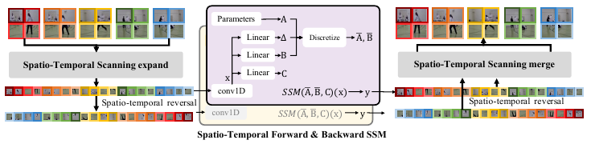

> **Hình 3:** Chi tiết của Spatio-Temporal SSM được đề xuất. Hình minh họa các phép toán bên ngoài và bên trong của Spatio-Temporal Forward and Backward SSM. Ở đây, phương pháp quét ngược biểu diễn đảo ngược không-thời gian.

## 4. VideoMamba

Kiến trúc tổng thể của VideoMamba được đề xuất được trình bày trong Hình 2. Trước tiên, clip video được lấy mẫu được biến đổi thành các video token thông qua một video tokenizer (Mục 4.1). Sau đó, các video token này được cộng với positional embedding (Mục 4.2), chứa thông tin vị trí. Các token này cùng với class token tạo thành đầu vào cho mô hình. Các token đầu vào đi qua $L$ lớp của encoder VideoMamba (Mục 4.3), nơi spatio-temporal forward and backward SSM (Mục 4.4) được áp dụng. Cuối cùng, sau khi đi qua lớp cuối, class token được normalization và đưa vào một video classification head gồm một lớp MLP duy nhất để tạo dự đoán cuối cùng của mô hình. Để khắc phục các khó khăn trong việc huấn luyện mô hình do kích thước tương đối nhỏ của các tập dữ liệu video, chúng tôi khởi tạo các mô hình video bằng các mô hình ảnh đã pretrain, tận dụng các thế mạnh do các tập dữ liệu ảnh quy mô lớn cung cấp. Phần giải thích chi tiết cho từng thành phần được cung cấp trong các tiểu mục sau.

### 4.1. Video Tokenizer

Video tokenizer ánh xạ clip video được lấy mẫu $V \in \mathbb{R}^{T \times H \times W \times C}$ thành một chuỗi video token

$$
z=[z_1,z_2,\ldots,z_{n_t \times n_h \times n_w}],
$$

trong đó $T$, $H$, $W$ và $C$ lần lượt biểu diễn độ dài thời gian, chiều cao, chiều rộng và số kênh của video, còn mỗi video token $z_i \in \mathbb{R}^{d}$ là một feature embedding $d$ chiều. Trước tiên, chúng tôi chia clip video thành các tubelet không chồng lấp có kích thước $s_t \times s_h \times s_w$, tạo ra $n_t \cdot n_h \cdot n_w$ tubelet, trong đó

$$
n_t=\left\lfloor\frac{T}{s_t}\right\rfloor,\qquad
n_h=\left\lfloor\frac{H}{s_h}\right\rfloor,\qquad
n_w=\left\lfloor\frac{W}{s_w}\right\rfloor.
$$

Sau đó, chúng tôi sử dụng một lớp convolution 3D để trích xuất các video token từ từng tubelet. Video tokenizer được khởi tạo từ mô hình ảnh đã pretrain bằng cách inflate lớp convolution 2D thành lớp convolution 3D thông qua việc mở rộng tensor trọng số theo trục thời gian và lấy trung bình.

### 4.2. Positional Embedding

Positional embedding lần đầu được giới thiệu trong Transformer [43] và được sử dụng rộng rãi trong các mô hình thị giác dựa trên Transformer [2,9]. Tuy nhiên, positional embedding không được sử dụng trong SSM [15,16,35], vì bản chất hồi quy vốn có của SSM loại bỏ nhu cầu về thông tin vị trí. Mặc dù vậy, xét các đặc điểm của video, việc sử dụng positional embedding cung cấp lợi thế bổ sung cho mô hình thông tin không-thời gian thêm cho từng token. Do đó, với tư cách một mô hình hiểu video dựa trên SSM, để khảo sát ảnh hưởng của việc sử dụng positional embedding, chúng tôi xem xét một số lựa chọn cho positional embedding: (1) không sử dụng positional embedding; (2) sinusoidal positional embedding; và (3) learnable positional embedding. Đối với các lựa chọn (2) và (3), positional embedding $P \in \mathbb{R}^{n_t \cdot n_h \cdot n_w \times d}$ được cộng vào các token đầu vào $z$.

Khi sử dụng learnable positional embedding, chúng tôi có thể khởi tạo learnable positional embedding $P$ bằng positional embedding đã học từ mô hình ảnh đã pretrain $P_{\mathrm{image}} \in \mathbb{R}^{n_h \cdot n_w \times d}$, có thể được xem là trường hợp $n_t=1$. Chúng tôi xem xét một số phương pháp khởi tạo: (3-1) mở rộng positional embedding đã học $P_{\mathrm{image}}$ theo trục thời gian bằng cách sao chép nó $n_t$ lần; (3-2) nội suy theo chiều không gian, tức nội suy positional embedding đã học $P \in \mathbb{R}^{n_h \cdot n_w \times d}$ thành $\mathbb{R}^{(n_h \cdot n_w \cdot n_t) \times d}$; (3-3) nội suy theo chiều embedding, tức nội suy positional embedding đã học $P_{\mathrm{image}}$ thành $P \in \mathbb{R}^{n_h \cdot n_w \times (d \cdot n_t)}$ rồi reshape; và (3-4) khởi tạo ngẫu nhiên.

### 4.3. Khối encoder VideoMamba (VideoMamba Encoder Block)

Sau các bước tiền xử lý được đề cập trong Mục 4.1 và 4.2, chúng tôi thu được $n_t \cdot n_h \cdot n_w$ video token. Một class token được đặt trước các video token, và chúng được đưa vào encoder của VideoMamba được đề xuất, gồm $L$ khối encoder. Thiết kế kiến trúc của khối encoder VideoMamba sử dụng thiết kế của các công trình trước [15,32,56], tích hợp layer normalization, convolution 1D và một khối SSM. Đối với khối SSM, chúng tôi đề xuất spatio-temporal forward and backward SSM, được mô tả trong mục tiếp theo.

### 4.4. SSM thuận và ngược không-thời gian (Spatio-Temporal Forward and Backward SSM)

Để xử lý hiệu quả thông tin không gian không tuần tự trong khối encoder VideoMamba, chúng tôi xử lý $n_t \cdot n_h \cdot n_w$ token theo cả hướng thuận và ngược. Vì thông tin thời gian vốn có thứ tự, hướng thuận có thể được xác định trực tiếp bằng cách làm phẳng $n_t \cdot n_h \cdot n_w$ token. Mặt khác, theo hướng ngược, câu hỏi xuất hiện: chúng ta có nên đảo ngược thông tin thời gian như với thông tin không gian hay không? Sự kết hợp của thông tin không-thời gian tuần tự và không tuần tự làm phức tạp việc xác định cách đảo ngược phù hợp. Với cân nhắc này, chúng tôi khảo sát ba phương pháp riêng biệt để xác định hướng quét ngược của chuỗi token không-thời gian, như được trình bày trong Hình 2(b).

#### Đảo ngược không-thời gian (Spatio-temporal Reversal)

Cách tiếp cận đầu tiên là đảo ngược không-thời gian, tương đương với việc đảo ngược thứ tự của toàn bộ $n_t \cdot n_h \cdot n_w$ token đã được làm phẳng so với $n_t \cdot n_h \cdot n_w$ token theo hướng thuận. Hình 3 minh họa quá trình này. Cách tiếp cận này có ưu điểm bảo toàn thứ tự tổng thể của đầu vào giữa hướng thuận và ngược theo cách tương tự ảnh, giống như xử lý video bằng cách nối $n_t$ frame theo hướng cột để tạo một ảnh dài theo chiều dọc.

#### Đảo ngược không gian (Spatial Reversal)

Phương pháp thứ hai là đảo ngược không gian, không đảo toàn bộ token mà chỉ đảo từng tập $n_h \cdot n_w$ token, duy trì thứ tự dọc theo trục thời gian. Cách tiếp cận này bảo toàn thứ tự thời gian của dữ liệu trên cả đường thuận và đường ngược, cung cấp cho mô hình một luồng thời gian rõ ràng trong video đã cho.

#### Đảo ngược thời gian (Temporal Reversal)

Phương pháp cuối cùng là đảo ngược thời gian, duy trì thứ tự giữa $n_h \cdot n_w$ token trong khi chỉ đảo ngược chuỗi thời gian của chúng. Cách tiếp cận này có thể làm phong phú khả năng hiểu động lực thời gian của mô hình bằng cách cung cấp tiến trình sự kiện đảo ngược mà không thay đổi tính toàn vẹn không gian của các frame.

## 5. Thí nghiệm (Experiments)

### 5.1. Thiết lập thí nghiệm (Experimental Setup)

#### Các tập dữ liệu (Datasets)

Đối với các tác vụ nhận dạng hành động, chúng tôi sử dụng các tập dữ liệu Kinetics-400 (K400) [25], Something-Something V2 (SSV2) [14] và HMDB51 (HMDB) [28]. Tập dữ liệu Kinetics-400 chứa khoảng 240 nghìn video huấn luyện và 20 nghìn video validation từ 400 lớp hành động của con người. Tập dữ liệu Something-Something V2 gồm 168,9 nghìn video huấn luyện và 24,7 nghìn video validation trên 174 lớp. Tập dữ liệu HMDB51 tương đối nhỏ hơn các tập dữ liệu Kinetics và SSV2, chứa khoảng 9,5 nghìn video huấn luyện và 3,5 nghìn video validation từ 51 lớp. Trong tất cả các thí nghiệm, các mô hình được huấn luyện trên các video huấn luyện rồi được đánh giá trên các video validation từ những tập dữ liệu trên.

#### Chi tiết triển khai (Implementation Details)

Theo mặc định, chúng tôi đặt số lượng khối $L$ thành 24. Để căn chỉnh với kích thước mô hình của dòng VideoSwin, chúng tôi đặt số chiều trạng thái ẩn $d$ thành 384. Đối với video tokenizer, kích thước tubelet được đặt thành $s_t=2$ và $s_h=s_w=16$.

Chúng tôi sử dụng optimizer AdamW để huấn luyện. Linear warm-up và cosine decay learning-rate scheduler đều được sử dụng để huấn luyện các mô hình trong một số epoch cố định, với batch size bằng 64. Chúng tôi khởi tạo backbone của mạng bằng các trọng số đã pretrain trên ImageNet-1K, đồng thời khởi tạo ngẫu nhiên các lớp head. Learning rate ban đầu được đặt thành $3\times10^{-4}$. Các kỹ thuật data augmentation mạnh hơn được sử dụng, bao gồm label smoothing [39], RandAugment [8] và random erasing [55]. Đối với inference, chúng tôi tuân theo cách tiếp cận được mô tả trong [40] bằng cách sử dụng nhiều view, tức crop, của video. Điểm dự đoán cuối cùng được tính bằng cách lấy trung bình các điểm từ từng view.

**Kinetics.** Chúng tôi lấy mẫu 16 frame từ mỗi video với temporal stride bằng 2 và resize chúng thành $224\times224$. Chúng tôi sử dụng optimizer AdamW trong 30 epoch với cosine decay learning-rate scheduler và 1 epoch linear warm-up. Batch size bằng 64 được sử dụng.

**SSV2.** Tương tự Kinetics, chúng tôi sử dụng 16 frame với temporal stride bằng 2 được resize thành $224\times224$. Optimizer AdamW được sử dụng để huấn luyện trong 35 epoch với learning-rate scheduler và warm-up. Batch size và data augmentation, ngoại trừ reverse augmentation, nhất quán với Kinetics.

**HMDB51.** Chúng tôi sử dụng cùng chiến lược huấn luyện như Kinetics cho HMDB, với 50 epoch huấn luyện.

### 5.2. Phân tích sự phụ thuộc của mô hình vào tính nhất quán thời gian (Analysis of Model’s Dependency on Temporal Consistency)

Trong thí nghiệm này, chúng tôi nhằm đánh giá khả năng hiểu cách sắp xếp thời gian của mô hình video bằng cách sắp xếp lại các frame đầu vào. Khảo sát này có tính then chốt đối với việc mở rộng ban đầu và phân tích các mô hình ảnh sang hiểu video. Ví dụ, nếu mô hình chỉ xem video như một bó ảnh, các kết quả có khả năng sẽ tương tự bất kể video được sắp xếp lại như thế nào. Để thực hiện điều này, các frame video gốc, ví dụ được đánh chỉ số từ 1 đến 8, được áp dụng nhiều chiến lược sắp xếp lại khác nhau để kiểm tra ảnh hưởng của chúng. Các chiến lược sắp xếp lại của chúng tôi cho thí nghiệm này gồm:

1. **Interleaved reordering.** Bằng cách triển khai một mẫu liên tục xen kẽ giữa các frame cách xa nhau, phương pháp này được thiết kế để kiểm tra tính vững của mô hình trước những gián đoạn cực độ trong luồng tường thuật. Ví dụ, chuỗi có thể theo thứ tự $[1\rightarrow8\rightarrow2\rightarrow7\rightarrow3\rightarrow6\rightarrow4\rightarrow5]$.
2. **Pairwise reordering.** Trong cách tiếp cận này, các frame được sắp xếp lại theo cặp, cụ thể tạo ra chuỗi $[1\rightarrow2\rightarrow7\rightarrow8\rightarrow5\rightarrow6\rightarrow3\rightarrow4]$ bằng cách nhóm các frame theo từng cặp. Điều này được thực hiện để bảo đảm rằng, trong các kịch bản kích thước tubelet được đặt thành 2, việc sinh đặc trưng sẽ không gặp các vấn đề đáng kể.
3. **Block-wise reordering.** Chiến lược này bao gồm việc tổ chức lại các frame video thành các block, mỗi block gồm một nửa số frame liên tiếp. Ví dụ, chuỗi $[5\rightarrow6\rightarrow7\rightarrow8\rightarrow1\rightarrow2\rightarrow3\rightarrow4]$ được tạo ra.

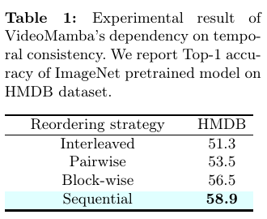

> **Bảng 1:** Kết quả thí nghiệm về sự phụ thuộc của VideoMamba vào tính nhất quán thời gian. Chúng tôi báo cáo Top-1 accuracy của mô hình đã pretrain trên ImageNet trên tập dữ liệu HMDB.

Kết quả thí nghiệm trên tập dữ liệu HMDB được trình bày trong Bảng 1. Kết quả cho thấy một mối quan hệ rõ ràng giữa độ phức tạp của việc sắp xếp lại theo thời gian và hiệu năng của mô hình. Mô hình đạt hiệu năng tốt nhất khi xử lý các video theo thứ tự tuần tự ban đầu, cho thấy sự phụ thuộc của nó vào luồng thời gian vốn có để đạt khả năng hiểu tối ưu. Khi sự gián đoạn thời gian trở nên nghiêm trọng hơn, từ block-wise reordering sang pairwise reordering rồi đến interleaved reordering gây xao lãng nhiều nhất, hiệu năng của mô hình giảm dần. Các kết quả này cho thấy mô hình của chúng tôi diễn giải hành động trong video bằng cách phản ánh thứ tự thời gian của chúng.

### 5.3. SSM thuận và ngược không-thời gian (Spatio-Temporal Forward and Backward SSM)

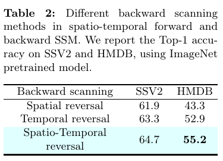

> **Bảng 2:** Các phương pháp quét ngược khác nhau trong spatio-temporal forward and backward SSM. Chúng tôi báo cáo Top-1 accuracy trên SSV2 và HMDB bằng mô hình đã pretrain trên ImageNet.

Như được đề cập trong Mục 4.4, chúng tôi so sánh ba phương pháp khác nhau cho quét ngược không-thời gian: (1) đảo ngược không gian; (2) đảo ngược thời gian; và (3) đảo ngược không-thời gian. Bảng 2 cho thấy kết quả thí nghiệm trên các tập dữ liệu SSV2 và HMDB. Chúng tôi không sử dụng một class token bổ sung trong thí nghiệm này, vì vị trí của class token có thể ảnh hưởng đến hiệu năng. Các kết quả cho thấy đảo ngược không-thời gian là phương pháp hiệu quả nhất cho SSM ngược, nhấn mạnh tầm quan trọng của mối quan hệ bổ sung giữa thứ tự token trong SSM thuận và ngược. Ngược lại, đảo ngược không gian được cho thấy là ít có lợi hơn, vì nó giữ vị trí tương đối của phần lớn token giống nhau trong cả đường thuận và đường ngược, cản trở mô hình hưởng lợi đầy đủ từ các ưu điểm của quét hai chiều. Do đó, chúng tôi chọn đảo ngược không-thời gian làm phương pháp quét ngược.

### 5.4. Nghiên cứu ablation (Ablational Study)

#### Positional Embedding

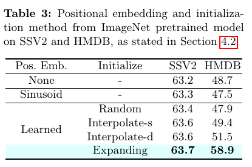

> **Bảng 3:** Positional embedding và phương pháp khởi tạo từ mô hình đã pretrain trên ImageNet trên SSV2 và HMDB, như được nêu trong Mục 4.2.

Trong mục này, chúng tôi khảo sát ảnh hưởng của các chiến lược positional embedding khác nhau, xem Mục 4.2, và các phương pháp khởi tạo của chúng trên các tập dữ liệu SSV2 và HMDB. Như được cho thấy trong Bảng 3, việc lược bỏ positional embedding dẫn đến hiệu năng thấp hơn, làm nổi bật tầm quan trọng của chúng. Việc sử dụng sinusoidal embedding cung cấp một cải thiện nhỏ, nhưng sử dụng learnable positional embedding với khởi tạo phù hợp tạo ra hiệu năng tốt hơn. Đáng chú ý, phương pháp khởi tạo bằng mở rộng theo thời gian nổi bật, đạt accuracy cao nhất trên cả hai tập dữ liệu, như được cho thấy trong bảng. Điều này cho thấy hiệu quả của positional embedding được khởi tạo phù hợp từ mô hình ảnh trong việc nâng cao khả năng xử lý nội dung video của mô hình, cung cấp cho mô hình thông tin không-thời gian bổ sung.

#### Bổ sung regularization (Adding Regularization)

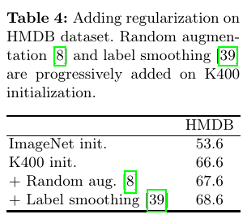

> **Bảng 4:** Bổ sung regularization trên tập dữ liệu HMDB. Random augmentation [8] và label smoothing [39] lần lượt được bổ sung trên khởi tạo K400.

Với tư cách một công trình tiên phong về mô hình nhận dạng video dựa trên Mamba, chúng tôi tiến hành các thí nghiệm để tìm ra các training recipe cho việc học mô hình hiệu suất cao. Chúng tôi lần lượt đánh giá ảnh hưởng của nhiều kỹ thuật regularization khác nhau đối với việc huấn luyện trên HMDB trong Bảng 4. Việc sử dụng khởi tạo Kinetics-400 làm tăng đáng kể accuracy, minh họa các lợi ích của pretraining chuyên biệt theo miền. Việc sử dụng random augmentation và label smoothing cũng dẫn đến một cải thiện nhỏ, mỗi phương pháp tạo ra mức cải thiện 1%. Tiến trình này cho thấy các phương pháp regularization như random augmentation và label smoothing cũng hiệu quả trong việc huấn luyện mô hình VideoMamba trên các tập dữ liệu nhỏ.

#### Số lượng frame (Number of Frames)

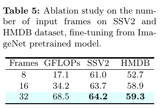

> **Bảng 5:** Nghiên cứu ablation về số lượng frame đầu vào trên các tập dữ liệu SSV2 và HMDB, fine-tune từ mô hình đã pretrain trên ImageNet.

Chúng tôi tiến hành một phân tích so sánh hiệu năng của mô hình trên các số lượng frame khác nhau, tập trung vào ảnh hưởng của số lượng frame đối với accuracy trong Bảng 5. Mô hình được quan sát là cung cấp hiệu năng vững nhất với chuỗi đầu vào dài nhất gồm 32 frame. Kết quả này nhấn mạnh khả năng xử lý hiệu quả dữ liệu tầm xa của mô hình, đạt hiệu năng vượt trội với độ phức tạp tính toán tuyến tính. Hiệu suất này cho thấy sự thành thạo của mô hình trong việc xử lý thông tin thời gian quy mô rộng, một lợi thế đáng kể so với độ phức tạp bậc hai thường gắn với các cơ chế self-attention.

#### Số chiều embedding (Embedding Dimension)

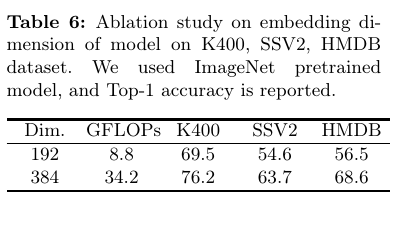

> **Bảng 6:** Nghiên cứu ablation về số chiều embedding của mô hình trên các tập dữ liệu K400, SSV2 và HMDB. Chúng tôi sử dụng mô hình đã pretrain trên ImageNet và báo cáo Top-1 accuracy.

Chúng tôi thực hiện một nghiên cứu ablation về số chiều embedding của mô hình trên các tập dữ liệu K400, SSV2 và HMDB. Chúng tôi so sánh hai kích thước số chiều embedding khác nhau là 192 và 384, đồng thời GFLOPs và Top-1 accuracy được báo cáo trong Bảng 6. Các kết quả cho thấy rõ rằng ngay cả trong các kịch bản rất nhẹ, mô hình vẫn hoạt động tốt, trong khi số chiều embedding lớn hơn có thể nâng cao thêm khả năng hiểu của VideoMamba.

### 5.5. So sánh với nhiều mô hình video (Comparison to Various Video Models)

#### HMDB51

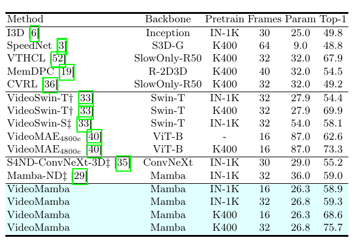

> **Bảng 7:** So sánh với các công trình trước trên HMDB51. Ký hiệu $\ddagger$ biểu thị các kết quả từ [29], và $\dagger$ là số liệu được tái tạo để so sánh công bằng. Đơn vị của `Param` là Mega, tức $10^6$. Chỉ số dưới biểu thị epoch huấn luyện của mô hình. `N/A` biểu thị các số liệu không có sẵn đối với chúng tôi.

Hiệu năng của VideoMamba trên tập dữ liệu HMDB51, được cung cấp trong Bảng 7, cho thấy tính vượt trội của nó không chỉ trước các mô hình Transformer truyền thống như VideoSwin mà còn trước các mô hình SSM như Mamba-ND và S4ND-ConvNeXt-3D. Khi được pretrain trên ImageNet-1K, VideoMamba thể hiện hiệu năng khá với Top-1 accuracy $58.9\%$ cho 16 frame và $59.3\%$ cho 32 frame. Hơn nữa, khi chúng tôi pretrain VideoMamba trên K400, một tập dữ liệu phù hợp hơn với nội dung video, hiệu năng của nó tăng đáng kể lên Top-1 accuracy $68.6\%$ cho 16 frame, vượt tất cả các mô hình được so sánh.

So với VideoSwin-T, một mô hình Transformer thông thường, VideoMamba sử dụng ít FLOPs và ít tham số hơn đáng kể, vượt VideoSwin-T $4.9\%$. Hơn nữa, chúng tôi cũng vượt kiến trúc dựa trên Mamba đồng thời [29] và phương pháp dựa trên SSM trước đó [35], trong khi vẫn có ít tham số hơn.

#### Something-Something V2

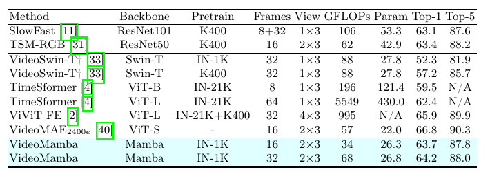

> **Bảng 8:** So sánh với các công trình trước trên Something-Something V2. `Views` biểu thị temporal clip $\times$ spatial crop, và $\dagger$ là số liệu được tái tạo. Đơn vị của `Param` là Mega, tức $10^6$. Chỉ số dưới biểu thị epoch huấn luyện của mô hình.

Bảng 8 cho thấy VideoMamba của chúng tôi đạt hiệu năng cao với yêu cầu tính toán được giảm trên Something-Something V2. Nó vượt TimeSformer, mô hình có số lượng tham số lớn hơn đáng kể. Trong khi VideoSwin-T yêu cầu 88 GFLOPs, VideoMamba hoạt động hiệu suất cao chỉ với 34 GFLOPs cho 16 frame và 68 GFLOPs cho 32 frame, đồng thời cũng có ít tham số hơn, lần lượt là 26,4M và 26,8M. Nó đạt Top-1 accuracy $63.7\%$ và $64.2\%$ lần lượt cho 16 và 32 frame, vượt VideoSwin-T $7\%$ về Top-1 accuracy. Điều này làm nổi bật hiệu suất vượt trội của VideoMamba và khả năng xử lý các tập dữ liệu yêu cầu diễn giải chi tiết động lực không gian và thời gian với ít tài nguyên hơn.

#### Kinetics-400

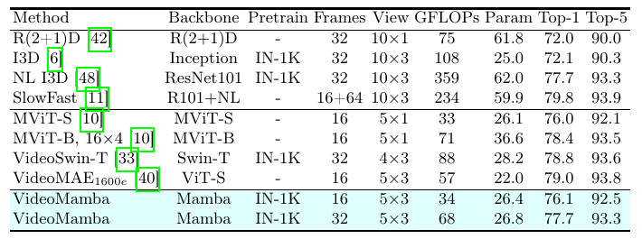

> **Bảng 9:** So sánh với các công trình trước trên Kinetics-400. Chỉ số dưới biểu thị epoch huấn luyện của mô hình.

Bảng 9 cho thấy VideoMamba cũng thể hiện hiệu suất đáng chú ý trên tập dữ liệu Kinetics-400, cung cấp hiệu năng cạnh tranh với tài nguyên tính toán nhỏ hơn. Ngoài các hiệu suất này, VideoMamba đạt Top-1 accuracy $76.1\%$ và $77.7\%$ lần lượt cho 16 và 32 frame, cho thấy năng lực xử lý dữ liệu video hiệu quả với mức tiêu thụ tài nguyên thấp hơn so với VideoSwin-T và các mô hình khác có kích thước tương tự.

### 5.6. Phân tích Delta (Analysis of Delta)

Trong mục này, chúng tôi khảo sát ý nghĩa của $\Delta$ trong VideoMamba, làm nổi bật vai trò của nó trong việc nhấn mạnh các đặc trưng chứa thông tin trong video. Cụ thể, chúng tôi khảo sát cách $\Delta$ biến đổi để tập trung vào các chi tiết không-thời gian thiết yếu thay vì nhiễu nền ít liên quan hơn. Phân tích trực quan của chúng tôi, được trình bày trong Hình 4, cho thấy bản chất chọn lọc của $\Delta$ trong Spatio-Temporal SSM của VideoMamba. Ban đầu, mô hình tập trung vào toàn bộ cảnh với các giá trị $\Delta$ cao, sử dụng ngữ cảnh của trạng thái ẩn để phân biệt các đặc trưng quan trọng. Khi lớp trở nên sâu hơn, VideoMamba chuyển trọng tâm sang các phần tử động, chẳng hạn chuyển động, bằng cách điều chỉnh các giá trị $\Delta$ để làm nổi bật các vùng có thay đổi đáng kể.

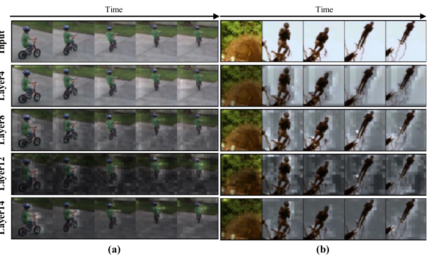

> **Hình 4:** Trực quan hóa Delta. Delta giữ vai trò cốt yếu trong suy luận phụ thuộc ngữ cảnh của VideoMamba bằng cách cho phép nhấn mạnh có chọn lọc các khía cạnh quan trọng khi cập nhật trạng thái ẩn. Nhãn GT của (a) là `ride bike`, và nhãn của (b) là `dive`.

Ví dụ, các giá trị $\Delta$ tăng xung quanh một đứa trẻ đang di chuyển trong Hình 4(a) cho thấy khả năng tập trung vào chuyển động và các đặc trưng phức tạp của mô hình thay vì các phần tử nền tĩnh. Tương tự, trong Hình 4(b), $\Delta$ cũng ưu tiên người đang lặn trong khi bỏ qua nền của frame ban đầu. Điều này cho thấy cách VideoMamba nắm bắt hiệu quả phụ thuộc tầm xa với nhận biết ngữ cảnh.

## 6. Kết luận (Conclusion)

Nghiên cứu này đã giới thiệu VideoMamba, một mô hình mới đánh dấu một tiến bộ đáng kể trong phân tích video bằng cách điều chỉnh kiến trúc Mamba thuần để xử lý các yêu cầu phức tạp của nội dung video. Thông qua việc sử dụng một cơ chế Spatio-Temporal Selective SSM, VideoMamba xử lý hiệu suất cao sự tương tác phức tạp của thông tin không gian và thời gian, đạt được sự cân bằng đáng chú ý giữa hiệu suất tính toán và độ chính xác phân tích. Các đánh giá quy mô rộng của chúng tôi cho thấy hiệu năng vượt trội của VideoMamba trên nhiều tập dữ liệu khác nhau, thể hiện khả năng vượt các mô hình hiện có nhờ việc xử lý thành thạo các phụ thuộc tầm xa và động lực video phức tạp. VideoMamba không chỉ thiết lập các tiêu chuẩn mới trong lĩnh vực mà còn đặt nền móng cho nghiên cứu tương lai, hứa hẹn thúc đẩy tiến bộ đáng kể trong nhận dạng và phân tích video.

## Lời cảm ơn (Acknowledgements)

Công trình này được hỗ trợ bởi khoản tài trợ của Institute of Information & Communications Technology Planning & Evaluation (IITP), được Chính phủ Hàn Quốc (MSIT) tài trợ, số 2020-0-00153, *Penetration Security Testing of ML Model Vulnerabilities and Defense*.

## Tài liệu tham khảo (References)

> Tên tác giả, tên công trình và thông tin xuất bản được giữ nguyên theo bản gốc.

1. Akbari, H., Yuan, L., Qian, R., Chuang, W.H., Chang, S.F., Cui, Y., Gong, B.: Vatt: Transformers for multimodal self-supervised learning from raw video, audio and text. Advances in Neural Information Processing Systems 34, 24206–24221 (2021)
2. Arnab, A., Dehghani, M., Heigold, G., Sun, C., Lučić, M., Schmid, C.: Vivit: A video vision transformer. In: Proceedings of the IEEE/CVF international conference on computer vision. pp. 6836–6846 (2021)
3. Benaim, S., Ephrat, A., Lang, O., Mosseri, I., Freeman, W.T., Rubinstein, M., Irani, M., Dekel, T.: Speednet: Learning the speediness in videos. In: Proceedings of the IEEE/CVF Conference on Computer Vision and Pattern Recognition. pp. 9922–9931 (2020)
4. Bertasius, G., Wang, H., Torresani, L.: Is space-time attention all you need for video understanding? In: ICML. vol. 2, p. 4 (2021)
5. Carion, N., Massa, F., Synnaeve, G., Usunier, N., Kirillov, A., Zagoruyko, S.: End-to-end object detection with transformers. In: European conference on computer vision. pp. 213–229. Springer (2020)
6. Carreira, J., Zisserman, A.: Quo vadis, action recognition? a new model and the kinetics dataset. In: proceedings of the IEEE Conference on Computer Vision and Pattern Recognition. pp. 6299–6308 (2017)
7. Chen, H., Wang, Y., Guo, T., Xu, C., Deng, Y., Liu, Z., Ma, S., Xu, C., Xu, C., Gao, W.: Pre-trained image processing transformer. In: Proceedings of the IEEE/CVF conference on computer vision and pattern recognition. pp. 12299–12310 (2021)
8. Cubuk, E.D., Zoph, B., Shlens, J., Le, Q.V.: Randaugment: Practical automated data augmentation with a reduced search space. In: Proceedings of the IEEE/CVF conference on computer vision and pattern recognition workshops. pp. 702–703 (2020)
9. Dosovitskiy, A., Beyer, L., Kolesnikov, A., Weissenborn, D., Zhai, X., Unterthiner, T., Dehghani, M., Minderer, M., Heigold, G., Gelly, S., et al.: An image is worth 16x16 words: Transformers for image recognition at scale. In: International Conference on Learning Representations (2020)
10. Fan, H., Xiong, B., Mangalam, K., Li, Y., Yan, Z., Malik, J., Feichtenhofer, C.: Multiscale vision transformers. In: Proceedings of the IEEE/CVF international conference on computer vision. pp. 6824–6835 (2021)
11. Feichtenhofer, C., Fan, H., Malik, J., He, K.: Slowfast networks for video recognition. In: Proceedings of the IEEE/CVF international conference on computer vision. pp. 6202–6211 (2019)
12. Feichtenhofer, C., Li, Y., He, K., et al.: Masked autoencoders as spatiotemporal learners. Advances in neural information processing systems 35, 35946–35958 (2022)
13. Gavrilyuk, K., Sanford, R., Javan, M., Snoek, C.G.: Actor-transformers for group activity recognition. In: Proceedings of the IEEE/CVF Conference on Computer Vision and Pattern Recognition. pp. 839–848 (2020)
14. Goyal, R., Ebrahimi Kahou, S., Michalski, V., Materzynska, J., Westphal, S., Kim, H., Haenel, V., Fruend, I., Yianilos, P., Mueller-Freitag, M., et al.: The “something something” video database for learning and evaluating visual common sense. In: Proceedings of the IEEE international conference on computer vision. pp. 5842–5850 (2017)
15. Gu, A., Dao, T.: Mamba: Linear-time sequence modeling with selective state spaces. arXiv preprint arXiv:2312.00752 (2023)
16. Gu, A., Goel, K., Re, C.: Efficiently modeling long sequences with structured state spaces. In: International Conference on Learning Representations (2021)
17. Gu, A., Johnson, I., Goel, K., Saab, K., Dao, T., Rudra, A., Ré, C.: Combining recurrent, convolutional, and continuous-time models with linear state space layers. Advances in neural information processing systems 34, 572–585 (2021)
18. Gupta, A., Gu, A., Berant, J.: Diagonal state spaces are as effective as structured state spaces. Advances in Neural Information Processing Systems 35, 22982–22994 (2022)
19. Han, T., Xie, W., Zisserman, A.: Memory-augmented dense predictive coding for video representation learning. In: European conference on computer vision. pp. 312–329. Springer (2020)
20. Hara, K., Kataoka, H., Satoh, Y.: Learning spatio-temporal features with 3d residual networks for action recognition. In: Proceedings of the IEEE international conference on computer vision workshops. pp. 3154–3160 (2017)
21. Hu, V.T., Baumann, S.A., Gui, M., Grebenkova, O., Ma, P., Fischer, J.S., Ommer, B.: Zigma: A dit-style zigzag mamba diffusion model. arXiv preprint arXiv:2403.13802 (2024)
22. Islam, M.M., Bertasius, G.: Long movie clip classification with state-space video models. In: European Conference on Computer Vision. pp. 87–104. Springer (2022)
23. Ji, S., Xu, W., Yang, M., Yu, K.: 3d convolutional neural networks for human action recognition. IEEE transactions on pattern analysis and machine intelligence 35(1), 221–231 (2012)
24. Kalman, R.E.: A new approach to linear filtering and prediction problems. Journal of Basic Engineering (1960)
25. Kay, W., Carreira, J., Simonyan, K., Zhang, B., Hillier, C., Vijayanarasimhan, S., Viola, F., Green, T., Back, T., Natsev, P., et al.: The kinetics human action video dataset. arXiv preprint arXiv:1705.06950 (2017)
26. Kondratyuk, D., Yuan, L., Li, Y., Zhang, L., Tan, M., Brown, M., Gong, B.: Movinets: Mobile video networks for efficient video recognition. In: Proceedings of the IEEE/CVF Conference on Computer Vision and Pattern Recognition. pp. 16020–16030 (2021)
27. Kozlov, A., Andronov, V., Gritsenko, Y.: Lightweight network architecture for realtime action recognition. In: Proceedings of the 35th Annual ACM Symposium on Applied Computing. pp. 2074–2080 (2020)
28. Kuehne, H., Jhuang, H., Garrote, E., Poggio, T., Serre, T.: Hmdb: a large video database for human motion recognition. In: 2011 International conference on computer vision. pp. 2556–2563. IEEE (2011)
29. Li, S., Singh, H., Grover, A.: Mamba-nd: Selective state space modeling for multidimensional data. arXiv preprint arXiv:2402.05892 (2024)
30. Liang, D., Zhou, X., Wang, X., Zhu, X., Xu, W., Zou, Z., Ye, X., Bai, X.: Pointmamba: A simple state space model for point cloud analysis. arXiv preprint arXiv:2402.10739 (2024)
31. Lin, J., Gan, C., Han, S.: Tsm: Temporal shift module for efficient video understanding. In: Proceedings of the IEEE/CVF international conference on computer vision. pp. 7083–7093 (2019)
32. Liu, Y., Tian, Y., Zhao, Y., Yu, H., Xie, L., Wang, Y., Ye, Q., Liu, Y.: Vmamba: Visual state space model. arXiv preprint arXiv:2401.10166 (2024)
33. Liu, Z., Ning, J., Cao, Y., Wei, Y., Zhang, Z., Lin, S., Hu, H.: Video swin transformer. In: Proceedings of the IEEE/CVF conference on computer vision and pattern recognition. pp. 3202–3211 (2022)
34. Neimark, D., Bar, O., Zohar, M., Asselmann, D.: Video transformer network. In: Proceedings of the IEEE/CVF international conference on computer vision. pp. 3163–3172 (2021)
35. Nguyen, E., Goel, K., Gu, A., Downs, G., Shah, P., Dao, T., Baccus, S., Ré, C.: S4nd: Modeling images and videos as multidimensional signals with state spaces. Advances in neural information processing systems 35, 2846–2861 (2022)
36. Qian, R., Meng, T., Gong, B., Yang, M.H., Wang, H., Belongie, S., Cui, Y.: Spatiotemporal contrastive video representation learning. In: Proceedings of the IEEE/CVF Conference on Computer Vision and Pattern Recognition. pp. 6964–6974 (2021)
37. Qiu, Z., Yao, T., Mei, T.: Learning spatio-temporal representation with pseudo-3d residual networks. In: Proceedings of the IEEE International Conference on Computer Vision. pp. 5533–5541 (2017)
38. Smith, J.T., Warrington, A., Linderman, S.W.: Simplified state space layers for sequence modeling. arXiv preprint arXiv:2208.04933 (2022)
39. Szegedy, C., Vanhoucke, V., Ioffe, S., Shlens, J., Wojna, Z.: Rethinking the inception architecture for computer vision. In: Proceedings of the IEEE conference on computer vision and pattern recognition. pp. 2818–2826 (2016)
40. Tong, Z., Song, Y., Wang, J., Wang, L.: Videomae: Masked autoencoders are data-efficient learners for self-supervised video pre-training. Advances in neural information processing systems 35, 10078–10093 (2022)
41. Tran, D., Bourdev, L., Fergus, R., Torresani, L., Paluri, M.: Learning spatiotemporal features with 3d convolutional networks. In: Proceedings of the IEEE international conference on computer vision. pp. 4489–4497 (2015)
42. Tran, D., Wang, H., Torresani, L., Ray, J., LeCun, Y., Paluri, M.: A closer look at spatiotemporal convolutions for action recognition. In: Proceedings of the IEEE conference on Computer Vision and Pattern Recognition. pp. 6450–6459 (2018)
43. Vaswani, A., Shazeer, N., Parmar, N., Uszkoreit, J., Jones, L., Gomez, A.N., Kaiser, Ł., Polosukhin, I.: Attention is all you need. Advances in neural information processing systems 30 (2017)
44. Wang, J., Zhu, W., Wang, P., Yu, X., Liu, L., Omar, M., Hamid, R.: Selective structured state-spaces for long-form video understanding. In: Proceedings of the IEEE/CVF Conference on Computer Vision and Pattern Recognition. pp. 6387–6397 (2023)
45. Wang, L., Huang, B., Zhao, Z., Tong, Z., He, Y., Wang, Y., Wang, Y., Qiao, Y.: Videomae v2: Scaling video masked autoencoders with dual masking (2023)
46. Wang, N., Zhou, W., Wang, J., Li, H.: Transformer meets tracker: Exploiting temporal context for robust visual tracking. In: Proceedings of the IEEE/CVF conference on computer vision and pattern recognition. pp. 1571–1580 (2021)
47. Wang, W., Xie, E., Li, X., Fan, D.P., Song, K., Liang, D., Lu, T., Luo, P., Shao, L.: Pyramid vision transformer: A versatile backbone for dense prediction without convolutions. In: Proceedings of the IEEE/CVF international conference on computer vision. pp. 568–578 (2021)
48. Wang, X., Girshick, R., Gupta, A., He, K.: Non-local neural networks. In: Proceedings of the IEEE conference on computer vision and pattern recognition. pp. 7794–7803 (2018)
49. Wu, C.Y., Feichtenhofer, C., Fan, H., He, K., Krahenbuhl, P., Girshick, R.: Long-term feature banks for detailed video understanding. In: Proceedings of the IEEE/CVF Conference on Computer Vision and Pattern Recognition. pp. 284–293 (2019)
50. Wu, C.Y., Krahenbuhl, P.: Towards long-form video understanding. In: Proceedings of the IEEE/CVF Conference on Computer Vision and Pattern Recognition. pp. 1884–1894 (2021)
51. Xie, S., Sun, C., Huang, J., Tu, Z., Murphy, K.: Rethinking spatiotemporal feature learning: Speed-accuracy trade-offs in video classification. In: Proceedings of the European conference on computer vision (ECCV). pp. 305–321 (2018)
52. Yang, C., Xu, Y., Dai, B., Zhou, B.: Video representation learning with visual tempo consistency. arXiv preprint arXiv:2006.15489 (2020)
53. Yin, M., Yao, Z., Cao, Y., Li, X., Zhang, Z., Lin, S., Hu, H.: Disentangled non-local neural networks. In: Computer Vision–ECCV 2020: 16th European Conference, Glasgow, UK, August 23–28, 2020, Proceedings, Part XV 16. pp. 191–207. Springer (2020)
54. Zheng, S., Lu, J., Zhao, H., Zhu, X., Luo, Z., Wang, Y., Fu, Y., Feng, J., Xiang, T., Torr, P.H., et al.: Rethinking semantic segmentation from a sequence-to-sequence perspective with transformers. In: Proceedings of the IEEE/CVF conference on computer vision and pattern recognition. pp. 6881–6890 (2021)
55. Zhong, Z., Zheng, L., Kang, G., Li, S., Yang, Y.: Random erasing data augmentation. In: Proceedings of the AAAI conference on artificial intelligence. vol. 34, pp. 13001–13008 (2020)
56. Zhu, L., Liao, B., Zhang, Q., Wang, X., Liu, W., Wang, X.: Vision mamba: Efficient visual representation learning with bidirectional state space model. arXiv preprint arXiv:2401.09417 (2024)
