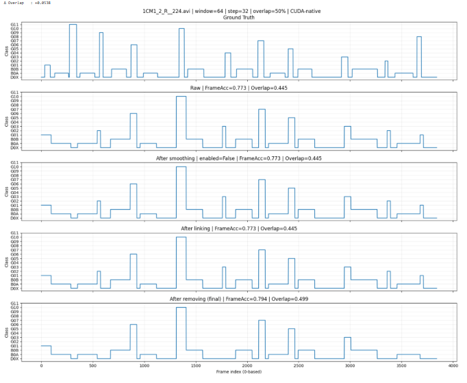
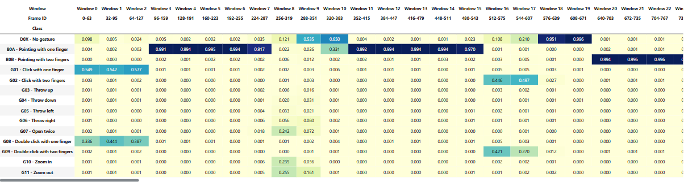
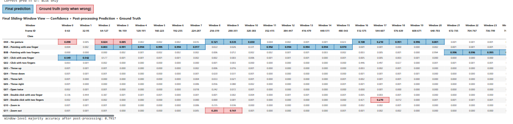

# Báo cáo kết quả nghiên cứu ngày 21/09/2026 

## A. Công việc đã thực hiện 
- Bổ sung cơ chế post processing và đánh giá kết quả 
- Tìm kiếm một số dataset `Traffic police gesture datasets`

### 1. Cơ chế Post Processing 
- **Các thông tin benchmark model hiện tại** : 

| Metric | Value | Unit / Note |
| :--- | :--- | :--- |
| **Architecture** | VideoMamba-Tiny | - |
| **Precision** | FP32 | torch.float32 |
| **Input** | `1x3x16x224x224` | B x C x T x H x W |
| **Parameters** | 6.9608 | M |
| **FP32 parameter payload** | 26.5533 | MiB |
| **Checkpoint size** | 80.0099 | MiB |
| **Reference compute** | 17.0000 | GFLOPs/clip |
| **Pure model latency - mean** | 49.2837 | ms/clip |
| **Pure model latency - median** | 49.2274 | ms/clip |
| **Pure model latency - P95** | 49.8600 | ms/clip |
| **Pure model throughput** | 20.2907 | clips/s |
| **Effective compute throughput** | 0.3449 | TFLOPs/s |
| **Sampled-frame throughput** | 324.6507 | sampled frames/s |
| **Forward extra peak** | 56.5820 | MiB |
| **Model + preprocessing mean** | 96.9421 | ms/window |
| **Model + preprocessing P95** | 100.6740 | ms/window |
| **End-to-end mean** | 283.1526 | ms/window |
| **End-to-end throughput** | 3.5317 | windows/s |
| **Temporal context** | 2.1333 | s |
| **Prediction interval** | 1.0667 | s |
| **Real-time factor** | 0.2655 | - |
| **Real-time speed** | 3.7671 | x realtime |
| **GPU** | Tesla T4 | - |
| **PyTorch** | 2.10.0+cu128 | - |
| **CUDA** | 12.8 | - |

- **Toàn bộ luồng hoạt động hiện tại**:

```text
Continuous video
      ↓
Sliding window: 64 frames (step = 32 frames, overlap = 50%)
      ↓
Mỗi window lấy 16 frame: [0, 4, 8, ..., 60]
      ↓
Resize / Crop / Normalize
      ↓
VideoMamba (Input: [1, 3, 16, 224, 224])
      ↓
14 logits
      ↓
Softmax
      ↓
Probability vector của WINDOW: P_i = [p0, p1, ..., p13]
      ↓
Optional probability smoothing
      ↓
Phân probability của các window xuống từng FRAME
      ↓
Argmax mỗi frame
      ↓
Frame-level label sequence
      ↓
LINKING
      ↓
REMOVING
      ↓
Final gesture segments
```

- Kết quả sau post processing hiện tại : 

]

> Một số gesture diễn ra trong thời gian ngắn thì sẽ bị remove mất và coi gesture đó là 1 gesture lân cận có duration dài hơn . 

- No post processing : 



- Post processing : 



### 2. Tìm kiếm một số dataset `Traffic police gesture datasets`
- Khi tìm kiếm thì em thấy có nhiều dataset liên quan, tuy nhiên đa số không public link tải, trong số đó có 2 bộ dataset nổi bật và có thể tải về từ repository [zc402/traffic-gesture-datasets](https://github.com/zc402/traffic-gesture-datasets) : **CTP-gesture_ver1** và **CTP-gesture_ver2**.

---

#### 2.1 Chinese Traffic Police Gesture dataset (CTP-gesture) Version 1
- **Thông tin dataset**:
  - **Link tải Google Drive**: [Tải CTPGesture v1](https://drive.google.com/file/d/1QT88DwKyhJ4-hEk81YEpGvikKDS_uqjj/view?usp=sharing)
  - **Cấu trúc & Định dạng file**:
    - **Video RGB (`.mp4`)**: Frame-rate cố định 15 FPS, độ phân giải 1080x1080 ghi lại chuỗi cử chỉ liên tục của CSGT.
    - **File nhãn (`.csv`)**: Nhãn cử chỉ được annotate chi tiết theo từng frame (per-frame).
    - Phân chia sẵn 2 tập: `train/` và `test/`.
  - **Danh sách 9 nhãn cử chỉ (0 - 8)**:
    - `0`: No gesture / Stand in attention (Đứng nghiêm / không có cử chỉ)
    - `1`: Stop (Dừng xe)
    - `2`: Forward (Đi thẳng)
    - `3`: Left Turn (Rẽ trái)
    - `4`: Left Turn Waiting (Chờ rẽ trái)
    - `5`: Right Turn (Rẽ phải)
    - `6`: Lane Changing (Chuyển làn)
    - `7`: Slow Down (Giảm tốc độ)
    - `8`: Pull Over (Tấp lề)

---

#### 2.2 Chinese Traffic Police Gesture dataset (CTP-gesture) Version 2
- **Thông tin dataset**:
    - Dataset mở rộng đa chiều gồm **32 cử chỉ giao thông có chỉ định hướng** (kết hợp từ 8 loại hiệu lệnh chỉ huy và 4 hướng đứng của CSGT so với camera), tổng cộng 33 lớp ($4 \times 8 + 1$ inactive).
    - **8 cử chỉ + 1 trạng thái nghỉ no gesture **:
        - Tương tự phiên bản Version 1 (Stop, Forward, Left Turn, Left Turn Waiting, Right Turn, Lane Changing, Slow Down, Pull Over).
    - **4 hướng đứng của police so với Camera**:
        - `F` (Front): Quay mặt chính diện về phía camera.
        - `L` (Left): Quay sườn trái về phía camera.
        - `B` (Back): Quay lưng về phía camera.
        - `R` (Right): Quay sườn phải về phía camera.
  - **Link tải Google Drive**: [Tải CTPGesture v2](https://drive.google.com/file/d/1ItPsIYY828LPkoal1y9TEfrg-_IDchj3/view?usp=sharing)
  - **Cấu trúc dữ liệu chi tiết**:
    - **Video & Nhãn gán thủ công (Ground Truth)**:
      - `video/`: Video cử chỉ của CSGT định dạng `.m4v`.
      - `label_gesture_timestamp/`: Nhãn thời gian bắt đầu - kết thúc 9 loại cử chỉ (file `.llc`).
      - `label_orientation_timestamp/`: Nhãn thời gian 4 hướng cơ thể CSGT (file `.llc`).
    - **Pseudo Labels (Gán nhãn chi tiết theo Frame)**:
      - `label_gesture_frame/`: Nhãn cử chỉ theo từng frame (`.json5`).
      - `label_orientation_frame/`: Hướng cơ thể theo từng frame (`.json5`).
      - `label_combine_frame/`: Nhãn kết hợp cả cử chỉ và hướng đứng cho từng frame (`.json5`).
    - **Tracking & 3D Skeleton**:
      - `track_single/`: Bounding box và quỹ đạo riêng của CSGT (`.pkl`).
      - `track_mul/`: Quỹ đạo của người xung quanh trong video (`.pkl`).
      - `vibe/`: Tham số 3D Human Mesh SMPL được trích xuất bằng mô hình VIBE (`.pkl`).

